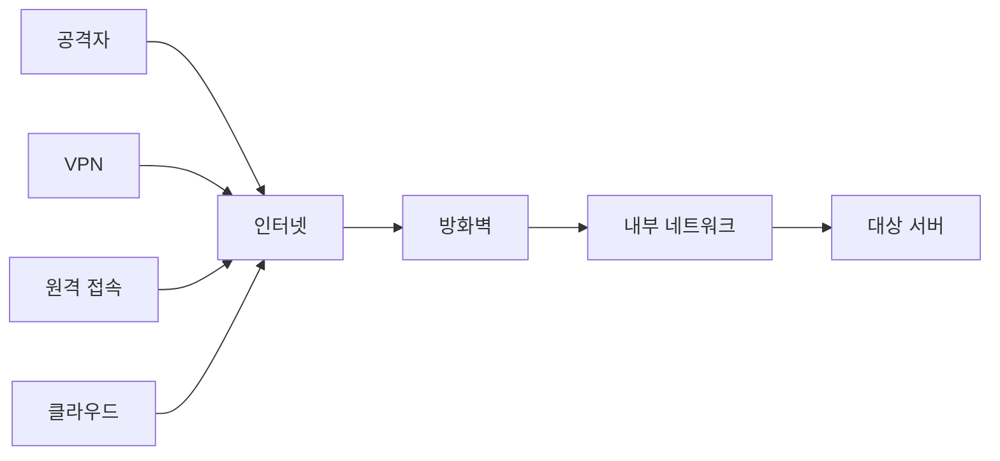
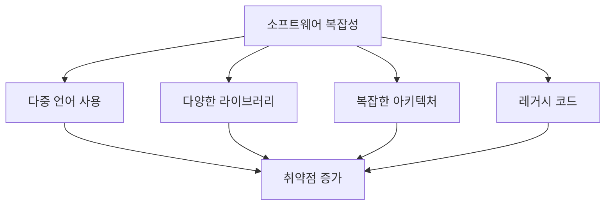

# 2강: 보안취약점의 개념 및 종류

## 개요
해킹보안전문가 1급 과정의 두 번째 강의로, 보안 취약점이 발생하는 원인과 환경적 요인들을 학습합니다. 시스템, 네트워크, 웹 보안 취약점의 분류와 특징, 그리고 서버 취약점 진단 방법론에 대해 다룹니다.

## 주요 학습 내용

### 1. 보안 취약점 발생 환경적 요인

현대 정보시스템 환경에서 보안 취약점이 발생하는 주요 환경적 요인들을 살펴보겠습니다.

#### 🌐 1. 네트워크 연결성 (Network Connectivity)

##### 특징
- **네트워크가 연결되어 있다면 언제, 어디에서든 접근이 가능**
- 전 세계가 그물망처럼 얽혀 있는 네트워크에 접속만 할 수 있다면 사용자가 어디에 있든 원하는 시스템까지 접속이 가능
- 물리적 거리의 제약 없음

##### 보안 위험


- **원격 공격 가능**: 물리적으로 떨어진 곳에서도 공격
- **익명성 보장**: 공격자 추적의 어려움
- **24시간 접근**: 상시적인 공격 위험

##### 대응 방안
- 강력한 방화벽 및 침입 탐지 시스템 운영
- VPN과 같은 보안 연결 방식 사용
- 네트워크 접근 제어 정책 수립
- 정기적인 네트워크 보안 점검

#### 📝 2. 정보 변조의 용이성 (Ease of Information Modification)

##### 특징
- **정보에 대한 변조가 용이**
- 컴퓨터의 저장 공간은 종이나 기타 실생활에 사용하는 물체보다 정보의 변조가 용이
- 이전의 정보를 유지하지 않고 새로운 정보로 바꾸는 데 드는 시간이 점점 줄어들고 있음

##### 보안 위험
- **데이터 무결성 침해**: 원본 데이터의 변조
- **흔적 제거 용이**: 로그나 증거 삭제 가능
- **실시간 변조**: 빠른 속도로 정보 조작

##### 대응 방안
```bash
# 파일 무결성 검증 예시
md5sum important_file.txt > checksum.md5
# 나중에 검증
md5sum -c checksum.md5
```

- 디지털 서명과 해시 함수 활용
- 백업 시스템을 통한 원본 보존
- 변경 이력 추적 시스템 구축
- 접근 권한 최소화 원칙 적용

#### 🏢 3. 정보의 집적성 (Information Concentration)

##### 특징
- **거의 대부분의 중요한 서비스가 컴퓨터 시스템으로 통합**
- 금융, 교통, 정치, 경제 할 것 없이 컴퓨터라는 시스템을 중심으로 운영
- 하나의 시스템에 여러 중요 정보가 집중

##### 보안 위험
- **단일 지점 장애**: 하나의 시스템 침해로 다수 서비스 마비
- **연쇄 피해**: 한 시스템에서 다른 시스템으로 공격 확산
- **높은 피해 규모**: 집적된 정보로 인한 대규모 피해

##### 대응 방안
- 시스템 분산화 및 이중화
- 마이크로서비스 아키텍처 적용
- 네트워크 세분화(Network Segmentation)
- 위험 분산을 위한 클라우드 활용

#### 🔧 4. 소프트웨어의 복잡성 (Software Complexity)

##### 특징
- **복잡한 소프트웨어일수록 문제점을 찾기 어려움**
- 논리적 오류나 치명적인 오류가 발생할 확률이 증가
- 이렇게 발생된 컴퓨터 시스템 오류들은 보안취약점으로 발전할 가능성 존재

##### 복잡성의 증가 요인


##### 보안 위험
- **숨겨진 취약점**: 복잡한 코드 속 발견되지 않은 버그
- **의존성 문제**: 외부 라이브러리의 취약점 상속
- **통합 오류**: 여러 컴포넌트 간 상호작용 문제

##### 대응 방안
- 정적/동적 코드 분석 도구 활용
- 보안 코딩 가이드라인 준수
- 정기적인 코드 리뷰 수행
- 의존성 관리 및 취약점 스캔

#### 👁️ 5. 불가시성 (Invisibility)

##### 특징
- **시스템에 누가 들어와서 무엇을 하는지 빠르게 알아차리기 어려움**
- 시스템 내부는 시스템 관리자 등의 눈에 보이지 않음
- 이러한 불가시성을 이용하여 컴퓨터 시스템 관련 범죄 발생

##### 보안 위험
- **은밀한 침입**: 공격자의 활동이 쉽게 발견되지 않음
- **지속적 잠복**: 장기간에 걸친 정보 수집
- **내부자 위협**: 정당한 권한을 가진 사용자의 악의적 행위

##### 대응 방안
```bash
# 실시간 로그 모니터링 예시
tail -f /var/log/auth.log | grep "Failed password"
```

- 포괄적인 로깅 및 모니터링 시스템
- 사용자 행동 분석(UBA) 도구
- 실시간 침입 탐지 시스템(IDS/IPS)
- 정기적인 보안 감사

### 2. 보안 취약점의 분류

#### 🖥️ 시스템 보안 취약점 (System Security Vulnerabilities)

##### 정의
- **사용자의 계정이나 디렉토리, 파일 등의 관리에 대한 취약점**
- 접근 권한이 없는 사용자가 특정 파일을 열람 가능한다면 심각한 보안 취약점
- 예: Server, Web, WAS, 정보보호시스템 등

##### 주요 취약점 유형

###### 1. 계정 관리 취약점
```bash
# 취약한 예시: UID 0을 가진 다른 계정
grep ":0:" /etc/passwd
root:x:0:0:root:/root:/bin/bash
hacker:x:0:0:hacker:/home/hacker:/bin/bash  # 위험!
```

- **중복 UID 0**: root 권한을 가진 다른 계정
- **빈 패스워드**: 패스워드가 설정되지 않은 계정
- **불필요한 계정**: 사용하지 않는 기본 계정들
- **약한 패스워드**: 추측 가능한 간단한 패스워드

###### 2. 파일 시스템 취약점
```bash
# 위험한 파일 권한 예시
-rwxrwxrwx 1 root root 1234 Jan 1 12:00 /etc/passwd  # 위험!
-rw-r--r-- 1 root root 1234 Jan 1 12:00 /etc/passwd  # 안전
```

- **잘못된 파일 권한**: 중요 파일에 과도한 권한
- **SetUID/SetGID 프로그램**: 권한 상승 위험
- **소유자 없는 파일**: 관리되지 않는 파일들

###### 3. 서비스 취약점
- **불필요한 서비스**: 사용하지 않는 네트워크 서비스
- **기본 설정**: 보안이 약화된 기본 설정값
- **버전 노출**: 서비스 버전 정보 노출

##### 대응 방안
- 정기적인 계정 점검 및 정리
- 최소 권한 원칙 적용
- 중요 파일의 접근 권한 엄격히 관리
- 불필요한 서비스 비활성화

#### 🌐 네트워크 보안 취약점 (Network Security Vulnerabilities)

##### 정의
- **시스템의 상태를 확인하기 위한 취약점**
- 크래킹의 첫 단계로 네트워크 취약점을 파악하고 접근방법을 검토
- 네트워크를 통한 정보 수집 및 공격 경로 파악

##### 주요 취약점 유형

###### 1. 정보 수집 취약점
**Ping 스캔 (Network Discovery)**
```bash
# 네트워크 상의 호스트 존재 여부 파악
ping -c 1 192.168.1.1
nmap -sn 192.168.1.0/24  # 네트워크 스캔
```

- 네트워크 상의 모든 IP 주소로 ICMP echo request packet 발송
- 응답하면 호스트 존재 확인
- **ICMP(Internet Control Message Protocol)**: 네트워크 위에서 운영체제 간 오류 메시지 전송

###### 2. 포트 스캔 취약점
```bash
# 포트 스캔 예시
nmap -sS target.com  # SYN 스캔
nmap -sT target.com  # TCP Connect 스캔
nmap -sU target.com  # UDP 스캔
```

- 열린 포트와 서비스 파악
- 서비스 버전 및 운영체제 정보 수집
- 공격 벡터 결정을 위한 정보 수집

###### 3. 프로토콜 취약점
- **ARP Spoofing**: MAC 주소 위조를 통한 트래픽 가로채기
- **DNS Spoofing**: DNS 응답 조작을 통한 트래픽 우회
- **DHCP Spoofing**: 가짜 DHCP 서버를 통한 네트워크 설정 조작

##### 방어 기법
```bash
# 방화벽 설정 예시 (iptables)
iptables -A INPUT -p icmp --icmp-type echo-request -j DROP  # Ping 차단
iptables -A INPUT -p tcp --dport 22 -s 192.168.1.0/24 -j ACCEPT  # SSH 접근 제한
```

- 방화벽을 통한 불필요한 포트 차단
- 침입 탐지 시스템(IDS) 운영
- 네트워크 세분화 및 접근 제어
- 정기적인 네트워크 모니터링

#### 🌍 웹 보안 취약점 (Web Security Vulnerabilities)

##### 정의
- **웹 브라우저의 문제나 웹 프로그래밍 언어의 오류, 버그로 인한 보안 취약점**
- 사용자 인증 절차 없거나 우회하여 접속, 접근 권한을 초과한 정보 열람
- 웹 애플리케이션을 통해서 발생되는 해킹이 주로 발생

##### OWASP Top 10 2021 주요 취약점

###### 1. A01:2021 - 접근 제어 실패 (Broken Access Control)
```php
// 취약한 예시: 직접 객체 참조
$user_id = $_GET['user_id'];
$query = "SELECT * FROM user_data WHERE user_id = $user_id";
// 다른 사용자의 user_id로 접근 가능!
```

###### 2. A02:2021 - 암호화 실패 (Cryptographic Failures)
```php
// 취약한 예시: 평문 패스워드 저장
$password = $_POST['password'];
$query = "INSERT INTO users (username, password) VALUES ('$username', '$password')";

// 안전한 방법: 해시화
$hashed_password = password_hash($_POST['password'], PASSWORD_DEFAULT);
```

###### 3. A03:2021 - 인젝션 (Injection)
```php
// SQL Injection 취약점
$sql = "SELECT * FROM users WHERE name = '" . $_GET['name'] . "'";
// 입력: ' OR '1'='1' --

// 안전한 방법: Prepared Statement
$stmt = $pdo->prepare("SELECT * FROM users WHERE name = ?");
$stmt->execute([$_GET['name']]);
```

###### 4. A07:2021 - XSS (Cross-Site Scripting)
```html
<!-- 취약한 예시 -->
<?php echo "안녕하세요, " . $_GET['name'] . "님!"; ?>
<!-- 입력: <script>alert('XSS')</script> -->

<!-- 안전한 방법 -->
<?php echo "안녕하세요, " . htmlspecialchars($_GET['name']) . "님!"; ?>
```

##### 웹 취약점 스캔 도구
```bash
# OWASP ZAP을 이용한 웹 취약점 스캔
zap-baseline.py -t http://example.com

# Nikto를 이용한 웹 서버 취약점 스캔
nikto -h http://example.com
```

### 3. 서버 취약점 진단 개요

#### 진단 목적
**서버 취약점 점검**은 시스템 설정 또는 서비스를 통해 공격자에 의해 공격당하지 않도록 보안점검 항목을 정의하여 점검을 실시합니다. 취약점 점검 항목에 의해 현황을 파악하고 보안 기준에 부합하도록 설정을 유지하여 **안정적인 서비스와 보안 위험을 사전 제거하는 것을 목적**으로 합니다.

#### 진단 대상 시스템
- **UNIX/Linux 서버**
- **Windows 서버**
- **네트워크 장비**
- **데이터베이스 서버**
- **웹 서버 및 웹 애플리케이션**

### 4. 서버 취약점 점검 영역

#### 🔐 1. 계정관리 (Account Management)

##### 점검 목적
- **시스템에 등록되어 있는 관리자 및 사용자 계정의 권한 오남용 여부**
- **패스워드의 안전한 설정 적용**

##### 주요 점검 항목
```bash
# 계정 상태 확인
cat /etc/passwd
cat /etc/shadow

# 빈 패스워드 계정 확인
awk -F: '($2 == "") {print $1}' /etc/shadow

# 동일한 UID 확인
awk -F: '{print $3}' /etc/passwd | sort | uniq -d
```

- **root 계정 관리**: 원격 접속 제한, su 권한 제한
- **불필요한 계정**: 사용하지 않는 계정 제거
- **패스워드 정책**: 복잡성, 길이, 만료 정책
- **계정 잠금**: 무차별 대입 공격 방지

#### 📁 2. 파일 및 디렉토리 관리 (File and Directory Management)

##### 점검 목적
- **시스템 파일 및 디렉토리의 권한 오남용 여부 점검**
- **중요파일에 대한 권한 오남용 여부 점검**

##### 주요 점검 항목
```bash
# 중요 시스템 파일 권한 확인
ls -la /etc/passwd /etc/shadow /etc/hosts

# 월드 라이터블 파일 찾기
find / -perm -002 -type f -exec ls -la {} \;

# SetUID 파일 찾기
find / -perm -4000 -type f -exec ls -la {} \;
```

- **시스템 파일 권한**: /etc/passwd, /etc/shadow 등
- **소유자 없는 파일**: 관리되지 않는 파일 정리
- **SetUID/SetGID**: 권한 상승 위험 파일 관리
- **임시 디렉토리**: /tmp, /var/tmp 권한 설정

#### 🔧 3. 서비스 관리 (Service Management)

##### 점검 목적
- **시스템에서 제공하는 서비스 중 불필요한 서비스 활성화 부분 및 설정 점검**
- **DNS, SMTP, SNMP, FTP, SSH 등**

##### 주요 점검 항목
```bash
# 실행 중인 서비스 확인
systemctl list-units --type=service --state=running

# 네트워크 서비스 확인
netstat -tulnp

# xinetd 서비스 확인
cat /etc/xinetd.conf
```

- **불필요한 서비스**: 사용하지 않는 네트워크 서비스 중지
- **서비스 설정**: 보안 설정 적용 여부
- **포트 관리**: 불필요한 포트 차단
- **원격 접속**: SSH, Telnet 등 보안 설정

#### 🔄 4. 패치 관리 (Patch Management)

##### 점검 목적
- **최신 보안 패치 및 서버의 제조사에서 제공하는 시스템 패치에 대한 설정 및 적용 현황 점검**

##### 주요 점검 항목
```bash
# 시스템 버전 확인
uname -a
cat /etc/os-release

# 설치된 패키지 확인 (Ubuntu/Debian)
apt list --upgradable

# 설치된 패키지 확인 (CentOS/RHEL)
yum check-update
```

- **운영체제 패치**: 최신 보안 업데이트 적용
- **애플리케이션 패치**: 설치된 소프트웨어 업데이트
- **정기 업데이트**: 자동 업데이트 정책 수립
- **패치 테스트**: 업데이트 전 충분한 테스트

#### 📊 5. 로그 관리 (Log Management)

##### 점검 목적
- **시스템 로그 접근 권한 점검**
- **로그수집에 대한 점검**

##### 주요 점검 항목
```bash
# 시스템 로그 확인
ls -la /var/log/

# 로그 회전 설정 확인
cat /etc/logrotate.conf

# 원격 로그 설정 확인
cat /etc/rsyslog.conf
```

- **로그 파일 권한**: 무단 수정 방지
- **로그 보관 정책**: 충분한 보관 기간 설정
- **로그 분석**: 정기적인 로그 검토
- **원격 로그**: 중앙 집중식 로그 관리

### 5. 서버 취약점 진단 기술

#### 진단 방법론
**서버 취약점 진단은 운영체제별로 알려진 취약점에 대하여 서버의 용도에 따라 체크리스트 형태로 실시**합니다.

#### 법적 근거
**과기정통부의 주요정보통신기반시설에 대한 취약점 분석 평가 기준**을 근거로 취약점 항목을 설명합니다.

#### 진단 도구 및 기법

##### 자동화 도구
```bash
# OpenVAS를 이용한 취약점 스캔
openvas-cli -u admin -w password -h localhost -p 9390 -T target.xml -M scan_id

# Nessus를 이용한 취약점 스캔
# GUI를 통한 스캔 정책 설정 및 실행

# Lynis를 이용한 시스템 감사
lynis audit system
```

##### 수동 점검
```bash
# UNIX 서버 보안 점검 스크립트 예시
#!/bin/bash

echo "=== 서버 보안 점검 스크립트 ==="

# 1. 계정 정보 확인
echo "1. 계정 정보 확인"
echo "- UID 0 계정:"
awk -F: '($3 == 0) {print $1}' /etc/passwd

# 2. 빈 패스워드 계정 확인
echo "- 빈 패스워드 계정:"
awk -F: '($2 == "") {print $1}' /etc/shadow

# 3. 중요 파일 권한 확인
echo "2. 중요 파일 권한 확인"
ls -la /etc/passwd /etc/shadow /etc/hosts

# 4. 실행 중인 서비스 확인
echo "3. 실행 중인 서비스"
netstat -tulnp | grep LISTEN

# 5. 시스템 정보
echo "4. 시스템 정보"
uname -a
```

### 6. UNIX 서버 취약점 기본 항목 미리보기

#### 계정관리 - root 이외의 UID가 '0' 금지

##### 취약점 개요
- **위험도**: 높음
- **위협 영향**: 시스템 관리자 권한 획득

##### 취약점 설명
사용자가 시스템에 접근하려면 사용자 계정이 반드시 필요합니다. 이때 모든 계정에는 UID가 부여되는데 이것을 통해 사용자의 이름, 패스워드, 홈 디렉토리 등과 같은 사용자에 관련된 정보에 대응시킵니다.

시스템은 로그인 ID가 달라도 **동일한 UID를 가진 계정을 같은 사용자로 인식**합니다. UNIX 시스템에서 root 계정의 UID는 '0'으로 설정되어 있는데, 만약 root 이외의 다른 사용자의 UID가 '0'일 경우 root 계정과 동일한 권한을 갖게 됩니다.

##### 점검 방법
```bash
# UID 0인 계정 확인
grep ":0:" /etc/passwd
```

##### 보안 권장사항
- **시스템 관리자는 2개의 계정을 가지는 것을 권장**
  - 하나는 관리업무를 위한 UID가 '0'인 root 사용자
  - 다른 하나는 일반적인 업무를 위한 일반 사용자 계정

## 보안 점검 자동화 스크립트

### 통합 보안 점검 스크립트

```bash
#!/bin/bash

# 서버 보안 취약점 종합 점검 스크립트
# 사용법: sudo ./security_audit.sh

LOG_FILE="/var/log/security_audit_$(date +%Y%m%d_%H%M%S).log"
REPORT_FILE="/tmp/security_report_$(date +%Y%m%d_%H%M%S).txt"

echo "서버 보안 취약점 점검을 시작합니다..." | tee -a $LOG_FILE
echo "보고서 파일: $REPORT_FILE"

{
    echo "=================================="
    echo "서버 보안 취약점 점검 보고서"
    echo "점검 일시: $(date)"
    echo "시스템 정보: $(uname -a)"
    echo "=================================="
    echo

    # 1. 계정 관리 점검
    echo "1. 계정 관리 점검"
    echo "=================="
    
    echo "1-1. UID 0 계정 확인:"
    uid_zero_accounts=$(awk -F: '($3 == 0) {print $1}' /etc/passwd)
    if [ "$uid_zero_accounts" = "root" ]; then
        echo "✅ 양호: root 계정만 UID 0을 가지고 있습니다."
    else
        echo "⚠️ 취약: root 외에 UID 0을 가진 계정이 있습니다:"
        echo "$uid_zero_accounts"
    fi
    
    echo "1-2. 빈 패스워드 계정 확인:"
    empty_password=$(awk -F: '($2 == "") {print $1}' /etc/shadow)
    if [ -z "$empty_password" ]; then
        echo "✅ 양호: 빈 패스워드 계정이 없습니다."
    else
        echo "⚠️ 취약: 다음 계정들이 빈 패스워드를 가지고 있습니다:"
        echo "$empty_password"
    fi
    
    # 2. 파일 시스템 점검
    echo
    echo "2. 파일 시스템 점검"
    echo "=================="
    
    echo "2-1. 중요 파일 권한 확인:"
    echo "/etc/passwd 권한: $(ls -la /etc/passwd | awk '{print $1, $3, $4}')"
    echo "/etc/shadow 권한: $(ls -la /etc/shadow | awk '{print $1, $3, $4}')"
    
    # 3. 네트워크 서비스 점검
    echo
    echo "3. 네트워크 서비스 점검"
    echo "====================="
    
    echo "3-1. 실행 중인 네트워크 서비스:"
    netstat -tulnp 2>/dev/null | grep LISTEN | head -10
    
    # 4. 시스템 업데이트 상태
    echo
    echo "4. 시스템 업데이트 상태"
    echo "====================="
    
    if command -v yum >/dev/null 2>&1; then
        echo "4-1. 사용 가능한 업데이트 (CentOS/RHEL):"
        yum check-update | grep -E "^[a-zA-Z]" | wc -l | xargs echo "업데이트 가능한 패키지 수:"
    elif command -v apt >/dev/null 2>&1; then
        echo "4-1. 사용 가능한 업데이트 (Ubuntu/Debian):"
        apt list --upgradable 2>/dev/null | grep -c upgradable | xargs echo "업데이트 가능한 패키지 수:"
    fi
    
    # 5. 로그 관리 점검
    echo
    echo "5. 로그 관리 점검"
    echo "================"
    
    echo "5-1. 로그 디렉토리 권한:"
    ls -ld /var/log
    
    echo "5-2. 주요 로그 파일 크기:"
    ls -lh /var/log/messages /var/log/secure /var/log/auth.log 2>/dev/null | head -5
    
    echo
    echo "=================================="
    echo "점검 완료: $(date)"
    echo "상세 로그: $LOG_FILE"
    echo "=================================="

} > $REPORT_FILE

echo "보안 점검이 완료되었습니다."
echo "보고서: $REPORT_FILE"
echo "로그: $LOG_FILE"
```

### Windows 서버 점검 PowerShell 스크립트

```powershell
# Windows 서버 보안 점검 스크립트
param(
    [string]$OutputPath = "C:\SecurityAudit_$(Get-Date -Format 'yyyyMMdd_HHmmss').txt"
)

$results = @()
$results += "Windows 서버 보안 취약점 점검 보고서"
$results += "점검 일시: $(Get-Date)"
$results += "시스템: $env:COMPUTERNAME ($env:OS)"
$results += "=" * 50

# 1. 계정 관리 점검
$results += "`n1. 계정 관리 점검"
$results += "=" * 20

# Administrator 계정 상태
$admin = Get-LocalUser -Name "Administrator" -ErrorAction SilentlyContinue
if ($admin) {
    if ($admin.Enabled) {
        $results += "⚠️ Administrator 계정이 활성화되어 있습니다."
    } else {
        $results += "✅ Administrator 계정이 비활성화되어 있습니다."
    }
}

# Guest 계정 상태
$guest = Get-LocalUser -Name "Guest" -ErrorAction SilentlyContinue
if ($guest) {
    if ($guest.Enabled) {
        $results += "⚠️ Guest 계정이 활성화되어 있습니다."
    } else {
        $results += "✅ Guest 계정이 비활성화되어 있습니다."
    }
}

# 2. 서비스 관리 점검
$results += "`n2. 서비스 관리 점검"
$results += "=" * 20

$dangerousServices = @("Telnet", "FTP", "RemoteRegistry")
foreach ($service in $dangerousServices) {
    $svc = Get-Service -Name $service -ErrorAction SilentlyContinue
    if ($svc) {
        if ($svc.Status -eq "Running") {
            $results += "⚠️ $service 서비스가 실행 중입니다."
        } else {
            $results += "✅ $service 서비스가 중지되어 있습니다."
        }
    }
}

# 3. 업데이트 상태 확인
$results += "`n3. 시스템 업데이트 상태"
$results += "=" * 20

$updateSession = New-Object -ComObject Microsoft.Update.Session
$updateSearcher = $updateSession.CreateupdateSearcher()
try {
    $searchResult = $updateSearcher.Search("IsInstalled=0 and Type='Software'")
    $results += "사용 가능한 업데이트: $($searchResult.Updates.Count)개"
} catch {
    $results += "업데이트 확인 중 오류가 발생했습니다."
}

# 결과 저장
$results | Out-File -FilePath $OutputPath -Encoding UTF8
Write-Host "보안 점검이 완료되었습니다."
Write-Host "보고서: $OutputPath"
```

## 실습 환경 구축

### 취약한 실습 환경

#### 1. DVWA (Damn Vulnerable Web Application)
```bash
# Docker를 이용한 DVWA 실행
docker run -d -p 80:80 vulnerables/web-dvwa
```

#### 2. Metasploitable
```bash
# VirtualBox에 Metasploitable 설치
wget https://sourceforge.net/projects/metasploitable/files/Metasploitable2/metasploitable-linux-2.0.0.zip
```

#### 3. WebGoat
```bash
# WebGoat 실행
java -jar webgoat-server-8.2.2.jar --server.port=8080
```

## 참고 자료 및 도구

### 보안 점검 도구
- **OpenVAS**: 오픈소스 취약점 스캐너
- **Nessus**: 상용 취약점 스캐너  
- **Lynis**: 시스템 보안 감사 도구
- **OWASP ZAP**: 웹 애플리케이션 보안 테스트
- **Nikto**: 웹 서버 취약점 스캐너

### 보안 기준 및 가이드라인
- **KISA 보안가이드**: 한국인터넷진흥원 보안 가이드라인
- **NIST SP 800-53**: 미국 표준기술연구소 보안 통제
- **CIS Controls**: 사이버보안 기본 통제
- **ISO 27001**: 정보보안관리시스템 국제표준

## 마무리

보안 취약점은 다양한 환경적 요인으로 인해 발생하며, 이를 체계적으로 분류하고 관리하는 것이 중요합니다. 시스템, 네트워크, 웹 각 영역별 특성을 이해하고 적절한 진단 도구와 방법론을 활용하여 정기적인 보안 점검을 수행해야 합니다.

다음 강의부터는 구체적인 UNIX와 Windows 시스템의 보안 취약점과 대응 방안에 대해 자세히 학습하겠습니다.

---
*이 자료는 해킹보안전문가 1급 자격증 취득을 위한 학습 목적으로 작성되었습니다.*