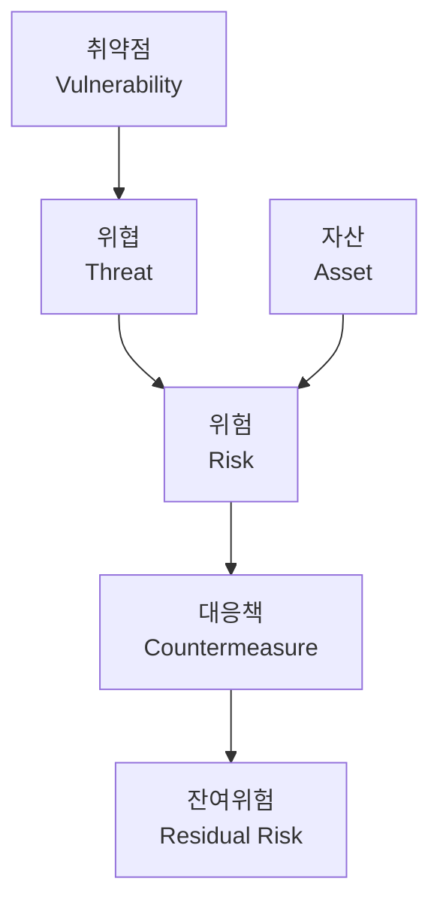

# 01_Fundamentals - 해킹 및 보안 기초

## 📋 개요
해킹보안전문가 1급 과정의 기초 파트입니다. 해킹과 정보보안의 기본 개념부터 보안 취약점의 분류와 진단 방법론까지 전반적인 기초 지식을 학습합니다.

## 📚 강의 구성

### 🔍 기초 개념 학습 (1-2강)

#### [1강: 해킹 기본 개념과 정보보안 기초](./01_Fundamentals_01.md)
- **해킹과 보안의 기본 개념**
  - 해킹(Hacking) vs 크래킹(Cracking) 구분
  - 웹 해킹(Web Hacking)의 정의와 유형
  - 취약점 공격(Exploit)의 개념
  - 제로데이(Zero-day) 공격의 특징

- **해커 분류 체계**
  - 🤍 화이트 해커(White-hat Hacker): 윤리적 해킹 전문가
  - 🖤 블랙햣 해커(Black-hat Hacker): 악의적 크래커
  - 🩶 그레이햣 해커(Grey-hat Hacker): 중간적 성격
  - 👶 스크립트 키디(Script Kiddie): 도구 의존적 초보자
  - 🔴 훙커(Honker)/레드 해커: 중국계 해커 그룹

- **사회공학 공격(Social Engineering)**
  - 인간 심리를 이용한 비기술적 공격
  - 피싱, 보이스 피싱, 스피어 피싱 등
  - 권위, 긴급성, 호감, 상호호혜 기법

- **관련 법률과 처벌**
  - 정보통신망 이용촉진 및 정보보호 등에 관한 법률
  - 침입죄: 5년 이하 징역 또는 5천만원 이하 벌금
  - 악성프로그램 유포: 7년 이하 징역 또는 7천만원 이하 벌금

- **정보보안 3요소 (CIA Triad)**
  - 🔐 기밀성(Confidentiality): 인가된 접근만 허용
  - ✅ 무결성(Integrity): 정보의 정확성 보장
  - 🔄 가용성(Availability): 필요 시 언제든 접근 가능

#### [2강: 보안취약점의 개념 및 종류](./02_Fundamentals_02.md)
- **취약점 발생의 환경적 요인**
  - 🌐 네트워크 연결성: 원격 접근 가능성
  - 📝 정보 변조 용이성: 디지털 정보의 변조 위험
  - 🏢 정보 집적성: 중요 정보의 중앙 집중화
  - 🔧 소프트웨어 복잡성: 복잡한 시스템의 숨겨진 버그
  - 👁️ 불가시성: 내부 활동의 모니터링 어려움

- **보안 취약점 분류**
  - 🖥️ **시스템 보안 취약점**: 계정, 파일, 권한 관리 문제
  - 🌐 **네트워크 보안 취약점**: 네트워크 설정 및 프로토콜 문제  
  - 🌍 **웹 보안 취약점**: 웹 애플리케이션 및 서버 문제

- **OWASP Top 10 주요 웹 취약점**
  - SQL Injection: 데이터베이스 공격
  - XSS(Cross-Site Scripting): 악성 스크립트 삽입
  - CSRF(Cross-Site Request Forgery): 요청 위조
  - Broken Access Control: 접근 제어 실패

- **서버 취약점 진단 방법론**
  - 🔐 계정관리: 사용자 계정 및 권한 점검
  - 📁 파일 및 디렉터리 관리: 중요 파일 권한 설정
  - 🔧 서비스 관리: 불필요한 서비스 및 포트 관리
  - 🔄 패치 관리: 보안 업데이트 적용 현황
  - 📊 로그 관리: 보안 로그 수집 및 분석

## 🎯 학습 목표

### 1단계: 기본 개념 이해
- [ ] 해킹과 크래킹의 차이점 명확히 구분
- [ ] 다양한 해커 유형과 특성 파악
- [ ] 정보보안 3요소(CIA) 완전 이해
- [ ] 관련 법률과 처벌 규정 숙지

### 2단계: 취약점 분류 체계 학습
- [ ] 환경적 요인별 취약점 발생 원리 이해
- [ ] 시스템/네트워크/웹 취약점 분류 체계 파악
- [ ] OWASP Top 10 주요 취약점 숙지
- [ ] 서버 취약점 진단 5대 영역 이해

### 3단계: 실무 적용 능력 배양
- [ ] 기본적인 취약점 스캔 도구 사용
- [ ] 간단한 보안 점검 스크립트 작성
- [ ] 취약점 보고서 작성 및 해석
- [ ] 기초적인 보안 정책 수립

## 🛠️ 실습 도구 및 환경

### 기본 도구
- **운영체제**: Linux (Ubuntu, CentOS), Windows Server
- **가상화**: VMware, VirtualBox
- **텍스트 에디터**: VS Code, Notepad++
- **터미널**: Bash, PowerShell

### 보안 도구
- **취약점 스캐너**: 
  - OpenVAS (오픈소스)
  - Nessus (상용)
  - Lynis (시스템 감사)
- **웹 보안 도구**:
  - OWASP ZAP
  - Burp Suite Community
  - Nikto
- **네트워크 도구**:
  - Nmap (포트 스캔)
  - Wireshark (패킷 분석)

### 실습 환경
- **DVWA** (Damn Vulnerable Web Application)
- **WebGoat** (웹 애플리케이션 보안 학습)
- **Metasploitable** (취약한 Linux 시스템)
- **VulnHub** (다양한 취약한 시스템 이미지)

## 📊 핵심 개념 정리

### 보안 용어 관계도


### 해커 분류 매트릭스
| 구분 | 동기 | 기술 수준 | 법적 지위 | 대표 활동 |
|------|------|-----------|-----------|-----------|
| **화이트햣** | 보안 강화 | 높음 | 합법 | 모의해킹, 보안컨설팅 |
| **블랙햣** | 악의적 목적 | 높음 | 불법 | 데이터 유출, 시스템 파괴 |
| **그레이햣** | 선한 동기 | 중-높음 | 애매함 | 무허가 취약점 발견 |
| **스크립트 키디** | 자랑, 인정 | 낮음 | 대부분 불법 | 기존 도구 무분별 사용 |

### 정보보안 3요소 세부 분석
#### 🔐 기밀성 (Confidentiality)
- **암호화**: 데이터 보호의 핵심 기술
- **접근제어**: 인가된 사용자만 접근 허용
- **인증**: 사용자 신원 확인 절차

#### ✅ 무결성 (Integrity)  
- **해시함수**: 데이터 변조 탐지
- **디지털서명**: 데이터 출처 및 무결성 보장
- **버전관리**: 변경 이력 추적

#### 🔄 가용성 (Availability)
- **이중화**: 시스템 장애 대비
- **백업**: 데이터 복구 체계
- **모니터링**: 시스템 상태 실시간 감시

### OWASP Top 10 2021 요약
| 순위 | 취약점 | 설명 | 대응 방안 |
|------|--------|------|-----------|
| A01 | 접근제어 실패 | 권한 검증 미흡 | 최소 권한 원칙, 세션 관리 |
| A02 | 암호화 실패 | 민감 정보 평문 저장 | 강력한 암호화, 키 관리 |
| A03 | 인젝션 | SQL/NoSQL/Command 주입 | 입력값 검증, Prepared Statement |
| A04 | 안전하지 않은 설계 | 보안 고려 부족한 설계 | 보안 설계 원칙, 위협 모델링 |
| A05 | 보안 구성 오류 | 잘못된 보안 설정 | 보안 설정 점검, 하드닝 |
| A06 | 취약한 컴포넌트 | 오래된 라이브러리 사용 | 의존성 관리, 정기 업데이트 |
| A07 | 식별/인증 실패 | 약한 인증 메커니즘 | 다중인증, 세션 보안 |
| A08 | 소프트웨어/데이터 무결성 실패 | 검증되지 않은 업데이트 | 디지털 서명, 무결성 검사 |
| A09 | 보안 로그/모니터링 실패 | 부적절한 로깅 | 중앙집중 로깅, 실시간 모니터링 |
| A10 | 서버측 요청 위조(SSRF) | 서버의 내부 자원 접근 | URL 화이트리스트, 네트워크 분할 |

## 🔧 실습 예제

### 1. 기본 보안 점검 스크립트

#### Linux 시스템 기초 점검
```bash
#!/bin/bash
# 기초 보안 점검 스크립트

echo "=== Linux 시스템 기초 보안 점검 ==="
echo "점검 시간: $(date)"
echo

# 1. 시스템 정보 확인
echo "1. 시스템 정보"
echo "운영체제: $(cat /etc/os-release | grep PRETTY_NAME | cut -d'"' -f2)"
echo "커널 버전: $(uname -r)"
echo "호스트명: $(hostname)"
echo

# 2. 계정 상태 확인  
echo "2. 계정 상태 점검"
echo "전체 계정 수: $(wc -l < /etc/passwd)"
echo "UID 0 계정: $(awk -F: '$3==0 {print $1}' /etc/passwd | tr '\n' ' ')"
echo "빈 패스워드 계정: $(awk -F: '$2=="" {print $1}' /etc/shadow 2>/dev/null | tr '\n' ' ')"
echo

# 3. 네트워크 서비스 확인
echo "3. 네트워크 서비스 현황"
echo "LISTEN 포트 수: $(netstat -tln 2>/dev/null | grep LISTEN | wc -l)"
echo "주요 서비스:"
netstat -tlnp 2>/dev/null | grep LISTEN | awk '{print $4}' | cut -d: -f2 | sort -n | head -10

echo
echo "점검 완료!"
```

#### Windows PowerShell 기초 점검
```powershell
# Windows 시스템 기초 보안 점검

Write-Host "=== Windows 시스템 기초 보안 점검 ===" -ForegroundColor Yellow
Write-Host "점검 시간: $(Get-Date)" -ForegroundColor Gray
Write-Host

# 1. 시스템 정보
Write-Host "1. 시스템 정보" -ForegroundColor Cyan
Write-Host "컴퓨터명: $env:COMPUTERNAME"
Write-Host "OS 버전: $((Get-WmiObject -Class Win32_OperatingSystem).Caption)"
Write-Host "마지막 부팅: $((Get-WmiObject -Class Win32_OperatingSystem).LastBootUpTime)"
Write-Host

# 2. 사용자 계정 확인
Write-Host "2. 사용자 계정 상태" -ForegroundColor Cyan
$users = Get-LocalUser
Write-Host "전체 계정 수: $($users.Count)"
Write-Host "활성 계정 수: $(($users | Where-Object {$_.Enabled}).Count)"
Write-Host "Administrator 상태: $(if((Get-LocalUser Administrator).Enabled){'활성화'}else{'비활성화'})"
Write-Host "Guest 상태: $(if((Get-LocalUser Guest).Enabled){'활성화'}else{'비활성화'})"
Write-Host

# 3. 중요 서비스 확인
Write-Host "3. 중요 서비스 현황" -ForegroundColor Cyan
$importantServices = @("Themes", "RemoteRegistry", "TelNet", "FTPSVC")
foreach($service in $importantServices) {
    $svc = Get-Service -Name $service -ErrorAction SilentlyContinue
    if($svc) {
        $status = if($svc.Status -eq 'Running'){"실행중 ⚠️"}else{"중지됨 ✅"}
        Write-Host "$service`: $status"
    }
}

Write-Host "`n점검 완료!" -ForegroundColor Green
```

### 2. 취약점 스캔 실습

#### Nmap을 이용한 기본 스캔
```bash
# 1. 호스트 발견 스캔
nmap -sn 192.168.1.0/24

# 2. 기본 포트 스캔
nmap -sS -O 192.168.1.100

# 3. 서비스 버전 탐지
nmap -sV 192.168.1.100

# 4. 취약점 스크립트 실행
nmap --script vuln 192.168.1.100
```

#### OpenVAS 기본 설정
```bash
# OpenVAS 설치 (Ubuntu)
sudo apt install openvas

# 초기 설정
sudo gvm-setup

# 서비스 시작
sudo gvm-start

# 웹 인터페이스 접속: https://localhost:9392
```

### 3. 웹 취약점 실습 예제

#### SQL Injection 테스트
```php
// 취약한 PHP 코드 (테스트용)
<?php
$username = $_POST['username'];
$password = $_POST['password'];

// 취약점: 직접적인 SQL 쿼리 구성
$query = "SELECT * FROM users WHERE username='$username' AND password='$password'";

// 공격 예시 입력
// username: admin' OR '1'='1' --
// password: anything
?>

<!-- 보안 강화 코드 -->
<?php
// Prepared Statement 사용
$stmt = $pdo->prepare("SELECT * FROM users WHERE username = ? AND password = ?");
$stmt->execute([$username, $password]);
?>
```

#### XSS 취약점 테스트
```html
<!-- 취약한 HTML (테스트용) -->
<form method="get" action="">
    이름: <input type="text" name="name">
    <input type="submit" value="전송">
</form>

<?php
if(isset($_GET['name'])) {
    // 취약점: 입력값 필터링 없음
    echo "안녕하세요, " . $_GET['name'] . "님!";
    
    // 공격 예시: <script>alert('XSS')</script>
}
?>

<!-- 보안 강화 코드 -->
<?php
if(isset($_GET['name'])) {
    // htmlspecialchars로 입력값 이스케이핑
    echo "안녕하세요, " . htmlspecialchars($_GET['name'], ENT_QUOTES, 'UTF-8') . "님!";
}
?>
```

## 📈 학습 로드맵

### 🔰 입문 단계 (1-2주)
- [ ] 해킹과 보안의 기본 개념 이해
- [ ] 간단한 Linux 명령어 학습
- [ ] 기본적인 네트워크 개념 습득
- [ ] 가상머신 환경 구축

### 🎯 기초 단계 (3-4주)  
- [ ] 취약점 분류 체계 완전 이해
- [ ] OWASP Top 10 상세 학습
- [ ] 기본 보안 도구 사용법 익히기
- [ ] 간단한 취약점 실습 수행

### 🚀 중급 단계 (5-8주)
- [ ] 서버 취약점 진단 방법론 숙지
- [ ] 자동화 스크립트 작성 능력
- [ ] 취약점 보고서 작성 및 해석
- [ ] 기본적인 침투 테스트 수행

### 💪 고급 단계 (9-12주)
- [ ] 복합적인 취약점 분석 능력
- [ ] 보안 정책 수립 및 관리
- [ ] 인시던트 대응 절차 이해
- [ ] 보안 솔루션 설계 및 구축

## 🏆 인증서 및 자격증

### 국내 자격증
- **정보보안기사**: 국가기술자격, 정보보안 기초 지식
- **정보처리보안사**: TTA 인증, 보안 실무 능력
- **해킹보안전문가**: 민간자격, 실무 중심 해킹 보안

### 국제 자격증  
- **Security+**: CompTIA, 기초 보안 지식 인증
- **CEH**: EC-Council, 윤리적 해킹 전문가
- **CISSP**: (ISC)², 정보보안 전문가 (경력 5년 필요)
- **CISA**: ISACA, 정보시스템 감사 전문가

## 📚 추천 학습 자료

### 도서
- **국내서적**:
  - 『해킹 보안 전문가 가이드』 - 이희조 저
  - 『정보보안개론』 - 한국정보보호학회
  - 『웹 해킹 & 보안 완벽 가이드』 - 조기현 저

- **해외서적**:
  - 『The Web Application Hacker's Handbook』 - Dafydd Stuttard
  - 『Hacking: The Art of Exploitation』 - Jon Erickson
  - 『Gray Hat Hacking』 - Daniel Regalado

### 온라인 리소스
- **OWASP** (https://owasp.org/): 웹 애플리케이션 보안 가이드
- **SANS Reading Room** (https://www.sans.org/reading-room/): 보안 백서 및 연구자료
- **CVE Details** (https://www.cvedetails.com/): 취약점 정보 데이터베이스
- **Exploit Database** (https://www.exploit-db.com/): 익스플로잇 코드 저장소

### 실습 플랫폼
- **HackTheBox** (https://www.hackthebox.eu/): 온라인 침투 테스트 실습
- **TryHackMe** (https://tryhackme.com/): 초보자 친화적 보안 학습
- **OverTheWire** (https://overthewire.org/): 워게임 형태의 보안 실습
- **PicoCTF** (https://picoctf.org/): CTF 대회 형태의 보안 문제

## ⚠️ 윤리적 고려사항

### 윤리적 해킹의 원칙
1. **허가된 활동만 수행**: 명시적 승인 없이는 테스트 금지
2. **피해 최소화**: 시스템 가용성에 영향을 주지 않도록 주의
3. **기밀성 유지**: 발견된 취약점 정보의 적절한 관리
4. **신고 의무**: 발견된 취약점의 적절한 보고 절차 준수

### 법적 주의사항
- **정보통신망법** 준수: 불법적인 시스템 접근 금지
- **개인정보보호법** 준수: 개인정보 수집 및 처리 제한
- **저작권법** 준수: 상용 도구의 불법 사용 금지
- **국제법** 고려: 국경을 넘나드는 보안 활동 시 각국 법률 준수

## 🔧 도구 설치 가이드

### Linux 환경 (Ubuntu 20.04 기준)
```bash
# 기본 도구 설치
sudo apt update
sudo apt install -y nmap nikto dirb gobuster sqlmap

# OpenVAS 설치
sudo apt install -y openvas
sudo gvm-setup

# Docker 설치 (취약한 앱 실행용)
sudo apt install -y docker.io
sudo systemctl enable docker
sudo usermod -aG docker $USER

# DVWA 실행
docker run -d -p 80:80 vulnerables/web-dvwa
```

### Windows 환경
```powershell
# Chocolatey 패키지 매니저 설치
Set-ExecutionPolicy Bypass -Scope Process -Force
[System.Net.ServicePointManager]::SecurityProtocol = [System.Net.ServicePointManager]::SecurityProtocol -bor 3072
iex ((New-Object System.Net.WebClient).DownloadString('https://chocolatey.org/install.ps1'))

# 보안 도구 설치
choco install -y nmap burp-suite-free-edition wireshark

# PowerShell 보안 모듈 설치
Install-Module -Name PowerShellGet -Force
Install-Module -Name Pester -Force
```

## 📞 학습 지원 및 커뮤니티

### 국내 커뮤니티
- **KISA**: 한국인터넷진흥원 보안 가이드 및 교육
- **KITRI**: 한국정보기술연구원 보안 인재 양성
- **CodeEngn**: 리버스 엔지니어링 및 보안 연구
- **WACON**: 화이트햇 콘테스트 및 컨퍼런스

### 국제 커뮤니티
- **DEF CON**: 세계 최대 해커 컨퍼런스
- **Black Hat**: 보안 연구 및 기술 컨퍼런스  
- **BSides**: 지역 단위 보안 커뮤니티 이벤트
- **OWASP Chapter**: 지역별 OWASP 모임

## 🎯 다음 단계

이 기초 과정을 완료한 후에는 다음과 같은 전문 분야로 진출할 수 있습니다:

### 🖥️ 서버 보안 전문가
- **02_Server_Security** 과정 수강
- UNIX/Linux 및 Windows 서버 보안 전문성 확보
- 서버 하드닝 및 취약점 진단 능력 개발

### 🌐 웹 보안 전문가
- 웹 애플리케이션 보안 심화 학습
- OWASP 가이드라인 기반 보안 개발
- 웹 애플리케이션 침투 테스트 전문성

### 🔍 침투 테스트 전문가
- 모의해킹 방법론 학습
- 침투 테스트 도구 활용 능력
- 보안 컨설팅 역량 개발

### 🛡️ 보안 관제 전문가
- SOC(보안관제센터) 운영 능력
- 보안 인시던트 대응 절차
- 보안 모니터링 시스템 관리

---

## 💡 학습 팁

### 효과적인 학습 방법
1. **이론과 실습의 균형**: 개념 학습 후 반드시 실습으로 검증
2. **단계별 학습**: 기초부터 차근차근 단계별로 진행
3. **커뮤니티 활용**: 온라인 커뮤니티에서 질문하고 토론
4. **프로젝트 기반 학습**: 실제 프로젝트를 통한 경험 축적

### 실습 환경 관리
- **안전한 환경**: 격리된 테스트 환경에서만 실습
- **백업 유지**: 중요한 시스템 설정의 정기적 백업
- **문서화**: 실습 과정과 결과를 상세히 기록
- **버전 관리**: 코드와 설정 파일의 체계적 관리

---

## 📞 문의 및 기여

이 자료에 대한 문의나 개선사항은 GitHub Issues를 통해 제안해 주세요.

**작성자**: [Shin-Tae-Bin](https://github.com/Shin-Tae-Bin)  
**프로젝트**: [Hacking-Security-Expert-1st-Grade](https://github.com/Shin-Tae-Bin/Hacking-Security-Expert-1st-Grade)

---
*이 자료는 해킹보안전문가 1급 자격증 취득을 위한 학습 목적으로 작성되었습니다.*