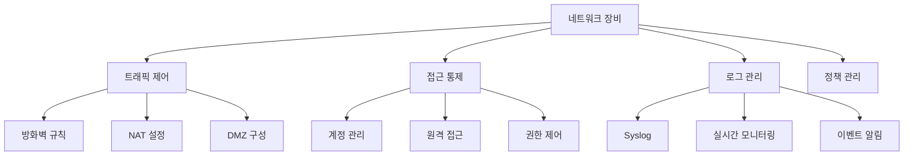
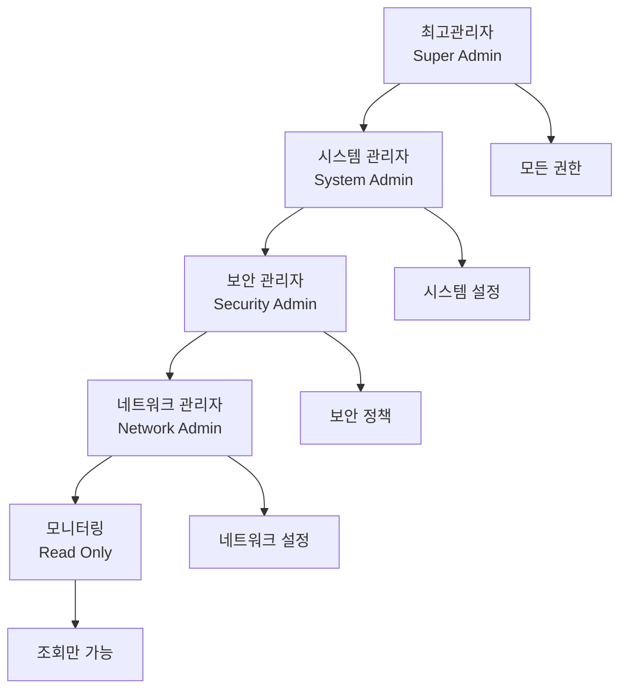

# 11강: 보안·네트워크 장비 기초 개념 및 진단 체계

## 개요
해킹보안전문가 1급 과정의 네트워크 보안 파트입니다. 보안·네트워크 장비의 취약점 진단 개념과 체계적인 점검 방법론을 학습합니다. 방화벽, 라우터, 스위치, IPS/IDS 등 네트워크 보안 장비의 안전한 설정과 관리 방법을 다룹니다.

## 주요 학습 내용

### 1. 보안·네트워크 장비 취약점 진단 개요

#### 진단 목적 및 중요성
**보안·네트워크 장비의 취약점 점검**은 장비 설정 또는 장비를 통과하는 트래픽 처리 설정을 통해 공격자에 의해 공격당하지 않도록 보안점검 항목을 정의하여 점검을 실시합니다. 취약점 점검 항목에 의해 현황을 파악하고 보안 기준에 부합하도록 설정을 유지하여 **안정적인 서비스와 보안 위험을 사전 제거하는 것**을 목적으로 합니다.

#### 네트워크 장비 보안의 특성


#### 진단 대상 장비
- **방화벽(Firewall)**: 패킷 필터링 및 침입 차단
- **라우터(Router)**: 네트워크 간 데이터 라우팅
- **스위치(Switch)**: LAN 내 데이터 스위칭
- **IPS/IDS**: 침입 탐지 및 방지 시스템
- **UTM**: 통합 보안 관리 장비
- **VPN 게이트웨이**: 가상 사설망 접속 장비

### 2. 취약점 진단 분류 체계

보안·네트워크 장비의 취약점 점검은 장비에 따라 세부적인 내용이 달라지지만 **사전 정의된 취약점 점검 항목**을 바탕으로 이루어집니다.

#### 🔐 계정 관리 (Account Management)
- **시스템에 등록되어 있는 관리자 및 사용자 계정의 권한 오남용 여부**
- **패스워드의 안전한 설정 적용**

주요 점검 영역:
- Default 계정 및 패스워드 변경
- 계정별 권한 설정 및 관리
- 로그인 실패 횟수 제한
- 패스워드 복잡성 및 암호화

#### 🚪 접근 관리 (Access Management)
- **장비에 접근 IP설정 등 장비 자체에 대한 접근 통제 현황 점검**

주요 점검 영역:
- 원격 관리 접근 통제
- 보안 접속 프로토콜 사용
- Session timeout 설정
- VTY 접근 제어(ACL)

#### 🔄 패치 관리 (Patch Management)
- **장비별 최신 보안 패치 및 제조사 권고사항 적용 내역 점검**

주요 점검 영역:
- 벤더 최신 업데이트 적용
- 취약점 패치 현황 관리
- 정기적인 보안 업데이트

#### 📊 로그 관리 (Log Management)
- **시스템 로그 접근 권한 점검, 로그수집에 대한 점검**

주요 점검 영역:
- 보안장비 로그 설정
- 로그 정기적 검토
- 로그 보관 정책
- 원격 로그 서버 사용
- NTP 서버 연동
- Timestamp 설정

#### ⚙️ 기능 관리 (Function Management)
- **장비를 통과하는 트래픽에 대하여 보안 설정 점검**

주요 점검 영역:
- 정책 관리
- NAT 설정
- DMZ 설정
- 최소한의 서비스만 제공
- 이상징후 탐지 경고 기능
- SNMP 서비스 관리

### 3. 미래창조과학부 취약점 분석·평가 기준

#### 필수 점검 항목 (상급)

##### 계정관리
| 번호 | 취약점 점검 항목 | 등급 | 설명 |
|------|------------------|------|------|
| **S-1** | 보안장비 Default 계정 변경 | 상 | 제조업체 기본 계정 변경 |
| **S-2** | 보안장비 Default 패스워드 변경 | 상 | 제조업체 기본 패스워드 변경 |
| **S-3** | 보안장비 계정별 권한 설정 | 상 | 최소 권한 원칙 적용 |
| **S-4** | 보안장비 계정 관리 | 상 | 1인 1계정, 공유계정 금지 |

##### 접근관리
| 번호 | 취약점 점검 항목 | 등급 | 설명 |
|------|------------------|------|------|
| **S-5** | 보안장비 원격 관리 접근 통제 | 상 | 접속 IP 및 계정 제한 |
| **S-6** | 보안장비 보안 접속 | 상 | HTTPS/SSH 등 암호화 연결 |
| **S-7** | Session timeout 설정 | 상 | 자동 로그아웃 설정 |

##### 패치관리
| 번호 | 취약점 점검 항목 | 등급 | 설명 |
|------|------------------|------|------|
| **S-8** | 벤더에서 제공하는 최신 업데이트 적용 | 상 | 정기적인 보안 패치 적용 |

##### 기능관리
| 번호 | 취약점 점검 항목 | 등급 | 설명 |
|------|------------------|------|------|
| **S-9** | 정책 관리 | 상 | 표준화된 정책 관리 체계 |
| **S-10** | NAT 설정 | 상 | 네트워크 주소 변환 설정 |
| **S-11** | DMZ 설정 | 상 | 비무장지대 구성 |
| **S-12** | 최소한의 서비스만 제공 | 상 | All Deny 기반 최소 허용 |
| **S-13** | 이상징후 탐지 경고 기능 설정 | 상 | 실시간 알림 기능 |
| **S-14** | 장비 사용량 검토 | 상 | 리소스 모니터링 |
| **S-15** | SNMP 서비스 확인 | 상 | 불필요 시 비활성화 |
| **S-16** | SNMP community string 복잡성 설정 | 상 | 기본값 변경 및 복잡화 |

#### 선택 점검 항목 (중/하급)

##### 계정관리
| 번호 | 취약점 점검 항목 | 등급 |
|------|------------------|------|
| **S-17** | 로그인 실패횟수 제한 | 중 |

##### 로그관리
| 번호 | 취약점 점검 항목 | 등급 |
|------|------------------|------|
| **S-18** | 보안장비 로그 설정 | 중 |
| **S-19** | 보안장비 로그 정기적 검토 | 중 |
| **S-20** | 보안장비 로그 보관 | 중 |
| **S-21** | 보안장비 정책 백업 설정 | 중 |
| **S-22** | 원격 로그 서버 사용 | 중 |
| **S-23** | 로그 서버 설정 관리 | 하 |
| **S-24** | NTP 서버 연동 | 중 |

##### 기능관리
| 번호 | 취약점 점검 항목 | 등급 |
|------|------------------|------|
| **S-25** | 부가 기능 설정 | 중 |
| **S-26** | 유해 트래픽 차단 정책 설정 | 중 |

### 4. Default 계정/패스워드 관리

#### S-1: 보안장비 Default 계정 변경

##### 취약점 설명
**디폴트 로그인 계정**은 장비 제조업체에서 출고 시 설정되어 나오는 기본 로그인 아이디를 말합니다. 제조사의 장비별 디폴트 로그인 아이디 리스트는 인터넷 등을 통해 쉽게 구할 수 있어, 악의적인 사용자가 이러한 디폴트 로그인계정을 이용하여 불법적으로 방화벽 장비에 접근할 수 있습니다.

방화벽 장비에 대한 불법 접근은 일반 정보시스템 침해사고보다 **훨씬 심각한 피해**를 초래할 수 있습니다. 불법접근이 가능한 경우 시스템으로의 침입경로를 제공해 줄 수도 있습니다.

- **위협 영향**: 보안장비에 불법적 침입 허용

##### 점검 방법
```bash
# 1. Web을 통한 접속 시도
# 2. Default 계정, 비밀번호 입력 테스트
# 3. 접속 성공/실패 확인
```

**주요 Default 계정 예시:**
- **Cisco**: admin, cisco, root
- **Juniper**: root, admin
- **Fortinet**: admin
- **SonicWall**: admin
- **Palo Alto**: admin

##### 조치 방안
```bash
# 보안장비별 계정 변경 방법

1. 보안장비에서 제공하고 있는 계정 메뉴에서 ID 변경
2. ID 변경이 불가능할 경우 패스워드로 보완 필요

# 예시: 방화벽 Web 관리 화면
- System → Administrator → Account Management
- 새로운 관리자 계정 생성 후 기본 계정 비활성화
```

##### 조치 영향
- 일반적으로 이상 영향 없음
- 새로운 계정 정보 관리 필수

#### S-2: 보안장비 Default 패스워드 변경

##### 취약점 설명
**디폴트 로그인 패스워드**는 장비 제조업체에서 출고 시 설정되어 나오는 기본 로그인 패스워드를 말합니다. 각 제조사의 장비별 디폴트 로그인 패스워드 리스트는 인터넷 등을 통해 쉽게 구할 수 있어, 악의적인 사용자가 이러한 디폴트 패스워드를 이용하여 불법적으로 방화벽 장비에 접근할 수 있습니다.

- **위협 영향**: 보안장비에 불법적 침입 허용

**주요 Default 패스워드 예시:**
- **Cisco**: cisco, admin, password
- **Juniper**: (빈 패스워드), netscreen
- **Fortinet**: (빈 패스워드)
- **SonicWall**: password
- **Palo Alto**: admin

##### 조치 방안
```bash
# 보안장비 패스워드 정책 예시

1. 보안장비에서 제공하고 있는 패스워드 메뉴에서 패스워드 변경
2. 보안장비가 제공하는 범위에서 패스워드 설정
   - 특수문자, 숫자, 영소문자 포함 8자리 이상
   - 사전에 없는 단어 조합
   - 정기적인 패스워드 변경

# 강력한 패스워드 예시
- 약함: admin, password123
- 강함: Adm!n2024#Sec, N3tw0rk@2024!
```

### 5. 계정별 권한 관리

#### S-3: 보안장비 계정별 권한 설정

##### 취약점 설명
여러 사람이 접속하여 사용하는 경우, **계정별 부적절한 권한 설정**으로 인해 보안장비에 영향을 끼칠 수 있습니다. 예를 들면, 보안 정책과 관련 없는 관리자에게 보안정책을 수정할 수 있는 권한이 부여된다면, 의도하지 않았어도 보안장비의 보안정책이 수정될 수도 있습니다.

- **위협 영향**: 잘못된 권한 설정으로 추가적인 피해 발생 증가

##### 권한 레벨 체계


##### 조치 방안
```bash
# 권한별 역할 정의

1. Super Administrator (최고관리자)
   - 모든 시스템 설정 및 정책 변경
   - 계정 생성/삭제/권한 부여
   - 시스템 백업/복구

2. Security Administrator (보안관리자)
   - 방화벽 정책 설정/변경
   - 보안 로그 분석
   - 침입탐지 설정

3. Network Administrator (네트워크관리자)
   - 네트워크 인터페이스 설정
   - 라우팅 정책 관리
   - 네트워크 모니터링

4. Read-only User (조회 사용자)
   - 설정 조회만 가능
   - 로그 조회
   - 상태 모니터링
```

#### S-4: 보안장비 계정 관리

##### 취약점 설명
계정을 제대로 관리하지 않는 경우 다음과 같은 문제가 발생할 수 있습니다:

- 자신의 업무와 관련이 없는 애플리케이션 및 자원에 접속 가능
- 운영자 부주의로 발생한 시스템 장애 발생 시 사후 추적 불가
- 휴면중인 사용자 계정이 시스템에 존재하여 악의적인 목적으로 사용될 가능성
- 시스템 담당자들이 관리 편의를 위해 하나의 관리 계정을 공용으로 사용
- 계정의 생성/변경/삭제 및 시스템 접근이력 등에 대한 데이터를 체계적으로 관리하지 않음

- **위협 영향**: 네트워크 장애, 정보유출, 비인가 사용자 접속 허용

##### 조치 방안
```bash
# 계정 관리 원칙

1. 1인 1계정 원칙
   - 개인별 고유 계정 할당
   - 공유 계정 사용 금지
   - 개인 책임 추적 가능

2. 최소 권한 원칙
   - 업무에 필요한 최소한의 권한만 부여
   - 권한 상승은 별도 절차를 통해 승인
   - 정기적인 권한 검토

3. 계정 생명주기 관리
   - 신규 계정: 승인 절차를 통한 생성
   - 기존 계정: 정기적인 권한 및 활성 상태 검토
   - 퇴직자 계정: 즉시 비활성화 및 삭제

4. 감사 추적
   - 모든 계정 활동 로그 기록
   - 접속 이력 및 변경 사항 추적
   - 정기적인 로그 검토
```

### 6. 실무 적용 가이드

#### 체크리스트 기반 점검
```bash
#!/bin/bash
# 보안·네트워크 장비 기초 점검 스크립트

echo "=== 보안·네트워크 장비 기초 보안 점검 ==="
echo "점검 일시: $(date)"
echo

# 1. 계정 관리 점검
echo "1. 계정 관리 점검"
echo "================="

echo "□ S-1: Default 계정이 변경되었나요?"
echo "□ S-2: Default 패스워드가 변경되었나요?"
echo "□ S-3: 계정별 적절한 권한이 설정되었나요?"
echo "□ S-4: 1인 1계정 원칙이 적용되었나요?"
echo "□ S-17: 로그인 실패횟수 제한이 설정되었나요?"
echo

# 2. 접근 관리 점검
echo "2. 접근 관리 점검"
echo "================="

echo "□ S-5: 원격 관리 접근 IP가 제한되었나요?"
echo "□ S-6: HTTPS/SSH 등 보안 접속을 사용하나요?"
echo "□ S-7: Session timeout이 설정되었나요?"
echo

# 3. 패치 관리 점검
echo "3. 패치 관리 점검"
echo "================="

echo "□ S-8: 최신 보안 패치가 적용되었나요?"
echo

# 4. 기능 관리 점검
echo "4. 기능 관리 점검"
echo "================="

echo "□ S-9: 정책 관리가 표준화되었나요?"
echo "□ S-10: NAT 설정이 적절한가요?"
echo "□ S-11: DMZ가 구성되었나요?"
echo "□ S-12: 최소한의 서비스만 허용하나요?"
echo "□ S-13: 이상징후 탐지 경고가 설정되었나요?"
echo "□ S-14: 장비 사용량을 정기적으로 검토하나요?"
echo "□ S-15: SNMP 서비스가 적절히 관리되나요?"
echo "□ S-16: SNMP community string이 복잡하게 설정되었나요?"
echo

# 5. 로그 관리 점검
echo "5. 로그 관리 점검"
echo "================="

echo "□ S-18: 보안장비 로그가 설정되었나요?"
echo "□ S-19: 로그를 정기적으로 검토하나요?"
echo "□ S-20: 로그를 적절한 기간 보관하나요?"
echo "□ S-21: 정책 백업이 설정되었나요?"
echo "□ S-22: 원격 로그 서버를 사용하나요?"
echo "□ S-23: 로그 서버가 적절히 관리되나요?"
echo "□ S-24: NTP 서버와 연동되었나요?"

echo
echo "점검 완료!"
```

#### 제조사별 관리 방법

##### Cisco 장비 관리
```bash
# Cisco IOS 기본 보안 설정

# 1. Enable secret 설정
Router(config)# enable secret strong_password_2024!

# 2. 콘솔 패스워드 설정
Router(config)# line con 0
Router(config-line)# password console_pass_2024
Router(config-line)# login

# 3. VTY 접근 제한
Router(config)# access-list 1 permit 192.168.1.0 0.0.0.255
Router(config)# line vty 0 4
Router(config-line)# access-class 1 in
Router(config-line)# password vty_pass_2024
Router(config-line)# login

# 4. 로깅 설정
Router(config)# logging buffered 16384
Router(config)# logging 192.168.1.100
```

##### Juniper 장비 관리
```bash
# Juniper JunOS 기본 보안 설정

# 1. Root 패스워드 설정
user@juniper# set system root-authentication encrypted-password "$1$xyz$..."

# 2. 사용자 계정 생성
user@juniper# set system login user admin class super-user authentication encrypted-password "$1$abc$..."

# 3. 로그 설정
user@juniper# set system syslog host 192.168.1.100 any any

# 4. NTP 설정
user@juniper# set system ntp server 192.168.1.10
```

##### Fortinet 장비 관리
```bash
# FortiGate 기본 보안 설정

# 1. 관리자 계정 설정
config system admin
    edit "admin"
        set password "strong_password_2024!"
    next
end

# 2. 접근 제한 설정
config system admin
    edit "admin"
        set trusthost1 192.168.1.0/24
    next
end

# 3. 로그 설정
config log syslogd setting
    set status enable
    set server "192.168.1.100"
end
```

### 7. 보안 정책 수립 가이드

#### 계정 보안 정책 예시
```markdown
# 네트워크 보안장비 계정 보안 정책

## 1. 목적
본 정책은 네트워크 보안장비의 계정 보안을 강화하여 무단 접근을 방지하고 
시스템의 무결성을 유지하는 것을 목적으로 한다.

## 2. 적용 범위
- 모든 방화벽, 라우터, 스위치, IPS/IDS 등 네트워크 보안장비
- 해당 장비에 접근하는 모든 관리자 및 사용자

## 3. 계정 관리 원칙

### 3.1 기본 계정 관리
- 모든 기본(Default) 계정은 변경 또는 비활성화
- 기본 패스워드는 반드시 변경
- 불필요한 계정은 즉시 삭제

### 3.2 패스워드 정책
- 최소 8자 이상의 복잡한 패스워드 사용
- 영문 대소문자, 숫자, 특수문자 조합 필수
- 90일마다 패스워드 변경
- 이전 3개 패스워드 재사용 금지

### 3.3 접근 제어
- 1인 1계정 원칙 준수
- 최소 권한 원칙 적용
- 관리 목적 외 계정 공유 금지
- 원격 접근 시 IP 주소 제한

## 4. 모니터링 및 감사
- 모든 계정 활동 로그 기록
- 로그인 실패 3회 초과 시 계정 잠금
- 월 1회 계정 현황 검토
- 분기 1회 권한 적정성 검토
```

### 8. 위험도별 대응 우선순위

#### 긴급 대응 (상급 취약점)


1. **Default 계정/패스워드 (S-1, S-2)**
   - 발견 즉시 변경 필수
   - 24시간 내 완료
   - 임시 조치 후 영구 조치

2. **원격 접근 통제 미흡 (S-5)**
   - ACL 즉시 적용
   - 허용 IP 최소화
   - 접근 로그 모니터링

3. **권한 설정 오류 (S-3)**
   - 과도한 권한 즉시 회수
   - 필요 권한만 재부여
   - 변경 사항 문서화

#### 정기 대응 (중급 취약점)
1. **로그 관리 (S-18~S-24)**
   - 월간 로그 분석
   - 분기별 정책 검토
   - 연간 보관 정책 갱신

2. **SNMP 관리 (S-15, S-16)**
   - 분기별 Community String 변경
   - 불필요 서비스 정기 점검
   - 모니터링 솔루션 연동 검토

#### 계획 대응 (하급 취약점)
1. **부가 기능 (S-25)**
   - 연간 기능 검토
   - 벤더 권장사항 적용
   - 성능 영향 평가

## 실습 환경

### 가상 네트워크 구성
```bash
# GNS3 또는 EVE-NG를 이용한 실습 환경 구성

1. 기본 토폴로지
   [PC1] --- [Switch] --- [Firewall] --- [Router] --- [Internet]
                |              |
              [PC2]        [DMZ Server]

2. 실습 장비
   - Cisco 2811 Router
   - Cisco 2960 Switch  
   - ASA 5505 Firewall
   - Ubuntu Server (Syslog)

3. 설정 시나리오
   - 취약한 설정으로 초기 구성
   - 단계별 보안 강화 실습
   - 점검 도구를 이용한 검증
```

### Docker 기반 실습
```bash
# Docker를 이용한 네트워크 보안 실습

# 1. 취약한 네트워크 서비스 컨테이너
docker run -d --name vulnerable-router \
  -p 23:23 -p 161:161/udp \
  vulnerable/router:latest

# 2. 로그 서버 컨테이너
docker run -d --name syslog-server \
  -p 514:514/udp \
  rsyslog/server:latest

# 3. 모니터링 도구 컨테이너
docker run -d --name network-monitor \
  -p 3000:3000 \
  grafana/grafana:latest
```

## 참고 자료

### 관련 표준 및 가이드라인
- **KISA 주요정보통신기반시설 취약점 분석·평가 기준**
- **NIST SP 800-53**: Security Controls for Federal Information Systems
- **ISO/IEC 27001**: Information Security Management Systems
- **SANS Top 20 Critical Security Controls**

### 벤더별 보안 가이드
- **Cisco Security Configuration Guide**
- **Juniper Security Hardening Guide**
- **Fortinet Security Best Practices**
- **Palo Alto Networks Security Configuration**

### 도구 및 솔루션
- **Nessus**: 취약점 스캔
- **OpenVAS**: 오픈소스 취약점 스캐너
- **Nmap**: 네트워크 스캔
- **PRTG**: 네트워크 모니터링

## 마무리

보안·네트워크 장비의 취약점 진단은 **체계적인 접근**이 필요합니다. 단순히 개별 취약점을 점검하는 것이 아니라, **전체적인 보안 아키텍처** 관점에서 접근해야 합니다. 

다음 강의에서는 **로그인 실패횟수 제한**, **원격 관리 접근 통제**, **보안 접속** 등 접근 관리와 관련된 구체적인 취약점과 대응 방안에 대해 자세히 학습하겠습니다.

---
*이 자료는 해킹보안전문가 1급 자격증 취득을 위한 학습 목적으로 작성되었습니다.*