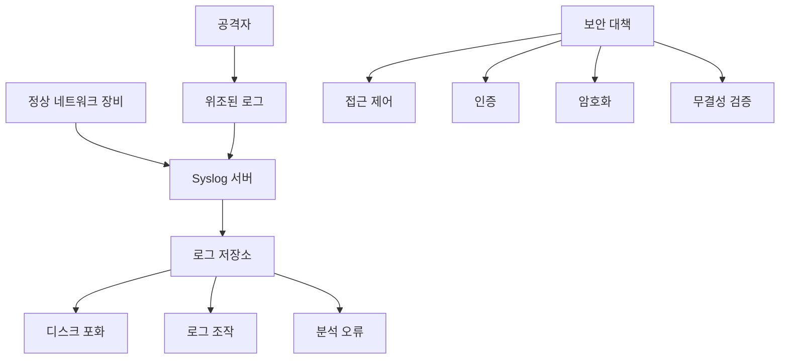
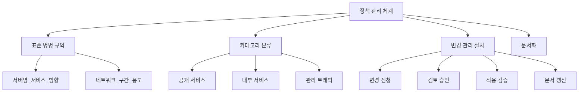
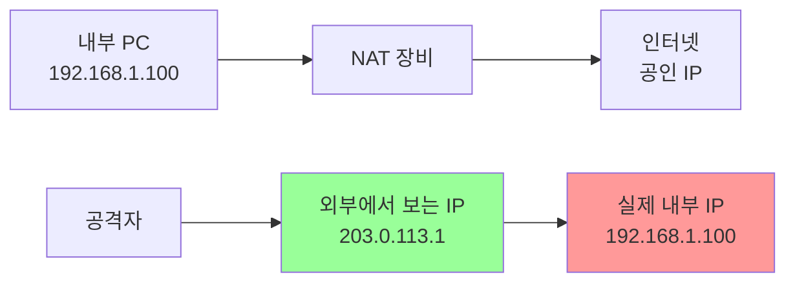
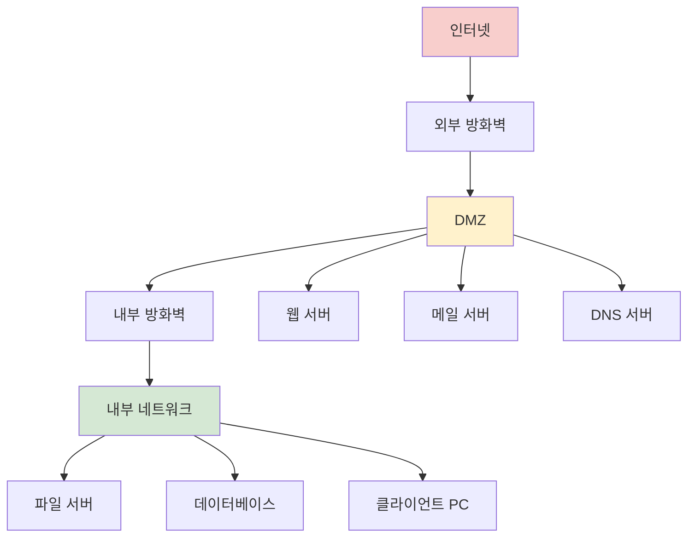
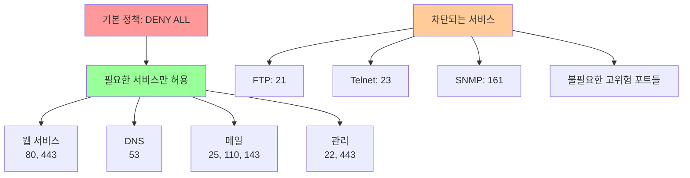
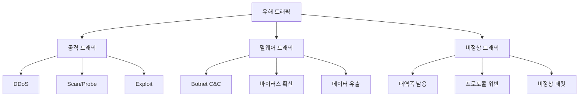

# 13강: 기능 관리 및 고급 보안 설정

## 개요
해킹보안전문가 1급 과정의 13강으로, 보안·네트워크 장비의 기능 관리 취약점을 다룹니다. 정책 관리, NAT/DMZ 설정, 유해 트래픽 차단, 이상 징후 탐지, SNMP 서비스 관리 등 고급 보안 기능들의 올바른 구성과 운영 방법을 학습합니다.

## 주요 학습 내용

### 1. 로그 관리 - 로그 서버 설정 관리 (S-23)

#### 취약점 설명
**Syslog 서버는 기본적으로 모든 IP로부터 로그 메시지를 받아들입니다.** 이 경우에 공격자는 이미 syslog 서버에 저장되어 있는 로그 메시지를 변경하지는 못하지만 조작된 로그 메시지를 전송함으로써 관리자에게 혼란을 줄 수 있습니다. 또한, syslog 서버의 디스크를 모두 조작된 로그로 채움으로써 정상적으로 발생된 로그가 저장될 수 없도록 할 수 있습니다.

- **위협 영향**: 잘못 전송된 로그로 인해 로그 분석을 제대로 할 수 없음

#### Syslog 보안 위험


#### 점검 방법
```bash
# Syslog 서버 접근 제한 설정 확인

# 1. 서버 측 접근 제어 확인
sudo netstat -ulnp | grep :514
sudo ss -ulnp | grep :514

# 2. 방화벽 규칙 확인
sudo iptables -L -n | grep 514
sudo ufw status | grep 514

# 3. Syslog 서버 설정 확인
cat /etc/rsyslog.conf | grep -E "ModLoad|UDPServer"

# 4. 접근 로그 확인
tail -f /var/log/syslog | grep -E "refused|denied|blocked"
```

#### 조치 방안

##### Syslog 서버 보안 강화
```bash
# 1. rsyslog 서버 보안 설정

# /etc/rsyslog.conf 수정
# 특정 IP 대역에서만 로그 수신 허용
$ModLoad imudp
$UDPServerRun 514
$UDPServerAddress 192.168.1.100  # 특정 인터페이스만
$AllowedSender UDP, 192.168.1.0/24  # 허용된 네트워크만

# TLS 암호화 설정
$DefaultNetstreamDriver gtls
$DefaultNetstreamDriverCAFile /etc/ssl/certs/ca.pem
$DefaultNetstreamDriverCertFile /etc/ssl/certs/server.pem
$DefaultNetstreamDriverKeyFile /etc/ssl/private/server.key

# 2. 네트워크 레벨 접근 제어
sudo iptables -A INPUT -p udp --dport 514 -s 192.168.1.0/24 -j ACCEPT
sudo iptables -A INPUT -p udp --dport 514 -j DROP

# UFW를 사용하는 경우
sudo ufw allow from 192.168.1.0/24 to any port 514 proto udp
sudo ufw deny 514/udp

# 3. 로그 무결성 보장
# 디지털 서명을 위한 스크립트
#!/bin/bash
LOG_FILE="/var/log/network.log"
SIGNATURE_FILE="${LOG_FILE}.sig"

# 로그 파일 서명
openssl dgst -sha256 -sign /etc/ssl/private/log-signing.key \
    -out $SIGNATURE_FILE $LOG_FILE

# 서명 검증
openssl dgst -sha256 -verify /etc/ssl/certs/log-signing.pub \
    -signature $SIGNATURE_FILE $LOG_FILE
```

##### 고급 Syslog 보안 설정
```bash
# syslog-ng 고급 설정 예시
# /etc/syslog-ng/syslog-ng.conf

# TLS 암호화 소스 정의
source s_network_tls {
    syslog(
        transport("tls")
        port(6514)
        tls(
            key-file("/etc/ssl/private/syslog-ng.key")
            cert-file("/etc/ssl/certs/syslog-ng.crt")
            ca-file("/etc/ssl/certs/ca.crt")
            peer-verify(required-trusted)
        )
    );
};

# 허용된 호스트만 로그 수신
source s_network_filtered {
    network(
        transport("udp")
        port(514)
        ip("192.168.1.100")
        so_rcvbuf(2097152)
        flags(no-hostname)
        keep-alive(yes)
    );
};

# 로그 필터링 및 검증
filter f_valid_logs {
    match("^<[0-9]+>" value("MESSAGE"));  # 유효한 syslog 형식만
};

filter f_rate_limit {
    rate-limit(100);  # 초당 100개 메시지로 제한
};
```

### 2. 로그 관리 - NTP 서버 연동 (S-24)

#### 취약점 설명
**보안장비들의 시간을 동기화시키는 것은 매우 중요합니다.** NTP는 RFC958을 통하여 처음 등장하여 장비의 시간 동기화 프로토콜의 표준이 되었습니다. 만약 보안장비에 NTP와 같은 프로토콜이 적용되어 있지 않다면 로그파일 관리를 시간별로 일관되게 하지 못할 것이며 이는 네트워크 관리, accounting, 사고 분석 등을 수행하는 데 큰 단점으로 작용할 것입니다.

- **위협 영향**: 장비들의 상이한 시간설정은 정확한 로그 분석을 어렵게 함

#### 시간 동기화의 중요성
```mermaid
timeline
    title 보안 사고 분석 시나리오
    
    09:15:30 : 방화벽 : 외부 접속 시도 탐지
    09:15:32 : IPS/IDS : 침입 시도 차단
    09:15:35 : 라우터 : 비정상 트래픽 증가
    09:15:40 : 서버 : 로그인 실패 증가
    
    section 시간 불일치 시
    09:15:30 : 방화벽 : 외부 접속 시도 탐지
    09:17:45 : IPS/IDS : 침입 시도 차단
    09:13:22 : 라우터 : 비정상 트래픽 증가
    09:20:15 : 서버 : 로그인 실패 증가
```

#### 점검 방법
```bash
# 네트워크 장비별 NTP 설정 확인

# Cisco IOS
Router# show ntp associations
Router# show ntp status
Router# show clock

# Juniper JunOS
user@juniper> show ntp associations
user@juniper> show ntp status
user@juniper> show system uptime

# Linux 시스템
ntpq -pn  # NTP 피어 상태 확인
timedatectl status  # systemd 기반 시스템
chrony sources -v  # chrony 사용 시

# 시간 오차 확인 스크립트
#!/bin/bash
declare -A devices=(
    ["router"]="192.168.1.1"
    ["firewall"]="192.168.1.2"
    ["switch"]="192.168.1.3"
)

reference_time=$(date +%s)
echo "기준 시간: $(date)"
echo "================================="

for device in "${!devices[@]}"; do
    device_time=$(snmpwalk -v2c -c public ${devices[$device]} 1.3.6.1.2.1.25.1.2.0 2>/dev/null)
    if [ $? -eq 0 ]; then
        echo "$device (${devices[$device]}): 시간 동기화 확인됨"
    else
        echo "$device (${devices[$device]}): 시간 동기화 실패"
    fi
done
```

#### 조치 방안

##### Cisco 장비 NTP 설정
```bash
# Cisco IOS NTP 클라이언트 설정
Router(config)# ntp server 192.168.1.10 prefer  # Primary NTP 서버
Router(config)# ntp server 192.168.1.11         # Secondary NTP 서버
Router(config)# ntp server pool.ntp.org         # 공용 NTP 풀

# NTP 인증 설정 (보안 강화)
Router(config)# ntp authenticate
Router(config)# ntp authentication-key 1 md5 SecretKey123
Router(config)# ntp trusted-key 1
Router(config)# ntp server 192.168.1.10 key 1

# 시간대 설정
Router(config)# clock timezone KST 9
Router(config)# clock summer-time KDT recurring

# NTP 로깅
Router(config)# ntp logging
```

##### Juniper 장비 NTP 설정
```bash
# Juniper JunOS NTP 설정
user@juniper> configure
[edit]
user@juniper# set system ntp server 192.168.1.10 prefer
user@juniper# set system ntp server 192.168.1.11

# NTP 인증
user@juniper# set system ntp authentication-key 1 type md5 value "SecretKey123"
user@juniper# set system ntp server 192.168.1.10 key 1
user@juniper# set system ntp trusted-key 1

# 시간대 설정
user@juniper# set system time-zone Asia/Seoul

# 설정 적용
user@juniper# commit
```

##### Linux NTP 서버 구축
```bash
# NTP 서버 설치 및 설정 (Ubuntu/CentOS)
sudo apt-get install ntp  # Ubuntu
sudo yum install ntp      # CentOS

# /etc/ntp.conf 설정
# 상위 NTP 서버 설정
server pool.ntp.org iburst
server time.google.com iburst
server time.cloudflare.com iburst

# 로컬 네트워크에 NTP 서비스 제공
restrict 192.168.1.0 mask 255.255.255.0 nomodify notrap

# 보안 설정
restrict default kod nomodify notrap nopeer noquery
restrict -6 default kod nomodify notrap nopeer noquery

# 로컬 클록을 fallback으로 설정
server 127.127.1.0
fudge 127.127.1.0 stratum 10

# 서비스 시작
sudo systemctl enable ntp
sudo systemctl start ntp
sudo systemctl status ntp
```

##### chrony 기반 설정 (최신 권장)
```bash
# chrony 설치
sudo apt-get install chrony

# /etc/chrony/chrony.conf 설정
# NTP 서버 설정
pool pool.ntp.org iburst maxsources 4
server time.google.com iburst
server time.cloudflare.com iburst

# 네트워크 허용 설정
allow 192.168.1.0/24

# 보안 설정
bindaddress 192.168.1.100  # 특정 IP에서만 서비스
clientloglimit 10000       # 클라이언트 로그 제한

# 시간 점프 허용 (초기 동기화)
makestep 1.0 3

# 서비스 관리
sudo systemctl enable chronyd
sudo systemctl start chronyd
sudo chrony sources -v
```

### 3. 기능 관리 - 정책 관리 (S-9)

#### 취약점 설명
**표준 절차와 지침이 필요합니다.** 관리자마다 자신의 관리 방법을 적용한다면 그 침입차단시스템의 정책은 다양한 버전이 존재하고 관리자가 퇴사하거나 팀을 옮기게 될 경우, 이는 침입차단 시스템의 정책 보안성에 심각한 문제를 발생할 수 있으므로 관리자에 따라서 개별적인 정책 관리 방법이 존재하지 않도록 **표준적인 정책 관리와 지침**이 필요합니다.

- **위협 영향**: 외부사용자의 비인가 접근

#### 정책 관리 체계


#### 정책 명명 규약 예시
```bash
# 표준 명명 규약

1. 서비스별 분류
   - WEB_SERVICE_ALLOW
   - DB_ACCESS_INTERNAL
   - MGMT_SSH_ADMIN

2. 네트워크 구간별 분류
   - DMZ_TO_INTERNAL
   - EXTERNAL_TO_DMZ
   - INTERNAL_TO_EXTERNAL

3. 객체명 표준화
   - SRV_WEB01 (웹서버 01)
   - NET_DMZ_SEGMENT (DMZ 네트워크)
   - GRP_ADMIN_USERS (관리자 그룹)

4. 정책 순서 규칙
   - 010_DENY_ALL_DEFAULT
   - 020_ALLOW_DNS_INTERNAL
   - 030_ALLOW_WEB_DMZ
   - 999_LOG_DENIED_TRAFFIC
```

#### 조치 방안

##### 방화벽 정책 표준화
```bash
# Cisco ASA 정책 표준화 예시

# 1. 객체 그룹 정의
object-group network DMZ_SERVERS
 network-object 192.168.10.0 255.255.255.0

object-group service WEB_SERVICES
 service-object tcp eq 80
 service-object tcp eq 443

# 2. 표준 ACL 구조
access-list OUTSIDE_IN extended deny ip any any log
access-list OUTSIDE_IN line 1 extended permit object-group WEB_SERVICES any object-group DMZ_SERVERS
access-list OUTSIDE_IN line 2 extended permit tcp any object-group DMZ_SERVERS eq 22

# 3. 정책 문서화
! Policy Name: WEB_ACCESS_FROM_INTERNET
! Purpose: Allow HTTP/HTTPS access to DMZ web servers
! Created: 2024-01-01
! Modified: 2024-01-15
! Owner: Network Security Team
```

##### FortiGate 정책 표준화
```bash
# FortiGate 정책 표준화

# 1. 주소 객체 표준화
config firewall address
    edit "SRV_WEB01"
        set subnet 192.168.10.10/32
        set comment "Web Server 01 - Production"
    next
    edit "NET_DMZ_SEGMENT"
        set subnet 192.168.10.0/24
        set comment "DMZ Network Segment"
    next
end

# 2. 서비스 객체 표준화
config firewall service custom
    edit "SVC_WEB_STANDARD"
        set protocol TCP/UDP/SCTP
        set tcp-portrange 80 443
        set comment "Standard Web Services"
    next
end

# 3. 정책 표준화
config firewall policy
    edit 10
        set name "ALLOW_WEB_ACCESS_DMZ"
        set srcintf "wan1"
        set dstintf "dmz"
        set srcaddr "all"
        set dstaddr "NET_DMZ_SEGMENT"
        set service "SVC_WEB_STANDARD"
        set action accept
        set logtraffic all
        set comments "Allow web access to DMZ servers"
    next
end
```

##### 정책 관리 자동화
```python
#!/usr/bin/env python3
# 방화벽 정책 관리 자동화 스크립트

import json
import logging
from datetime import datetime
from typing import Dict, List

class FirewallPolicyManager:
    def __init__(self, config_file: str):
        self.config_file = config_file
        self.policies = []
        self.naming_standards = {
            'server_prefix': 'SRV_',
            'network_prefix': 'NET_',
            'service_prefix': 'SVC_',
            'group_prefix': 'GRP_'
        }
        
    def validate_naming(self, name: str, object_type: str) -> bool:
        """명명 규약 검증"""
        prefix = self.naming_standards.get(f"{object_type}_prefix", "")
        return name.startswith(prefix) and len(name) <= 32
    
    def create_policy(self, policy_data: Dict) -> Dict:
        """표준화된 정책 생성"""
        policy = {
            'id': self.get_next_policy_id(),
            'name': self.generate_policy_name(policy_data),
            'created': datetime.now().isoformat(),
            'created_by': policy_data.get('created_by', 'system'),
            'source': policy_data['source'],
            'destination': policy_data['destination'],
            'service': policy_data['service'],
            'action': policy_data['action'],
            'logging': policy_data.get('logging', True),
            'comment': policy_data.get('comment', ''),
            'enabled': policy_data.get('enabled', True)
        }
        
        # 명명 규약 검증
        if not self.validate_policy_name(policy['name']):
            raise ValueError(f"Policy name '{policy['name']}' doesn't follow naming convention")
            
        return policy
    
    def generate_policy_name(self, policy_data: Dict) -> str:
        """정책명 자동 생성"""
        action = policy_data['action'].upper()
        service = policy_data['service'].upper()
        direction = f"{policy_data['source']}_TO_{policy_data['destination']}"
        return f"{action}_{service}_{direction}"[:32]  # 32자 제한
    
    def analyze_policies(self) -> Dict:
        """정책 분석 및 최적화 제안"""
        analysis = {
            'total_policies': len(self.policies),
            'unused_policies': [],
            'overlapping_policies': [],
            'optimization_suggestions': []
        }
        
        # 중복 정책 검출
        for i, policy1 in enumerate(self.policies):
            for j, policy2 in enumerate(self.policies[i+1:], i+1):
                if self.policies_overlap(policy1, policy2):
                    analysis['overlapping_policies'].append((i, j))
        
        return analysis
    
    def generate_report(self) -> str:
        """정책 관리 보고서 생성"""
        analysis = self.analyze_policies()
        
        report = f"""
방화벽 정책 관리 보고서
생성일시: {datetime.now().strftime('%Y-%m-%d %H:%M:%S')}
{'='*50}

총 정책 수: {analysis['total_policies']}
미사용 정책: {len(analysis['unused_policies'])}
중복 정책: {len(analysis['overlapping_policies'])}

최적화 제안:
{chr(10).join(analysis['optimization_suggestions'])}
"""
        return report

# 사용 예시
if __name__ == "__main__":
    manager = FirewallPolicyManager("firewall_config.json")
    
    # 새 정책 생성
    new_policy = {
        'source': 'EXTERNAL',
        'destination': 'DMZ',
        'service': 'HTTP',
        'action': 'ALLOW',
        'created_by': 'admin',
        'comment': 'Allow web access to DMZ'
    }
    
    policy = manager.create_policy(new_policy)
    print(f"새 정책 생성: {policy['name']}")
    
    # 보고서 생성
    report = manager.generate_report()
    print(report)
```

### 4. 기능 관리 - NAT 설정 (S-10)

#### 취약점 설명
**NAT를 사용하는 목적에는 2가지가 있는데**, 첫째는 인터넷의 공인 IP주소를 절약할 수 있다는 점이고 둘째는 인터넷이란 공공망과 연결되는 사용자들의 고유한 사설망을 침입자들로부터 보호할 수 있다는 점입니다. 따라서 외부 침입자가 공격하기 위해서는 사설망의 내부 사설 IP주소를 알아야 하기 때문에 공격이 불가능해지므로 내부 네트워크를 보호합니다.

- **위협 영향**: 내부 네트워크 정보 노출

#### NAT 동작 원리


#### NAT 유형별 보안 레벨
| NAT 유형 | 보안 레벨 | 설명 | 사용 사례 |
|----------|-----------|------|-----------|
| **Static NAT** | 중간 | 1:1 고정 매핑 | 서버 서비스 |
| **Dynamic NAT** | 높음 | 동적 IP 할당 | 일반 클라이언트 |
| **PAT (NAPT)** | 가장 높음 | 포트까지 변환 | 소규모 네트워크 |
| **No NAT** | 낮음 | 주소 변환 없음 | DMZ 직접 연결 |

#### 조치 방안

##### Cisco ASA NAT 설정
```bash
# Cisco ASA NAT 설정 예시

# 1. 객체 정의
object network INTERNAL_NET
 subnet 192.168.1.0 255.255.255.0

object network DMZ_NET
 subnet 192.168.10.0 255.255.255.0

object network WEB_SERVER
 host 192.168.10.10

# 2. Dynamic PAT (Hide NAT) - 가장 보안성이 높음
object network INTERNAL_NET
 nat (inside,outside) dynamic interface

# 3. Static NAT (서버 서비스용)
object network WEB_SERVER
 nat (dmz,outside) static 203.0.113.10

# 4. 포트 포워딩 (최소 권한 원칙)
object network WEB_SERVER
 nat (dmz,outside) static interface service tcp 80 80
 nat (dmz,outside) static interface service tcp 443 443

# 5. NAT 면제 (내부 통신)
nat (inside,dmz) source static INTERNAL_NET INTERNAL_NET destination static DMZ_NET DMZ_NET
```

##### FortiGate NAT 정책
```bash
# FortiGate NAT 설정

# 1. 동적 IP 풀 정의
config firewall ippool
    edit "EXTERNAL_POOL"
        set startip 203.0.113.100
        set endip 203.0.113.200
        set type overload  # PAT 사용
    next
end

# 2. Virtual IP (포트 포워딩)
config firewall vip
    edit "WEB_SERVER_VIP"
        set extip 203.0.113.10
        set mappedip 192.168.10.10
        set extintf "wan1"
        set portforward enable
        set extport 80
        set mappedport 80
        set protocol tcp
    next
end

# 3. NAT 정책 적용
config firewall policy
    edit 1
        set srcintf "internal"
        set dstintf "wan1"
        set srcaddr "INTERNAL_NETWORK"
        set dstaddr "all"
        set action accept
        set service "ALL"
        set ippool enable
        set poolname "EXTERNAL_POOL"
    next
end
```

### 5. 기능 관리 - DMZ 설정 (S-11)

#### 취약점 설명
**컴퓨터 보안에서의 비무장지대(DMZ)는** 조직의 내부 네트워크와 (일반적으로 인터넷인) 외부 네트워크 사이에 위치한 서브넷입니다. DMZ 안에 있는 호스트들은 외부 네트워크로 서비스를 제공하면서 **DMZ 안의 호스트의 침입으로부터 내부 네트워크를 보호**합니다.

- **위협 영향**: DMZ를 구성하지 않고 서버와 클라이언트 PC들을 하나의 네트워크로 구성하면 보안에 HOLE이 생길 소지가 있음

#### DMZ 아키텍처


#### DMZ 설계 원칙
```bash
# DMZ 설계 및 구현 원칙

1. 네트워크 분할 원칙
   - 외부 → DMZ: 제한적 허용
   - DMZ → 내부: 최소한 허용
   - 내부 → DMZ: 필요시만 허용

2. 서비스 배치 원칙
   - 공개 서비스: DMZ에 배치
   - 중요 데이터: 내부 네트워크에 보관
   - 관리 시스템: 별도 관리 네트워크

3. 접근 제어 원칙
   - Default Deny 정책
   - 최소 권한 원칙
   - 세션 기반 제어
```

#### 조치 방안

##### 삼각 방화벽 설정 (Single Firewall)
```bash
# Cisco ASA 삼각 방화벽 설정

# 1. 보안 레벨 설정
interface GigabitEthernet0/0
 nameif outside
 security-level 0
 ip address 203.0.113.1 255.255.255.0

interface GigabitEthernet0/1
 nameif dmz
 security-level 50
 ip address 192.168.10.1 255.255.255.0

interface GigabitEthernet0/2
 nameif inside
 security-level 100
 ip address 192.168.1.1 255.255.255.0

# 2. DMZ 접근 정책
access-list OUTSIDE_IN extended permit tcp any host 192.168.10.10 eq 80
access-list OUTSIDE_IN extended permit tcp any host 192.168.10.10 eq 443
access-list OUTSIDE_IN extended deny ip any any log

access-list DMZ_IN extended permit tcp 192.168.10.0 255.255.255.0 192.168.1.0 255.255.255.0 eq 3306
access-list DMZ_IN extended deny ip any any log

# 3. NAT 설정
object network DMZ_SERVERS
 subnet 192.168.10.0 255.255.255.0
 nat (dmz,outside) dynamic interface

object network WEB_SERVER
 host 192.168.10.10
 nat (dmz,outside) static 203.0.113.10
```

##### 이중 방화벽 설정 (Dual Firewall)
```bash
# 외부 방화벽 (Perimeter Firewall)
# 기본 필터링 및 DDoS 방어 담당

access-list OUTSIDE_IN extended permit tcp any 192.168.10.0 255.255.255.0 eq 80
access-list OUTSIDE_IN extended permit tcp any 192.168.10.0 255.255.255.0 eq 443
access-list OUTSIDE_IN extended permit tcp any 192.168.10.0 255.255.255.0 eq 25
access-list OUTSIDE_IN extended permit udp any any eq 53
access-list OUTSIDE_IN extended deny ip any any log

# 내부 방화벽 (Internal Firewall)  
# DMZ와 내부 네트워크 간 세밀한 제어

access-list DMZ_INSIDE extended permit tcp host 192.168.10.10 192.168.1.0 255.255.255.0 eq 3306
access-list DMZ_INSIDE extended permit tcp host 192.168.10.20 192.168.1.0 255.255.255.0 eq 389
access-list DMZ_INSIDE extended deny ip any any log

access-list INSIDE_DMZ extended permit tcp 192.168.1.0 255.255.255.0 192.168.10.0 255.255.255.0 eq 22
access-list INSIDE_DMZ extended permit icmp 192.168.1.0 255.255.255.0 192.168.10.0 255.255.255.0
access-list INSIDE_DMZ extended deny ip any any log
```

### 6. 기능 관리 - 최소한의 서비스만 허용 (S-12)

#### 취약점 설명
**방화벽은 기본적으로 all deny 설정입니다.** 이와 더불어 허용할 포트와 IP만 추가해 줌으로써, 관리 포인트도 적어지게 됩니다. 필요 없는 포트는 차단되어있으므로 침입자의 침입 가능성을 낮춰줍니다.

- **위협 영향**: 비인가자 접속 시도 발생 증가

#### 최소 권한 원칙 (Principle of Least Privilege)


#### 서비스별 위험도 평가
| 서비스 | 포트 | 위험도 | 허용 조건 | 대안 |
|--------|------|--------|-----------|------|
| **HTTP** | 80/TCP | 중간 | 공개 웹서비스 | HTTPS로 이전 |
| **HTTPS** | 443/TCP | 낮음 | 암호화된 웹서비스 | - |
| **SSH** | 22/TCP | 낮음 | IP 제한 필수 | Key 기반 인증 |
| **DNS** | 53/UDP | 낮음 | 필수 서비스 | DNS over HTTPS |
| **FTP** | 21/TCP | 높음 | 사용 금지 권장 | SFTP/SCP |
| **Telnet** | 23/TCP | 매우높음 | 사용 금지 | SSH |
| **SNMP v1/v2** | 161/UDP | 높음 | 사용 금지 | SNMP v3 |

#### 조치 방안

##### 기본 보안 정책 수립
```bash
# Cisco ASA 최소 권한 정책

# 1. 기본 DENY 정책 (implicit)
# ASA는 기본적으로 모든 트래픽을 차단

# 2. 필수 서비스만 허용
access-list OUTSIDE_IN extended remark === WEB SERVICES ===
access-list OUTSIDE_IN extended permit tcp any object WEB_SERVERS eq 80
access-list OUTSIDE_IN extended permit tcp any object WEB_SERVERS eq 443

access-list OUTSIDE_IN extended remark === DNS SERVICES ===
access-list OUTSIDE_IN extended permit udp any object DNS_SERVERS eq 53

access-list OUTSIDE_IN extended remark === MAIL SERVICES ===
access-list OUTSIDE_IN extended permit tcp any object MAIL_SERVERS eq 25
access-list OUTSIDE_IN extended permit tcp any object MAIL_SERVERS eq 465
access-list OUTSIDE_IN extended permit tcp any object MAIL_SERVERS eq 587

access-list OUTSIDE_IN extended remark === DENY ALL OTHERS ===
access-list OUTSIDE_IN extended deny ip any any log

# 3. 관리 트래픽 제한
access-list MGMT_IN extended permit tcp 192.168.100.0 255.255.255.0 any eq 22
access-list MGMT_IN extended permit tcp 192.168.100.0 255.255.255.0 any eq 443
access-list MGMT_IN extended deny ip any any log
```

##### 서비스 포트 최적화
```bash
# 불필요한 서비스 식별 및 차단 스크립트
#!/bin/bash

# 1. 활성 포트 스캔
echo "=== 활성 포트 스캔 ==="
nmap -sS -O 192.168.1.0/24 | grep -E "open|filtered"

# 2. 위험한 서비스 확인
DANGEROUS_PORTS=(21 23 135 139 445 1433 1521 3306 5432)
TARGET_RANGE="192.168.1.0/24"

echo "=== 위험한 서비스 탐지 ==="
for port in "${DANGEROUS_PORTS[@]}"; do
    echo "포트 $port 스캔 중..."
    nmap -p $port $TARGET_RANGE | grep -E "open" | while read line; do
        echo "⚠️  위험: $line"
    done
done

# 3. 방화벽 정책 제안
echo "=== 차단 권고 포트 ==="
cat << EOF
# 다음 포트들의 차단을 권고합니다:
access-list BLOCK_DANGEROUS extended deny tcp any any eq 21   ! FTP
access-list BLOCK_DANGEROUS extended deny tcp any any eq 23   ! Telnet  
access-list BLOCK_DANGEROUS extended deny tcp any any eq 135  ! RPC Endpoint Mapper
access-list BLOCK_DANGEROUS extended deny tcp any any eq 139  ! NetBIOS Session
access-list BLOCK_DANGEROUS extended deny tcp any any eq 445  ! SMB
access-list BLOCK_DANGEROUS extended deny udp any any eq 161  ! SNMP
access-list BLOCK_DANGEROUS extended deny tcp any any eq 1433 ! SQL Server
access-list BLOCK_DANGEROUS extended deny tcp any any eq 3306 ! MySQL
EOF
```

### 7. 기능 관리 - 유해 트래픽 차단 정책 설정 (S-26)

#### 취약점 설명
**유해 트래픽은 정상적인 네트워크 운용 및 서비스에 지장을 주는 악의적인 공격성 패킷과 바이러스 패킷**으로, 망 운영에 치명적인 장애를 유발하며 동시 다발적인 급속한 확산이 특징입니다. 유해 트래픽의 위험성은 지속적인 증가 추세이며 트래픽 관리는 망 운용에 필수적인 요소로 부각되고 있습니다.

- **위협 영향**: 유해 트래픽으로 인한 정상적인 운영 불가

#### 유해 트래픽 분류


#### 조치 방안

##### IPS 시그니처 기반 차단
```bash
# Cisco IPS 설정
ip ips name IPS_POLICY

# 1. 시그니처 활성화
ip ips signature-category
  category all
    retired true
  category attack
    retired false
  category policy
    retired false
exit

# 2. 사용자 정의 시그니처
ip ips signature-definition
  sig 60000 subsig 1
    status enabled
    engine string-tcp
    sig-name "SQL Injection Attempt"
    sig-comment "Detects SQL injection patterns"
    alert-severity medium
    sig-string-info "UNION SELECT|union select|OR 1=1|or 1=1"
  exit
exit

# 3. 인터페이스에 적용
interface GigabitEthernet0/1
 ip ips IPS_POLICY in
 ip ips IPS_POLICY out
```

##### Anomaly 기반 탐지
```bash
# FortiGate Anomaly Detection 설정

# 1. DoS 보호 정책
config firewall DoS-policy
    edit 1
        set interface "wan1"
        set srcaddr "all"
        set dstaddr "all"
        set service "ALL"
        set anomaly tcp_syn_flood tcp_port_scan udp_flood icmp_flood
    next
end

# 2. 이상 트래픽 임계값 설정
config firewall anomaly
    edit "tcp_syn_flood"
        set status enable
        set threshold 2000
        set action block
        set quarantine expiry
    next
    edit "tcp_port_scan"
        set status enable
        set threshold 1000
        set action block
        set quarantine expiry
    next
end

# 3. 지리적 차단 (GeoIP)
config firewall address
    edit "BLOCKED_COUNTRIES"
        set type geography
        set country "CN" "RU" "KP"  # 차단할 국가 코드
    next
end

config firewall policy
    edit 1
        set srcintf "wan1"
        set srcaddr "BLOCKED_COUNTRIES"
        set dstintf "dmz"
        set dstaddr "all"
        set service "ALL"
        set action deny
        set logtraffic all
    next
end
```

##### 실시간 위협 인텔리전스
```python
#!/usr/bin/env python3
# 실시간 위협 인텔리전스 기반 차단 시스템

import requests
import json
import subprocess
import time
from datetime import datetime
import ipaddress

class ThreatIntelligenceBlocker:
    def __init__(self):
        self.threat_feeds = [
            'https://feodotracker.abuse.ch/downloads/ipblocklist.txt',
            'https://reputation.alienvault.com/reputation.data',
            # 추가 위협 인텔리전스 피드
        ]
        self.blocked_ips = set()
        
    def fetch_threat_ips(self):
        """위협 IP 목록 수집"""
        new_threats = set()
        
        for feed_url in self.threat_feeds:
            try:
                response = requests.get(feed_url, timeout=30)
                if response.status_code == 200:
                    for line in response.text.split('\n'):
                        line = line.strip()
                        if line and not line.startswith('#'):
                            try:
                                ip = ipaddress.ip_address(line.split('#')[0].strip())
                                new_threats.add(str(ip))
                            except ValueError:
                                continue
            except Exception as e:
                print(f"피드 수집 실패 {feed_url}: {e}")
                
        return new_threats
    
    def update_firewall_rules(self, new_threats):
        """방화벽 규칙 업데이트"""
        # 새로운 위협 IP들만 추가
        to_block = new_threats - self.blocked_ips
        
        if to_block:
            print(f"새로운 위협 IP {len(to_block)}개 차단 추가")
            
            # Cisco ASA 명령어 생성
            commands = []
            for ip in to_block:
                commands.append(f"access-list THREAT_BLOCK extended deny ip host {ip} any")
            
            # 방화벽에 적용 (실제 환경에서는 SSH/API 사용)
            with open('/tmp/firewall_update.txt', 'w') as f:
                f.write('\n'.join(commands))
            
            # 로그 기록
            with open('/var/log/threat_intelligence.log', 'a') as f:
                f.write(f"{datetime.now().isoformat()}: {len(to_block)} IPs blocked\n")
                
            self.blocked_ips.update(to_block)
    
    def run_continuous_monitoring(self):
        """지속적 모니터링 실행"""
        while True:
            try:
                print(f"{datetime.now()}: 위협 인텔리전스 업데이트 중...")
                new_threats = self.fetch_threat_ips()
                self.update_firewall_rules(new_threats)
                print(f"총 {len(self.blocked_ips)}개 위협 IP 차단 중")
                
                # 1시간마다 업데이트
                time.sleep(3600)
                
            except KeyboardInterrupt:
                print("모니터링 중단됨")
                break
            except Exception as e:
                print(f"오류 발생: {e}")
                time.sleep(300)  # 5분 후 재시도

if __name__ == "__main__":
    blocker = ThreatIntelligenceBlocker()
    blocker.run_continuous_monitoring()
```

## 종합 실습

### 네트워크 보안 설정 검증 스크립트
```bash
#!/bin/bash
# 종합 네트워크 보안 설정 검증

echo "=== 네트워크 보안 설정 종합 점검 ==="
echo "점검 시작: $(date)"
echo

# 설정 변수
DEVICES_FILE="/etc/network_devices.conf"
RESULTS_DIR="/var/log/security_audit/$(date +%Y%m%d)"
mkdir -p $RESULTS_DIR

# 점검 결과 요약
TOTAL_CHECKS=0
PASSED_CHECKS=0
FAILED_CHECKS=0

function check_result() {
    local test_name="$1"
    local result="$2"
    
    TOTAL_CHECKS=$((TOTAL_CHECKS + 1))
    
    if [ "$result" = "PASS" ]; then
        echo "✅ $test_name: PASS"
        PASSED_CHECKS=$((PASSED_CHECKS + 1))
    else
        echo "❌ $test_name: FAIL - $result"
        FAILED_CHECKS=$((FAILED_CHECKS + 1))
    fi
}

# 1. NTP 동기화 점검
echo "1. NTP 동기화 점검"
echo "=================="
while read device ip community; do
    ntp_status=$(snmpwalk -v2c -c $community -t 5 $ip 1.3.6.1.2.1.25.1.2.0 2>/dev/null)
    if [ $? -eq 0 ]; then
        check_result "NTP-$device" "PASS"
    else
        check_result "NTP-$device" "NTP 동기화 실패"
    fi
done < $DEVICES_FILE

# 2. 불필요한 서비스 점검
echo -e "\n2. 불필요한 서비스 점검"
echo "===================="
DANGEROUS_PORTS=(21 23 135 139 445 161 1433 3306)

while read device ip _; do
    for port in "${DANGEROUS_PORTS[@]}"; do
        if nmap -p $port $ip 2>/dev/null | grep -q "open"; then
            check_result "PORT-$device-$port" "위험한 포트 $port 열려있음"
        else
            check_result "PORT-$device-$port" "PASS"
        fi
    done
done < $DEVICES_FILE

# 3. 보안 프로토콜 사용 점검
echo -e "\n3. 보안 프로토콜 사용 점검"
echo "======================="
while read device ip _; do
    # SSH 확인
    if nmap -p 22 $ip 2>/dev/null | grep -q "open"; then
        check_result "SSH-$device" "PASS"
    else
        check_result "SSH-$device" "SSH 서비스 비활성화"
    fi
    
    # HTTPS 확인
    if nmap -p 443 $ip 2>/dev/null | grep -q "open"; then
        # SSL 인증서 확인
        cert_info=$(openssl s_client -connect $ip:443 -servername $device 2>/dev/null | openssl x509 -noout -dates 2>/dev/null)
        if echo "$cert_info" | grep -q "notAfter"; then
            check_result "HTTPS-$device" "PASS"
        else
            check_result "HTTPS-$device" "SSL 인증서 문제"
        fi
    else
        check_result "HTTPS-$device" "HTTPS 서비스 비활성화"
    fi
done < $DEVICES_FILE

# 4. 로그 수집 점검
echo -e "\n4. 로그 수집 점검"
echo "==============="
if ss -ulnp | grep -q ":514"; then
    check_result "SYSLOG-SERVER" "PASS"
else
    check_result "SYSLOG-SERVER" "Syslog 서버 비활성화"
fi

# 최근 24시간 로그 수집량 확인
log_lines=$(find /var/log -name "*.log" -mtime -1 -exec wc -l {} + 2>/dev/null | tail -1 | awk '{print $1}')
if [ "$log_lines" -gt 1000 ]; then
    check_result "LOG-COLLECTION" "PASS"
else
    check_result "LOG-COLLECTION" "로그 수집량 부족 ($log_lines lines)"
fi

# 5. 백업 상태 점검
echo -e "\n5. 설정 백업 점검"
echo "==============="
backup_dir="/backup/configs"
if [ -d "$backup_dir" ]; then
    latest_backup=$(find $backup_dir -name "*.tar.gz" -mtime -1 | wc -l)
    if [ "$latest_backup" -gt 0 ]; then
        check_result "CONFIG-BACKUP" "PASS"
    else
        check_result "CONFIG-BACKUP" "최근 24시간 내 백업 없음"
    fi
else
    check_result "CONFIG-BACKUP" "백업 디렉토리 없음"
fi

# 결과 요약
echo -e "\n" "="*50
echo "점검 결과 요약"
echo "="*50
echo "총 점검 항목: $TOTAL_CHECKS"
echo "통과: $PASSED_CHECKS"
echo "실패: $FAILED_CHECKS"
echo "성공률: $(( PASSED_CHECKS * 100 / TOTAL_CHECKS ))%"

# 보고서 생성
cat << EOF > $RESULTS_DIR/security_audit_report.html
<!DOCTYPE html>
<html>
<head>
    <title>네트워크 보안 감사 보고서</title>
    <meta charset="UTF-8">
    <style>
        body { font-family: Arial, sans-serif; margin: 20px; }
        .header { background-color: #f0f0f0; padding: 10px; border-radius: 5px; }
        .pass { color: green; font-weight: bold; }
        .fail { color: red; font-weight: bold; }
        table { border-collapse: collapse; width: 100%; margin-top: 20px; }
        th, td { border: 1px solid #ddd; padding: 8px; text-align: left; }
        th { background-color: #f2f2f2; }
    </style>
</head>
<body>
    <div class="header">
        <h1>네트워크 보안 감사 보고서</h1>
        <p>생성일시: $(date)</p>
        <p>점검 결과: <span class="pass">$PASSED_CHECKS 통과</span> / <span class="fail">$FAILED_CHECKS 실패</span> / 총 $TOTAL_CHECKS 항목</p>
    </div>
    
    <h2>주요 취약점</h2>
    <ul>
        <li>불필요한 서비스 포트 활성화</li>
        <li>약한 인증 메커니즘</li>
        <li>로그 관리 미흡</li>
        <li>정기 백업 누락</li>
    </ul>
    
    <h2>권장사항</h2>
    <ol>
        <li>위험 포트 차단 (FTP, Telnet, SNMP v1/v2)</li>
        <li>SSH 키 기반 인증 적용</li>
        <li>HTTPS 인증서 갱신</li>
        <li>중앙집중 로그 관리 구축</li>
        <li>자동화된 설정 백업 구현</li>
    </ol>
</body>
</html>
EOF

echo "상세 보고서: $RESULTS_DIR/security_audit_report.html"
```

## 마무리

이번 강의에서는 네트워크 보안장비의 **기능 관리**에 대한 고급 취약점들을 심화 학습했습니다. **정책 표준화**, **NAT/DMZ 구성**, **유해 트래픽 차단** 등은 네트워크 보안의 핵심 요소들입니다.

다음 강의에서는 **SNMP 보안**, **계정 권한 관리**, **패스워드 정책** 등 보다 세밀한 보안 설정에 대해 학습하겠습니다.

---
*이 자료는 해킹보안전문가 1급 자격증 취득을 위한 학습 목적으로 작성되었습니다.*