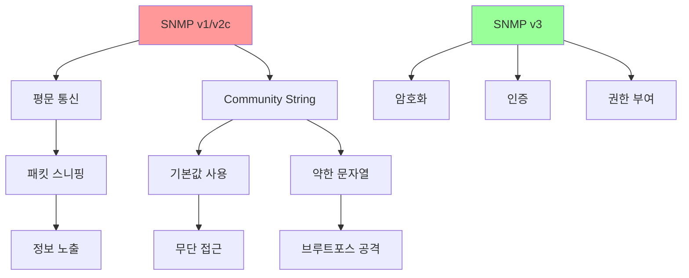
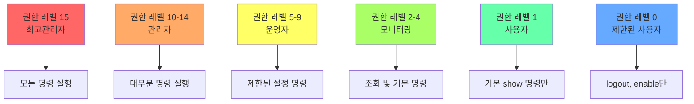
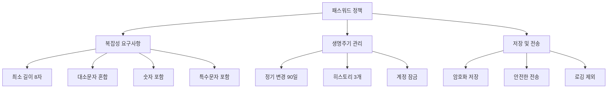
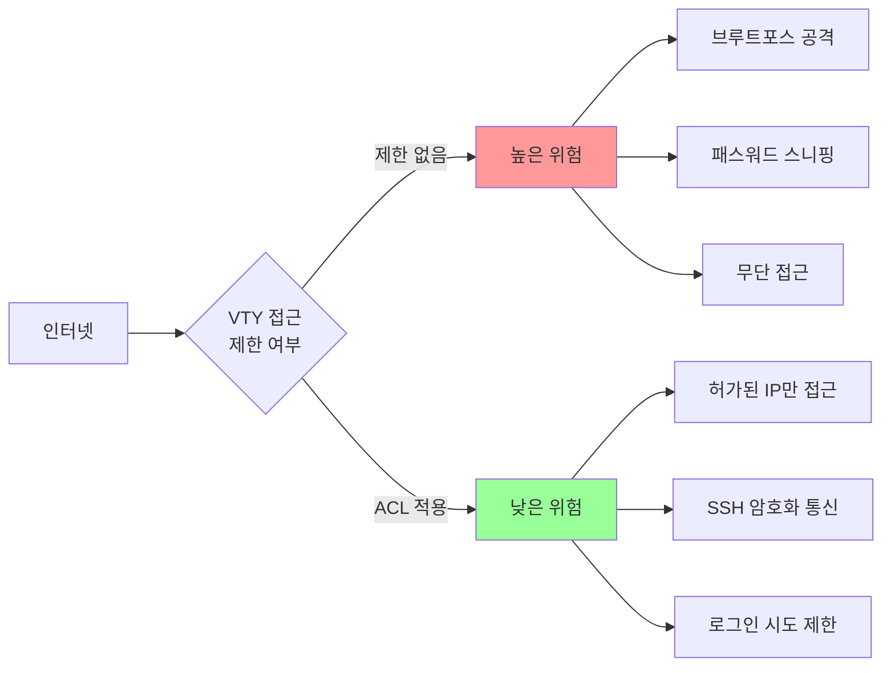

# 14강: SNMP 보안 및 고급 계정 관리

## 개요
해킹보안전문가 1급 과정의 14강으로, SNMP 보안과 고급 계정 관리 기법을 다룹니다. SNMP Community String 복잡성 설정, 사용자·명령어별 권한 수준 관리, 패스워드 정책 수립, 암호화된 인증, VTY 접근 제어 등 네트워크 장비의 세밀한 보안 설정을 학습합니다.

## 주요 학습 내용

### 1. 기능 관리 - SNMP Community String 복잡성 설정 (S-16)

#### 취약점 설명
**SNMP에서 community string은** SNMP(데몬)와 클라이언트가 데이터를 교환하기 전에 인증하는 일종의 **패스워드**로서 초기값으로 설정되어 있는 Public, Private와 같은 SNMP default community string을 이용할 시에 해당 장비의 중요한 정보를 외부로 노출시킬 가능성이나 네트워크 장비 설정 등을 변경(RW)시킬 수 있는 위험성이 많습니다.

이를 그대로 사용하는 것은 **패스워드를 사용하지 않는 계정을 사용하는 것 이상으로 위험**함에도 불구하고 대부분의 시스템, 네트워크 관리자들이 기본적인 문자열인 public을 그대로 사용하거나 다른 문자열로 변경을 해도 상호나 monitor, router, mrtg 등 사회 공학적으로 추측할 수 있는 문자열을 사용하고 있어 문제가 되고 있습니다.

- **위협 영향**: SNMP community string 변경을 하지 않았을 시에 중요한 정보가 외부로 노출될 위험이 있음

#### SNMP 보안 위험성


#### 일반적인 기본 Community String
| 장비/SW | Read Community | Write Community | 비고 |
|---------|---------------|-----------------|------|
| **Cisco** | public | private | IOS 기본값 |
| **Juniper** | public | private | JunOS 기본값 |
| **HP** | public | (없음) | 읽기 전용 |
| **Dell** | public | private | 기본 설정 |
| **Linux Net-SNMP** | public | (비활성화) | 패키지 기본값 |
| **Windows** | public | (비활성화) | 서비스 기본값 |

#### 점검 방법
```bash
# SNMP Community String 점검

# 1. 기본 Community String 테스트
snmpwalk -v2c -c public 192.168.1.1 1.3.6.1.2.1.1
snmpwalk -v2c -c private 192.168.1.1 1.3.6.1.2.1.1

# 2. 일반적인 약한 Community String 테스트
COMMON_STRINGS=("public" "private" "cisco" "admin" "router" "switch" "monitor" "mrtg" "nagios")

for community in "${COMMON_STRINGS[@]}"; do
    echo "Testing community: $community"
    timeout 5 snmpget -v2c -c $community 192.168.1.1 1.3.6.1.2.1.1.1.0 2>/dev/null
    if [ $? -eq 0 ]; then
        echo "⚠️  취약한 Community String 발견: $community"
    fi
done

# 3. SNMP 버전별 지원 확인
nmap -sU -p 161 --script snmp-info 192.168.1.0/24

# 4. SNMP Write 테스트 (주의: 실제 환경에서 신중히 사용)
snmpset -v2c -c private 192.168.1.1 1.3.6.1.2.1.1.6.0 s "Test Location"
```

#### 조치 방안

##### Cisco 장비 SNMP 보안 설정
```bash
# Cisco IOS SNMP 보안 강화

# 1. 기본 Community String 제거
no snmp-server community public
no snmp-server community private

# 2. 강력한 Community String 설정
snmp-server community "Str0ng_R3ad_0nly_2024!" RO 10
snmp-server community "Sup3r_Wr1t3_K3y_2024@" RW 20

# 3. 접근 제어 리스트 정의
access-list 10 permit 192.168.100.10  # NMS 서버
access-list 10 permit 192.168.100.11  # 백업 NMS
access-list 10 deny any log

access-list 20 permit 192.168.100.10  # Write 권한은 더 제한적
access-list 20 deny any log

# 4. View 기반 접근 제어 (VACM)
snmp-server view READONLY iso included
snmp-server view READONLY 1.3.6.1.6.3 excluded  # SNMPv3 제외
snmp-server view READWRITE iso included

# 5. SNMP v3 설정 (권장)
snmp-server group ADMIN v3 auth read READONLY write READWRITE access 10
snmp-server user admin_user ADMIN v3 auth sha AuthPass123! priv aes 128 PrivPass456!

# 6. 불필요한 SNMP 기능 비활성화
no snmp-server enable traps  # 필요한 트랩만 개별 활성화
no snmp-server system-shutdown
```

##### Linux/Unix SNMP 보안 설정
```bash
# Net-SNMP (snmpd.conf) 보안 설정

# 1. 기본 설정 제거/주석처리
# rocommunity public  default    -V systemonly
# rwcommunity private default    -V systemonly

# 2. 강력한 Community String 및 접근 제한
rocommunity "Rd_0nly_C0mmun1ty_2024!"  192.168.100.0/24
rwcommunity "Wr1t3_C0mmun1ty_Str0ng!"  192.168.100.10

# 3. View 기반 접근 제어
view   systemonly  included   .1.3.6.1.2.1.1
view   systemonly  included   .1.3.6.1.2.1.25.1

# 4. SNMPv3 사용자 설정
createUser admin_user SHA "AuthenticationPassword123!" AES "PrivacyPassword456!"
rouser admin_user priv -V systemonly

# 5. 접근 로그 활성화
authtrapenable 1

# 6. 시스템 정보 제한
syslocation Unknown
syscontact Security Team <security@company.com>

# 7. 서비스 재시작
sudo systemctl restart snmpd
sudo systemctl enable snmpd
```

##### FortiGate SNMP 보안 설정
```bash
# FortiGate SNMP 보안 설정

# 1. 기본 Community 비활성화
config system snmp sysinfo
    set status disable
end

# 2. 강력한 Community String 설정
config system snmp community
    edit 1
        set name "Complex_Read_Community_2024!"
        set query-v1-status disable
        set query-v2c-status enable
        set trap-v1-status disable
        set trap-v2c-status enable
        set hosts "192.168.100.10" "192.168.100.11"
    next
end

# 3. SNMPv3 사용자 설정
config system snmp user
    edit "secure_user"
        set security-level auth-priv
        set auth-proto sha
        set auth-pwd "StrongAuthPassword123!"
        set priv-proto aes
        set priv-pwd "StrongPrivPassword456!"
        set query-port 161
    next
end

# 4. 접근 제한 설정
config system interface
    edit "port1"
        set allowaccess https ssh snmp
        set snmp-index 1
    next
end
```

##### SNMP v3 완전 구성 예시
```bash
# SNMP v3 완전 보안 구성

# 1. Cisco IOS SNMPv3 설정
# 암호화 엔진 ID 생성
snmp-server engineID local 80001F888070C2E4B0522A

# 보안 그룹 정의
snmp-server group ADMIN_GROUP v3 auth read ADMIN_VIEW write ADMIN_VIEW access ADMIN_ACL
snmp-server group READONLY_GROUP v3 auth read READONLY_VIEW access READONLY_ACL

# View 정의
snmp-server view ADMIN_VIEW iso included
snmp-server view READONLY_VIEW 1.3.6.1.2.1 included
snmp-server view READONLY_VIEW 1.3.6.1.4.1 excluded  # 벤더 특정 MIB 제외

# 사용자 생성
snmp-server user admin_user ADMIN_GROUP v3 auth sha "Adm1nAuth2024!" priv aes 128 "Adm1nPriv2024!"
snmp-server user monitor_user READONLY_GROUP v3 auth sha "Mon1torAuth2024!" priv aes 128 "Mon1torPriv2024!"

# 접근 제어
access-list ADMIN_ACL permit 192.168.100.10
access-list ADMIN_ACL deny any log
access-list READONLY_ACL permit 192.168.100.0 0.0.0.255
access-list READONLY_ACL deny any log

# 2. 클라이언트 측 SNMPv3 사용
snmpget -v3 -l authPriv -u admin_user -a SHA -A "Adm1nAuth2024!" \
        -x AES -X "Adm1nPriv2024!" 192.168.1.1 1.3.6.1.2.1.1.1.0
```

### 2. 계정 관리 - 사용자·명령어별 권한 수준 설정

#### 취약점 설명
**시스코 IOS에서는 0에서 15에 이르는 16개의 서로 다른 권한 수준을 규정**하고 있는데 레벨 1과 레벨 15는 시스코 IOS에 기본적으로 정의되어 있습니다. 사용자 EXEC 모드는 레벨 1에서 실행되며 privileged EXEC 모드는 레벨 15에서 실행됩니다.

규모가 큰 네트워크를 관리할 때에는 **권한 수준 0에서부터 15까지의 여러 단계의 레벨을 사용**하여 라우터 및 네트워크를 효율적으로 관리합니다.

- **위협 영향**: 사용자별·명령어별 권한 설정을 통한 비인가된 행동 차단

#### Cisco IOS 권한 레벨 체계


#### 점검 방법
```bash
# Cisco 권한 레벨 점검

# 1. 현재 권한 레벨 확인
Router# show privilege
Current privilege level is 15

# 2. 사용자 권한 설정 확인
Router# show running-config | section username
username admin privilege 15 secret cisco123
username operator privilege 5 secret oper123
username monitor privilege 2 secret monitor123

# 3. 명령어별 권한 레벨 확인
Router# show parser dump | include privilege
```

#### 조치 방안

##### 세분화된 권한 레벨 설정
```bash
# Cisco IOS 세분화된 권한 관리

# 1. 사용자별 권한 레벨 지정
username security_admin privilege 15 password SecurityAdmin2024!
username network_admin privilege 10 password NetAdmin2024!
username operator privilege 5 password Operator2024!
username monitor privilege 2 password Monitor2024!

# 2. 명령어별 권한 레벨 지정

# 보안 관련 명령어 (Level 15)
privilege exec level 15 configure
privilege configure level 15 access-list
privilege configure level 15 crypto
privilege configure level 15 username
privilege configure level 15 enable

# 네트워크 설정 명령어 (Level 10)
privilege exec level 10 configure terminal
privilege configure level 10 interface
privilege configure level 10 router
privilege configure level 10 ip route

# 운영 명령어 (Level 5)
privilege exec level 5 clear counters
privilege exec level 5 clear arp
privilege exec level 5 reload
privilege exec level 5 write

# 모니터링 명령어 (Level 2)
privilege exec level 2 show running-config
privilege exec level 2 show interface
privilege exec level 2 show ip route
privilege exec level 2 ping
privilege exec level 2 traceroute

# NSA 권고사항에 따른 중요 명령어 Level 15 지정
privilege exec level 15 connect
privilege exec level 15 telnet
privilege exec level 15 rlogin
privilege exec level 15 show ip access-list
privilege exec level 15 show logging

# 3. 사용자 그룹 관리 (AAA 사용 시)
aaa new-model
aaa authentication login default local
aaa authorization exec default local

# 4. 권한별 메뉴 인터페이스 설정
menu NETWORK_MENU title "Network Management Menu"
menu NETWORK_MENU text "1. Show Interface Status"
menu NETWORK_MENU command 1 show ip interface brief
menu NETWORK_MENU text "2. Show Routing Table"  
menu NETWORK_MENU command 2 show ip route
menu NETWORK_MENU prompt "Please select: "

username operator menu NETWORK_MENU
```

##### RBAC 기반 권한 관리 스크립트
```python
#!/usr/bin/env python3
# 역할 기반 접근 제어(RBAC) 관리 시스템

import json
import hashlib
from datetime import datetime
from typing import Dict, List, Set

class NetworkRBAC:
    def __init__(self):
        self.users = {}
        self.roles = {}
        self.permissions = {}
        self.commands = {}
        
        # 기본 역할 정의
        self.init_default_roles()
        
    def init_default_roles(self):
        """기본 역할 및 권한 초기화"""
        
        # 명령어 권한 레벨 정의
        self.commands = {
            # Level 15 - 최고 관리자
            'configure': 15,
            'username': 15,
            'crypto': 15,
            'access-list': 15,
            'enable': 15,
            
            # Level 10 - 네트워크 관리자
            'interface': 10,
            'ip route': 10,
            'router': 10,
            'vlan': 10,
            
            # Level 5 - 운영자
            'clear counters': 5,
            'reload': 5,
            'write memory': 5,
            'copy': 5,
            
            # Level 2 - 모니터링
            'show': 2,
            'ping': 2,
            'traceroute': 2,
            
            # Level 1 - 기본 사용자
            'show version': 1,
            'show clock': 1
        }
        
        # 역할 정의
        self.roles = {
            'security_admin': {
                'level': 15,
                'description': 'Security Administrator',
                'allowed_commands': [cmd for cmd, level in self.commands.items() if level <= 15]
            },
            'network_admin': {
                'level': 10,
                'description': 'Network Administrator', 
                'allowed_commands': [cmd for cmd, level in self.commands.items() if level <= 10]
            },
            'operator': {
                'level': 5,
                'description': 'Network Operator',
                'allowed_commands': [cmd for cmd, level in self.commands.items() if level <= 5]
            },
            'monitor': {
                'level': 2,
                'description': 'Network Monitor',
                'allowed_commands': [cmd for cmd, level in self.commands.items() if level <= 2]
            },
            'user': {
                'level': 1,
                'description': 'Basic User',
                'allowed_commands': [cmd for cmd, level in self.commands.items() if level <= 1]
            }
        }
    
    def create_user(self, username: str, password: str, role: str, 
                   ip_restrictions: List[str] = None) -> bool:
        """사용자 생성"""
        if username in self.users:
            return False
            
        if role not in self.roles:
            return False
            
        password_hash = hashlib.sha256(password.encode()).hexdigest()
        
        self.users[username] = {
            'password_hash': password_hash,
            'role': role,
            'level': self.roles[role]['level'],
            'ip_restrictions': ip_restrictions or [],
            'created': datetime.now().isoformat(),
            'last_login': None,
            'login_failures': 0,
            'locked': False
        }
        
        return True
    
    def authenticate_user(self, username: str, password: str, 
                         source_ip: str = None) -> Dict:
        """사용자 인증"""
        if username not in self.users:
            return {'success': False, 'reason': 'User not found'}
            
        user = self.users[username]
        
        if user['locked']:
            return {'success': False, 'reason': 'Account locked'}
            
        # IP 제한 확인
        if user['ip_restrictions'] and source_ip:
            allowed = any(source_ip.startswith(ip) for ip in user['ip_restrictions'])
            if not allowed:
                return {'success': False, 'reason': 'IP not allowed'}
        
        # 패스워드 검증
        password_hash = hashlib.sha256(password.encode()).hexdigest()
        if password_hash != user['password_hash']:
            user['login_failures'] += 1
            if user['login_failures'] >= 3:
                user['locked'] = True
            return {'success': False, 'reason': 'Invalid password'}
        
        # 로그인 성공
        user['last_login'] = datetime.now().isoformat()
        user['login_failures'] = 0
        
        return {
            'success': True,
            'level': user['level'],
            'role': user['role'],
            'allowed_commands': self.roles[user['role']]['allowed_commands']
        }
    
    def check_command_permission(self, username: str, command: str) -> bool:
        """명령어 실행 권한 확인"""
        if username not in self.users:
            return False
            
        user = self.users[username]
        role = self.roles[user['role']]
        
        # 명령어가 허용된 목록에 있는지 확인
        for allowed_cmd in role['allowed_commands']:
            if command.startswith(allowed_cmd):
                return True
                
        return False
    
    def generate_cisco_config(self) -> str:
        """Cisco 설정 생성"""
        config_lines = []
        
        for username, user_data in self.users.items():
            level = user_data['level']
            # 실제 패스워드는 별도 관리 (여기서는 생략)
            config_lines.append(f"username {username} privilege {level} secret <encrypted>")
            
        for cmd, level in self.commands.items():
            if level > 1:  # 기본 레벨이 아닌 것만
                config_lines.append(f"privilege exec level {level} {cmd}")
                
        return '\n'.join(config_lines)
    
    def audit_permissions(self) -> Dict:
        """권한 감사"""
        audit_result = {
            'total_users': len(self.users),
            'users_by_role': {},
            'locked_accounts': [],
            'high_privilege_users': [],
            'recent_logins': []
        }
        
        for username, user_data in self.users.items():
            role = user_data['role']
            if role not in audit_result['users_by_role']:
                audit_result['users_by_role'][role] = 0
            audit_result['users_by_role'][role] += 1
            
            if user_data['locked']:
                audit_result['locked_accounts'].append(username)
                
            if user_data['level'] >= 10:
                audit_result['high_privilege_users'].append({
                    'username': username,
                    'level': user_data['level'],
                    'role': role
                })
                
            if user_data['last_login']:
                audit_result['recent_logins'].append({
                    'username': username,
                    'last_login': user_data['last_login']
                })
        
        return audit_result

# 사용 예시
if __name__ == "__main__":
    rbac = NetworkRBAC()
    
    # 사용자 생성
    rbac.create_user("admin", "AdminPass2024!", "security_admin", ["192.168.100.10"])
    rbac.create_user("netadmin", "NetAdminPass2024!", "network_admin", ["192.168.100.0/24"])
    rbac.create_user("operator", "OperatorPass2024!", "operator")
    rbac.create_user("monitor", "MonitorPass2024!", "monitor")
    
    # 인증 테스트
    auth_result = rbac.authenticate_user("admin", "AdminPass2024!", "192.168.100.10")
    print(f"Authentication result: {auth_result}")
    
    # 권한 확인
    can_configure = rbac.check_command_permission("admin", "configure terminal")
    print(f"Can execute 'configure terminal': {can_configure}")
    
    # Cisco 설정 생성
    cisco_config = rbac.generate_cisco_config()
    print("\nGenerated Cisco Config:")
    print(cisco_config)
    
    # 권한 감사
    audit = rbac.audit_permissions()
    print(f"\nAudit Results: {json.dumps(audit, indent=2)}")
```

### 3. 계정 관리 - 패스워드 설정 및 복잡성

#### 패스워드 설정 (기본)
**기본 패스워드를 손쉽게 유추할 수 있으므로** 패스워드는 반드시 설정 또는 변경한 후에 사용해야 합니다.

- **위협 영향**: 패스워드가 없거나 기본 패스워드의 경우 비인가의 접속 가능

#### 패스워드 복잡성 설정 (고급)
Console, VTY, AUX 접속 시, enable 모드 접속 시 **추측하기 쉬운 패스워드를 사용할 경우**, 비인가자가 패스워드 추측을 통해 장비에 접속할 수 있습니다.

- **위협 영향**: 공격자가 암호를 쉽게 해독할 수 있음

#### 패스워드 정책 수립


#### 조치 방안

##### 강력한 패스워드 정책 구현
```bash
# Cisco IOS 패스워드 정책 설정

# 1. 기본 패스워드 설정
Router(config)# enable secret StrongEnablePassword2024!

# 2. Console 패스워드
Router(config)# line console 0
Router(config-line)# password ConsolePassword2024!
Router(config-line)# login

# 3. VTY 패스워드 (Telnet/SSH)
Router(config)# line vty 0 4
Router(config-line)# password VtyPassword2024!
Router(config-line)# login local

# 4. 사용자 계정 패스워드 복잡성
Router(config)# username admin privilege 15 algorithm-type scrypt secret AdminPassword2024!
Router(config-line)# exec-timeout 10 0
Router(config-line)# transport input ssh

# 5. 패스워드 암호화 강제
Router(config)# service password-encryption

# 6. 패스워드 정책 엄격화 (IOS 15.0+)
Router(config)# security passwords min-length 8
Router(config)# security authentication failure rate 3 log

# 7. AAA 기반 패스워드 정책 (고급)
Router(config)# aaa new-model
Router(config)# aaa authentication login default local
Router(config)# aaa local authentication attempts max-fail 3
Router(config)# aaa local authentication lockout-time 300
```

##### 패스워드 복잡성 검증 도구
```python
#!/usr/bin/env python3
# 네트워크 장비 패스워드 복잡성 검증 도구

import re
import string
from typing import Dict, List, Tuple
import hashlib
import secrets

class PasswordComplexityChecker:
    def __init__(self):
        self.min_length = 8
        self.max_length = 128
        self.required_character_types = 3
        
        # 일반적인 약한 패스워드 목록
        self.common_passwords = [
            'password', 'admin', 'cisco', '123456', 'qwerty',
            'letmein', 'welcome', 'monkey', 'dragon', 'master',
            'cisco123', 'admin123', 'password123', 'router',
            'switch', 'firewall', 'network', 'default'
        ]
        
        # 금지된 패턴
        self.forbidden_patterns = [
            r'(.)\1{3,}',  # 4번 이상 반복되는 문자
            r'1234|2345|3456|4567|5678|6789|7890',  # 연속 숫자
            r'abcd|bcde|cdef|defg|efgh|fghi|ghij',  # 연속 문자
            r'qwer|wert|erty|rtyu|tyui|yuio|uiop',  # 키보드 패턴
        ]
    
    def analyze_password(self, password: str) -> Dict:
        """패스워드 복잡성 분석"""
        analysis = {
            'password': password,
            'length': len(password),
            'character_types': self._count_character_types(password),
            'entropy': self._calculate_entropy(password),
            'strength_score': 0,
            'vulnerabilities': [],
            'recommendations': [],
            'compliance': False
        }
        
        # 길이 검사
        if analysis['length'] < self.min_length:
            analysis['vulnerabilities'].append(f"패스워드가 너무 짧습니다 (최소 {self.min_length}자)")
            analysis['recommendations'].append(f"최소 {self.min_length}자 이상 사용하세요")
        elif analysis['length'] > self.max_length:
            analysis['vulnerabilities'].append(f"패스워드가 너무 깁니다 (최대 {self.max_length}자)")
        else:
            analysis['strength_score'] += 10
            
        # 문자 유형 검사
        if analysis['character_types'] < self.required_character_types:
            analysis['vulnerabilities'].append(f"문자 유형이 부족합니다 ({analysis['character_types']}/{self.required_character_types})")
            analysis['recommendations'].append("대문자, 소문자, 숫자, 특수문자 중 3가지 이상 사용하세요")
        else:
            analysis['strength_score'] += 20
            
        # 일반적인 패스워드 검사
        if password.lower() in [pw.lower() for pw in self.common_passwords]:
            analysis['vulnerabilities'].append("일반적으로 사용되는 약한 패스워드입니다")
            analysis['recommendations'].append("예측하기 어려운 고유한 패스워드를 사용하세요")
        else:
            analysis['strength_score'] += 15
            
        # 금지된 패턴 검사
        for pattern in self.forbidden_patterns:
            if re.search(pattern, password, re.IGNORECASE):
                analysis['vulnerabilities'].append("반복적이거나 예측 가능한 패턴이 발견되었습니다")
                analysis['recommendations'].append("규칙적인 패턴을 피하고 무작위성을 높이세요")
                break
        else:
            analysis['strength_score'] += 15
            
        # 사용자명/일반 단어 포함 검사
        if self._contains_common_words(password):
            analysis['vulnerabilities'].append("사용자명이나 일반적인 단어가 포함되어 있습니다")
            analysis['recommendations'].append("사용자명, 장비명, 일반적인 단어 사용을 피하세요")
        else:
            analysis['strength_score'] += 10
            
        # 엔트로피 기반 강도 평가
        if analysis['entropy'] < 30:
            analysis['vulnerabilities'].append("패스워드의 복잡성이 낮습니다")
        elif analysis['entropy'] >= 50:
            analysis['strength_score'] += 20
        else:
            analysis['strength_score'] += 10
            
        # 최종 강도 평가
        if analysis['strength_score'] >= 70 and len(analysis['vulnerabilities']) == 0:
            analysis['compliance'] = True
            analysis['strength'] = 'Strong'
        elif analysis['strength_score'] >= 50:
            analysis['strength'] = 'Medium'
        else:
            analysis['strength'] = 'Weak'
            
        return analysis
    
    def _count_character_types(self, password: str) -> int:
        """문자 유형 개수 계산"""
        types = 0
        if re.search(r'[a-z]', password):
            types += 1
        if re.search(r'[A-Z]', password):
            types += 1
        if re.search(r'[0-9]', password):
            types += 1
        if re.search(r'[^a-zA-Z0-9]', password):
            types += 1
        return types
    
    def _calculate_entropy(self, password: str) -> float:
        """패스워드 엔트로피 계산"""
        charset_size = 0
        if re.search(r'[a-z]', password):
            charset_size += 26
        if re.search(r'[A-Z]', password):
            charset_size += 26
        if re.search(r'[0-9]', password):
            charset_size += 10
        if re.search(r'[^a-zA-Z0-9]', password):
            charset_size += 32
            
        if charset_size == 0:
            return 0
            
        import math
        return len(password) * math.log2(charset_size)
    
    def _contains_common_words(self, password: str) -> bool:
        """일반적인 단어 포함 여부"""
        common_words = ['admin', 'user', 'cisco', 'router', 'switch', 
                       'network', 'server', 'manager', 'system']
        password_lower = password.lower()
        return any(word in password_lower for word in common_words)
    
    def generate_strong_password(self, length: int = 12) -> str:
        """강력한 패스워드 생성"""
        if length < self.min_length:
            length = self.min_length
            
        # 각 문자 유형에서 최소 1개씩 포함
        password_chars = []
        password_chars.extend(secrets.choice(string.ascii_lowercase) for _ in range(2))
        password_chars.extend(secrets.choice(string.ascii_uppercase) for _ in range(2))
        password_chars.extend(secrets.choice(string.digits) for _ in range(2))
        password_chars.extend(secrets.choice('!@#$%^&*()_+-=[]{}|;:,.<>?') for _ in range(2))
        
        # 나머지 길이만큼 무작위 문자 추가
        all_chars = string.ascii_letters + string.digits + '!@#$%^&*()_+-=[]{}|;:,.<>?'
        for _ in range(length - len(password_chars)):
            password_chars.append(secrets.choice(all_chars))
            
        # 문자 순서 섞기
        secrets.SystemRandom().shuffle(password_chars)
        
        return ''.join(password_chars)
    
    def batch_check_passwords(self, password_list: List[str]) -> Dict:
        """배치 패스워드 검사"""
        results = []
        summary = {'total': 0, 'strong': 0, 'medium': 0, 'weak': 0, 'compliant': 0}
        
        for password in password_list:
            analysis = self.analyze_password(password)
            results.append(analysis)
            
            summary['total'] += 1
            summary[analysis['strength'].lower()] += 1
            if analysis['compliance']:
                summary['compliant'] += 1
                
        return {'results': results, 'summary': summary}

# 사용 예시 및 테스트
if __name__ == "__main__":
    checker = PasswordComplexityChecker()
    
    # 테스트 패스워드들
    test_passwords = [
        "admin",           # 약함
        "cisco123",        # 약함
        "Password123!",    # 중간
        "MyStr0ng_P@ssw0rd_2024!",  # 강함
        "1234567890",      # 약함
        "ComplexNetworkDevice2024@",  # 강함
    ]
    
    print("네트워크 장비 패스워드 복잡성 검사")
    print("=" * 50)
    
    for password in test_passwords:
        analysis = checker.analyze_password(password)
        
        print(f"\n패스워드: {password}")
        print(f"강도: {analysis['strength']}")
        print(f"점수: {analysis['strength_score']}/100")
        print(f"컴플라이언스: {'✅' if analysis['compliance'] else '❌'}")
        print(f"엔트로피: {analysis['entropy']:.1f} bits")
        
        if analysis['vulnerabilities']:
            print("취약점:")
            for vuln in analysis['vulnerabilities']:
                print(f"  ⚠️  {vuln}")
                
        if analysis['recommendations']:
            print("권장사항:")
            for rec in analysis['recommendations']:
                print(f"  💡 {rec}")
    
    # 강력한 패스워드 생성
    print(f"\n생성된 강력한 패스워드: {checker.generate_strong_password(12)}")
```

### 4. 계정 관리 - 암호화된 패스워드 사용

#### 취약점 설명
**암호화된 패스워드를 사용하지 않으면** 장비의 설정 파일에 패스워드가 Plain Text(암호화되지 않은 평문)로 저장되는데 평문으로 저장되어 있을 시 해독될 가능성이 쉬워 정보에 대한 유출 위험이 발생합니다.

- **위협 영향**: 설정 파일이 유출되면 패스워드가 유출될 수 있음

#### 패스워드 저장 방식 비교
| 저장 방식 | 보안 수준 | 가역성 | 사용 사례 |
|-----------|-----------|--------|-----------|
| **평문** | 매우 낮음 | 완전 가역 | 사용 금지 |
| **Type 7 (Vigenère)** | 낮음 | 쉽게 복호화 | legacy 지원용 |
| **Type 5 (MD5)** | 중간 | 해시 (불가역) | 기본 보안 |
| **Type 8 (PBKDF2)** | 높음 | 해시 (불가역) | 고급 보안 |
| **Type 9 (scrypt)** | 매우 높음 | 해시 (불가역) | 최고 보안 |

#### 조치 방안

##### Cisco 암호화 패스워드 설정
```bash
# Cisco IOS 암호화된 패스워드 설정

# 1. Enable Secret (Type 5 - MD5 해시)
Router(config)# enable secret SecretPassword2024!
# 결과: enable secret 5 $1$mERr$9cswBwUv6WeC6M8kNSs8.

# 2. Enable Secret (Type 8 - PBKDF2)
Router(config)# enable algorithm-type sha256 secret SecretPassword2024!

# 3. Enable Secret (Type 9 - scrypt) - 최고 보안
Router(config)# enable algorithm-type scrypt secret SecretPassword2024!

# 4. 사용자 계정 암호화 패스워드
Router(config)# username admin algorithm-type scrypt secret AdminPassword2024!

# 5. 기존 패스워드 암호화 강제
Router(config)# service password-encryption

# 6. 암호화 수준 확인
Router# show running-config | include secret
enable secret 9 $9$2MJBozw/9T1b4UxP$InFaBdprNI7nt5I0C6s6OMLckY2g8nKCgnNJLx.3LXM

# 7. Type 0 (평문) 패스워드 제거
Router(config)# no enable password
Router(config)# line con 0
Router(config-line)# no password
Router(config-line)# login local

# 8. VTY 암호화 패스워드
Router(config)# line vty 0 4
Router(config-line)# no password
Router(config-line)# login local
Router(config-line)# transport input ssh
```

##### 패스워드 암호화 검증 스크립트
```bash
#!/bin/bash
# Cisco 패스워드 암호화 상태 검증

DEVICE_IP="192.168.1.1"
BACKUP_FILE="/tmp/cisco_config_backup.txt"

echo "=== Cisco 패스워드 암호화 상태 검증 ==="
echo "대상 장비: $DEVICE_IP"
echo "검증 시간: $(date)"
echo

# SSH로 설정 백업 (expect 필요)
expect -c "
set timeout 30
spawn ssh admin@$DEVICE_IP
expect \"Password:\"
send \"password\r\"
expect \"#\"
send \"terminal length 0\r\"
expect \"#\"
send \"show running-config\r\"
expect \"#\"
" > $BACKUP_FILE 2>/dev/null

if [ ! -f $BACKUP_FILE ]; then
    echo "❌ 설정 파일 백업 실패"
    exit 1
fi

echo "✅ 설정 파일 백업 완료"
echo

# 패스워드 암호화 상태 검사
echo "1. Enable Password 검사"
echo "======================"

# Enable Secret 확인 (권장)
if grep -q "enable secret" $BACKUP_FILE; then
    secret_type=$(grep "enable secret" $BACKUP_FILE | awk '{print $3}')
    case $secret_type in
        5) echo "✅ Enable Secret Type 5 (MD5) 사용 중 - 양호" ;;
        8) echo "✅ Enable Secret Type 8 (PBKDF2) 사용 중 - 우수" ;;
        9) echo "✅ Enable Secret Type 9 (scrypt) 사용 중 - 최고" ;;
        *) echo "⚠️  Enable Secret 타입 불명: $secret_type" ;;
    esac
else
    echo "❌ Enable Secret 미설정"
fi

# Enable Password 확인 (사용 금지)
if grep -q "enable password" $BACKUP_FILE; then
    if grep -q "enable password 7" $BACKUP_FILE; then
        echo "⚠️  Enable Password Type 7 사용 중 - 개선 필요"
    else
        echo "❌ Enable Password 평문 사용 중 - 즉시 변경 필요"
    fi
fi

echo
echo "2. 사용자 계정 패스워드 검사"
echo "========================="

# Username 패스워드 검사
user_count=0
encrypted_count=0

while read line; do
    if echo "$line" | grep -q "^username"; then
        user_count=$((user_count + 1))
        username=$(echo "$line" | awk '{print $2}')
        
        if echo "$line" | grep -q "secret"; then
            if echo "$line" | grep -qE "secret [5-9]"; then
                secret_type=$(echo "$line" | sed 's/.*secret \([0-9]\).*/\1/')
                echo "✅ 사용자 $username: Type $secret_type 암호화"
                encrypted_count=$((encrypted_count + 1))
            else
                echo "⚠️  사용자 $username: 암호화 타입 불명"
            fi
        elif echo "$line" | grep -q "password"; then
            if echo "$line" | grep -q "password 7"; then
                echo "⚠️  사용자 $username: Type 7 암호화 (약함)"
            else
                echo "❌ 사용자 $username: 평문 패스워드"
            fi
        fi
    fi
done < $BACKUP_FILE

echo
echo "3. Line 패스워드 검사"
echo "=================="

# Console/VTY 패스워드 검사
check_line_password() {
    local line_type="$1"
    local in_section=false
    
    while read line; do
        if echo "$line" | grep -q "line $line_type"; then
            in_section=true
            continue
        fi
        
        if $in_section && echo "$line" | grep -q "^line "; then
            in_section=false
        fi
        
        if $in_section && echo "$line" | grep -q "password"; then
            if echo "$line" | grep -q "password 7"; then
                echo "⚠️  $line_type: Type 7 암호화 (약함)"
            else
                echo "❌ $line_type: 평문 패스워드"
            fi
            return
        fi
        
        if $in_section && echo "$line" | grep -q "login local"; then
            echo "✅ $line_type: Local 사용자 인증 사용 (권장)"
            return
        fi
    done < $BACKUP_FILE
}

check_line_password "con"
check_line_password "vty"

echo
echo "4. Service Password-Encryption 확인"
echo "=================================="

if grep -q "service password-encryption" $BACKUP_FILE; then
    echo "✅ Service Password-Encryption 활성화됨"
else
    echo "⚠️  Service Password-Encryption 비활성화 - 활성화 권장"
fi

echo
echo "5. 보안 권장사항"
echo "==============="

recommendations=0

if ! grep -q "enable secret [89]" $BACKUP_FILE; then
    echo "💡 Enable Secret을 Type 8 또는 Type 9로 업그레이드하세요"
    recommendations=$((recommendations + 1))
fi

if grep -q "enable password" $BACKUP_FILE; then
    echo "💡 Enable Password를 제거하고 Enable Secret만 사용하세요"
    recommendations=$((recommendations + 1))
fi

if grep -q "password 7\|password [^7]" $BACKUP_FILE; then
    echo "💡 모든 Line 패스워드를 Local 사용자 인증으로 변경하세요"
    recommendations=$((recommendations + 1))
fi

if ! grep -q "service password-encryption" $BACKUP_FILE; then
    echo "💡 Service Password-Encryption을 활성화하세요"
    recommendations=$((recommendations + 1))
fi

if [ $recommendations -eq 0 ]; then
    echo "✅ 모든 패스워드가 안전하게 설정되었습니다"
fi

# 개선 스크립트 생성
cat > /tmp/password_hardening.txt << EOF
! Cisco 패스워드 보안 강화 설정
! $(date) 생성

! 1. Enable Secret 업그레이드
enable algorithm-type scrypt secret YourNewSecretPassword2024!

! 2. 기존 Enable Password 제거
no enable password

! 3. Service Password-Encryption 활성화
service password-encryption

! 4. 사용자 계정 암호화 강화
$(grep "^username" $BACKUP_FILE | while read line; do
    username=$(echo "$line" | awk '{print $2}')
    privilege=$(echo "$line" | grep -o "privilege [0-9]*" | awk '{print $2}')
    echo "username $username privilege ${privilege:-15} algorithm-type scrypt secret NewPassword2024!"
done)

! 5. Line 설정 보안 강화
line con 0
 no password
 login local
 exec-timeout 10 0

line vty 0 4
 no password
 login local
 transport input ssh
 exec-timeout 10 0
 access-class VTY_ACCESS in

! 6. VTY 접근 제어
access-list VTY_ACCESS permit 192.168.100.0 0.0.0.255
access-list VTY_ACCESS deny any log
EOF

echo
echo "개선 설정 스크립트가 생성되었습니다: /tmp/password_hardening.txt"

# 정리
rm -f $BACKUP_FILE
```

### 5. 접근 관리 - VTY 접근(ACL) 설정

#### 취약점 설명
**인터넷으로부터 VTY 접근을 차단하지 않았을 경우**, VTY 장치를 통해서 네트워크 접속을 시도할 수 있으며 원격 접속 패스워드 추측공격 및 sniffer 공격을 통해 장비에 접근할 수 있습니다.

- **위협 영향**: Brute Force 공격이나 HTTP 서버 취약점 공격을 받을 수 있음

#### VTY 접근 위험도


#### 조치 방안

##### Cisco VTY ACL 설정
```bash
# Cisco IOS VTY 접근 제어 설정

# 1. 기본 VTY ACL 설정
access-list 10 remark === VTY Management Access ===
access-list 10 permit 192.168.100.10    # Primary 관리 서버
access-list 10 permit 192.168.100.11    # Secondary 관리 서버
access-list 10 permit 192.168.100.0 0.0.0.255  # 관리 네트워크
access-list 10 deny any log

# VTY에 ACL 적용
line vty 0 4
 access-class 10 in
 transport input ssh
 login local
 exec-timeout 10 0

# 2. 확장 ACL을 이용한 세밀한 제어
ip access-list extended VTY_EXTENDED_ACCESS
 remark === Allow SSH from Management Network ===
 permit tcp 192.168.100.0 0.0.0.255 any eq 22
 remark === Allow HTTPS from Management Network ===  
 permit tcp 192.168.100.0 0.0.0.255 any eq 443
 remark === Deny all other access ===
 deny ip any any log

# 인터페이스에 적용
interface GigabitEthernet0/1
 ip access-group VTY_EXTENDED_ACCESS in

# 3. 시간 기반 접근 제어
time-range BUSINESS_HOURS
 periodic weekdays 09:00 to 18:00

ip access-list extended VTY_TIME_ACCESS
 permit tcp 192.168.100.0 0.0.0.255 any eq 22 time-range BUSINESS_HOURS
 deny ip any any log

# 4. 동적 VTY 풀 관리
line vty 0 4
 access-class 10 in
 rotary 1

line vty 5 15  # 추가 VTY 라인
 access-class 11 in  # 더 제한적인 ACL

access-list 11 permit 192.168.100.10  # 특정 서버만
access-list 11 deny any log
```

##### 고급 VTY 보안 설정
```bash
# 고급 VTY 보안 구성

# 1. SSH 키 기반 인증 설정
crypto key generate rsa general-keys modulus 2048
ip ssh version 2
ip ssh time-out 60
ip ssh authentication-retries 3

# 2. VTY별 다른 권한 설정
username admin privilege 15 secret AdminPass2024!
username operator privilege 5 secret OperPass2024!

line vty 0 2
 privilege level 15
 access-class ADMIN_ACCESS in
 login local
 transport input ssh

line vty 3 4
 privilege level 5
 access-class OPERATOR_ACCESS in
 login local
 transport input ssh

# 3. 관리자용 ACL (더 엄격)
access-list ADMIN_ACCESS permit 192.168.100.10
access-list ADMIN_ACCESS deny any log

# 4. 운영자용 ACL (제한적)
access-list OPERATOR_ACCESS permit 192.168.100.20
access-list OPERATOR_ACCESS permit 192.168.100.21
access-list OPERATOR_ACCESS deny any log

# 5. AAA를 이용한 동적 VTY 관리
aaa new-model
aaa authentication login VTY_AUTH local
aaa authorization exec VTY_AUTHOR local

line vty 0 15
 authorization exec VTY_AUTHOR
 accounting exec default start-stop group tacacs+
 login authentication VTY_AUTH
 transport input ssh

# 6. 로그인 배너 및 경고
banner motd ^
=========================================================
             AUTHORIZED ACCESS ONLY
This system is for authorized users only.
All activities are monitored and logged.
Unauthorized access is strictly prohibited.
=========================================================
^

line vty 0 15
 exec-banner
 motd-banner
```

### 종합 보안 검증 도구

```python
#!/usr/bin/env python3
# 네트워크 장비 종합 보안 점검 도구

import re
import socket
import subprocess
from typing import Dict, List
import json
from datetime import datetime

class NetworkSecurityAuditor:
    def __init__(self):
        self.audit_results = {
            'timestamp': datetime.now().isoformat(),
            'devices': {},
            'summary': {
                'total_devices': 0,
                'compliant_devices': 0,
                'critical_issues': 0,
                'warnings': 0
            }
        }
    
    def audit_device(self, device_ip: str, device_type: str = 'cisco') -> Dict:
        """개별 장비 보안 감사"""
        device_audit = {
            'ip': device_ip,
            'type': device_type,
            'tests': {},
            'compliance_score': 0,
            'total_tests': 0,
            'passed_tests': 0,
            'issues': []
        }
        
        # 1. SNMP 보안 테스트
        snmp_result = self._test_snmp_security(device_ip)
        device_audit['tests']['snmp'] = snmp_result
        
        # 2. 서비스 포트 스캔
        port_result = self._test_open_ports(device_ip)
        device_audit['tests']['ports'] = port_result
        
        # 3. SSH/Telnet 테스트
        remote_access_result = self._test_remote_access(device_ip)
        device_audit['tests']['remote_access'] = remote_access_result
        
        # 4. VTY 접근 제어 테스트
        vty_result = self._test_vty_access(device_ip)
        device_audit['tests']['vty_access'] = vty_result
        
        # 점수 계산
        for test_name, test_result in device_audit['tests'].items():
            device_audit['total_tests'] += 1
            if test_result['passed']:
                device_audit['passed_tests'] += 1
            else:
                device_audit['issues'].extend(test_result['issues'])
        
        device_audit['compliance_score'] = (device_audit['passed_tests'] / device_audit['total_tests']) * 100
        
        return device_audit
    
    def _test_snmp_security(self, device_ip: str) -> Dict:
        """SNMP 보안 테스트"""
        result = {
            'name': 'SNMP Security',
            'passed': True,
            'issues': [],
            'details': {}
        }
        
        # 기본 Community String 테스트
        common_communities = ['public', 'private', 'cisco', 'admin']
        vulnerable_communities = []
        
        for community in common_communities:
            try:
                cmd = f"snmpget -v2c -c {community} -t 2 {device_ip} 1.3.6.1.2.1.1.1.0"
                output = subprocess.run(cmd.split(), capture_output=True, text=True, timeout=5)
                if output.returncode == 0:
                    vulnerable_communities.append(community)
            except (subprocess.TimeoutExpired, subprocess.SubprocessError):
                pass
        
        if vulnerable_communities:
            result['passed'] = False
            result['issues'].append(f"약한 SNMP Community 발견: {vulnerable_communities}")
        
        result['details']['vulnerable_communities'] = vulnerable_communities
        return result
    
    def _test_open_ports(self, device_ip: str) -> Dict:
        """포트 스캔 테스트"""
        result = {
            'name': 'Open Ports',
            'passed': True,
            'issues': [],
            'details': {}
        }
        
        # 위험한 포트들
        dangerous_ports = [21, 23, 135, 139, 445, 161, 1433, 3306]
        open_dangerous_ports = []
        
        for port in dangerous_ports:
            sock = socket.socket(socket.AF_INET, socket.SOCK_STREAM)
            sock.settimeout(2)
            try:
                result_code = sock.connect_ex((device_ip, port))
                if result_code == 0:
                    open_dangerous_ports.append(port)
            except:
                pass
            finally:
                sock.close()
        
        if open_dangerous_ports:
            result['passed'] = False
            result['issues'].append(f"위험한 포트 열림: {open_dangerous_ports}")
        
        result['details']['open_dangerous_ports'] = open_dangerous_ports
        return result
    
    def _test_remote_access(self, device_ip: str) -> Dict:
        """원격 접근 테스트"""
        result = {
            'name': 'Remote Access Security',
            'passed': True,
            'issues': [],
            'details': {}
        }
        
        # SSH 확인 (권장)
        ssh_available = self._check_port(device_ip, 22)
        telnet_available = self._check_port(device_ip, 23)
        
        if telnet_available:
            result['passed'] = False
            result['issues'].append("Telnet 서비스가 활성화되어 있음 (보안 위험)")
        
        if not ssh_available:
            result['issues'].append("SSH 서비스가 비활성화되어 있음 (권장사항)")
        
        result['details']['ssh_available'] = ssh_available
        result['details']['telnet_available'] = telnet_available
        
        return result
    
    def _test_vty_access(self, device_ip: str) -> Dict:
        """VTY 접근 제어 테스트"""
        result = {
            'name': 'VTY Access Control',
            'passed': True,
            'issues': [],
            'details': {}
        }
        
        # 외부에서 SSH/Telnet 접근 시도 (간접 테스트)
        if self._check_port(device_ip, 22) or self._check_port(device_ip, 23):
            # 실제로는 여러 소스 IP에서 테스트해야 함
            result['details']['remote_management_accessible'] = True
            # VTY ACL이 적용되어 있는지 확인하는 더 정교한 테스트가 필요
        
        return result
    
    def _check_port(self, ip: str, port: int) -> bool:
        """포트 열림 상태 확인"""
        sock = socket.socket(socket.AF_INET, socket.SOCK_STREAM)
        sock.settimeout(2)
        try:
            result = sock.connect_ex((ip, port))
            return result == 0
        except:
            return False
        finally:
            sock.close()
    
    def generate_report(self, output_file: str = None) -> str:
        """감사 보고서 생성"""
        report = f"""
네트워크 보안 감사 보고서
{'='*50}
생성일시: {self.audit_results['timestamp']}

요약
----
총 장비 수: {self.audit_results['summary']['total_devices']}
준수 장비 수: {self.audit_results['summary']['compliant_devices']}
심각한 이슈: {self.audit_results['summary']['critical_issues']}
경고사항: {self.audit_results['summary']['warnings']}

장비별 상세 결과
--------------
"""
        
        for device_ip, audit_result in self.audit_results['devices'].items():
            report += f"""
장비: {device_ip}
준수율: {audit_result['compliance_score']:.1f}%
통과/전체: {audit_result['passed_tests']}/{audit_result['total_tests']}

주요 이슈:
"""
            for issue in audit_result['issues'][:5]:  # 상위 5개만
                report += f"  ⚠️  {issue}\n"
        
        if output_file:
            with open(output_file, 'w', encoding='utf-8') as f:
                f.write(report)
        
        return report

# 사용 예시
if __name__ == "__main__":
    auditor = NetworkSecurityAuditor()
    
    # 테스트 대상 장비들
    devices = [
        "192.168.1.1",
        "192.168.1.2", 
        "192.168.1.3"
    ]
    
    for device in devices:
        print(f"감사 중: {device}")
        audit_result = auditor.audit_device(device)
        auditor.audit_results['devices'][device] = audit_result
        auditor.audit_results['summary']['total_devices'] += 1
        
        if audit_result['compliance_score'] >= 80:
            auditor.audit_results['summary']['compliant_devices'] += 1
        
        # 이슈 수준 분류
        for issue in audit_result['issues']:
            if '위험한 포트' in issue or 'Telnet' in issue:
                auditor.audit_results['summary']['critical_issues'] += 1
            else:
                auditor.audit_results['summary']['warnings'] += 1
    
    # 보고서 생성
    report = auditor.generate_report("security_audit_report.txt")
    print(report)
```

## 마무리

이번 강의에서는 **SNMP 보안**과 **고급 계정 관리** 기법들을 심화 학습했습니다. 특히 **Community String 복잡성**, **권한 레벨 세분화**, **패스워드 암호화**, **VTY 접근 제어** 등은 네트워크 보안의 핵심 요소들입니다.

다음 강의에서는 **Session Timeout**, **불필요한 서비스 차단**, **로깅 최적화**, **네트워크 시간 동기화** 등 마지막 고급 보안 설정들을 완성하겠습니다.

---
*이 자료는 해킹보안전문가 1급 자격증 취득을 위한 학습 목적으로 작성되었습니다.*