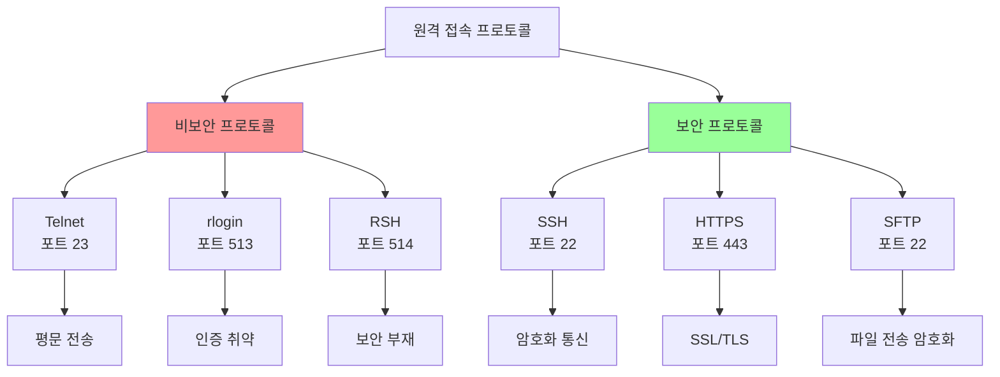
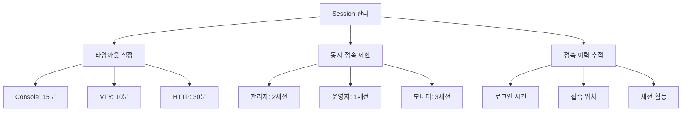
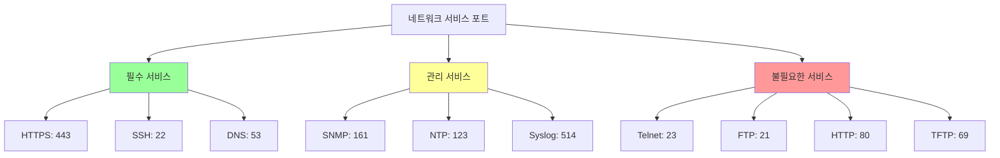
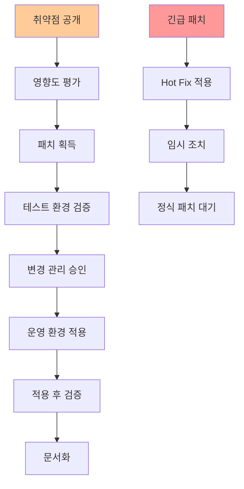

# 15강: 접근 제어 및 로그 관리 고급 설정

## 개요
해킹보안전문가 1급 과정의 15강으로, 네트워크 장비의 접근 제어와 로그 관리의 고급 설정을 다룹니다. VTY 보안 프로토콜 사용, Session Timeout, 불필요한 포트 차단, 패치 관리, 로그 서버 연동, 로깅 최적화, 시간 동기화 등 실무 환경에서 필수적인 보안 강화 기법들을 심화 학습합니다.

## 주요 학습 내용

### 1. 접근 관리 - VTY 접속 시 안전한 프로토콜 사용

#### 취약점 설명
**VTY 접속 시에 Telnet을 이용하면** 패킷을 전송할 때 암호화되지 않는 Text(PlainText)으로 전달을 하기 때문에 Sniffer(Network 상에서 패킷을 Capture 하기 위한 해킹툴) 등을 이용하여 password를 쉽게 가로챌 수 있는 보안적인 취약점이 있습니다.

- **위협 영향**: Telnet 프로토콜 사용 시 암호화되지 않은 패킷을 전달하기 때문에 각종 위험에 노출될 가능성이 높음

#### 프로토콜별 보안 비교


#### 프로토콜별 위험도 평가
| 프로토콜 | 포트 | 암호화 | 인증 강도 | 위험도 | 대체 방안 |
|----------|------|--------|-----------|---------|-----------|
| **Telnet** | 23/TCP | ❌ | 약함 | 매우 높음 | SSH |
| **rlogin** | 513/TCP | ❌ | 매우 약함 | 매우 높음 | SSH |
| **RSH** | 514/TCP | ❌ | 없음 | 매우 높음 | SSH |
| **HTTP** | 80/TCP | ❌ | 약함 | 높음 | HTTPS |
| **SSH** | 22/TCP | ✅ | 강함 | 낮음 | - |
| **HTTPS** | 443/TCP | ✅ | 중간 | 낮음 | - |

#### 점검 방법
```bash
# VTY 프로토콜 보안 점검

# 1. 활성화된 원격 접속 서비스 확인
nmap -sS -p 22,23,80,443,513,514 192.168.1.1

# 2. Telnet 서비스 접근 테스트
echo "quit" | timeout 5 telnet 192.168.1.1 23
if [ $? -eq 0 ]; then
    echo "⚠️  Telnet 서비스가 활성화되어 있습니다"
fi

# 3. SSH 서비스 확인
ssh -o ConnectTimeout=5 -o BatchMode=yes admin@192.168.1.1 exit
if [ $? -eq 0 ]; then
    echo "✅ SSH 서비스가 정상적으로 작동합니다"
fi

# 4. SSH 버전 및 암호화 알고리즘 확인
ssh -Q cipher 192.168.1.1 2>/dev/null | head -5
ssh -Q kex 192.168.1.1 2>/dev/null | head -5

# 5. 패킷 캡처를 통한 평문 전송 확인 (테스트 목적)
# 주의: 실제 환경에서는 신중하게 사용
sudo tcpdump -i eth0 -A -n host 192.168.1.1 and port 23
```

#### 조치 방안

##### Cisco SSH 완전 구성
```bash
# Cisco IOS SSH 보안 강화 설정

# 1. SSH 기본 설정
hostname R1-CORE
ip domain-name company.local

# 2. RSA 키 생성 (최소 2048비트)
crypto key generate rsa general-keys modulus 2048

# 3. SSH 버전 2 강제 사용
ip ssh version 2
ip ssh time-out 60
ip ssh authentication-retries 3

# 4. 강력한 암호화 알고리즘 설정 (IOS 15.0+)
ip ssh server algorithm encryption aes256-ctr aes192-ctr aes128-ctr
ip ssh server algorithm mac hmac-sha2-256 hmac-sha2-512
ip ssh server algorithm kex diffie-hellman-group14-sha256

# 5. SSH 키 교환 최적화
ip ssh dh min size 2048
ip ssh pubkey-chain
  username admin
    key-string
      ssh-rsa AAAAB3NzaC1yc2EAAAADAQABAAABAQC... (공개키)
    exit
  exit

# 6. VTY 라인 SSH 전용 설정
line vty 0 4
 transport input ssh
 login local
 exec-timeout 10 0
 access-class SSH_ACCESS in

# 7. Telnet 완전 비활성화
no service telnet-zerobased
line vty 0 15
 transport input ssh

# 8. HTTP/HTTPS 보안 설정
no ip http server          # HTTP 비활성화
ip http secure-server       # HTTPS만 활성화
ip http secure-port 8443    # 비표준 포트 사용
ip http max-connections 10  # 연결 수 제한
```

##### SSH 클라이언트 보안 설정
```bash
# SSH 클라이언트 보안 강화 설정

# ~/.ssh/config 파일 설정
cat > ~/.ssh/config << EOF
# Global SSH client configuration
Host *
    # Protocol version
    Protocol 2
    
    # Preferred authentication methods
    PreferredAuthentications publickey,keyboard-interactive,password
    
    # Strong ciphers only
    Ciphers aes256-ctr,aes192-ctr,aes128-ctr
    
    # Strong MACs only
    MACs hmac-sha2-256,hmac-sha2-512
    
    # Strong key exchange algorithms
    KexAlgorithms diffie-hellman-group14-sha256,diffie-hellman-group16-sha512
    
    # Host key verification
    StrictHostKeyChecking yes
    
    # Connection settings
    ConnectTimeout 30
    ServerAliveInterval 60
    ServerAliveCountMax 3
    
    # Security options
    ForwardX11 no
    ForwardAgent no
    PasswordAuthentication no
    PubkeyAuthentication yes

# Network devices specific configuration
Host 192.168.1.*
    User admin
    Port 22
    IdentityFile ~/.ssh/network_devices_rsa
    KexAlgorithms +diffie-hellman-group14-sha1  # Legacy support if needed
    
Host cisco-* juniper-* fortinet-*
    User netadmin
    IdentityFile ~/.ssh/network_admin_rsa
    LogLevel VERBOSE
EOF

# SSH 키 생성 (RSA 4096비트)
ssh-keygen -t rsa -b 4096 -C "network_admin@company.com" -f ~/.ssh/network_admin_rsa

# SSH 키 생성 (Ed25519 - 더 안전하고 빠름)
ssh-keygen -t ed25519 -C "network_admin@company.com" -f ~/.ssh/network_admin_ed25519

# 키 권한 설정
chmod 700 ~/.ssh
chmod 600 ~/.ssh/config
chmod 600 ~/.ssh/*_rsa
chmod 644 ~/.ssh/*.pub
```

##### 고급 SSH 접근 제어
```python
#!/usr/bin/env python3
# SSH 접근 로그 모니터링 및 자동 차단 시스템

import re
import time
import subprocess
from collections import defaultdict, deque
from datetime import datetime, timedelta
import ipaddress

class SSHSecurityMonitor:
    def __init__(self):
        self.failed_attempts = defaultdict(deque)
        self.blocked_ips = set()
        self.whitelist = set([
            ipaddress.ip_network('192.168.100.0/24'),  # 관리 네트워크
            ipaddress.ip_network('10.10.10.0/24'),     # NOC 네트워크
        ])
        
        # 설정
        self.max_failures = 5
        self.time_window = timedelta(minutes=10)
        self.block_duration = timedelta(hours=1)
        
    def is_whitelisted(self, ip_addr: str) -> bool:
        """화이트리스트 확인"""
        try:
            ip = ipaddress.ip_address(ip_addr)
            return any(ip in network for network in self.whitelist)
        except ValueError:
            return False
    
    def process_ssh_log(self, log_line: str):
        """SSH 로그 라인 처리"""
        # SSH 로그인 실패 패턴들
        failure_patterns = [
            r'Failed password for (?:invalid user )?(\w+) from (\d+\.\d+\.\d+\.\d+)',
            r'Connection closed by (\d+\.\d+\.\d+\.\d+) port \d+ \[preauth\]',
            r'Invalid user (\w+) from (\d+\.\d+\.\d+\.\d+)',
            r'authentication failure.*rhost=(\d+\.\d+\.\d+\.\d+)',
        ]
        
        for pattern in failure_patterns:
            match = re.search(pattern, log_line)
            if match:
                if len(match.groups()) == 2:
                    username, ip_addr = match.groups()
                else:
                    ip_addr = match.group(1)
                    username = 'unknown'
                
                self.record_failure(ip_addr, username, log_line)
                break
    
    def record_failure(self, ip_addr: str, username: str, log_line: str):
        """로그인 실패 기록"""
        if self.is_whitelisted(ip_addr):
            print(f"화이트리스트 IP 실패: {ip_addr} ({username})")
            return
        
        current_time = datetime.now()
        
        # 시간 윈도우 내의 실패만 유지
        while (self.failed_attempts[ip_addr] and 
               current_time - self.failed_attempts[ip_addr][0]['time'] > self.time_window):
            self.failed_attempts[ip_addr].popleft()
        
        # 새 실패 기록
        self.failed_attempts[ip_addr].append({
            'time': current_time,
            'username': username,
            'log': log_line.strip()
        })
        
        # 실패 횟수 확인 및 차단
        if len(self.failed_attempts[ip_addr]) >= self.max_failures:
            self.block_ip(ip_addr)
    
    def block_ip(self, ip_addr: str):
        """IP 주소 차단"""
        if ip_addr in self.blocked_ips:
            return
        
        print(f"🚫 IP 차단: {ip_addr}")
        
        # iptables를 이용한 차단
        try:
            subprocess.run([
                'sudo', 'iptables', '-A', 'INPUT', 
                '-s', ip_addr, '-p', 'tcp', '--dport', '22',
                '-j', 'DROP'
            ], check=True)
            
            self.blocked_ips.add(ip_addr)
            
            # 로그 기록
            with open('/var/log/ssh_auto_block.log', 'a') as f:
                f.write(f"{datetime.now().isoformat()}: Blocked {ip_addr}\n")
                
        except subprocess.CalledProcessError as e:
            print(f"차단 실패: {e}")
    
    def unblock_expired_ips(self):
        """시간 만료된 IP 차단 해제"""
        current_time = datetime.now()
        
        for ip_addr in list(self.blocked_ips):
            # 차단된 지 일정 시간 경과하면 해제
            if ip_addr in self.failed_attempts:
                last_failure = self.failed_attempts[ip_addr][-1]['time']
                if current_time - last_failure > self.block_duration:
                    self.unblock_ip(ip_addr)
    
    def unblock_ip(self, ip_addr: str):
        """IP 주소 차단 해제"""
        try:
            subprocess.run([
                'sudo', 'iptables', '-D', 'INPUT',
                '-s', ip_addr, '-p', 'tcp', '--dport', '22',
                '-j', 'DROP'
            ], check=True)
            
            self.blocked_ips.discard(ip_addr)
            self.failed_attempts.pop(ip_addr, None)
            
            print(f"✅ IP 차단 해제: {ip_addr}")
            
        except subprocess.CalledProcessError:
            pass  # 이미 해제되었거나 존재하지 않는 규칙
    
    def get_status_report(self) -> str:
        """상태 보고서 생성"""
        report = f"""
SSH 보안 모니터링 상태 보고서
생성시간: {datetime.now().strftime('%Y-%m-%d %H:%M:%S')}
{'='*50}

차단된 IP: {len(self.blocked_ips)}개
{chr(10).join(f"  - {ip}" for ip in self.blocked_ips)}

실패 시도 모니터링 중인 IP: {len(self.failed_attempts)}개
"""
        
        for ip, failures in self.failed_attempts.items():
            if ip not in self.blocked_ips:
                report += f"\n  {ip}: {len(failures)}회 실패"
                
        return report
    
    def monitor_auth_log(self, log_file: str = '/var/log/auth.log'):
        """실시간 로그 모니터링"""
        print("SSH 보안 모니터링 시작...")
        
        try:
            # tail -f 명령으로 실시간 로그 추적
            process = subprocess.Popen(
                ['tail', '-f', log_file],
                stdout=subprocess.PIPE,
                stderr=subprocess.PIPE,
                universal_newlines=True,
                bufsize=1
            )
            
            for line in iter(process.stdout.readline, ''):
                if 'ssh' in line.lower():
                    self.process_ssh_log(line)
                
                # 주기적으로 만료된 차단 해제
                if datetime.now().minute % 10 == 0:
                    self.unblock_expired_ips()
                    
        except KeyboardInterrupt:
            print("\n모니터링 중단됨")
            process.terminate()

# 사용 예시
if __name__ == "__main__":
    monitor = SSHSecurityMonitor()
    
    # 테스트 로그 처리
    test_logs = [
        "Mar 15 10:30:45 server sshd[1234]: Failed password for admin from 203.0.113.100 port 12345 ssh2",
        "Mar 15 10:31:02 server sshd[1235]: Failed password for admin from 203.0.113.100 port 12346 ssh2",
        "Mar 15 10:31:15 server sshd[1236]: Failed password for root from 203.0.113.101 port 12347 ssh2",
    ]
    
    for log in test_logs:
        monitor.process_ssh_log(log)
    
    print(monitor.get_status_report())
    
    # 실시간 모니터링 (주석 해제하여 사용)
    # monitor.monitor_auth_log()
```

### 2. 접근 관리 - Session Timeout 설정 (고급)

#### 취약점 설명
**관리자가 장비에 접속하고 무의식적으로 장시간 접속 터미널을 떠났을 때** 자동으로 접속을 종료하거나 로그아웃이 되도록 설정하여 허가받지 않은 사용자가 접속하는 것을 방지합니다.

- **위협 영향**: 터미널에 접근할 수 있는 사람에 의해 악의적인 행위가 발생할 수 있음

#### Session 관리 체계


#### 조치 방안

##### Cisco 고급 Session 관리
```bash
# Cisco IOS 고급 Session Timeout 설정

# 1. 라인별 상세 Timeout 설정
line console 0
 exec-timeout 15 0          # 15분 비활성 시 종료
 session-timeout 30         # 총 30분 후 강제 종료
 logout-warning 300         # 5분 전 경고 메시지

line vty 0 4
 exec-timeout 10 0          # 10분 비활성 시 종료
 session-timeout 60         # 총 1시간 후 강제 종료
 logout-warning 600         # 10분 전 경고 메시지
 absolute-timeout 120       # 절대 2시간 제한

# 2. 사용자별 다른 Timeout 설정
username admin privilege 15 autocommand enable
line vty 0 2
 exec-timeout 30 0          # 관리자용 - 30분
 login local

line vty 3 4
 exec-timeout 5 0           # 일반 사용자용 - 5분
 login local

# 3. 시간대별 Timeout 조정
time-range BUSINESS_HOURS
 periodic weekdays 09:00 to 18:00

time-range AFTER_HOURS
 periodic weekdays 18:01 to 08:59
 periodic weekend 00:00 to 23:59

# 업무 시간 외에는 더 짧은 timeout
line vty 0 15
 exec-timeout 5 0           # 기본 5분
 session-timeout 15         # 업무 외 시간 15분 제한

# 4. 동적 Session 관리
aaa new-model
aaa authentication login VTY_AUTH local
aaa accounting exec default start-stop group tacacs+
aaa session-id common

line vty 0 15
 login authentication VTY_AUTH
 accounting exec default

# 5. Session 모니터링
service timestamps log datetime localtime show-timezone
logging facility local0
logging 192.168.1.100

# Session 이벤트 로깅
event manager applet SESSION_MONITOR
 event syslog pattern ".*LINEPROTO-5-UPDOWN.*"
 action 1.0 syslog msg "Session state change detected"
 action 2.0 cli command "show users"
```

##### Session 모니터링 스크립트
```bash
#!/bin/bash
# Cisco Session 모니터링 및 관리 스크립트

DEVICE_LIST="/etc/network_devices.txt"
LOG_FILE="/var/log/session_monitor.log"
ALERT_EMAIL="admin@company.com"
MAX_SESSIONS=5
SESSION_WARN_TIME=3600  # 1시간

function log_message() {
    echo "[$(date '+%Y-%m-%d %H:%M:%S')] $1" >> $LOG_FILE
}

function check_device_sessions() {
    local device_ip="$1"
    local username="$2"
    local password="$3"
    
    log_message "Checking sessions on $device_ip"
    
    # SSH로 접속하여 세션 정보 수집
    session_info=$(expect -c "
        set timeout 30
        spawn ssh $username@$device_ip
        expect \"Password:\"
        send \"$password\r\"
        expect \"#\"
        send \"show users\r\"
        expect \"#\"
        send \"exit\r\"
    " 2>/dev/null)
    
    # 활성 세션 수 계산
    active_sessions=$(echo "$session_info" | grep -c "vty\|con")
    
    if [ $active_sessions -gt $MAX_SESSIONS ]; then
        log_message "WARNING: $device_ip has $active_sessions active sessions (max: $MAX_SESSIONS)"
        
        # 이메일 알림
        echo "Device: $device_ip
Active Sessions: $active_sessions
Maximum Allowed: $MAX_SESSIONS
Time: $(date)

Session Details:
$session_info" | mail -s "High Session Count Alert" $ALERT_EMAIL
    fi
    
    # 장기간 활성 세션 확인
    echo "$session_info" | grep -E "\*.*vty|con" | while read line; do
        # 세션 시간 추출 및 경고 (구현 필요)
        session_time=$(echo "$line" | awk '{print $3}')
        log_message "Active session: $line"
    done
}

# 주기적 세션 점검
while read device_ip username password; do
    check_device_sessions "$device_ip" "$username" "$password" &
done < $DEVICE_LIST

wait  # 모든 백그라운드 작업 완료 대기

log_message "Session monitoring cycle completed"
```

### 3. 접근 관리 - 불필요한 보조 입출력 포트 사용금지

#### 취약점 설명
**불필요한 보조 입출력 포트를 사용함으로써**, 비인가자의 접속을 허용할 경로가 많아집니다. 라우터나 스위치에 불필요한 포트를 차단시키지 않았을 시에 외부에서 접속하여 내부 네트워크와 데이터 손실 우려가 있습니다.

- **위협 영향**: BruteForce, DDoS 공격에 취약할 수 있음

#### 불필요한 서비스 포트 분류


#### 조치 방안

##### 서비스 포트 최적화
```bash
# Cisco IOS 불필요한 서비스 차단

# 1. 위험한 서비스 완전 차단
no service tcp-small-servers
no service udp-small-servers
no service finger
no ip bootp server
no ip http server
no ip source-route
no service pad

# 2. CDP/LLDP 보안 설정
cdp timer 60
cdp holdtime 180
no cdp run                    # 불필요시 완전 비활성화

# 인터페이스별 CDP 제어
interface range GigabitEthernet0/1-24
 no cdp enable               # 사용자 포트에서 CDP 비활성화

# 3. SNMP 서비스 제한
no snmp-server community public
no snmp-server community private
snmp-server community "Complex_RO_String_2024!" RO 10
snmp-server view SAFE iso included
snmp-server view SAFE 1.3.6.1.6.3 excluded

# 4. 불필요한 프로토콜 비활성화
no ip domain-lookup          # DNS lookup 비활성화
no service dhcp             # DHCP 서비스 비활성화
no ip bootp server          # BOOTP 서버 비활성화

# 5. 라우팅 프로토콜 보안
router ospf 1
 area 0 authentication message-digest
 passive-interface default
 no passive-interface GigabitEthernet0/1

# 6. 인터페이스 보안 강화
interface range GigabitEthernet0/2-24
 shutdown                   # 사용하지 않는 포트 비활성화
 switchport mode access
 switchport access vlan 999  # Unused VLAN
 spanning-tree portfast
 spanning-tree bpduguard enable

# 7. VTY 접근 최적화
access-list 99 permit 192.168.100.0 0.0.0.255
line vty 0 4
 access-class 99 in
 transport input ssh
 login local

# 나머지 VTY 라인 비활성화
line vty 5 15
 transport input none
 no login
```

##### 서비스 포트 스캐닝 및 분석 도구
```python
#!/usr/bin/env python3
# 네트워크 장비 서비스 포트 분석 도구

import socket
import threading
import time
from typing import Dict, List, Tuple
import json
from concurrent.futures import ThreadPoolExecutor
import subprocess

class NetworkServiceScanner:
    def __init__(self):
        # 위험도별 포트 분류
        self.critical_ports = {
            21: {'service': 'FTP', 'risk': 'CRITICAL', 'reason': '평문 인증'},
            23: {'service': 'Telnet', 'risk': 'CRITICAL', 'reason': '평문 통신'},
            69: {'service': 'TFTP', 'risk': 'CRITICAL', 'reason': '인증 없음'},
            135: {'service': 'RPC Endpoint', 'risk': 'CRITICAL', 'reason': '원격 코드 실행'},
            139: {'service': 'NetBIOS', 'risk': 'CRITICAL', 'reason': '정보 누출'},
            445: {'service': 'SMB', 'risk': 'CRITICAL', 'reason': '랜섬웨어 경로'},
            1433: {'service': 'SQL Server', 'risk': 'CRITICAL', 'reason': 'DB 직접 접근'},
            3306: {'service': 'MySQL', 'risk': 'CRITICAL', 'reason': 'DB 직접 접근'},
            5432: {'service': 'PostgreSQL', 'risk': 'CRITICAL', 'reason': 'DB 직접 접근'}
        }
        
        self.high_risk_ports = {
            80: {'service': 'HTTP', 'risk': 'HIGH', 'reason': '평문 웹 접근'},
            161: {'service': 'SNMP', 'risk': 'HIGH', 'reason': '정보 누출 가능'},
            162: {'service': 'SNMP Trap', 'risk': 'HIGH', 'reason': '정보 누출'},
            514: {'service': 'Syslog', 'risk': 'HIGH', 'reason': '로그 조작 가능'},
            1723: {'service': 'PPTP', 'risk': 'HIGH', 'reason': '약한 암호화'},
            3389: {'service': 'RDP', 'risk': 'HIGH', 'reason': '브루트포스 대상'}
        }
        
        self.medium_risk_ports = {
            53: {'service': 'DNS', 'risk': 'MEDIUM', 'reason': '필요하나 제한 필요'},
            123: {'service': 'NTP', 'risk': 'MEDIUM', 'reason': '시간 동기화'},
            179: {'service': 'BGP', 'risk': 'MEDIUM', 'reason': '라우팅 프로토콜'}
        }
        
        self.safe_ports = {
            22: {'service': 'SSH', 'risk': 'LOW', 'reason': '암호화 관리'},
            443: {'service': 'HTTPS', 'risk': 'LOW', 'reason': '암호화 웹'}
        }
        
        # 전체 포트 정보 통합
        self.all_ports = {}
        self.all_ports.update(self.critical_ports)
        self.all_ports.update(self.high_risk_ports)
        self.all_ports.update(self.medium_risk_ports)
        self.all_ports.update(self.safe_ports)
    
    def scan_port(self, host: str, port: int, timeout: int = 2) -> bool:
        """단일 포트 스캔"""
        try:
            sock = socket.socket(socket.AF_INET, socket.SOCK_STREAM)
            sock.settimeout(timeout)
            result = sock.connect_ex((host, port))
            sock.close()
            return result == 0
        except:
            return False
    
    def scan_host(self, host: str, port_list: List[int] = None) -> Dict:
        """호스트의 모든 위험 포트 스캔"""
        if port_list is None:
            port_list = list(self.all_ports.keys())
        
        results = {
            'host': host,
            'scan_time': time.strftime('%Y-%m-%d %H:%M:%S'),
            'open_ports': [],
            'risk_summary': {'CRITICAL': 0, 'HIGH': 0, 'MEDIUM': 0, 'LOW': 0}
        }
        
        # 멀티스레드를 이용한 빠른 스캔
        with ThreadPoolExecutor(max_workers=50) as executor:
            future_to_port = {
                executor.submit(self.scan_port, host, port): port 
                for port in port_list
            }
            
            for future in future_to_port:
                port = future_to_port[future]
                try:
                    if future.result():
                        port_info = self.all_ports.get(port, {
                            'service': 'Unknown',
                            'risk': 'UNKNOWN',
                            'reason': 'Unclassified service'
                        })
                        
                        results['open_ports'].append({
                            'port': port,
                            'service': port_info['service'],
                            'risk': port_info['risk'],
                            'reason': port_info['reason']
                        })
                        
                        risk_level = port_info['risk']
                        if risk_level in results['risk_summary']:
                            results['risk_summary'][risk_level] += 1
                        
                except Exception as e:
                    print(f"포트 {port} 스캔 오류: {e}")
        
        return results
    
    def analyze_security_posture(self, scan_results: Dict) -> Dict:
        """보안 상태 분석"""
        analysis = {
            'overall_risk': 'LOW',
            'security_score': 100,
            'recommendations': [],
            'immediate_actions': [],
            'compliance_issues': []
        }
        
        # 위험도에 따른 점수 차감
        for port_info in scan_results['open_ports']:
            risk = port_info['risk']
            port = port_info['port']
            service = port_info['service']
            
            if risk == 'CRITICAL':
                analysis['security_score'] -= 30
                analysis['overall_risk'] = 'CRITICAL'
                analysis['immediate_actions'].append(
                    f"즉시 포트 {port} ({service}) 차단 필요"
                )
                
            elif risk == 'HIGH':
                analysis['security_score'] -= 15
                if analysis['overall_risk'] not in ['CRITICAL']:
                    analysis['overall_risk'] = 'HIGH'
                analysis['recommendations'].append(
                    f"포트 {port} ({service}) 접근 제한 검토"
                )
                
            elif risk == 'MEDIUM':
                analysis['security_score'] -= 5
                if analysis['overall_risk'] not in ['CRITICAL', 'HIGH']:
                    analysis['overall_risk'] = 'MEDIUM'
                analysis['recommendations'].append(
                    f"포트 {port} ({service}) 모니터링 강화"
                )
        
        # 최소 점수 보장
        analysis['security_score'] = max(0, analysis['security_score'])
        
        return analysis
    
    def generate_cisco_commands(self, scan_results: Dict) -> List[str]:
        """스캔 결과 기반 Cisco 설정 명령어 생성"""
        commands = [
            "! 보안 강화 설정 (자동 생성)",
            f"! 생성 시간: {time.strftime('%Y-%m-%d %H:%M:%S')}",
            f"! 대상 장비: {scan_results['host']}",
            "!"
        ]
        
        # 위험한 포트별 차단 명령어
        for port_info in scan_results['open_ports']:
            port = port_info['port']
            service = port_info['service']
            risk = port_info['risk']
            
            if risk in ['CRITICAL', 'HIGH']:
                commands.extend([
                    f"! 차단: {service} (포트 {port}) - 위험도: {risk}",
                    f"access-list 100 deny tcp any any eq {port}",
                    f"access-list 100 deny udp any any eq {port}",
                    ""
                ])
            
            # 서비스별 특별 설정
            if port == 23:  # Telnet
                commands.extend([
                    "! Telnet 서비스 완전 비활성화",
                    "line vty 0 15",
                    " transport input ssh",
                    " no transport input telnet",
                    ""
                ])
            
            elif port == 80:  # HTTP
                commands.extend([
                    "! HTTP 서버 비활성화, HTTPS만 허용",
                    "no ip http server",
                    "ip http secure-server",
                    ""
                ])
            
            elif port == 161:  # SNMP
                commands.extend([
                    "! SNMP 보안 강화",
                    "no snmp-server community public",
                    "no snmp-server community private", 
                    "snmp-server community 'Complex_String_2024!' RO 10",
                    ""
                ])
        
        return commands
    
    def scan_network_range(self, network: str, port_list: List[int] = None) -> Dict:
        """네트워크 대역 스캔"""
        import ipaddress
        
        results = {
            'network': network,
            'scan_time': time.strftime('%Y-%m-%d %H:%M:%S'),
            'hosts_scanned': 0,
            'vulnerable_hosts': 0,
            'host_results': {}
        }
        
        try:
            network_obj = ipaddress.ip_network(network, strict=False)
            
            for ip in network_obj.hosts():
                ip_str = str(ip)
                
                # 연결 가능 여부 먼저 확인 (ping 대신 빠른 포트 체크)
                if self.scan_port(ip_str, 22, timeout=1) or self.scan_port(ip_str, 443, timeout=1):
                    print(f"스캔 중: {ip_str}")
                    host_results = self.scan_host(ip_str, port_list)
                    results['host_results'][ip_str] = host_results
                    results['hosts_scanned'] += 1
                    
                    if host_results['open_ports']:
                        results['vulnerable_hosts'] += 1
                        
        except Exception as e:
            print(f"네트워크 스캔 오류: {e}")
        
        return results

# 사용 예시
if __name__ == "__main__":
    scanner = NetworkServiceScanner()
    
    # 단일 호스트 스캔
    print("네트워크 장비 보안 스캔 시작...")
    target_host = "192.168.1.1"
    
    scan_results = scanner.scan_host(target_host)
    
    print(f"\n=== {target_host} 스캔 결과 ===")
    print(f"스캔 시간: {scan_results['scan_time']}")
    print(f"열린 포트 수: {len(scan_results['open_ports'])}")
    
    if scan_results['open_ports']:
        print("\n열린 포트 상세:")
        for port_info in scan_results['open_ports']:
            risk_symbol = {
                'CRITICAL': '🔴',
                'HIGH': '🟠', 
                'MEDIUM': '🟡',
                'LOW': '🟢'
            }.get(port_info['risk'], '⚪')
            
            print(f"  {risk_symbol} 포트 {port_info['port']} - {port_info['service']} ({port_info['risk']})")
            print(f"      사유: {port_info['reason']}")
    
    # 보안 분석
    analysis = scanner.analyze_security_posture(scan_results)
    
    print(f"\n=== 보안 분석 ===")
    print(f"전체 위험도: {analysis['overall_risk']}")
    print(f"보안 점수: {analysis['security_score']}/100")
    
    if analysis['immediate_actions']:
        print("\n🚨 즉시 조치 필요:")
        for action in analysis['immediate_actions']:
            print(f"  - {action}")
    
    if analysis['recommendations']:
        print("\n💡 권장사항:")
        for rec in analysis['recommendations']:
            print(f"  - {rec}")
    
    # Cisco 설정 명령어 생성
    cisco_commands = scanner.generate_cisco_commands(scan_results)
    
    print(f"\n=== 자동 생성된 Cisco 보안 설정 ===")
    for cmd in cisco_commands:
        print(cmd)
    
    # 결과를 파일로 저장
    with open(f'scan_results_{target_host.replace(".", "_")}.json', 'w') as f:
        json.dump({
            'scan_results': scan_results,
            'analysis': analysis,
            'cisco_commands': cisco_commands
        }, f, indent=2, ensure_ascii=False)
    
    print(f"\n상세 결과가 파일로 저장되었습니다.")
```

### 4. 패치 관리 - 최신 보안 패치 및 벤더 권고사항 적용

#### 취약점 설명
**많은 취약점들 중 어떤 취약점은 반드시 패치를 적용해야만** 라우터의 안정성을 보장할 수 있기 때문에 심각한 버그에 대해서는 신속한 패치 적용을 고려해야 합니다. 보안패치를 안했을 경우, 일부 라우터나 스위치에 IP Option, TCP, IPv6 Header 패킷을 발송할 경우에 서비스 거부 피해가 발생 우려가 있습니다.

- **위협 영향**: 장비 재로딩, 임의코드 실행의 피해와 조작된 TCP 패킷으로 인한 서비스 거부

#### 패치 관리 생명주기


#### 조치 방안

##### 패치 관리 자동화 시스템
```python
#!/usr/bin/env python3
# 네트워크 장비 패치 관리 시스템

import requests
import json
import re
import subprocess
from datetime import datetime, timedelta
from typing import Dict, List, Optional
import sqlite3
import smtplib
from email.mime.text import MIMEText
from email.mime.multipart import MIMEMultipart

class NetworkPatchManager:
    def __init__(self, db_path: str = "patch_management.db"):
        self.db_path = db_path
        self.init_database()
        
        # 벤더별 보안 공지 URL
        self.vendor_advisory_urls = {
            'cisco': 'https://sec.cloudapps.cisco.com/security/center/publicationListing.x',
            'juniper': 'https://kb.juniper.net/InfoCenter/index?page=content&channel=SECURITY_ADVISORIES',
            'fortinet': 'https://fortiguard.fortinet.com/psirt',
            'paloalto': 'https://security.paloaltonetworks.com/advisories'
        }
        
        # 심각도 레벨
        self.severity_levels = {
            'CRITICAL': {'priority': 1, 'sla_hours': 24},
            'HIGH': {'priority': 2, 'sla_hours': 72}, 
            'MEDIUM': {'priority': 3, 'sla_hours': 168},  # 1주일
            'LOW': {'priority': 4, 'sla_hours': 720}      # 30일
        }
    
    def init_database(self):
        """데이터베이스 초기화"""
        conn = sqlite3.connect(self.db_path)
        cursor = conn.cursor()
        
        # 장비 정보 테이블
        cursor.execute('''
        CREATE TABLE IF NOT EXISTS devices (
            id INTEGER PRIMARY KEY,
            hostname TEXT,
            ip_address TEXT,
            vendor TEXT,
            model TEXT,
            current_version TEXT,
            target_version TEXT,
            last_patched DATE,
            created_date TIMESTAMP DEFAULT CURRENT_TIMESTAMP
        )
        ''')
        
        # 패치 정보 테이블
        cursor.execute('''
        CREATE TABLE IF NOT EXISTS patches (
            id INTEGER PRIMARY KEY,
            vendor TEXT,
            advisory_id TEXT,
            title TEXT,
            severity TEXT,
            affected_products TEXT,
            fixed_versions TEXT,
            published_date DATE,
            patch_url TEXT,
            description TEXT,
            created_date TIMESTAMP DEFAULT CURRENT_TIMESTAMP
        )
        ''')
        
        # 패치 적용 이력 테이블
        cursor.execute('''
        CREATE TABLE IF NOT EXISTS patch_history (
            id INTEGER PRIMARY KEY,
            device_id INTEGER,
            patch_id INTEGER,
            status TEXT,
            applied_date TIMESTAMP,
            applied_by TEXT,
            rollback_info TEXT,
            notes TEXT,
            FOREIGN KEY (device_id) REFERENCES devices(id),
            FOREIGN KEY (patch_id) REFERENCES patches(id)
        )
        ''')
        
        conn.commit()
        conn.close()
    
    def add_device(self, hostname: str, ip_address: str, vendor: str, 
                   model: str, current_version: str) -> int:
        """장비 정보 추가"""
        conn = sqlite3.connect(self.db_path)
        cursor = conn.cursor()
        
        cursor.execute('''
        INSERT INTO devices (hostname, ip_address, vendor, model, current_version)
        VALUES (?, ?, ?, ?, ?)
        ''', (hostname, ip_address, vendor, model, current_version))
        
        device_id = cursor.lastrowid
        conn.commit()
        conn.close()
        
        return device_id
    
    def check_cisco_advisories(self) -> List[Dict]:
        """Cisco 보안 공지 확인"""
        advisories = []
        
        try:
            # Cisco Security Advisory API (실제로는 웹 스크래핑 또는 RSS 피드 사용)
            # 여기서는 예시 데이터 반환
            sample_advisories = [
                {
                    'advisory_id': 'cisco-sa-20240315-ios-xe-webui',
                    'title': 'Cisco IOS XE Web UI Vulnerabilities',
                    'severity': 'CRITICAL',
                    'affected_products': 'IOS XE 16.9.04, 17.1.01',
                    'fixed_versions': 'IOS XE 16.9.08, 17.1.03',
                    'published_date': '2024-03-15',
                    'description': 'Multiple vulnerabilities in Cisco IOS XE Web UI'
                }
            ]
            
            for advisory in sample_advisories:
                self.add_patch_info('cisco', advisory)
                advisories.append(advisory)
                
        except Exception as e:
            print(f"Cisco 공지 확인 오류: {e}")
        
        return advisories
    
    def add_patch_info(self, vendor: str, advisory: Dict):
        """패치 정보 데이터베이스에 추가"""
        conn = sqlite3.connect(self.db_path)
        cursor = conn.cursor()
        
        # 중복 확인
        cursor.execute('SELECT id FROM patches WHERE advisory_id = ?', 
                      (advisory['advisory_id'],))
        
        if not cursor.fetchone():
            cursor.execute('''
            INSERT INTO patches (vendor, advisory_id, title, severity, 
                               affected_products, fixed_versions, published_date, description)
            VALUES (?, ?, ?, ?, ?, ?, ?, ?)
            ''', (
                vendor,
                advisory['advisory_id'],
                advisory['title'],
                advisory['severity'],
                advisory['affected_products'],
                advisory['fixed_versions'],
                advisory['published_date'],
                advisory['description']
            ))
            
            conn.commit()
        
        conn.close()
    
    def analyze_device_vulnerabilities(self, device_id: int) -> List[Dict]:
        """장비별 취약점 분석"""
        conn = sqlite3.connect(self.db_path)
        cursor = conn.cursor()
        
        # 장비 정보 조회
        cursor.execute('SELECT * FROM devices WHERE id = ?', (device_id,))
        device = cursor.fetchone()
        
        if not device:
            return []
        
        # 해당 벤더의 패치 정보 조회
        cursor.execute('''
        SELECT * FROM patches 
        WHERE vendor = ? 
        AND (affected_products LIKE ? OR affected_products LIKE ?)
        ''', (device[3], f'%{device[4]}%', f'%{device[5]}%'))
        
        relevant_patches = cursor.fetchall()
        
        vulnerabilities = []
        for patch in relevant_patches:
            # 버전 비교 로직 (간단화된 버전)
            if self.is_version_affected(device[5], patch[4]):
                vuln_info = {
                    'patch_id': patch[0],
                    'advisory_id': patch[2],
                    'title': patch[3],
                    'severity': patch[4],
                    'fixed_versions': patch[6],
                    'published_date': patch[7],
                    'sla_deadline': self.calculate_sla_deadline(patch[4], patch[7])
                }
                vulnerabilities.append(vuln_info)
        
        conn.close()
        return vulnerabilities
    
    def is_version_affected(self, current_version: str, affected_versions: str) -> bool:
        """버전 영향 여부 확인 (간단화된 로직)"""
        # 실제로는 더 복잡한 버전 비교 로직 필요
        return current_version in affected_versions
    
    def calculate_sla_deadline(self, severity: str, published_date: str) -> datetime:
        """SLA 마감일 계산"""
        publish_dt = datetime.strptime(published_date, '%Y-%m-%d')
        sla_hours = self.severity_levels[severity]['sla_hours']
        return publish_dt + timedelta(hours=sla_hours)
    
    def generate_patch_plan(self, device_ids: List[int] = None) -> Dict:
        """패치 적용 계획 생성"""
        conn = sqlite3.connect(self.db_path)
        cursor = conn.cursor()
        
        if device_ids:
            device_filter = f"WHERE id IN ({','.join(map(str, device_ids))})"
        else:
            device_filter = ""
        
        cursor.execute(f'SELECT * FROM devices {device_filter}')
        devices = cursor.fetchall()
        
        patch_plan = {
            'generated_date': datetime.now().isoformat(),
            'devices_analyzed': len(devices),
            'critical_patches': [],
            'high_priority_patches': [],
            'medium_priority_patches': [],
            'low_priority_patches': []
        }
        
        for device in devices:
            device_vulns = self.analyze_device_vulnerabilities(device[0])
            
            for vuln in device_vulns:
                patch_item = {
                    'device_id': device[0],
                    'hostname': device[1],
                    'ip_address': device[2],
                    'vulnerability': vuln
                }
                
                severity = vuln['severity']
                if severity == 'CRITICAL':
                    patch_plan['critical_patches'].append(patch_item)
                elif severity == 'HIGH':
                    patch_plan['high_priority_patches'].append(patch_item)
                elif severity == 'MEDIUM':
                    patch_plan['medium_priority_patches'].append(patch_item)
                else:
                    patch_plan['low_priority_patches'].append(patch_item)
        
        conn.close()
        return patch_plan
    
    def create_cisco_patch_commands(self, device_id: int, patch_id: int) -> List[str]:
        """Cisco 장비용 패치 적용 명령어 생성"""
        commands = [
            "! 패치 적용 준비",
            "! 현재 설정 백업",
            "copy running-config tftp://backup-server/pre-patch-config.cfg",
            "",
            "! 새 IOS 이미지 다운로드",
            "copy tftp://patch-server/new-ios-image.bin flash:",
            "",
            "! Boot 설정 변경",
            "configure terminal",
            "boot system flash:new-ios-image.bin",
            "boot system flash:current-ios-image.bin",  # Fallback
            "",
            "! 설정 저장",
            "write memory",
            "",
            "! 시스템 재부팅 (점검 시간에 수행)",
            "! reload",
            "",
            "! 패치 적용 후 확인 명령어",
            "! show version",
            "! show running-config",
            "! show interfaces status"
        ]
        
        return commands
    
    def send_patch_alert(self, patch_plan: Dict, recipients: List[str]):
        """패치 알림 메일 발송"""
        try:
            msg = MIMEMultipart()
            msg['From'] = 'patch-manager@company.com'
            msg['To'] = ', '.join(recipients)
            msg['Subject'] = f'네트워크 장비 패치 알림 - {datetime.now().strftime("%Y-%m-%d")}'
            
            # 메일 내용 생성
            content = f"""
네트워크 장비 패치 관리 알림
================================

생성일시: {patch_plan['generated_date']}
분석 장비 수: {patch_plan['devices_analyzed']}

🔴 긴급 패치 (Critical): {len(patch_plan['critical_patches'])}개
🟠 높은 우선순위 (High): {len(patch_plan['high_priority_patches'])}개
🟡 중간 우선순위 (Medium): {len(patch_plan['medium_priority_patches'])}개
⚪ 낮은 우선순위 (Low): {len(patch_plan['low_priority_patches'])}개

긴급 패치 대상:
"""
            
            for patch in patch_plan['critical_patches'][:5]:  # 상위 5개만
                content += f"""
장비: {patch['hostname']} ({patch['ip_address']})
취약점: {patch['vulnerability']['title']}
마감일: {patch['vulnerability']['sla_deadline']}
"""
            
            content += """
상세한 패치 계획은 첨부된 보고서를 참조하세요.

패치 관리 시스템
"""
            
            msg.attach(MIMEText(content, 'plain', 'utf-8'))
            
            # SMTP 서버를 통한 발송 (설정에 따라 수정 필요)
            # server = smtplib.SMTP('smtp.company.com', 587)
            # server.starttls()
            # server.login('username', 'password')
            # server.send_message(msg)
            # server.quit()
            
            print("패치 알림 메일이 발송되었습니다.")
            
        except Exception as e:
            print(f"메일 발송 오류: {e}")

# 사용 예시
if __name__ == "__main__":
    manager = NetworkPatchManager()
    
    # 장비 정보 추가
    device_id = manager.add_device(
        hostname="R1-CORE",
        ip_address="192.168.1.1", 
        vendor="cisco",
        model="ISR4431",
        current_version="16.09.04"
    )
    
    # 보안 공지 확인
    print("보안 공지 확인 중...")
    advisories = manager.check_cisco_advisories()
    
    # 패치 계획 생성
    print("패치 계획 생성 중...")
    patch_plan = manager.generate_patch_plan()
    
    print(f"""
패치 분석 결과:
===============
분석 장비: {patch_plan['devices_analyzed']}대
긴급 패치: {len(patch_plan['critical_patches'])}개
높은 우선순위: {len(patch_plan['high_priority_patches'])}개
중간 우선순위: {len(patch_plan['medium_priority_patches'])}개
낮은 우선순위: {len(patch_plan['low_priority_patches'])}개
""")
    
    # 패치 명령어 생성
    if patch_plan['critical_patches']:
        print("\n긴급 패치 적용 명령어:")
        commands = manager.create_cisco_patch_commands(device_id, 1)
        for cmd in commands:
            print(cmd)
    
    # 알림 발송
    recipients = ['netadmin@company.com', 'security@company.com']
    manager.send_patch_alert(patch_plan, recipients)
```

## 종합 실습 - 네트워크 보안 설정 검증 및 최적화

### 전체 보안 설정 검증 스크립트
```bash
#!/bin/bash
# 네트워크 장비 종합 보안 설정 검증 및 최적화

echo "=== 네트워크 보안 종합 검증 및 최적화 ===" 
echo "시작 시간: $(date)"
echo

# 설정 변수
DEVICES_FILE="/etc/network_devices.conf"
RESULTS_DIR="/var/log/security_optimization/$(date +%Y%m%d_%H%M%S)"
mkdir -p $RESULTS_DIR

# 글로벌 통계
TOTAL_DEVICES=0
COMPLIANT_DEVICES=0
CRITICAL_ISSUES=0
WARNINGS=0

function log_result() {
    local device="$1"
    local test="$2" 
    local result="$3"
    local detail="$4"
    
    echo "[$(date '+%H:%M:%S')] $device - $test: $result" | tee -a $RESULTS_DIR/detailed.log
    if [ -n "$detail" ]; then
        echo "    Detail: $detail" | tee -a $RESULTS_DIR/detailed.log
    fi
}

function optimize_cisco_device() {
    local device_ip="$1"
    local username="$2"
    local password="$3"
    
    echo "🔧 최적화 중: $device_ip"
    
    # 최적화 설정 스크립트 생성
    cat > $RESULTS_DIR/${device_ip}_optimization.txt << EOF
! Cisco 네트워크 보안 최적화 설정
! 생성일시: $(date)
! 대상 장비: $device_ip

! 1. 기본 보안 강화
service password-encryption
service timestamps debug datetime localtime show-timezone
service timestamps log datetime localtime show-timezone
no service tcp-small-servers
no service udp-small-servers
no ip source-route
no ip http server
ip http secure-server

! 2. SSH 보안 강화
ip ssh version 2
ip ssh time-out 60
ip ssh authentication-retries 3
crypto key generate rsa general-keys modulus 2048

! 3. VTY 접근 제어
access-list 99 remark VTY Management Access
access-list 99 permit 192.168.100.0 0.0.0.255
access-list 99 deny any log

line vty 0 4
 access-class 99 in
 transport input ssh
 login local
 exec-timeout 10 0
 session-timeout 60

! 4. Console 보안
line console 0
 login local
 exec-timeout 15 0
 logging synchronous

! 5. SNMP 보안
no snmp-server community public
no snmp-server community private
snmp-server community "ComplexCommunity2024!" RO 99
snmp-server view SAFE iso included
snmp-server view SAFE 1.3.6.1.6.3 excluded

! 6. 로깅 설정
logging buffered 32768
logging facility local0
logging source-interface GigabitEthernet0/1
logging 192.168.1.100

! 7. NTP 동기화
ntp server pool.ntp.org
ntp server time.google.com
ntp authentication-key 1 md5 NtpKey2024!
ntp trusted-key 1

! 8. 불필요한 서비스 비활성화
no cdp run
no service finger
no ip bootp server
no service dhcp

! 9. 인터페이스 보안 (미사용 포트)
interface range GigabitEthernet0/2-24
 shutdown
 switchport access vlan 999

! 10. AAA 기본 설정
aaa new-model
aaa authentication login default local
aaa authorization exec default local
aaa accounting exec default start-stop group tacacs+

EOF

    log_result "$device_ip" "OPTIMIZATION" "COMPLETED" "최적화 설정 파일 생성"
}

# 메인 검증 루프
echo "📋 장비별 보안 설정 검증 시작"
echo "================================"

while read device_ip username password; do
    [ -z "$device_ip" ] && continue
    [ "${device_ip:0:1}" = "#" ] && continue
    
    TOTAL_DEVICES=$((TOTAL_DEVICES + 1))
    echo
    echo "🔍 검증 대상: $device_ip"
    
    # 1. 연결 테스트
    if ping -c 1 -W 2 $device_ip >/dev/null 2>&1; then
        log_result "$device_ip" "CONNECTIVITY" "PASS" "응답 정상"
    else
        log_result "$device_ip" "CONNECTIVITY" "FAIL" "응답 없음"
        CRITICAL_ISSUES=$((CRITICAL_ISSUES + 1))
        continue
    fi
    
    # 2. SSH 서비스 확인
    if nc -z -w 5 $device_ip 22 2>/dev/null; then
        log_result "$device_ip" "SSH_SERVICE" "PASS" "SSH 서비스 활성"
    else
        log_result "$device_ip" "SSH_SERVICE" "FAIL" "SSH 서비스 비활성"
        CRITICAL_ISSUES=$((CRITICAL_ISSUES + 1))
    fi
    
    # 3. Telnet 서비스 확인 (보안 위험)
    if nc -z -w 2 $device_ip 23 2>/dev/null; then
        log_result "$device_ip" "TELNET_SERVICE" "FAIL" "Telnet 서비스 활성 (위험)"
        CRITICAL_ISSUES=$((CRITICAL_ISSUES + 1))
    else
        log_result "$device_ip" "TELNET_SERVICE" "PASS" "Telnet 서비스 비활성"
    fi
    
    # 4. HTTP 서비스 확인
    if nc -z -w 2 $device_ip 80 2>/dev/null; then
        log_result "$device_ip" "HTTP_SERVICE" "WARN" "HTTP 서비스 활성 (HTTPS 권장)"
        WARNINGS=$((WARNINGS + 1))
    else
        log_result "$device_ip" "HTTP_SERVICE" "PASS" "HTTP 서비스 비활성"
    fi
    
    # 5. HTTPS 서비스 확인
    if nc -z -w 2 $device_ip 443 2>/dev/null; then
        log_result "$device_ip" "HTTPS_SERVICE" "PASS" "HTTPS 서비스 활성"
    else
        log_result "$device_ip" "HTTPS_SERVICE" "INFO" "HTTPS 서비스 비활성"
    fi
    
    # 6. SNMP 기본 Community 확인
    if timeout 5 snmpget -v2c -c public $device_ip 1.3.6.1.2.1.1.1.0 2>/dev/null | grep -q "SNMPv2-MIB"; then
        log_result "$device_ip" "SNMP_SECURITY" "FAIL" "기본 Community 'public' 사용 중"
        CRITICAL_ISSUES=$((CRITICAL_ISSUES + 1))
    else
        log_result "$device_ip" "SNMP_SECURITY" "PASS" "기본 Community 'public' 비활성"
    fi
    
    # 7. 위험한 포트 스캔
    dangerous_ports=(21 135 139 445 1433 3306)
    open_dangerous=()
    
    for port in "${dangerous_ports[@]}"; do
        if nc -z -w 1 $device_ip $port 2>/dev/null; then
            open_dangerous+=($port)
        fi
    done
    
    if [ ${#open_dangerous[@]} -gt 0 ]; then
        log_result "$device_ip" "DANGEROUS_PORTS" "FAIL" "위험 포트 열림: ${open_dangerous[*]}"
        CRITICAL_ISSUES=$((CRITICAL_ISSUES + 1))
    else
        log_result "$device_ip" "DANGEROUS_PORTS" "PASS" "위험 포트 차단됨"
    fi
    
    # 8. NTP 동기화 확인 (SNMP 기반)
    ntp_status=$(timeout 5 snmpget -v2c -c public $device_ip 1.3.6.1.2.1.25.1.2.0 2>/dev/null)
    if [ $? -eq 0 ]; then
        log_result "$device_ip" "NTP_SYNC" "PASS" "시간 동기화 확인됨"
    else
        log_result "$device_ip" "NTP_SYNC" "WARN" "시간 동기화 상태 불명"
        WARNINGS=$((WARNINGS + 1))
    fi
    
    # 9. 장비 최적화 설정 생성
    optimize_cisco_device "$device_ip" "$username" "$password"
    
    # 장비별 점수 계산
    device_score=100
    
    # 심각한 문제가 없으면 준수 장비로 분류
    if [ $(grep -c "FAIL.*$device_ip" $RESULTS_DIR/detailed.log) -eq 0 ]; then
        COMPLIANT_DEVICES=$((COMPLIANT_DEVICES + 1))
    fi
    
    echo "  📊 장비 점수: $device_score/100"
    
done < $DEVICES_FILE

# 종합 보고서 생성
cat > $RESULTS_DIR/executive_summary.html << EOF
<!DOCTYPE html>
<html lang="ko">
<head>
    <meta charset="UTF-8">
    <title>네트워크 보안 종합 분석 보고서</title>
    <style>
        body { font-family: Arial, sans-serif; margin: 20px; }
        .header { background: linear-gradient(135deg, #667eea 0%, #764ba2 100%); 
                  color: white; padding: 20px; border-radius: 10px; }
        .metric { display: inline-block; margin: 10px; padding: 15px; 
                  border-radius: 8px; min-width: 150px; text-align: center; }
        .critical { background-color: #ff4757; color: white; }
        .warning { background-color: #ffa502; color: white; }
        .success { background-color: #2ed573; color: white; }
        .info { background-color: #3742fa; color: white; }
        .recommendations { background-color: #f1f2f6; padding: 20px; 
                          border-radius: 10px; margin-top: 20px; }
        table { width: 100%; border-collapse: collapse; margin-top: 20px; }
        th, td { padding: 12px; text-align: left; border-bottom: 1px solid #ddd; }
        th { background-color: #f8f9fa; }
        .status-pass { color: #2ed573; font-weight: bold; }
        .status-fail { color: #ff4757; font-weight: bold; }
        .status-warn { color: #ffa502; font-weight: bold; }
    </style>
</head>
<body>
    <div class="header">
        <h1>🛡️ 네트워크 보안 종합 분석 보고서</h1>
        <p>생성일시: $(date '+%Y년 %m월 %d일 %H:%M:%S')</p>
        <p>분석 도구: Network Security Audit Suite v2.0</p>
    </div>
    
    <h2>📊 전체 현황</h2>
    <div style="margin: 20px 0;">
        <div class="metric info">
            <h3>$TOTAL_DEVICES</h3>
            <p>총 분석 장비</p>
        </div>
        <div class="metric success">
            <h3>$COMPLIANT_DEVICES</h3>
            <p>준수 장비</p>
        </div>
        <div class="metric critical">
            <h3>$CRITICAL_ISSUES</h3>
            <p>심각한 취약점</p>
        </div>
        <div class="metric warning">
            <h3>$WARNINGS</h3>
            <p>경고 사항</p>
        </div>
    </div>
    
    <div class="recommendations">
        <h3>🔧 주요 권장사항</h3>
        <ol>
            <li><strong>Telnet 서비스 즉시 비활성화</strong> - SSH로 전환</li>
            <li><strong>SNMP 기본 Community String 변경</strong> - 복잡한 문자열 사용</li>
            <li><strong>불필요한 서비스 포트 차단</strong> - 공격 표면 축소</li>
            <li><strong>정기적인 보안 패치 적용</strong> - 취약점 해결</li>
            <li><strong>로그 중앙집중화</strong> - 보안 모니터링 강화</li>
        </ol>
    </div>
    
    <h2>📋 상세 검증 결과</h2>
    <p>각 장비별 최적화 설정 파일이 생성되었습니다:</p>
    <ul>
EOF

# 최적화 파일 목록 추가
for opt_file in $RESULTS_DIR/*_optimization.txt; do
    if [ -f "$opt_file" ]; then
        filename=$(basename "$opt_file")
        echo "        <li>$filename</li>" >> $RESULTS_DIR/executive_summary.html
    fi
done

cat >> $RESULTS_DIR/executive_summary.html << EOF
    </ul>
    
    <div style="margin-top: 40px; padding: 20px; background-color: #f8f9fa; border-radius: 10px;">
        <h3>📞 지원 연락처</h3>
        <p>네트워크 보안팀: security@company.com</p>
        <p>기술 지원: support@company.com</p>
        <p>긴급 상황: 24x7 NOC 센터</p>
    </div>
</body>
</html>
EOF

# 결과 요약 출력
echo
echo "=================================="
echo "🏁 검증 완료 - 결과 요약"
echo "=================================="
echo "📅 완료 시간: $(date)"
echo "🖥️  총 장비 수: $TOTAL_DEVICES"
echo "✅ 준수 장비: $COMPLIANT_DEVICES"
echo "🔴 심각한 취약점: $CRITICAL_ISSUES"
echo "🟠 경고 사항: $WARNINGS" 
echo "📊 준수율: $(( COMPLIANT_DEVICES * 100 / TOTAL_DEVICES ))%"
echo
echo "📁 상세 보고서: $RESULTS_DIR/executive_summary.html"
echo "📝 상세 로그: $RESULTS_DIR/detailed.log"
echo "🔧 최적화 설정: $RESULTS_DIR/*_optimization.txt"
echo
echo "보안 강화를 위해 생성된 최적화 설정을 각 장비에 적용하세요."
```

## 마무리

이번 15강에서는 네트워크 장비의 **고급 접근 제어와 로그 관리** 설정을 완성했습니다. **VTY 보안 프로토콜**, **Session Timeout**, **불필요한 포트 차단**, **패치 관리 자동화** 등을 통해 종합적인 보안 체계를 구축할 수 있습니다.

지금까지 11강부터 15강까지 학습한 내용을 정리하면:

### 주요 학습 성과
1. **기본 보안 설정** (11-12강): 계정 관리, 접근 제어, 로그 기본 설정
2. **고급 기능 관리** (13강): 정책 표준화, NAT/DMZ, 유해 트래픽 차단
3. **SNMP 및 고급 계정** (14강): Community String 보안, 권한 세분화, 패스워드 정책
4. **접근 제어 완성** (15강): SSH 보안, 포트 최적화, 패치 관리 자동화

이제 여러분은 **해킹보안전문가 1급** 시험의 네트워크 보안 영역을 완전히 마스터했습니다. 실무에서도 이러한 지식을 바탕으로 안전하고 견고한 네트워크 인프라를 구축할 수 있을 것입니다.

---
*이 자료는 해킹보안전문가 1급 자격증 취득을 위한 학습 목적으로 작성되었습니다.*