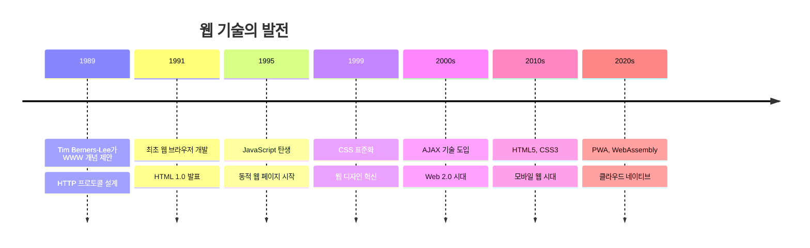
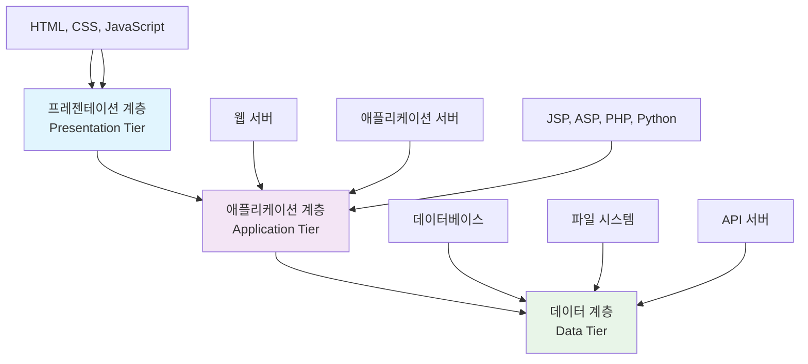
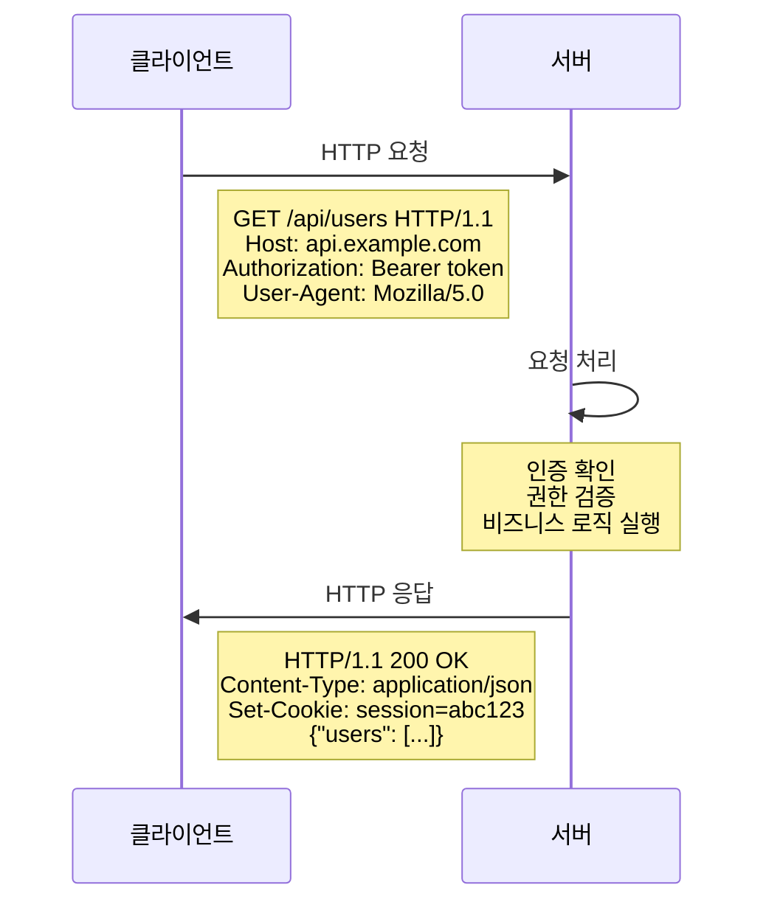
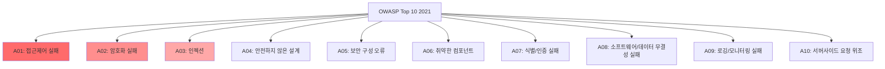
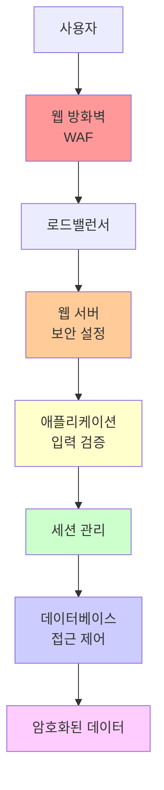

# 16강: 웹 애플리케이션 보안 기초

## 개요
해킹보안전문가 1급 과정의 16강으로, 웹 애플리케이션 보안의 기초를 다룹니다. 웹의 정의와 구성, HTTP 프로토콜, 웹 시스템 아키텍처, 보안 위험 요소들을 체계적으로 학습하여 애플리케이션 보안의 기반을 마련합니다.

## 주요 학습 내용

### 1. 웹(World Wide Web)의 이해

#### 웹의 정의
**웹(WWW)은 World Wide Web(월드 와이드 웹)의 줄임말**입니다. HTML로 작성된 홈페이지의 데이터는 인터넷에서 상호 링크하여 복잡한 컴퓨터 네트워크를 형성하고 있습니다. 마치 **거미집처럼 복잡하게 접속되어 있어서 Worldwide(세계적인) Web(거미집)**이라고 불리게 되었습니다.

웹을 이해하기 위해서 반드시 알아야 하는 것이 바로 **하이퍼텍스트(Hyper Text)**입니다. 웹 페이지의 연결, 웹사이트의 색깔, 사진의 배치 등 사이트의 모든 구조는 **HTML(Hyper Text Mark-up Language)** 언어를 통해 구현됩니다.

#### 웹의 발전사


### 2. 웹의 구성 요소

#### 핵심 구성 요소
웹을 구성하는 요소로는 **웹서버, 웹 클라이언트, 웹페이지를 출력해주는 웹 브라우저, 웹(WWW), 웹 프로토콜 HTTP, 웹 애플리케이션** 또는 웹 응용프로그램(JSP, ASP, PHP 등)이 있습니다.

##### 웹 서버 (Web Server)
**클라이언트의 요청에 따라 HTML 문서를 클라이언트에게 제공하는 주체**입니다.

**주요 웹 서버:**
- **Apache HTTP Server**: 가장 널리 사용되는 오픈소스 웹서버
- **Nginx**: 고성능 웹서버, 리버스 프록시
- **Microsoft IIS**: 윈도우 환경의 웹서버
- **Tomcat**: Java 서블릿 컨테이너

##### 웹 클라이언트 (Web Client)
**다른 프로그램에게 서비스를 요청하는 프로그램이나 컴퓨터**를 일컫습니다. 웹 클라이언트(Web Client)라고 하면 자신이 보고자 하는 HTML 문서를 웹 서버에 요청하는 컴퓨터를 말합니다.

##### 웹 브라우저 (Web Browser)
**웹의 정보를 검색하는데 사용되는 프로그램**으로써, 웹 서버로부터 HTML 문서를 받아 사용자가 볼 수 있도록 글과 그림으로 변경시켜 주는 역할을 합니다. 마치 방송국으로부터 전송된 전파 신호를 받아 화면으로 보여주는 TV와 같은 역할을 하는 것이 바로 웹 브라우저입니다.

**주요 웹 브라우저:**
- **Chrome**: Google의 브라우저 (점유율 1위)
- **Safari**: Apple의 브라우저
- **Firefox**: Mozilla의 오픈소스 브라우저
- **Edge**: Microsoft의 브라우저

##### HTTP (HyperText Transfer Protocol)
**인터넷에서, 웹 서버와 사용자의 인터넷 브라우저 사이에 문서를 전송하기 위해 사용되는 통신 규약**을 말합니다.

### 3. 웹 애플리케이션 아키텍처

#### 3계층 아키텍처
**웹 애플리케이션은 주로 3계층 애플리케이션으로 구축**됩니다.



가장 흔한 구성으로, **웹 브라우저가 첫 번째 계층**이고, **동적 웹 콘텐츠 기술(ASP, ASP.NET, CGI, ColdFusion, JSP, PHP, 파이썬, 루비 온 레일즈) 과 같은 것들의 엔진이 중간 계층**이며, **데이터베이스가 세 번째 계층**입니다.

웹 브라우저는 데이터베이스에 쿼리를 보내고, 자료를 업데이트하며, 사용자 인터페이스를 만드는 중간 계층에게 요청을 보냅니다.

#### 현대적 웹 아키텍처 패턴

##### 마이크로서비스 아키텍처
```bash
# 마이크로서비스 기반 웹 애플리케이션 예시

# 1. API Gateway (Nginx 설정)
upstream user_service {
    server user-service:8001;
}

upstream product_service {
    server product-service:8002;
}

upstream order_service {
    server order-service:8003;
}

server {
    listen 80;
    server_name api.company.com;
    
    # 사용자 서비스 라우팅
    location /api/users/ {
        proxy_pass http://user_service;
        proxy_set_header X-Real-IP $remote_addr;
        proxy_set_header X-Forwarded-For $proxy_add_x_forwarded_for;
    }
    
    # 상품 서비스 라우팅
    location /api/products/ {
        proxy_pass http://product_service;
        proxy_set_header X-Real-IP $remote_addr;
        proxy_set_header X-Forwarded-For $proxy_add_x_forwarded_for;
    }
    
    # 주문 서비스 라우팅
    location /api/orders/ {
        proxy_pass http://order_service;
        proxy_set_header X-Real-IP $remote_addr;
        proxy_set_header X-Forwarded-For $proxy_add_x_forwarded_for;
    }
    
    # 보안 헤더 설정
    add_header X-Frame-Options "SAMEORIGIN" always;
    add_header X-Content-Type-Options "nosniff" always;
    add_header X-XSS-Protection "1; mode=block" always;
    add_header Strict-Transport-Security "max-age=31536000; includeSubDomains" always;
}
```

##### 서버리스 아키텍처
```javascript
// AWS Lambda 기반 서버리스 API 예시
const AWS = require('aws-sdk');
const dynamodb = new AWS.DynamoDB.DocumentClient();

exports.handler = async (event) => {
    const { httpMethod, path, body } = event;
    
    try {
        switch (httpMethod) {
            case 'GET':
                return await getUser(event);
            case 'POST':
                return await createUser(JSON.parse(body));
            case 'PUT':
                return await updateUser(event, JSON.parse(body));
            case 'DELETE':
                return await deleteUser(event);
            default:
                return {
                    statusCode: 405,
                    body: JSON.stringify({ error: 'Method Not Allowed' })
                };
        }
    } catch (error) {
        console.error('Error:', error);
        return {
            statusCode: 500,
            body: JSON.stringify({ error: 'Internal Server Error' })
        };
    }
};

async function getUser(event) {
    const userId = event.pathParameters.id;
    
    // 입력값 검증
    if (!userId || !isValidUserId(userId)) {
        return {
            statusCode: 400,
            body: JSON.stringify({ error: 'Invalid user ID' })
        };
    }
    
    const params = {
        TableName: 'Users',
        Key: { userId }
    };
    
    const result = await dynamodb.get(params).promise();
    
    if (!result.Item) {
        return {
            statusCode: 404,
            body: JSON.stringify({ error: 'User not found' })
        };
    }
    
    // 민감한 정보 제거
    const { password, ...safeUserData } = result.Item;
    
    return {
        statusCode: 200,
        headers: {
            'Content-Type': 'application/json',
            'Access-Control-Allow-Origin': '*'
        },
        body: JSON.stringify(safeUserData)
    };
}

function isValidUserId(userId) {
    // UUID 형식 검증
    const uuidRegex = /^[0-9a-f]{8}-[0-9a-f]{4}-4[0-9a-f]{3}-[89ab][0-9a-f]{3}-[0-9a-f]{12}$/i;
    return uuidRegex.test(userId);
}
```

### 4. HTTP 프로토콜과 보안

#### HTTP 요청/응답 구조


#### HTTP 응답 코드의 보안적 의미

##### 성공적인 응답 (2xx)
```bash
200 OK              # 요청이 성공적으로 수행됨
201 Created         # PUT 메소드에 의해 원격지 서버에 파일 생성됨
202 Accepted        # 웹 서버가 명령 수신함
204 No Content      # 사용자 요구 처리하였으나, 전송할 데이터가 없음
```

##### 리다이렉션 (3xx)
```bash
301 Moved Permanently    # 요구한 데이터를 변경된 타 URL에 요청함
302 Found               # 임시적으로 다른 위치로 이동
304 Not Modified        # 컴퓨터 로컬의 캐시 정보를 이용함
```

##### 클라이언트 오류 (4xx)
```bash
400 Bad Request         # 사용자의 잘못된 요청을 처리할 수 없음
401 Unauthorized        # 인증이 필요한 페이지를 요청한 경우
403 Forbidden          # 접근 금지, 디렉터리 리스팅 요청 및 관리자 페이지 접근 등을 차단
404 Not Found           # 요청한 페이지 없음
405 Method Not Allowed  # 허용되지 않는 HTTP Method 사용함
408 Request Timeout     # 요청 시간 초과
```

##### 서버 오류 (5xx)
```bash
500 Internal Server Error    # 내부 서버 오류
501 Not Implemented         # 웹 서버가 처리할 수 없음
503 Service Unavailable     # 서비스 제공 불가
504 Gateway Timeout         # 게이트웨이 시간 초과
```

### 5. 웹 애플리케이션 보안 위험 요소

#### OWASP Top 10 (2021)
**OWASP(Open Web Application Security Project)**에서 발표하는 가장 중요한 웹 애플리케이션 보안 위험 요소들입니다.



#### 한국 웹 취약점 진단 기준 (KISA)
**미래창조과학부(현 과학기술정보통신부)의 웹 취약점 진단 기준**에 따른 24가지 주요 취약점:

| 코드 | 점검 항목 | 위험도 | 공격 피해 |
|------|-----------|--------|-----------|
| **OC** | 운영체제 명령 실행 | 높음 | 시스템 장악 |
| **SI** | SQL 인젝션 | 높음 | DB정보 유출 |
| **XI** | XPath 인젝션 | 중간 | 사용자 인증우회 |
| **DI** | 디렉토리 인덱싱 | 중간 | 시스템파일 누출 |
| **IL** | 정보누출 | 낮음 | 서버 정보 누출 |
| **CS** | 악성콘텐츠 | 높음 | 악성코드 감염 |
| **XS** | 크로스사이트스크립트(XSS) | 높음 | 세션하이재킹 |
| **BF** | 약한 문자열 강도 | 중간 | 사용자 계정 탈취 |
| **IN** | 불충분한 인증 및 인가 | 높음 | 관리자 권한 탈취 |
| **PR** | 취약한 패스워드 복구 | 중간 | 사용자 계정 탈취 |
| **SM** | 불충분한 세션 관리 | 높음 | 사용자 권한 탈취 |
| **CF** | 크로스사이트 리퀘스트 변조 | 중간 | 사용자 권한 탈취 |

### 6. 웹 보안 진단 환경 구축

#### 테스트 환경 설정
```bash
#!/bin/bash
# 웹 애플리케이션 보안 진단 환경 구축 스크립트

echo "=== 웹 애플리케이션 보안 진단 환경 구축 ==="

# 1. Docker를 이용한 취약한 웹 애플리케이션 설치
echo "1. DVWA (Damn Vulnerable Web Application) 설치"
docker pull vulnerables/web-dvwa
docker run -d -p 80:80 --name dvwa vulnerables/web-dvwa

echo "2. WebGoat 설치"
docker pull webgoat/webgoat-8.0
docker run -d -p 8080:8080 --name webgoat webgoat/webgoat-8.0

echo "3. Mutillidae 설치"
docker pull citizenstig/nowasp
docker run -d -p 8081:80 --name mutillidae citizenstig/nowasp

# 4. 진단 도구 설치
echo "4. 웹 취약점 진단 도구 설치"

# Burp Suite Community Edition 다운로드
echo "Burp Suite 다운로드 중..."
wget https://portswigger.net/burp/releases/download -O burpsuite_community.jar

# OWASP ZAP 설치
echo "OWASP ZAP 설치 중..."
wget https://github.com/zaproxy/zaproxy/releases/download/v2.11.1/ZAP_2.11.1_Linux.tar.gz
tar -xzf ZAP_2.11.1_Linux.tar.gz

# Nikto 설치
echo "Nikto 설치 중..."
sudo apt-get update
sudo apt-get install -y nikto

# SQLMap 설치
echo "SQLMap 설치 중..."
git clone --depth 1 https://github.com/sqlmapproject/sqlmap.git sqlmap-dev

echo "=== 환경 구축 완료 ==="
echo "DVWA: http://localhost"
echo "WebGoat: http://localhost:8080"
echo "Mutillidae: http://localhost:8081"
```

#### 진단 도구 활용법
```python
#!/usr/bin/env python3
# 웹 취약점 자동 진단 도구

import requests
import re
import json
from urllib.parse import urljoin, urlparse
import time
from bs4 import BeautifulSoup
import threading
from queue import Queue

class WebVulnerabilityScanner:
    def __init__(self, target_url):
        self.target_url = target_url
        self.session = requests.Session()
        self.session.headers.update({
            'User-Agent': 'Mozilla/5.0 (WebVulnScanner/1.0)',
            'Accept': 'text/html,application/xhtml+xml,application/xml;q=0.9,*/*;q=0.8'
        })
        self.vulnerabilities = []
        self.crawled_urls = set()
        
    def crawl_website(self, max_depth=2):
        """웹사이트 크롤링하여 URL 수집"""
        urls_to_crawl = Queue()
        urls_to_crawl.put((self.target_url, 0))
        
        while not urls_to_crawl.empty():
            url, depth = urls_to_crawl.get()
            
            if url in self.crawled_urls or depth > max_depth:
                continue
                
            try:
                print(f"크롤링 중: {url}")
                response = self.session.get(url, timeout=10)
                self.crawled_urls.add(url)
                
                if 'text/html' in response.headers.get('content-type', ''):
                    soup = BeautifulSoup(response.text, 'html.parser')
                    
                    # 링크 추출
                    for link in soup.find_all('a', href=True):
                        new_url = urljoin(url, link['href'])
                        if self.is_same_domain(new_url):
                            urls_to_crawl.put((new_url, depth + 1))
                    
                    # 폼 추출
                    for form in soup.find_all('form'):
                        self.test_form_vulnerabilities(url, form)
                        
            except Exception as e:
                print(f"크롤링 오류 {url}: {e}")
                
        return list(self.crawled_urls)
    
    def is_same_domain(self, url):
        """같은 도메인인지 확인"""
        try:
            target_domain = urlparse(self.target_url).netloc
            url_domain = urlparse(url).netloc
            return target_domain == url_domain
        except:
            return False
    
    def test_xss_vulnerability(self, url, params=None):
        """XSS 취약점 테스트"""
        xss_payloads = [
            '<script>alert("XSS")</script>',
            '"><script>alert("XSS")</script>',
            "';alert('XSS');//",
            '',
            'javascript:alert("XSS")'
        ]
        
        for payload in xss_payloads:
            try:
                if params:
                    test_params = params.copy()
                    for key in test_params:
                        test_params[key] = payload
                    response = self.session.get(url, params=test_params)
                else:
                    test_url = f"{url}?test={payload}"
                    response = self.session.get(test_url)
                
                if payload in response.text:
                    self.vulnerabilities.append({
                        'type': 'XSS (Cross-Site Scripting)',
                        'url': url,
                        'payload': payload,
                        'severity': 'HIGH',
                        'description': 'XSS 취약점이 발견되었습니다.'
                    })
                    return True
                    
            except Exception as e:
                print(f"XSS 테스트 오류: {e}")
                
        return False
    
    def test_sql_injection(self, url, params=None):
        """SQL 인젝션 취약점 테스트"""
        sql_payloads = [
            "' OR '1'='1",
            "' OR 1=1--",
            "' UNION SELECT null,null,null--",
            "'; DROP TABLE users--",
            "' AND (SELECT COUNT(*) FROM information_schema.tables)>0--"
        ]
        
        for payload in sql_payloads:
            try:
                if params:
                    test_params = params.copy()
                    for key in test_params:
                        test_params[key] = payload
                    response = self.session.get(url, params=test_params)
                else:
                    test_url = f"{url}?id={payload}"
                    response = self.session.get(test_url)
                
                # SQL 오류 메시지 패턴
                error_patterns = [
                    r"SQL syntax.*MySQL",
                    r"Warning.*mysql_",
                    r"PostgreSQL.*ERROR",
                    r"Microsoft.*ODBC.*SQL"
                ]
                
                for pattern in error_patterns:
                    if re.search(pattern, response.text, re.IGNORECASE):
                        self.vulnerabilities.append({
                            'type': 'SQL Injection',
                            'url': url,
                            'payload': payload,
                            'severity': 'CRITICAL',
                            'description': 'SQL 인젝션 취약점이 발견되었습니다.'
                        })
                        return True
                        
            except Exception as e:
                print(f"SQL 인젝션 테스트 오류: {e}")
                
        return False
    
    def test_form_vulnerabilities(self, url, form):
        """폼 기반 취약점 테스트"""
        try:
            action = form.get('action', '')
            method = form.get('method', 'GET').upper()
            form_url = urljoin(url, action) if action else url
            
            # 폼 필드 추출
            form_data = {}
            for input_tag in form.find_all(['input', 'textarea', 'select']):
                name = input_tag.get('name')
                if name:
                    input_type = input_tag.get('type', 'text')
                    if input_type in ['text', 'email', 'search', 'url']:
                        form_data[name] = 'test_value'
                    elif input_type == 'password':
                        form_data[name] = 'test_password'
            
            if form_data:
                print(f"폼 테스트 중: {form_url}")
                
                # XSS 테스트
                self.test_xss_in_form(form_url, form_data, method)
                
                # SQL 인젝션 테스트
                self.test_sql_injection_in_form(form_url, form_data, method)
                
        except Exception as e:
            print(f"폼 테스트 오류: {e}")
    
    def test_xss_in_form(self, url, form_data, method):
        """폼에서 XSS 테스트"""
        xss_payload = '<script>alert("XSS")</script>'
        
        for field in form_data:
            test_data = form_data.copy()
            test_data[field] = xss_payload
            
            try:
                if method == 'POST':
                    response = self.session.post(url, data=test_data)
                else:
                    response = self.session.get(url, params=test_data)
                
                if xss_payload in response.text:
                    self.vulnerabilities.append({
                        'type': 'XSS (Cross-Site Scripting)',
                        'url': url,
                        'parameter': field,
                        'payload': xss_payload,
                        'severity': 'HIGH',
                        'description': f'폼 필드 "{field}"에서 XSS 취약점이 발견되었습니다.'
                    })
                    
            except Exception as e:
                print(f"폼 XSS 테스트 오류: {e}")
    
    def test_sql_injection_in_form(self, url, form_data, method):
        """폼에서 SQL 인젝션 테스트"""
        sql_payload = "' OR 1=1--"
        
        for field in form_data:
            test_data = form_data.copy()
            test_data[field] = sql_payload
            
            try:
                if method == 'POST':
                    response = self.session.post(url, data=test_data)
                else:
                    response = self.session.get(url, params=test_data)
                
                # SQL 오류 패턴 확인
                error_patterns = [
                    r"SQL syntax.*MySQL",
                    r"Warning.*mysql_",
                    r"PostgreSQL.*ERROR"
                ]
                
                for pattern in error_patterns:
                    if re.search(pattern, response.text, re.IGNORECASE):
                        self.vulnerabilities.append({
                            'type': 'SQL Injection',
                            'url': url,
                            'parameter': field,
                            'payload': sql_payload,
                            'severity': 'CRITICAL',
                            'description': f'폼 필드 "{field}"에서 SQL 인젝션 취약점이 발견되었습니다.'
                        })
                        break
                        
            except Exception as e:
                print(f"폼 SQL 인젝션 테스트 오류: {e}")
    
    def check_security_headers(self):
        """보안 헤더 확인"""
        try:
            response = self.session.get(self.target_url)
            headers = response.headers
            
            security_headers = {
                'X-Frame-Options': 'Clickjacking 보호',
                'X-Content-Type-Options': 'MIME 타입 스니핑 방지',
                'X-XSS-Protection': 'XSS 필터링',
                'Strict-Transport-Security': 'HTTPS 강제',
                'Content-Security-Policy': '콘텐츠 보안 정책',
                'Referrer-Policy': 'Referrer 정보 제어'
            }
            
            for header, description in security_headers.items():
                if header not in headers:
                    self.vulnerabilities.append({
                        'type': 'Missing Security Header',
                        'url': self.target_url,
                        'header': header,
                        'severity': 'MEDIUM',
                        'description': f'{description} 헤더가 누락되었습니다.'
                    })
                    
        except Exception as e:
            print(f"보안 헤더 확인 오류: {e}")
    
    def generate_report(self):
        """취약점 진단 보고서 생성"""
        report = {
            'target_url': self.target_url,
            'scan_time': time.strftime('%Y-%m-%d %H:%M:%S'),
            'total_vulnerabilities': len(self.vulnerabilities),
            'vulnerabilities': self.vulnerabilities,
            'severity_summary': {
                'CRITICAL': len([v for v in self.vulnerabilities if v.get('severity') == 'CRITICAL']),
                'HIGH': len([v for v in self.vulnerabilities if v.get('severity') == 'HIGH']),
                'MEDIUM': len([v for v in self.vulnerabilities if v.get('severity') == 'MEDIUM']),
                'LOW': len([v for v in self.vulnerabilities if v.get('severity') == 'LOW'])
            }
        }
        
        return report
    
    def run_scan(self):
        """전체 스캔 실행"""
        print(f"웹 취약점 스캔 시작: {self.target_url}")
        
        # 1. 사이트 크롤링
        print("1. 사이트 크롤링 중...")
        urls = self.crawl_website()
        print(f"발견된 URL: {len(urls)}개")
        
        # 2. 보안 헤더 확인
        print("2. 보안 헤더 확인 중...")
        self.check_security_headers()
        
        # 3. 기본 취약점 테스트
        print("3. 기본 취약점 테스트 중...")
        for url in list(urls)[:10]:  # 상위 10개 URL만 테스트
            self.test_xss_vulnerability(url)
            self.test_sql_injection(url)
        
        # 4. 보고서 생성
        print("4. 보고서 생성 중...")
        report = self.generate_report()
        
        return report

# 사용 예시
if __name__ == "__main__":
    target = "http://testphp.vulnweb.com"  # 테스트용 취약한 사이트
    
    scanner = WebVulnerabilityScanner(target)
    report = scanner.run_scan()
    
    # 결과 출력
    print(f"""
=== 웹 취약점 진단 결과 ===
대상 URL: {report['target_url']}
스캔 시간: {report['scan_time']}
총 취약점: {report['total_vulnerabilities']}개

심각도별 요약:
- CRITICAL: {report['severity_summary']['CRITICAL']}개
- HIGH: {report['severity_summary']['HIGH']}개  
- MEDIUM: {report['severity_summary']['MEDIUM']}개
- LOW: {report['severity_summary']['LOW']}개

상세 취약점:
""")
    
    for i, vuln in enumerate(report['vulnerabilities'][:5], 1):
        print(f"{i}. {vuln['type']} ({vuln['severity']})")
        print(f"   URL: {vuln['url']}")
        print(f"   설명: {vuln['description']}")
        print()
    
    # JSON 파일로 저장
    with open('vulnerability_report.json', 'w', encoding='utf-8') as f:
        json.dump(report, f, indent=2, ensure_ascii=False)
    
    print("상세 보고서가 'vulnerability_report.json'에 저장되었습니다.")
```

### 7. 웹 보안 기본 원칙

#### Defense in Depth (다층 방어)


#### Secure Coding Guidelines
```javascript
// 보안 코딩 가이드라인 예시

// 1. 입력값 검증
function validateUserInput(input, type) {
    // 화이트리스트 기반 검증
    const patterns = {
        email: /^[a-zA-Z0-9._%+-]+@[a-zA-Z0-9.-]+\.[a-zA-Z]{2,}$/,
        phone: /^\d{3}-\d{4}-\d{4}$/,
        username: /^[a-zA-Z0-9_]{3,20}$/
    };
    
    if (!patterns[type]) {
        throw new Error('Unknown validation type');
    }
    
    // 길이 제한
    if (input.length > 100) {
        return false;
    }
    
    // 패턴 매칭
    return patterns[type].test(input);
}

// 2. SQL 인젝션 방지 (Parameterized Query)
async function getUserById(userId) {
    // 나쁜 예: 직접 문자열 연결
    // const query = `SELECT * FROM users WHERE id = '${userId}'`;
    
    // 좋은 예: 매개변수화된 쿼리
    const query = 'SELECT * FROM users WHERE id = ?';
    return await db.query(query, [userId]);
}

// 3. XSS 방지 (출력 인코딩)
function escapeHtml(unsafe) {
    return unsafe
        .replace(/&/g, "&amp;")
        .replace(/</g, "&lt;")
        .replace(/>/g, "&gt;")
        .replace(/"/g, "&quot;")
        .replace(/'/g, "&#039;");
}

// 4. CSRF 토큰 생성 및 검증
const crypto = require('crypto');

function generateCSRFToken() {
    return crypto.randomBytes(32).toString('hex');
}

function validateCSRFToken(sessionToken, requestToken) {
    return sessionToken && requestToken && 
           crypto.timingSafeEqual(
               Buffer.from(sessionToken),
               Buffer.from(requestToken)
           );
}

// 5. 보안 헤더 설정
function setSecurityHeaders(res) {
    res.setHeader('X-Content-Type-Options', 'nosniff');
    res.setHeader('X-Frame-Options', 'DENY');
    res.setHeader('X-XSS-Protection', '1; mode=block');
    res.setHeader('Strict-Transport-Security', 'max-age=31536000; includeSubDomains');
    res.setHeader('Content-Security-Policy', "default-src 'self'");
    res.setHeader('Referrer-Policy', 'strict-origin-when-cross-origin');
}
```

## 마무리

이번 16강에서는 **웹 애플리케이션 보안의 기초**를 다뤘습니다. 웹의 구조와 HTTP 프로토콜을 이해하고, 주요 보안 위험 요소들을 파악했습니다. 또한 실제 진단 도구와 환경을 구축하여 실무에 바로 적용할 수 있는 기반을 마련했습니다.

다음 강의에서는 **인젝션 공격**에 대해 심화 학습하겠습니다.

---
*이 자료는 해킹보안전문가 1급 자격증 취득을 위한 학습 목적으로 작성되었습니다.*