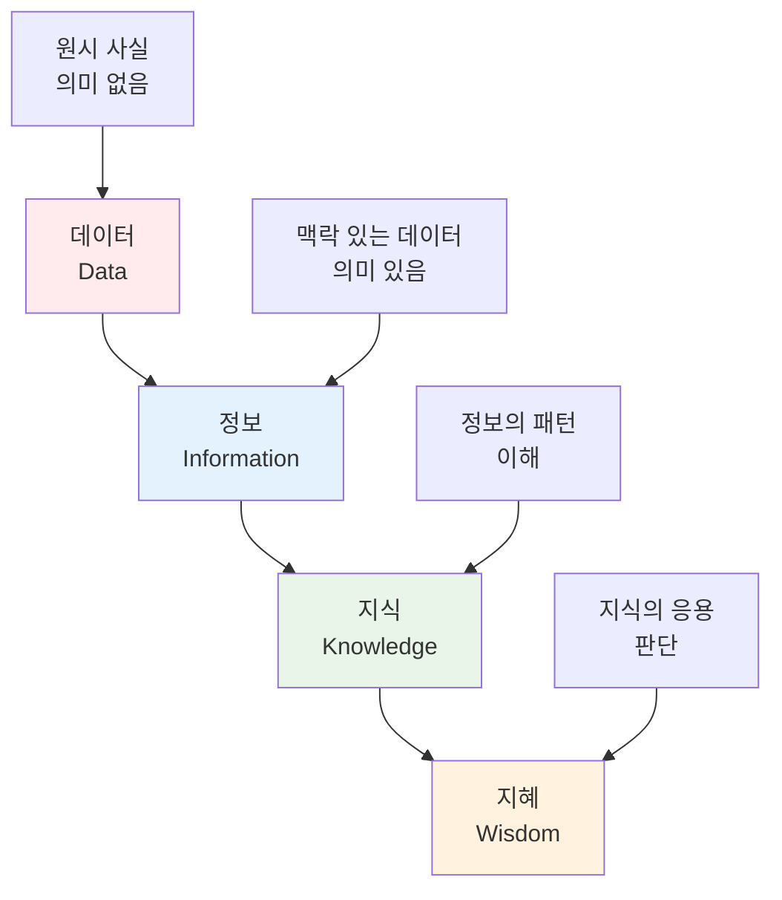

# 21강: 정보보안의 기본 개념 및 원칙

## 개요
해킹보안전문가 1급 과정의 21강으로, 정보보안 관리 시리즈의 시작입니다. 정보와 정보보안의 정의, 보안과 보호의 차이점, NIST와 OECD의 정보보안 원칙 등 정보보안 관리의 기본 개념을 다룹니다.

## 주요 학습 내용

### 1. 정보(Information)의 개념

#### 정보의 정의
**정보(情報, Information)**란 **관찰이나 측정을 통해 수집한 자료를 실제 문제에 도움이 되도록 정리한 지식 또는 그 자료**를 의미합니다.

- **국가정보화기본법 제3조**: 특정 목적을 위하여 광(光) 또는 전자적 방식으로 처리되어 부호, 문자, 음성, 음향 및 영상 등으로 표현된 모든 종류의 자료 또는 지식
- **핵심**: 정보 = 데이터를 연관성 있게 정리한 것

#### 정보의 특성


### 2. 정보보안 vs 정보보호

#### 기본 개념의 차이점

| 구분 | 정보보안(Security) | 정보보호(Protection) |
|------|-------------------|---------------------|
| **정의** | 안전을 유지함, 사회의 안녕과 질서 유지 | 위험이나 곤란 따위가 미치지 않도록 잘 보살펴 돌봄 |
| **관점** | 방법 지향적 (How) | 목적 지향적 (What) |
| **성격** | 주제적, 절차적, 구체적 | 객체적, 원칙적, 일반적 |
| **역할** | 보호를 위한 **수단** | 달성하고자 하는 **목적** |
| **대상** | 보호대상을 지키는 **방법** | 지킬 대상인 **정보** |

#### 법적 정의

##### 정보보호 (국가정보화기본법 제3조)
**정보의 수집·가공·저장·검색·송신·수신 중에 정보의 훼손·변조·유출 등을 방지하기 위한 관리적·기술적 수단을 강구하는 것**

##### 정보보안 (ISO/IEC 27000:2009)
**정보의 기밀성(Confidentiality), 무결성(Integrity), 가용성(Availability)을 보장하는 것**
- 추가적으로 진정성(Authenticity), 책임성(Accountability), 부인방지(Non-repudiation), 신뢰성(Reliability)과 관련

#### 실무 관점에서의 구분
```python
#!/usr/bin/env python3
# 정보보안 vs 정보보호 개념 구현

from enum import Enum
from datetime import datetime
import logging

class SecurityObjective(Enum):
    """정보보호의 목적 (What을 보호할 것인가)"""
    PERSONAL_DATA = "개인정보"
    BUSINESS_SECRET = "영업비밀"
    FINANCIAL_DATA = "금융정보"
    MEDICAL_RECORD = "의료정보"
    GOVERNMENT_DATA = "정부정보"

class SecurityMethod(Enum):
    """정보보안의 수단 (How 보호할 것인가)"""
    ENCRYPTION = "암호화"
    ACCESS_CONTROL = "접근통제"
    AUTHENTICATION = "인증"
    BACKUP = "백업"
    MONITORING = "모니터링"
    FIREWALL = "방화벽"

class InformationProtectionFramework:
    """정보보호 프레임워크 (목적 중심)"""
    
    def __init__(self):
        self.protection_objectives = []
        self.risk_assessment = {}
        self.compliance_requirements = []
    
    def define_protection_target(self, data_type: SecurityObjective, 
                               criticality: str, business_impact: str):
        """보호 대상 정의 (What)"""
        target = {
            'data_type': data_type,
            'criticality': criticality,  # High, Medium, Low
            'business_impact': business_impact,
            'defined_at': datetime.now()
        }
        self.protection_objectives.append(target)
        return target
    
    def assess_risk(self, asset, threat, vulnerability):
        """위험 평가"""
        risk_id = f"{asset}_{threat}_{vulnerability}"
        
        # 위험도 계산 (간단한 예시)
        threat_level = self._evaluate_threat(threat)
        vuln_level = self._evaluate_vulnerability(vulnerability)
        asset_value = self._evaluate_asset_value(asset)
        
        risk_score = (threat_level * vuln_level * asset_value) / 100
        
        self.risk_assessment[risk_id] = {
            'asset': asset,
            'threat': threat,
            'vulnerability': vulnerability,
            'risk_score': risk_score,
            'risk_level': self._categorize_risk(risk_score),
            'assessment_date': datetime.now()
        }
        
        return self.risk_assessment[risk_id]
    
    def _evaluate_threat(self, threat):
        """위협 수준 평가"""
        threat_scores = {
            '내부자 공격': 8,
            '외부 해킹': 7,
            '맬웨어': 6,
            '자연재해': 4,
            '시스템 장애': 5
        }
        return threat_scores.get(threat, 5)
    
    def _evaluate_vulnerability(self, vulnerability):
        """취약성 수준 평가"""
        vuln_scores = {
            '패치 미적용': 8,
            '약한 인증': 7,
            '불충분한 암호화': 6,
            '접근통제 부족': 7,
            '모니터링 부족': 5
        }
        return vuln_scores.get(vulnerability, 5)
    
    def _evaluate_asset_value(self, asset):
        """자산 가치 평가"""
        asset_values = {
            '고객 개인정보': 10,
            '영업 기밀': 9,
            '재무 정보': 9,
            '시스템 설정': 6,
            '일반 업무 문서': 4
        }
        return asset_values.get(asset, 5)
    
    def _categorize_risk(self, score):
        """위험 수준 분류"""
        if score >= 7:
            return '매우 높음'
        elif score >= 5:
            return '높음'
        elif score >= 3:
            return '보통'
        else:
            return '낮음'

class InformationSecurityImplementation:
    """정보보안 구현 (수단 중심)"""
    
    def __init__(self, protection_framework):
        self.protection_framework = protection_framework
        self.security_controls = {}
        self.implementation_status = {}
    
    def implement_security_control(self, control_type: SecurityMethod,
                                 target_asset, configuration):
        """보안 통제 구현 (How)"""
        control_id = f"{control_type.value}_{target_asset}"
        
        control = {
            'control_type': control_type,
            'target_asset': target_asset,
            'configuration': configuration,
            'implemented_at': datetime.now(),
            'status': 'Active'
        }
        
        self.security_controls[control_id] = control
        
        # 구현 로직 실행
        self._execute_control_implementation(control_type, configuration)
        
        return control
    
    def _execute_control_implementation(self, control_type, config):
        """실제 보안 통제 구현"""
        if control_type == SecurityMethod.ENCRYPTION:
            return self._implement_encryption(config)
        elif control_type == SecurityMethod.ACCESS_CONTROL:
            return self._implement_access_control(config)
        elif control_type == SecurityMethod.AUTHENTICATION:
            return self._implement_authentication(config)
        elif control_type == SecurityMethod.MONITORING:
            return self._implement_monitoring(config)
    
    def _implement_encryption(self, config):
        """암호화 구현"""
        from cryptography.fernet import Fernet
        
        # 암호화 키 생성
        key = Fernet.generate_key()
        cipher = Fernet(key)
        
        return {
            'method': 'AES-256',
            'key_management': config.get('key_management', 'Local'),
            'cipher': cipher,
            'status': 'Implemented'
        }
    
    def _implement_access_control(self, config):
        """접근통제 구현"""
        return {
            'model': config.get('model', 'RBAC'),
            'authentication': config.get('auth_method', 'Multi-factor'),
            'authorization_rules': config.get('rules', []),
            'status': 'Implemented'
        }
    
    def _implement_authentication(self, config):
        """인증 구현"""
        return {
            'method': config.get('method', '2FA'),
            'factors': config.get('factors', ['password', 'sms']),
            'session_timeout': config.get('timeout', 1800),
            'status': 'Implemented'
        }
    
    def _implement_monitoring(self, config):
        """모니터링 구현"""
        return {
            'log_sources': config.get('sources', []),
            'alert_rules': config.get('alerts', []),
            'retention_period': config.get('retention', 365),
            'status': 'Implemented'
        }
    
    def generate_implementation_report(self):
        """구현 현황 보고서"""
        total_controls = len(self.security_controls)
        active_controls = len([c for c in self.security_controls.values() 
                              if c['status'] == 'Active'])
        
        report = {
            'summary': {
                'total_controls': total_controls,
                'active_controls': active_controls,
                'implementation_rate': f"{(active_controls/total_controls*100):.1f}%" 
                                     if total_controls > 0 else "0%"
            },
            'controls_by_type': {},
            'risk_coverage': self._calculate_risk_coverage(),
            'recommendations': self._generate_recommendations()
        }
        
        # 통제 유형별 현황
        for control in self.security_controls.values():
            control_type = control['control_type'].value
            if control_type not in report['controls_by_type']:
                report['controls_by_type'][control_type] = 0
            report['controls_by_type'][control_type] += 1
        
        return report
    
    def _calculate_risk_coverage(self):
        """위험 대응 커버리지 계산"""
        risks = self.protection_framework.risk_assessment
        covered_risks = 0
        
        for risk in risks.values():
            if risk['risk_level'] in ['매우 높음', '높음']:
                # 해당 위험에 대한 통제가 구현되었는지 확인
                if self._has_risk_control(risk):
                    covered_risks += 1
        
        total_high_risks = len([r for r in risks.values() 
                               if r['risk_level'] in ['매우 높음', '높음']])
        
        if total_high_risks == 0:
            return "100%"
        
        return f"{(covered_risks/total_high_risks*100):.1f}%"
    
    def _has_risk_control(self, risk):
        """위험에 대한 통제 존재 여부 확인"""
        # 간단한 로직 예시
        return risk['asset'] in [c['target_asset'] for c in self.security_controls.values()]
    
    def _generate_recommendations(self):
        """권장사항 생성"""
        recommendations = []
        
        # 구현되지 않은 필수 통제 확인
        essential_controls = [SecurityMethod.ENCRYPTION, SecurityMethod.ACCESS_CONTROL, 
                            SecurityMethod.AUTHENTICATION]
        
        implemented_types = [c['control_type'] for c in self.security_controls.values()]
        
        for control in essential_controls:
            if control not in implemented_types:
                recommendations.append(f"{control.value} 통제 구현 필요")
        
        # 고위험 자산에 대한 추가 보안 권장
        high_risk_assets = [r['asset'] for r in self.protection_framework.risk_assessment.values()
                           if r['risk_level'] == '매우 높음']
        
        for asset in high_risk_assets:
            if not self._has_risk_control({'asset': asset}):
                recommendations.append(f"'{asset}' 자산에 대한 추가 보안 통제 필요")
        
        return recommendations

# 사용 예시
if __name__ == "__main__":
    # 1. 정보보호 목적 정의 (What을 보호할 것인가)
    protection = InformationProtectionFramework()
    
    # 보호 대상 정의
    protection.define_protection_target(
        SecurityObjective.PERSONAL_DATA, 
        "High", 
        "개인정보 유출 시 법적 제재 및 고객 신뢰도 하락"
    )
    
    protection.define_protection_target(
        SecurityObjective.BUSINESS_SECRET,
        "High",
        "영업비밀 유출 시 경쟁력 상실"
    )
    
    # 위험 평가
    protection.assess_risk("고객 개인정보", "외부 해킹", "패치 미적용")
    protection.assess_risk("영업 기밀", "내부자 공격", "접근통제 부족")
    
    # 2. 정보보안 수단 구현 (How 보호할 것인가)
    security = InformationSecurityImplementation(protection)
    
    # 암호화 구현
    security.implement_security_control(
        SecurityMethod.ENCRYPTION,
        "고객 개인정보",
        {
            'algorithm': 'AES-256',
            'key_management': 'HSM',
            'key_rotation': 'Monthly'
        }
    )
    
    # 접근통제 구현
    security.implement_security_control(
        SecurityMethod.ACCESS_CONTROL,
        "영업 기밀",
        {
            'model': 'RBAC',
            'auth_method': 'Multi-factor',
            'rules': ['role:manager', 'department:sales']
        }
    )
    
    # 인증 시스템 구현
    security.implement_security_control(
        SecurityMethod.AUTHENTICATION,
        "전체 시스템",
        {
            'method': '2FA',
            'factors': ['password', 'otp'],
            'timeout': 1800
        }
    )
    
    # 보고서 생성
    report = security.generate_implementation_report()
    
    print("=== 정보보안 구현 현황 보고서 ===")
    print(f"전체 통제 수: {report['summary']['total_controls']}")
    print(f"활성 통제 수: {report['summary']['active_controls']}")
    print(f"구현률: {report['summary']['implementation_rate']}")
    print(f"위험 대응 커버리지: {report['risk_coverage']}")
    
    print("\n=== 통제 유형별 현황 ===")
    for control_type, count in report['controls_by_type'].items():
        print(f"{control_type}: {count}개")
    
    print("\n=== 권장사항 ===")
    for recommendation in report['recommendations']:
        print(f"- {recommendation}")
```

### 3. 정보보안의 3대 목표 (CIA Triad)

#### 기밀성 (Confidentiality)
**정당한 권한이 부여된 사용자만 접근 가능**

```python
#!/usr/bin/env python3
# 기밀성 보장 시스템

import hashlib
from cryptography.fernet import Fernet
from cryptography.hazmat.primitives import hashes
from cryptography.hazmat.primitives.kdf.pbkdf2 import PBKDF2HMAC
import base64
import os
import json
import getpass

class ConfidentialitySystem:
    """기밀성 보장 시스템"""
    
    def __init__(self):
        self.access_control_list = {}
        self.encrypted_data = {}
        self.user_credentials = {}
    
    def register_user(self, username, password, access_level="user"):
        """사용자 등록"""
        # 패스워드 해시화 저장
        password_hash = hashlib.sha256(password.encode()).hexdigest()
        
        self.user_credentials[username] = {
            'password_hash': password_hash,
            'access_level': access_level,
            'created_at': datetime.now().isoformat()
        }
        
        return f"사용자 '{username}' 등록 완료"
    
    def authenticate_user(self, username, password):
        """사용자 인증"""
        if username not in self.user_credentials:
            return False, "존재하지 않는 사용자"
        
        password_hash = hashlib.sha256(password.encode()).hexdigest()
        stored_hash = self.user_credentials[username]['password_hash']
        
        if password_hash == stored_hash:
            return True, self.user_credentials[username]['access_level']
        else:
            return False, "인증 실패"
    
    def classify_data(self, data_id, classification_level, owner):
        """데이터 분류"""
        self.access_control_list[data_id] = {
            'classification': classification_level,  # public, internal, confidential, secret
            'owner': owner,
            'authorized_users': [owner],
            'access_rules': self._get_access_rules(classification_level)
        }
    
    def _get_access_rules(self, level):
        """분류 등급별 접근 규칙"""
        rules = {
            'public': {'min_clearance': 'user', 'requires_approval': False},
            'internal': {'min_clearance': 'employee', 'requires_approval': False},
            'confidential': {'min_clearance': 'manager', 'requires_approval': True},
            'secret': {'min_clearance': 'admin', 'requires_approval': True}
        }
        return rules.get(level, rules['internal'])
    
    def encrypt_sensitive_data(self, data, password):
        """민감 데이터 암호화"""
        # 패스워드 기반 키 유도
        password = password.encode()
        salt = os.urandom(16)
        kdf = PBKDF2HMAC(
            algorithm=hashes.SHA256(),
            length=32,
            salt=salt,
            iterations=100000,
        )
        key = base64.urlsafe_b64encode(kdf.derive(password))
        
        # 데이터 암호화
        fernet = Fernet(key)
        encrypted_data = fernet.encrypt(data.encode())
        
        return {
            'encrypted_data': encrypted_data,
            'salt': salt,
            'algorithm': 'AES-256 (Fernet)'
        }
    
    def decrypt_sensitive_data(self, encrypted_info, password):
        """민감 데이터 복호화"""
        try:
            password = password.encode()
            kdf = PBKDF2HMAC(
                algorithm=hashes.SHA256(),
                length=32,
                salt=encrypted_info['salt'],
                iterations=100000,
            )
            key = base64.urlsafe_b64encode(kdf.derive(password))
            
            fernet = Fernet(key)
            decrypted_data = fernet.decrypt(encrypted_info['encrypted_data'])
            
            return decrypted_data.decode()
        except:
            return None
    
    def access_data(self, username, data_id, requested_action="read"):
        """데이터 접근 요청"""
        # 사용자 인증 상태 확인
        if username not in self.user_credentials:
            return False, "인증되지 않은 사용자"
        
        # 데이터 존재 확인
        if data_id not in self.access_control_list:
            return False, "존재하지 않는 데이터"
        
        # 접근 권한 확인
        data_info = self.access_control_list[data_id]
        user_level = self.user_credentials[username]['access_level']
        
        if self._check_access_permission(username, user_level, data_info, requested_action):
            return True, f"'{data_id}' 데이터 '{requested_action}' 권한 승인"
        else:
            return False, f"'{data_id}' 데이터에 대한 '{requested_action}' 권한 없음"
    
    def _check_access_permission(self, username, user_level, data_info, action):
        """접근 권한 확인"""
        access_rules = data_info['access_rules']
        required_clearance = access_rules['min_clearance']
        
        # 사용자 권한 레벨 확인
        clearance_levels = ['user', 'employee', 'manager', 'admin']
        user_clearance_idx = clearance_levels.index(user_level)
        required_clearance_idx = clearance_levels.index(required_clearance)
        
        if user_clearance_idx < required_clearance_idx:
            return False
        
        # 명시적으로 승인된 사용자인지 확인
        if username not in data_info['authorized_users']:
            # 승인이 필요한 경우
            if access_rules['requires_approval']:
                return False
        
        return True

# 사용 예시
def demo_confidentiality():
    system = ConfidentialitySystem()
    
    # 사용자 등록
    system.register_user("alice", "secure123", "employee")
    system.register_user("bob", "admin456", "admin")
    system.register_user("charlie", "user789", "user")
    
    # 데이터 분류
    system.classify_data("customer_db", "confidential", "alice")
    system.classify_data("public_notice", "public", "alice")
    system.classify_data("salary_info", "secret", "bob")
    
    # 접근 시도
    print("=== 기밀성 테스트 ===")
    
    test_cases = [
        ("alice", "customer_db", "read"),
        ("charlie", "customer_db", "read"),  # 권한 없음
        ("charlie", "public_notice", "read"),
        ("alice", "salary_info", "read"),    # 권한 없음
        ("bob", "salary_info", "read")
    ]
    
    for username, data_id, action in test_cases:
        success, message = system.access_data(username, data_id, action)
        status = "✅" if success else "❌"
        print(f"{status} {username} -> {data_id} ({action}): {message}")
    
    # 암호화 테스트
    print("\n=== 암호화 테스트 ===")
    secret_data = "고객 신용카드 번호: 1234-5678-9012-3456"
    
    # 암호화
    encrypted_info = system.encrypt_sensitive_data(secret_data, "encryption_key_123")
    print(f"원본 데이터: {secret_data}")
    print(f"암호화됨: {encrypted_info['encrypted_data'][:50]}...")
    
    # 복호화
    decrypted_data = system.decrypt_sensitive_data(encrypted_info, "encryption_key_123")
    print(f"복호화됨: {decrypted_data}")
    
    # 잘못된 키로 복호화 시도
    wrong_decryption = system.decrypt_sensitive_data(encrypted_info, "wrong_key")
    print(f"잘못된 키: {wrong_decryption}")

if __name__ == "__main__":
    demo_confidentiality()
```

#### 무결성 (Integrity)
**정보의 불법적인 변경, 삭제 방지**

```python
#!/usr/bin/env python3
# 무결성 보장 시스템

import hashlib
import hmac
import json
from datetime import datetime
from cryptography.hazmat.primitives import hashes
from cryptography.hazmat.primitives.asymmetric import rsa, padding
from cryptography.hazmat.primitives import serialization

class IntegritySystem:
    """무결성 보장 시스템"""
    
    def __init__(self):
        self.data_hashes = {}
        self.digital_signatures = {}
        self.audit_log = []
        self.private_key = None
        self.public_key = None
        self._generate_key_pair()
    
    def _generate_key_pair(self):
        """디지털 서명용 키 쌍 생성"""
        self.private_key = rsa.generate_private_key(
            public_exponent=65537,
            key_size=2048,
        )
        self.public_key = self.private_key.public_key()
    
    def calculate_hash(self, data, algorithm='sha256'):
        """데이터 해시 계산"""
        if isinstance(data, str):
            data = data.encode('utf-8')
        
        if algorithm == 'sha256':
            return hashlib.sha256(data).hexdigest()
        elif algorithm == 'sha512':
            return hashlib.sha512(data).hexdigest()
        elif algorithm == 'md5':  # 보안상 권장하지 않음
            return hashlib.md5(data).hexdigest()
        else:
            raise ValueError(f"지원하지 않는 해시 알고리즘: {algorithm}")
    
    def store_data_with_hash(self, data_id, data, algorithm='sha256'):
        """데이터 저장 시 해시 생성"""
        data_hash = self.calculate_hash(data, algorithm)
        
        record = {
            'data_id': data_id,
            'data': data,
            'hash': data_hash,
            'algorithm': algorithm,
            'created_at': datetime.now().isoformat(),
            'modified_at': datetime.now().isoformat()
        }
        
        self.data_hashes[data_id] = record
        
        # 감사 로그 기록
        self._log_activity("DATA_STORED", data_id, f"해시 생성: {data_hash[:16]}...")
        
        return data_hash
    
    def verify_data_integrity(self, data_id, current_data=None):
        """데이터 무결성 검증"""
        if data_id not in self.data_hashes:
            return False, "등록되지 않은 데이터"
        
        stored_record = self.data_hashes[data_id]
        stored_hash = stored_record['hash']
        algorithm = stored_record['algorithm']
        
        # 현재 데이터가 제공되지 않으면 저장된 데이터 사용
        if current_data is None:
            current_data = stored_record['data']
        
        current_hash = self.calculate_hash(current_data, algorithm)
        
        integrity_valid = (stored_hash == current_hash)
        
        # 감사 로그 기록
        status = "PASS" if integrity_valid else "FAIL"
        self._log_activity("INTEGRITY_CHECK", data_id, f"검증 결과: {status}")
        
        if integrity_valid:
            return True, "데이터 무결성 확인됨"
        else:
            return False, f"데이터 무결성 위반 감지 (저장된 해시: {stored_hash[:16]}..., 현재 해시: {current_hash[:16]}...)"
    
    def create_digital_signature(self, data):
        """디지털 서명 생성"""
        if isinstance(data, str):
            data = data.encode('utf-8')
        
        signature = self.private_key.sign(
            data,
            padding.PSS(
                mgf=padding.MGF1(hashes.SHA256()),
                salt_length=padding.PSS.MAX_LENGTH
            ),
            hashes.SHA256()
        )
        
        return signature
    
    def verify_digital_signature(self, data, signature):
        """디지털 서명 검증"""
        try:
            if isinstance(data, str):
                data = data.encode('utf-8')
            
            self.public_key.verify(
                signature,
                data,
                padding.PSS(
                    mgf=padding.MGF1(hashes.SHA256()),
                    salt_length=padding.PSS.MAX_LENGTH
                ),
                hashes.SHA256()
            )
            return True, "디지털 서명 검증 성공"
        except:
            return False, "디지털 서명 검증 실패"
    
    def store_signed_data(self, data_id, data, signer_id):
        """서명된 데이터 저장"""
        # 디지털 서명 생성
        signature = self.create_digital_signature(data)
        
        # 해시와 서명 정보 저장
        data_hash = self.calculate_hash(data)
        
        record = {
            'data_id': data_id,
            'data': data,
            'hash': data_hash,
            'signature': signature,
            'signer_id': signer_id,
            'signed_at': datetime.now().isoformat()
        }
        
        self.digital_signatures[data_id] = record
        
        # 감사 로그 기록
        self._log_activity("DATA_SIGNED", data_id, f"서명자: {signer_id}")
        
        return signature
    
    def verify_signed_data(self, data_id, current_data=None):
        """서명된 데이터 검증"""
        if data_id not in self.digital_signatures:
            return False, "서명된 데이터가 아님"
        
        record = self.digital_signatures[data_id]
        stored_data = record['data']
        signature = record['signature']
        
        # 현재 데이터가 제공되지 않으면 저장된 데이터 사용
        if current_data is None:
            current_data = stored_data
        
        # 디지털 서명 검증
        signature_valid, signature_msg = self.verify_digital_signature(current_data, signature)
        
        # 해시 무결성 검증
        current_hash = self.calculate_hash(current_data)
        stored_hash = record['hash']
        hash_valid = (current_hash == stored_hash)
        
        # 감사 로그 기록
        result = "VALID" if (signature_valid and hash_valid) else "INVALID"
        self._log_activity("SIGNATURE_VERIFICATION", data_id, f"결과: {result}")
        
        if signature_valid and hash_valid:
            return True, "서명 및 무결성 검증 완료"
        else:
            errors = []
            if not signature_valid:
                errors.append("디지털 서명 검증 실패")
            if not hash_valid:
                errors.append("데이터 무결성 위반")
            return False, " / ".join(errors)
    
    def create_hmac(self, data, secret_key):
        """HMAC 생성"""
        if isinstance(data, str):
            data = data.encode('utf-8')
        if isinstance(secret_key, str):
            secret_key = secret_key.encode('utf-8')
        
        hmac_value = hmac.new(secret_key, data, hashlib.sha256).hexdigest()
        return hmac_value
    
    def verify_hmac(self, data, secret_key, expected_hmac):
        """HMAC 검증"""
        calculated_hmac = self.create_hmac(data, secret_key)
        
        # 타이밍 공격 방지를 위한 constant-time 비교
        is_valid = hmac.compare_digest(calculated_hmac, expected_hmac)
        
        return is_valid, calculated_hmac
    
    def _log_activity(self, activity_type, data_id, details):
        """감사 로그 기록"""
        log_entry = {
            'timestamp': datetime.now().isoformat(),
            'activity_type': activity_type,
            'data_id': data_id,
            'details': details
        }
        self.audit_log.append(log_entry)
    
    def get_audit_log(self, data_id=None):
        """감사 로그 조회"""
        if data_id is None:
            return self.audit_log
        else:
            return [log for log in self.audit_log if log['data_id'] == data_id]
    
    def generate_integrity_report(self):
        """무결성 보고서 생성"""
        total_data = len(self.data_hashes)
        signed_data = len(self.digital_signatures)
        
        # 무결성 검증 수행
        integrity_results = {}
        for data_id in self.data_hashes.keys():
            is_valid, message = self.verify_data_integrity(data_id)
            integrity_results[data_id] = is_valid
        
        valid_data = sum(integrity_results.values())
        invalid_data = total_data - valid_data
        
        report = {
            'summary': {
                'total_data_items': total_data,
                'signed_data_items': signed_data,
                'valid_data_items': valid_data,
                'invalid_data_items': invalid_data,
                'integrity_rate': f"{(valid_data/total_data*100):.1f}%" if total_data > 0 else "0%"
            },
            'integrity_status': integrity_results,
            'recommendations': self._generate_integrity_recommendations(integrity_results)
        }
        
        return report
    
    def _generate_integrity_recommendations(self, results):
        """무결성 관련 권장사항"""
        recommendations = []
        
        invalid_count = len([r for r in results.values() if not r])
        if invalid_count > 0:
            recommendations.append(f"{invalid_count}개의 무결성 위반 데이터 즉시 조사 필요")
        
        if len(self.digital_signatures) < len(self.data_hashes):
            recommendations.append("중요 데이터에 대한 디지털 서명 적용 고려")
        
        recommendations.extend([
            "정기적인 무결성 검증 스케줄 설정",
            "무결성 위반 시 자동 알림 시스템 구축",
            "백업 데이터와의 교차 검증 실시"
        ])
        
        return recommendations

# 사용 예시
def demo_integrity():
    system = IntegritySystem()
    
    print("=== 무결성 시스템 테스트 ===")
    
    # 1. 일반 데이터 저장 및 검증
    original_data = "중요한 고객 정보: Alice, Bob, Charlie"
    hash_value = system.store_data_with_hash("customer_list", original_data)
    print(f"원본 데이터 해시: {hash_value}")
    
    # 무결성 검증 (정상 케이스)
    is_valid, message = system.verify_data_integrity("customer_list")
    print(f"무결성 검증: {message}")
    
    # 무결성 검증 (변조 케이스)
    tampered_data = "변조된 고객 정보: Alice, Bob, Charlie, Evil Hacker"
    is_valid, message = system.verify_data_integrity("customer_list", tampered_data)
    print(f"변조된 데이터 검증: {message}")
    
    # 2. 디지털 서명 테스트
    print(f"\n=== 디지털 서명 테스트 ===")
    contract_data = "계약서: 갑과 을은 다음과 같이 계약한다..."
    signature = system.store_signed_data("contract_001", contract_data, "legal_dept")
    print("계약서가 디지털 서명으로 보호되었습니다.")
    
    # 서명 검증 (정상 케이스)
    is_valid, message = system.verify_signed_data("contract_001")
    print(f"서명 검증: {message}")
    
    # 서명 검증 (변조 케이스)
    tampered_contract = "계약서: 갑과 을은 다음과 같이 계약한다... [해커가 추가한 악의적인 조항]"
    is_valid, message = system.verify_signed_data("contract_001", tampered_contract)
    print(f"변조된 계약서 검증: {message}")
    
    # 3. HMAC 테스트
    print(f"\n=== HMAC 테스트 ===")
    api_data = "user_id=12345&action=transfer&amount=1000000"
    secret_key = "super_secret_api_key_123"
    
    hmac_value = system.create_hmac(api_data, secret_key)
    print(f"API 데이터 HMAC: {hmac_value}")
    
    # HMAC 검증
    is_valid, calculated = system.verify_hmac(api_data, secret_key, hmac_value)
    print(f"HMAC 검증: {'성공' if is_valid else '실패'}")
    
    # 변조된 데이터로 HMAC 검증
    tampered_api_data = "user_id=12345&action=transfer&amount=9999999"
    is_valid, calculated = system.verify_hmac(tampered_api_data, secret_key, hmac_value)
    print(f"변조된 데이터 HMAC 검증: {'성공' if is_valid else '실패'}")
    
    # 4. 무결성 보고서
    print(f"\n=== 무결성 보고서 ===")
    report = system.generate_integrity_report()
    
    print(f"전체 데이터: {report['summary']['total_data_items']}개")
    print(f"서명된 데이터: {report['summary']['signed_data_items']}개")
    print(f"무결성 유지율: {report['summary']['integrity_rate']}")
    
    print("\n권장사항:")
    for recommendation in report['recommendations']:
        print(f"- {recommendation}")
    
    # 5. 감사 로그
    print(f"\n=== 감사 로그 (최근 5개) ===")
    recent_logs = system.get_audit_log()[-5:]
    for log in recent_logs:
        print(f"{log['timestamp']}: {log['activity_type']} - {log['details']}")

if __name__ == "__main__":
    demo_integrity()
```

#### 가용성 (Availability)
**정보가 필요할 때 언제든지 사용 보장**

```python
#!/usr/bin/env python3
# 가용성 보장 시스템

import time
import threading
import random
from datetime import datetime, timedelta
import json
import sqlite3
import shutil
import os
from concurrent.futures import ThreadPoolExecutor

class AvailabilitySystem:
    """가용성 보장 시스템"""
    
    def __init__(self, db_path="availability_system.db"):
        self.db_path = db_path
        self.backup_paths = []
        self.monitoring_active = False
        self.system_status = {}
        self.performance_metrics = []
        self.init_database()
    
    def init_database(self):
        """데이터베이스 초기화"""
        conn = sqlite3.connect(self.db_path)
        cursor = conn.cursor()
        
        cursor.execute('''
            CREATE TABLE IF NOT EXISTS system_health (
                id INTEGER PRIMARY KEY AUTOINCREMENT,
                timestamp TEXT,
                component TEXT,
                status TEXT,
                response_time REAL,
                cpu_usage REAL,
                memory_usage REAL,
                disk_usage REAL
            )
        ''')
        
        cursor.execute('''
            CREATE TABLE IF NOT EXISTS availability_incidents (
                id INTEGER PRIMARY KEY AUTOINCREMENT,
                timestamp TEXT,
                component TEXT,
                incident_type TEXT,
                severity TEXT,
                description TEXT,
                duration INTEGER,
                resolved BOOLEAN
            )
        ''')
        
        cursor.execute('''
            CREATE TABLE IF NOT EXISTS backup_log (
                id INTEGER PRIMARY KEY AUTOINCREMENT,
                timestamp TEXT,
                backup_type TEXT,
                source_path TEXT,
                destination_path TEXT,
                size_mb REAL,
                success BOOLEAN,
                duration REAL
            )
        ''')
        
        conn.commit()
        conn.close()
    
    def create_backup(self, source_path, backup_type="manual"):
        """데이터 백업 생성"""
        start_time = time.time()
        timestamp = datetime.now().strftime("%Y%m%d_%H%M%S")
        
        backup_dir = f"backups/{backup_type}"
        os.makedirs(backup_dir, exist_ok=True)
        
        if os.path.isfile(source_path):
            filename = os.path.basename(source_path)
            backup_path = f"{backup_dir}/{timestamp}_{filename}"
            
            try:
                shutil.copy2(source_path, backup_path)
                size_mb = os.path.getsize(backup_path) / (1024 * 1024)
                success = True
                self.backup_paths.append(backup_path)
            except Exception as e:
                print(f"백업 실패: {e}")
                backup_path = None
                size_mb = 0
                success = False
        
        elif os.path.isdir(source_path):
            backup_path = f"{backup_dir}/{timestamp}_{os.path.basename(source_path)}"
            
            try:
                shutil.copytree(source_path, backup_path)
                size_mb = sum(os.path.getsize(os.path.join(backup_path, f)) 
                             for f in os.listdir(backup_path) 
                             if os.path.isfile(os.path.join(backup_path, f))) / (1024 * 1024)
                success = True
                self.backup_paths.append(backup_path)
            except Exception as e:
                print(f"백업 실패: {e}")
                backup_path = None
                size_mb = 0
                success = False
        
        duration = time.time() - start_time
        
        # 백업 로그 기록
        self._log_backup(backup_type, source_path, backup_path, size_mb, success, duration)
        
        if success:
            return True, backup_path, size_mb
        else:
            return False, None, 0
    
    def restore_from_backup(self, backup_path, restore_path):
        """백업에서 복원"""
        try:
            if os.path.isfile(backup_path):
                shutil.copy2(backup_path, restore_path)
            elif os.path.isdir(backup_path):
                if os.path.exists(restore_path):
                    shutil.rmtree(restore_path)
                shutil.copytree(backup_path, restore_path)
            
            return True, f"'{backup_path}'에서 '{restore_path}'로 복원 완료"
            
        except Exception as e:
            return False, f"복원 실패: {e}"
    
    def setup_redundancy(self, primary_service, backup_services):
        """서비스 이중화 설정"""
        redundancy_config = {
            'primary': primary_service,
            'backups': backup_services,
            'failover_enabled': True,
            'health_check_interval': 30,  # 30초마다 헬스 체크
            'failover_threshold': 3       # 3회 연속 실패 시 페일오버
        }
        
        self.system_status[primary_service['name']] = {
            'config': redundancy_config,
            'current_active': primary_service,
            'consecutive_failures': 0,
            'last_health_check': None
        }
        
        return redundancy_config
    
    def health_check(self, service):
        """서비스 헬스 체크"""
        try:
            start_time = time.time()
            
            # 실제 환경에서는 HTTP 요청, 데이터베이스 쿼리 등을 수행
            # 여기서는 시뮬레이션
            response_time = random.uniform(0.05, 0.5)  # 50ms ~ 500ms
            time.sleep(response_time)
            
            # 랜덤하게 실패 시뮬레이션 (5% 확률)
            if random.random() < 0.05:
                raise Exception("Service temporarily unavailable")
            
            # 성능 메트릭 수집
            cpu_usage = random.uniform(10, 80)
            memory_usage = random.uniform(30, 85)
            disk_usage = random.uniform(20, 90)
            
            metrics = {
                'service': service['name'],
                'status': 'healthy',
                'response_time': response_time,
                'cpu_usage': cpu_usage,
                'memory_usage': memory_usage,
                'disk_usage': disk_usage,
                'timestamp': datetime.now()
            }
            
            self._record_health_metrics(metrics)
            
            return True, metrics
            
        except Exception as e:
            error_metrics = {
                'service': service['name'],
                'status': 'unhealthy',
                'response_time': None,
                'error': str(e),
                'timestamp': datetime.now()
            }
            
            return False, error_metrics
    
    def perform_failover(self, service_name):
        """페일오버 수행"""
        if service_name not in self.system_status:
            return False, "서비스 설정을 찾을 수 없음"
        
        status = self.system_status[service_name]
        config = status['config']
        
        if not config['failover_enabled']:
            return False, "페일오버가 비활성화됨"
        
        if not config['backups']:
            return False, "백업 서비스가 설정되지 않음"
        
        # 다음 백업 서비스로 전환
        next_service = config['backups'][0]
        
        # 백업 서비스 헬스 체크
        is_healthy, metrics = self.health_check(next_service)
        
        if is_healthy:
            status['current_active'] = next_service
            status['consecutive_failures'] = 0
            
            # 인시던트 기록
            self._record_incident(
                service_name,
                "FAILOVER",
                "HIGH",
                f"Primary service failed, switched to {next_service['name']}"
            )
            
            return True, f"페일오버 성공: {next_service['name']}으로 전환"
        else:
            return False, f"백업 서비스도 사용 불가능: {metrics.get('error', 'Unknown error')}"
    
    def start_monitoring(self):
        """시스템 모니터링 시작"""
        self.monitoring_active = True
        
        def monitoring_loop():
            while self.monitoring_active:
                for service_name, status in self.system_status.items():
                    config = status['config']
                    current_service = status['current_active']
                    
                    # 헬스 체크 수행
                    is_healthy, metrics = self.health_check(current_service)
                    
                    if is_healthy:
                        status['consecutive_failures'] = 0
                        status['last_health_check'] = datetime.now()
                    else:
                        status['consecutive_failures'] += 1
                        
                        # 페일오버 임계값 확인
                        if status['consecutive_failures'] >= config['failover_threshold']:
                            print(f"⚠️  {service_name} 서비스 장애 감지, 페일오버 시도...")
                            
                            failover_success, message = self.perform_failover(service_name)
                            
                            if failover_success:
                                print(f"✅ {message}")
                            else:
                                print(f"❌ 페일오버 실패: {message}")
                                
                                # 심각한 인시던트 기록
                                self._record_incident(
                                    service_name,
                                    "SERVICE_DOWN",
                                    "CRITICAL",
                                    "Primary and backup services are unavailable"
                                )
                
                time.sleep(30)  # 30초마다 모니터링
        
        # 모니터링을 별도 스레드에서 실행
        monitoring_thread = threading.Thread(target=monitoring_loop)
        monitoring_thread.daemon = True
        monitoring_thread.start()
        
        print("시스템 모니터링이 시작되었습니다.")
    
    def stop_monitoring(self):
        """시스템 모니터링 중지"""
        self.monitoring_active = False
        print("시스템 모니터링이 중지되었습니다.")
    
    def calculate_uptime(self, service_name, period_hours=24):
        """서비스 가동시간 계산"""
        end_time = datetime.now()
        start_time = end_time - timedelta(hours=period_hours)
        
        conn = sqlite3.connect(self.db_path)
        cursor = conn.cursor()
        
        # 해당 기간의 헬스 체크 데이터 조회
        cursor.execute('''
            SELECT timestamp, status FROM system_health 
            WHERE component = ? AND timestamp >= ? AND timestamp <= ?
            ORDER BY timestamp
        ''', (service_name, start_time.isoformat(), end_time.isoformat()))
        
        health_records = cursor.fetchall()
        
        if not health_records:
            conn.close()
            return 0, "데이터 없음"
        
        # 다운타임 계산
        total_downtime = 0
        downtime_start = None
        
        for timestamp_str, status in health_records:
            timestamp = datetime.fromisoformat(timestamp_str)
            
            if status == 'unhealthy' and downtime_start is None:
                downtime_start = timestamp
            elif status == 'healthy' and downtime_start is not None:
                total_downtime += (timestamp - downtime_start).total_seconds()
                downtime_start = None
        
        # 마지막이 다운 상태로 끝났을 경우
        if downtime_start is not None:
            total_downtime += (end_time - downtime_start).total_seconds()
        
        total_period = period_hours * 3600  # 전체 기간 (초)
        uptime_seconds = total_period - total_downtime
        uptime_percentage = (uptime_seconds / total_period) * 100
        
        conn.close()
        
        return uptime_percentage, f"{uptime_percentage:.3f}% (다운타임: {total_downtime:.1f}초)"
    
    def _record_health_metrics(self, metrics):
        """헬스 메트릭 기록"""
        conn = sqlite3.connect(self.db_path)
        cursor = conn.cursor()
        
        cursor.execute('''
            INSERT INTO system_health 
            (timestamp, component, status, response_time, cpu_usage, memory_usage, disk_usage)
            VALUES (?, ?, ?, ?, ?, ?, ?)
        ''', (
            metrics['timestamp'].isoformat(),
            metrics['service'],
            metrics['status'],
            metrics.get('response_time'),
            metrics.get('cpu_usage'),
            metrics.get('memory_usage'),
            metrics.get('disk_usage')
        ))
        
        conn.commit()
        conn.close()
    
    def _record_incident(self, component, incident_type, severity, description):
        """인시던트 기록"""
        conn = sqlite3.connect(self.db_path)
        cursor = conn.cursor()
        
        cursor.execute('''
            INSERT INTO availability_incidents 
            (timestamp, component, incident_type, severity, description, resolved)
            VALUES (?, ?, ?, ?, ?, ?)
        ''', (
            datetime.now().isoformat(),
            component,
            incident_type,
            severity,
            description,
            False
        ))
        
        conn.commit()
        conn.close()
    
    def _log_backup(self, backup_type, source, destination, size_mb, success, duration):
        """백업 로그 기록"""
        conn = sqlite3.connect(self.db_path)
        cursor = conn.cursor()
        
        cursor.execute('''
            INSERT INTO backup_log 
            (timestamp, backup_type, source_path, destination_path, size_mb, success, duration)
            VALUES (?, ?, ?, ?, ?, ?, ?)
        ''', (
            datetime.now().isoformat(),
            backup_type,
            source,
            destination,
            size_mb,
            success,
            duration
        ))
        
        conn.commit()
        conn.close()
    
    def generate_availability_report(self):
        """가용성 보고서 생성"""
        report = {
            'summary': {
                'total_services': len(self.system_status),
                'monitoring_active': self.monitoring_active,
                'report_time': datetime.now().isoformat()
            },
            'service_uptime': {},
            'recent_incidents': [],
            'backup_status': {},
            'recommendations': []
        }
        
        # 서비스별 가동시간 계산
        for service_name in self.system_status.keys():
            uptime_pct, uptime_msg = self.calculate_uptime(service_name, 24)
            report['service_uptime'][service_name] = {
                'uptime_percentage': uptime_pct,
                'description': uptime_msg
            }
        
        # 최근 인시던트 조회
        conn = sqlite3.connect(self.db_path)
        cursor = conn.cursor()
        
        cursor.execute('''
            SELECT timestamp, component, incident_type, severity, description
            FROM availability_incidents 
            ORDER BY timestamp DESC 
            LIMIT 10
        ''')
        
        incidents = cursor.fetchall()
        for incident in incidents:
            report['recent_incidents'].append({
                'timestamp': incident[0],
                'component': incident[1],
                'type': incident[2],
                'severity': incident[3],
                'description': incident[4]
            })
        
        # 백업 상태 확인
        cursor.execute('''
            SELECT backup_type, COUNT(*) as count, AVG(size_mb) as avg_size,
                   SUM(CASE WHEN success = 1 THEN 1 ELSE 0 END) as successful_backups
            FROM backup_log 
            WHERE timestamp >= datetime('now', '-7 days')
            GROUP BY backup_type
        ''')
        
        backup_stats = cursor.fetchall()
        for stat in backup_stats:
            backup_type, count, avg_size, successful = stat
            success_rate = (successful / count * 100) if count > 0 else 0
            
            report['backup_status'][backup_type] = {
                'total_backups': count,
                'successful_backups': successful,
                'success_rate': f"{success_rate:.1f}%",
                'average_size_mb': f"{avg_size:.1f}" if avg_size else "0"
            }
        
        conn.close()
        
        # 권장사항 생성
        report['recommendations'] = self._generate_availability_recommendations(report)
        
        return report
    
    def _generate_availability_recommendations(self, report):
        """가용성 관련 권장사항"""
        recommendations = []
        
        # 가동시간 기반 권장사항
        for service, uptime_info in report['service_uptime'].items():
            if uptime_info['uptime_percentage'] < 99.0:
                recommendations.append(f"{service} 서비스의 가동시간이 {uptime_info['uptime_percentage']:.1f}%로 낮음 - 원인 분석 필요")
        
        # 인시던트 기반 권장사항
        critical_incidents = [i for i in report['recent_incidents'] if i['severity'] == 'CRITICAL']
        if critical_incidents:
            recommendations.append(f"최근 {len(critical_incidents)}개의 중대 인시던트 발생 - 근본 원인 분석 및 예방 대책 수립 필요")
        
        # 백업 기반 권장사항
        for backup_type, stats in report['backup_status'].items():
            success_rate = float(stats['success_rate'].replace('%', ''))
            if success_rate < 95.0:
                recommendations.append(f"{backup_type} 백업 성공률이 {success_rate}%로 낮음 - 백업 프로세스 점검 필요")
        
        # 일반 권장사항
        recommendations.extend([
            "정기적인 재해복구 훈련 실시",
            "백업 데이터의 복원 테스트 수행",
            "모니터링 알림 임계값 최적화",
            "페일오버 시나리오 테스트",
            "용량 계획 및 성능 최적화"
        ])
        
        return recommendations

# 사용 예시
def demo_availability():
    system = AvailabilitySystem()
    
    print("=== 가용성 시스템 테스트 ===")
    
    # 1. 백업 테스트
    print("1. 백업 시스템 테스트")
    
    # 테스트 파일 생성
    test_file = "test_data.txt"
    with open(test_file, 'w') as f:
        f.write("중요한 업무 데이터\n고객 정보 및 거래 내역")
    
    # 백업 생성
    success, backup_path, size = system.create_backup(test_file, "automatic")
    if success:
        print(f"✅ 백업 생성 성공: {backup_path} ({size:.2f}MB)")
    else:
        print("❌ 백업 생성 실패")
    
    # 2. 서비스 이중화 설정
    print("\n2. 서비스 이중화 설정")
    
    primary_service = {'name': 'web_server_primary', 'endpoint': 'http://10.0.1.10:8080'}
    backup_services = [
        {'name': 'web_server_backup1', 'endpoint': 'http://10.0.1.11:8080'},
        {'name': 'web_server_backup2', 'endpoint': 'http://10.0.1.12:8080'}
    ]
    
    redundancy_config = system.setup_redundancy(primary_service, backup_services)
    print(f"✅ 이중화 설정 완료: Primary={primary_service['name']}")
    
    # 3. 헬스 체크 테스트
    print("\n3. 헬스 체크 테스트")
    
    for i in range(5):
        is_healthy, metrics = system.health_check(primary_service)
        status = "✅ 정상" if is_healthy else "❌ 장애"
        
        if is_healthy:
            print(f"{status} - 응답시간: {metrics['response_time']:.3f}초, CPU: {metrics['cpu_usage']:.1f}%")
        else:
            print(f"{status} - 오류: {metrics.get('error', 'Unknown')}")
        
        time.sleep(1)
    
    # 4. 모니터링 시작 (짧은 데모)
    print("\n4. 모니터링 시스템 테스트 (10초간)")
    system.start_monitoring()
    time.sleep(10)
    system.stop_monitoring()
    
    # 5. 가동시간 계산
    print("\n5. 가동시간 분석")
    uptime_pct, uptime_msg = system.calculate_uptime('web_server_primary', 1)  # 1시간 기준
    print(f"서비스 가동시간: {uptime_msg}")
    
    # 6. 가용성 보고서
    print("\n=== 가용성 보고서 ===")
    report = system.generate_availability_report()
    
    print(f"전체 서비스: {report['summary']['total_services']}개")
    print(f"모니터링 상태: {'활성' if report['summary']['monitoring_active'] else '비활성'}")
    
    print("\n서비스별 가동시간:")
    for service, uptime_info in report['service_uptime'].items():
        print(f"  {service}: {uptime_info['description']}")
    
    print(f"\n최근 인시던트: {len(report['recent_incidents'])}건")
    for incident in report['recent_incidents'][:3]:  # 최근 3건만 표시
        print(f"  {incident['timestamp'][:19]}: {incident['type']} ({incident['severity']})")
    
    print("\n백업 현황:")
    for backup_type, stats in report['backup_status'].items():
        print(f"  {backup_type}: {stats['successful_backups']}/{stats['total_backups']} 성공 ({stats['success_rate']})")
    
    print("\n권장사항:")
    for recommendation in report['recommendations'][:5]:  # 상위 5개 권장사항
        print(f"  - {recommendation}")
    
    # 정리
    if os.path.exists(test_file):
        os.remove(test_file)

if __name__ == "__main__":
    demo_availability()
```

### 4. NIST 정보보안 원칙 8가지

#### NIST 원칙 구현
```python
#!/usr/bin/env python3
# NIST 정보보안 원칙 구현 시스템

from datetime import datetime
import json
import logging

class NISTSecurityPrinciples:
    """NIST 정보보안 8원칙 구현"""
    
    def __init__(self, organization_name):
        self.organization_name = organization_name
        self.mission_alignment = {}
        self.management_commitment = {}
        self.cost_effectiveness = {}
        self.responsibilities = {}
        self.external_responsibilities = {}
        self.comprehensive_approach = {}
        self.periodic_assessment = {}
        self.social_constraints = {}
        
        self.setup_logging()
    
    def setup_logging(self):
        """로깅 설정"""
        logging.basicConfig(
            filename=f'{self.organization_name}_security_principles.log',
            level=logging.INFO,
            format='%(asctime)s - %(levelname)s - %(message)s'
        )
        self.logger = logging.getLogger(__name__)
    
    # 원칙 1: 컴퓨터 보안은 조직의 임무를 지원해야 한다
    def principle1_mission_support(self, mission_statement, security_objectives):
        """원칙1: 조직 임무 지원"""
        alignment_record = {
            'mission_statement': mission_statement,
            'security_objectives': security_objectives,
            'alignment_analysis': self._analyze_mission_alignment(mission_statement, security_objectives),
            'defined_at': datetime.now().isoformat()
        }
        
        self.mission_alignment = alignment_record
        self.logger.info("Principle 1 - Mission Support: 조직 임무와 보안 목표 정렬 완료")
        
        return alignment_record
    
    def _analyze_mission_alignment(self, mission, objectives):
        """임무와 보안 목표 정렬 분석"""
        alignment_score = 0
        analysis = []
        
        mission_keywords = mission.lower().split()
        
        for objective in objectives:
            objective_lower = objective.lower()
            common_keywords = [word for word in mission_keywords if word in objective_lower]
            
            if common_keywords:
                alignment_score += len(common_keywords)
                analysis.append({
                    'objective': objective,
                    'alignment_keywords': common_keywords,
                    'aligned': True
                })
            else:
                analysis.append({
                    'objective': objective,
                    'alignment_keywords': [],
                    'aligned': False
                })
        
        return {
            'alignment_score': alignment_score,
            'total_objectives': len(objectives),
            'alignment_percentage': (alignment_score / len(objectives) * 100) if objectives else 0,
            'detailed_analysis': analysis
        }
    
    # 원칙 2: 컴퓨터 보안은 견고한 관리를 위한 필수요소이다
    def principle2_management_essential(self, governance_framework, executive_commitment):
        """원칙2: 견고한 관리 필수요소"""
        management_record = {
            'governance_framework': governance_framework,
            'executive_commitment': executive_commitment,
            'governance_maturity': self._assess_governance_maturity(governance_framework),
            'commitment_level': self._assess_commitment_level(executive_commitment),
            'established_at': datetime.now().isoformat()
        }
        
        self.management_commitment = management_record
        self.logger.info("Principle 2 - Management Essential: 관리 체계 및 경영진 의지 평가 완료")
        
        return management_record
    
    def _assess_governance_maturity(self, framework):
        """거버넌스 성숙도 평가"""
        maturity_factors = [
            'security_policy_exists',
            'roles_responsibilities_defined',
            'risk_management_process',
            'compliance_monitoring',
            'incident_response_plan',
            'security_awareness_program'
        ]
        
        maturity_score = sum(1 for factor in maturity_factors if framework.get(factor, False))
        maturity_level = {
            0: 'Initial',
            1: 'Basic',
            2-3: 'Developing',
            4-5: 'Managed',
            6: 'Optimized'
        }.get(maturity_score, 'Developing' if maturity_score in [2,3] else 'Managed' if maturity_score in [4,5] else 'Initial')
        
        return {
            'score': maturity_score,
            'max_score': len(maturity_factors),
            'maturity_level': maturity_level,
            'percentage': (maturity_score / len(maturity_factors) * 100)
        }
    
    def _assess_commitment_level(self, commitment):
        """경영진 의지 수준 평가"""
        commitment_indicators = [
            'budget_allocated',
            'ciso_appointed',
            'board_oversight',
            'regular_reporting',
            'training_mandated',
            'security_metrics_tracked'
        ]
        
        commitment_score = sum(1 for indicator in commitment_indicators if commitment.get(indicator, False))
        
        return {
            'score': commitment_score,
            'max_score': len(commitment_indicators),
            'commitment_level': 'High' if commitment_score >= 5 else 'Medium' if commitment_score >= 3 else 'Low',
            'percentage': (commitment_score / len(commitment_indicators) * 100)
        }
    
    # 원칙 3: 컴퓨터 보안은 비용대 효과가 고려되어야 한다
    def principle3_cost_effectiveness(self, security_investments, risk_assessments):
        """원칙3: 비용 대 효과"""
        cost_analysis = {
            'security_investments': security_investments,
            'risk_assessments': risk_assessments,
            'roi_analysis': self._calculate_security_roi(security_investments, risk_assessments),
            'cost_optimization_recommendations': self._generate_cost_optimization_recommendations(),
            'analyzed_at': datetime.now().isoformat()
        }
        
        self.cost_effectiveness = cost_analysis
        self.logger.info("Principle 3 - Cost Effectiveness: 비용 대비 효과 분석 완료")
        
        return cost_analysis
    
    def _calculate_security_roi(self, investments, risks):
        """보안 투자 ROI 계산"""
        total_investment = sum(investment['cost'] for investment in investments)
        total_risk_mitigation = sum(risk['potential_loss'] * risk['mitigation_percentage'] / 100 
                                   for risk in risks)
        
        roi = ((total_risk_mitigation - total_investment) / total_investment * 100) if total_investment > 0 else 0
        
        return {
            'total_investment': total_investment,
            'total_risk_mitigation': total_risk_mitigation,
            'roi_percentage': roi,
            'payback_period_months': (total_investment / (total_risk_mitigation / 12)) if total_risk_mitigation > 0 else float('inf')
        }
    
    def _generate_cost_optimization_recommendations(self):
        """비용 최적화 권장사항"""
        return [
            "고위험 자산 우선 보호로 투자 효율성 극대화",
            "오픈소스 보안 도구 활용으로 라이선스 비용 절감",
            "클라우드 보안 서비스 활용으로 운영비용 최적화",
            "보안 인력 교육을 통한 내부 역량 강화",
            "자동화를 통한 운영 효율성 개선"
        ]
    
    # 원칙 4: 컴퓨터 보안에 대한 책임과 책임추적성이 분명해야 한다
    def principle4_clear_responsibility(self, role_definitions, accountability_matrix):
        """원칙4: 명확한 책임과 책임추적성"""
        responsibility_record = {
            'role_definitions': role_definitions,
            'accountability_matrix': accountability_matrix,
            'responsibility_coverage': self._assess_responsibility_coverage(role_definitions),
            'accountability_gaps': self._identify_accountability_gaps(accountability_matrix),
            'established_at': datetime.now().isoformat()
        }
        
        self.responsibilities = responsibility_record
        self.logger.info("Principle 4 - Clear Responsibility: 책임 체계 및 추적성 정의 완료")
        
        return responsibility_record
    
    def _assess_responsibility_coverage(self, roles):
        """책임 범위 평가"""
        security_domains = [
            'information_security_governance',
            'risk_management',
            'incident_response',
            'access_management',
            'security_monitoring',
            'compliance_management',
            'security_awareness',
            'vendor_management'
        ]
        
        covered_domains = []
        for role in roles:
            covered_domains.extend(role.get('responsibilities', []))
        
        coverage_score = len(set(covered_domains) & set(security_domains))
        
        return {
            'covered_domains': coverage_score,
            'total_domains': len(security_domains),
            'coverage_percentage': (coverage_score / len(security_domains) * 100),
            'uncovered_domains': list(set(security_domains) - set(covered_domains))
        }
    
    def _identify_accountability_gaps(self, matrix):
        """책임추적성 공백 식별"""
        gaps = []
        
        for process, accountability in matrix.items():
            if not accountability.get('primary_responsible'):
                gaps.append(f"{process}: 주 책임자 미정의")
            
            if not accountability.get('escalation_path'):
                gaps.append(f"{process}: 에스컬레이션 경로 미정의")
            
            if not accountability.get('approval_authority'):
                gaps.append(f"{process}: 승인 권한 미정의")
        
        return gaps
    
    # 원칙 5: 시스템 소유자들은 그들의 조직 외부에 대해서도 보안 책임을 갖는다
    def principle5_external_responsibility(self, external_stakeholders, shared_responsibilities):
        """원칙5: 외부에 대한 보안 책임"""
        external_record = {
            'external_stakeholders': external_stakeholders,
            'shared_responsibilities': shared_responsibilities,
            'third_party_risk_assessment': self._assess_third_party_risks(external_stakeholders),
            'shared_responsibility_matrix': self._create_shared_responsibility_matrix(shared_responsibilities),
            'established_at': datetime.now().isoformat()
        }
        
        self.external_responsibilities = external_record
        self.logger.info("Principle 5 - External Responsibility: 외부 보안 책임 체계 정의 완료")
        
        return external_record
    
    def _assess_third_party_risks(self, stakeholders):
        """제3자 위험 평가"""
        risk_assessment = {}
        
        for stakeholder in stakeholders:
            risk_factors = stakeholder.get('risk_factors', [])
            access_level = stakeholder.get('access_level', 'Low')
            data_sensitivity = stakeholder.get('data_sensitivity', 'Low')
            
            risk_score = len(risk_factors) * {'High': 3, 'Medium': 2, 'Low': 1}[access_level] * {'High': 3, 'Medium': 2, 'Low': 1}[data_sensitivity]
            
            risk_assessment[stakeholder['name']] = {
                'risk_score': risk_score,
                'risk_level': 'High' if risk_score >= 15 else 'Medium' if risk_score >= 8 else 'Low',
                'mitigation_required': risk_score >= 8
            }
        
        return risk_assessment
    
    def _create_shared_responsibility_matrix(self, responsibilities):
        """공유 책임 매트릭스 생성"""
        matrix = {}
        
        for resp in responsibilities:
            matrix[resp['service']] = {
                'internal_responsibilities': resp.get('internal', []),
                'external_responsibilities': resp.get('external', []),
                'shared_responsibilities': resp.get('shared', []),
                'communication_protocol': resp.get('communication', 'Email'),
                'escalation_procedure': resp.get('escalation', 'Standard')
            }
        
        return matrix
    
    # 나머지 원칙들도 유사한 방식으로 구현...
    
    def generate_nist_compliance_report(self):
        """NIST 원칙 준수 보고서"""
        report = {
            'organization': self.organization_name,
            'report_date': datetime.now().isoformat(),
            'principle_compliance': {},
            'overall_compliance_score': 0,
            'recommendations': []
        }
        
        # 각 원칙별 준수 수준 평가
        principles = {
            'principle1_mission_support': self.mission_alignment,
            'principle2_management_essential': self.management_commitment,
            'principle3_cost_effectiveness': self.cost_effectiveness,
            'principle4_clear_responsibility': self.responsibilities,
            'principle5_external_responsibility': self.external_responsibilities
        }
        
        total_score = 0
        implemented_principles = 0
        
        for principle, data in principles.items():
            if data:
                implemented_principles += 1
                # 각 원칙별 점수 계산 로직
                score = self._calculate_principle_score(principle, data)
                total_score += score
                
                report['principle_compliance'][principle] = {
                    'implemented': True,
                    'compliance_score': score,
                    'status': 'Compliant' if score >= 80 else 'Partially Compliant' if score >= 60 else 'Non-Compliant'
                }
            else:
                report['principle_compliance'][principle] = {
                    'implemented': False,
                    'compliance_score': 0,
                    'status': 'Not Implemented'
                }
        
        if implemented_principles > 0:
            report['overall_compliance_score'] = total_score / implemented_principles
        
        report['recommendations'] = self._generate_nist_recommendations(report['principle_compliance'])
        
        return report
    
    def _calculate_principle_score(self, principle, data):
        """원칙별 점수 계산"""
        if principle == 'principle1_mission_support':
            return data.get('alignment_analysis', {}).get('alignment_percentage', 0)
        elif principle == 'principle2_management_essential':
            governance_score = data.get('governance_maturity', {}).get('percentage', 0)
            commitment_score = data.get('commitment_level', {}).get('percentage', 0)
            return (governance_score + commitment_score) / 2
        elif principle == 'principle3_cost_effectiveness':
            roi = data.get('roi_analysis', {}).get('roi_percentage', 0)
            return min(100, max(0, roi))  # ROI를 0-100 범위로 정규화
        elif principle == 'principle4_clear_responsibility':
            return data.get('responsibility_coverage', {}).get('coverage_percentage', 0)
        elif principle == 'principle5_external_responsibility':
            stakeholder_count = len(data.get('external_stakeholders', []))
            return min(100, stakeholder_count * 20)  # 최대 5개 이해관계자 기준
        
        return 0
    
    def _generate_nist_recommendations(self, compliance):
        """NIST 권장사항 생성"""
        recommendations = []
        
        for principle, status in compliance.items():
            if status['compliance_score'] < 80:
                if principle == 'principle1_mission_support':
                    recommendations.append("조직 임무와 보안 목표의 정렬성 강화 필요")
                elif principle == 'principle2_management_essential':
                    recommendations.append("보안 거버넌스 체계 및 경영진 의지 강화 필요")
                elif principle == 'principle3_cost_effectiveness':
                    recommendations.append("보안 투자의 비용 대비 효과 분석 및 최적화 필요")
                elif principle == 'principle4_clear_responsibility':
                    recommendations.append("보안 역할 및 책임의 명확화 필요")
                elif principle == 'principle5_external_responsibility':
                    recommendations.append("외부 이해관계자와의 보안 책임 체계 구축 필요")
        
        return recommendations

# 사용 예시
def demo_nist_principles():
    org = NISTSecurityPrinciples("ABC Corporation")
    
    print("=== NIST 정보보안 8원칙 구현 테스트 ===")
    
    # 원칙 1: 조직 임무 지원
    mission = "고객에게 안전하고 신뢰할 수 있는 금융 서비스를 제공하여 디지털 경제 발전에 기여한다"
    security_objectives = [
        "고객 금융 정보의 기밀성 보장",
        "서비스의 24/7 가용성 확보",
        "거래 데이터의 무결성 유지",
        "규제 준수 및 신뢰성 확보"
    ]
    
    principle1_result = org.principle1_mission_support(mission, security_objectives)
    print(f"원칙1 - 임무 지원: 정렬도 {principle1_result['alignment_analysis']['alignment_percentage']:.1f}%")
    
    # 원칙 2: 관리 필수요소
    governance = {
        'security_policy_exists': True,
        'roles_responsibilities_defined': True,
        'risk_management_process': True,
        'compliance_monitoring': True,
        'incident_response_plan': True,
        'security_awareness_program': False
    }
    
    commitment = {
        'budget_allocated': True,
        'ciso_appointed': True,
        'board_oversight': True,
        'regular_reporting': True,
        'training_mandated': False,
        'security_metrics_tracked': True
    }
    
    principle2_result = org.principle2_management_essential(governance, commitment)
    print(f"원칙2 - 관리 필수요소: 거버넌스 {principle2_result['governance_maturity']['percentage']:.1f}%, 의지 {principle2_result['commitment_level']['percentage']:.1f}%")
    
    # 원칙 3: 비용 대 효과
    investments = [
        {'name': '방화벽 업그레이드', 'cost': 50000},
        {'name': 'SIEM 도입', 'cost': 100000},
        {'name': '보안 교육', 'cost': 30000}
    ]
    
    risks = [
        {'name': '데이터 유출', 'potential_loss': 500000, 'mitigation_percentage': 70},
        {'name': '서비스 중단', 'potential_loss': 200000, 'mitigation_percentage': 60},
        {'name': '규제 위반', 'potential_loss': 300000, 'mitigation_percentage': 80}
    ]
    
    principle3_result = org.principle3_cost_effectiveness(investments, risks)
    print(f"원칙3 - 비용 대 효과: ROI {principle3_result['roi_analysis']['roi_percentage']:.1f}%")
    
    # NIST 준수 보고서
    print(f"\n=== NIST 원칙 준수 보고서 ===")
    compliance_report = org.generate_nist_compliance_report()
    
    print(f"전체 준수 점수: {compliance_report['overall_compliance_score']:.1f}%")
    
    print(f"\n원칙별 준수 현황:")
    for principle, status in compliance_report['principle_compliance'].items():
        principle_name = principle.replace('_', ' ').title()
        print(f"  {principle_name}: {status['status']} ({status['compliance_score']:.1f}%)")
    
    print(f"\n권장사항:")
    for recommendation in compliance_report['recommendations']:
        print(f"  - {recommendation}")

if __name__ == "__main__":
    demo_nist_principles()
```

## 마무리

이번 21강에서는 **정보보안의 기본 개념 및 원칙**을 다뤘습니다. **정보와 정보보안의 정의**, **보안과 보호의 차이점**, **CIA 3요소**, **NIST 8원칙** 등을 통해 정보보안 관리의 기초를 확실히 다졌습니다.

다음 강의에서는 **정보보안의 역사 및 암호학 기초**를 학습하여 현재 보안 기술의 발전 과정과 암호화 원리를 이해하겠습니다.

---
*이 자료는 해킹보안전문가 1급 자격증 취득을 위한 학습 목적으로 작성되었습니다.*